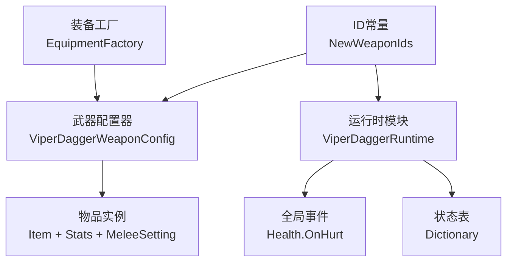
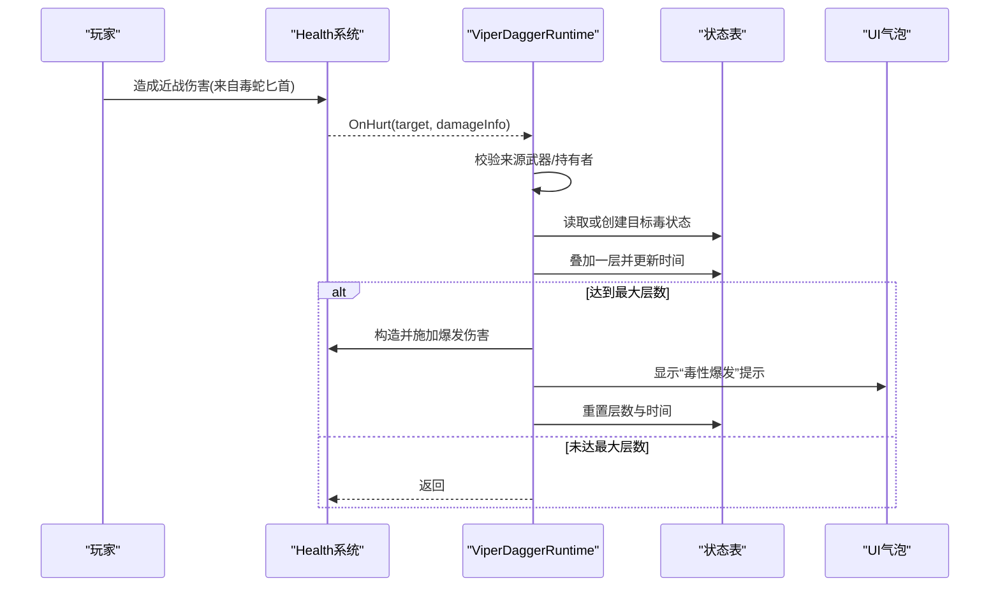
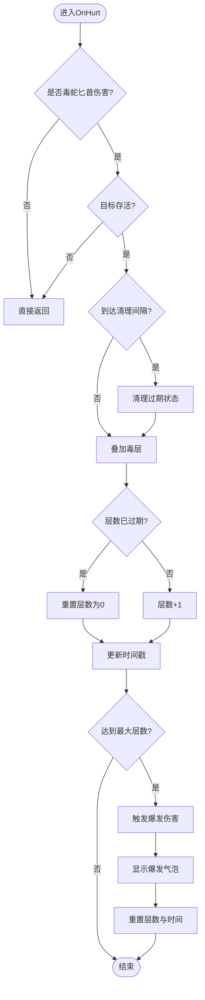
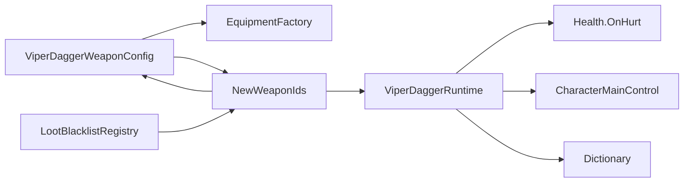

# 毒蛇匕首

<cite>
**本文引用的文件**
- [ViperDaggerConfig.cs](file://Integration/NewWeapons/ViperDagger/ViperDaggerConfig.cs)
- [ViperDaggerRuntime.cs](file://Integration/NewWeapons/ViperDagger/ViperDaggerRuntime.cs)
- [ViperDaggerWeaponConfig.cs](file://Integration/NewWeapons/ViperDagger/ViperDaggerWeaponConfig.cs)
- [NewWeaponIds.cs](file://Integration/NewWeapons/Common/NewWeaponIds.cs)
- [EquipmentFactory.cs](file://Integration/EquipmentFactory.cs)
- [LootBlacklistRegistry.cs](file://Config/LootBlacklistRegistry.cs)
</cite>

## 目录
1. [简介](#简介)
2. [项目结构](#项目结构)
3. [核心组件](#核心组件)
4. [架构总览](#架构总览)
5. [详细组件分析](#详细组件分析)
6. [依赖关系分析](#依赖关系分析)
7. [性能考量](#性能考量)
8. [故障排查指南](#故障排查指南)
9. [结论](#结论)
10. [附录](#附录)

## 简介
毒蛇匕首是一把近战武器，通过每次命中为目标叠加“蛇毒”层数，叠满后触发一次性的毒性爆发伤害。其设计强调贴脸高频连击、快速叠层与爆发节奏控制。基础单次伤害不高，但配合高攻速与低体力消耗，能在短时间内将目标毒层打满并释放爆发。

## 项目结构
毒蛇匕首的实现由三部分构成：
- 配置层：定义武器属性、本地化文本与叠毒参数（最大层数、持续时间、爆发伤害等）。
- 运行时层：订阅受伤事件，维护每个目标的毒素状态，执行叠加与爆发逻辑，并进行周期性清理。
- 装备工厂层：在资源加载完成后为物品装配近战组件、设置元素与标签、注入本地化文案。

图表来源
- [ViperDaggerWeaponConfig.cs:52-101](file://Integration/NewWeapons/ViperDagger/ViperDaggerWeaponConfig.cs#L52-L101)
- [ViperDaggerRuntime.cs:46-109](file://Integration/NewWeapons/ViperDagger/ViperDaggerRuntime.cs#L46-L109)
- [NewWeaponIds.cs:15-20](file://Integration/NewWeapons/Common/NewWeaponIds.cs#L15-L20)

章节来源
- [ViperDaggerConfig.cs:18-60](file://Integration/NewWeapons/ViperDagger/ViperDaggerConfig.cs#L18-L60)
- [ViperDaggerRuntime.cs:20-109](file://Integration/NewWeapons/ViperDagger/ViperDaggerRuntime.cs#L20-L109)
- [ViperDaggerWeaponConfig.cs:23-101](file://Integration/NewWeapons/ViperDagger/ViperDaggerWeaponConfig.cs#L23-L101)
- [NewWeaponIds.cs:15-20](file://Integration/NewWeapons/Common/NewWeaponIds.cs#L15-L20)

## 核心组件
- 配置常量：集中管理名称、描述、品质、近战属性、叠毒上限、持续时间、爆发伤害等。
- 运行时：监听受伤事件，按目标实例维护毒层与最近应用时间；达到上限时触发爆发伤害并重置层数；定时清理过期状态。
- 装备配置：为物品装配近战组件、设置毒元素与概率、绑定模型、注入本地化。

章节来源
- [ViperDaggerConfig.cs:24-60](file://Integration/NewWeapons/ViperDagger/ViperDaggerConfig.cs#L24-L60)
- [ViperDaggerRuntime.cs:20-109](file://Integration/NewWeapons/ViperDagger/ViperDaggerRuntime.cs#L20-L109)
- [ViperDaggerWeaponConfig.cs:52-101](file://Integration/NewWeapons/ViperDagger/ViperDaggerWeaponConfig.cs#L52-L101)

## 架构总览
毒蛇匕首采用“事件驱动 + 状态表”的轻量架构：
- 装备工厂在资源加载后完成静态配置。
- 运行时订阅全局受伤事件，仅当伤害来自玩家且使用毒蛇匕首时才处理。
- 以目标实例ID为键维护毒层与时间戳，避免每帧遍历带来的开销。
- 周期清理过期条目，防止内存泄漏。

图表来源
- [ViperDaggerRuntime.cs:82-171](file://Integration/NewWeapons/ViperDagger/ViperDaggerRuntime.cs#L82-L171)
- [ViperDaggerRuntime.cs:176-196](file://Integration/NewWeapons/ViperDagger/ViperDaggerRuntime.cs#L176-L196)

## 详细组件分析

### 配置层：ViperDaggerConfig
- 职责：集中声明武器名称、描述、品质、近战属性、叠毒上限、持续时间、日志前缀等。
- 关键点：
  - 最大毒层：固定上限，便于平衡爆发节奏。
  - 持续时间：用于判断是否重置层数与清理过期状态。
  - 基础属性：较低的基础伤害与暴击率，强调叠毒与爆发的输出曲线。

章节来源
- [ViperDaggerConfig.cs:18-60](file://Integration/NewWeapons/ViperDagger/ViperDaggerConfig.cs#L18-L60)

### 运行时层：ViperDaggerRuntime
- 职责：订阅受伤事件，维护目标毒状态，执行叠加与爆发，周期清理。
- 数据结构：
  - 状态结构：包含当前层数与最近应用时间。
  - 状态表：以目标实例ID为键的字典，支持O(1)查找与更新。
- 关键流程：
  - 早期退出：非毒蛇匕首伤害、目标死亡、非玩家来源直接返回。
  - 定期清理：超过持续时间一定阈值的状态被移除。
  - 叠加逻辑：若已过期则先重置层数；否则叠加至上限；达到上限触发爆发并重置。
  - 爆发伤害：构造新的伤害信息，设置为无武器ID以避免二次触发，附加毒元素，调用受击方造成伤害。
  - UI反馈：在玩家位置附近显示“毒性爆发”气泡。

图表来源
- [ViperDaggerRuntime.cs:82-171](file://Integration/NewWeapons/ViperDagger/ViperDaggerRuntime.cs#L82-L171)
- [ViperDaggerRuntime.cs:229-253](file://Integration/NewWeapons/ViperDagger/ViperDaggerRuntime.cs#L229-L253)

章节来源
- [ViperDaggerRuntime.cs:20-109](file://Integration/NewWeapons/ViperDagger/ViperDaggerRuntime.cs#L20-L109)
- [ViperDaggerRuntime.cs:114-171](file://Integration/NewWeapons/ViperDagger/ViperDaggerRuntime.cs#L114-L171)
- [ViperDaggerRuntime.cs:176-196](file://Integration/NewWeapons/ViperDagger/ViperDaggerRuntime.cs#L176-L196)
- [ViperDaggerRuntime.cs:229-253](file://Integration/NewWeapons/ViperDagger/ViperDaggerRuntime.cs#L229-L253)

### 装备配置层：ViperDaggerWeaponConfig
- 职责：在资源加载完成后为物品装配近战组件、设置毒元素、绑定模型、注入本地化。
- 关键点：
  - 接受两种baseName以兼容不同加载路径。
  - 为物品添加近战相关Stats，并设置显示字段。
  - 装配MeleeAgent与MeleeSetting，将元素设为毒，并尝试绑定原版中毒Buff。
  - 添加标签以便系统与UI识别。
  - 注入本地化名称与描述。

章节来源
- [ViperDaggerWeaponConfig.cs:52-101](file://Integration/NewWeapons/ViperDagger/ViperDaggerWeaponConfig.cs#L52-L101)
- [ViperDaggerWeaponConfig.cs:103-126](file://Integration/NewWeapons/ViperDagger/ViperDaggerWeaponConfig.cs#L103-L126)
- [ViperDaggerWeaponConfig.cs:128-191](file://Integration/NewWeapons/ViperDagger/ViperDaggerWeaponConfig.cs#L128-L191)
- [ViperDaggerWeaponConfig.cs:193-222](file://Integration/NewWeapons/ViperDagger/ViperDaggerWeaponConfig.cs#L193-L222)

### ID与注册：NewWeaponIds
- 职责：集中定义毒蛇匕首的类型ID、Bundle名、Prefab基名等常量，供运行时与配置器引用。
- 关键点：确保运行时与配置器对同一武器的标识一致。

章节来源
- [NewWeaponIds.cs:15-20](file://Integration/NewWeapons/Common/NewWeaponIds.cs#L15-L20)

## 依赖关系分析
- 运行时依赖：
  - 全局事件：Health.OnHurt，用于捕获伤害事件。
  - 玩家角色：CharacterMainControl.Main，用于确认伤害来源。
  - 近战代理：ItemAgent_MeleeWeapon与CurrentHoldItemAgent，用于判断是否持有毒蛇匕首。
  - 本地化：L10n.T与DialogueBubblesManager，用于显示提示。
- 配置依赖：
  - 装备工厂：EquipmentFactory，在资源加载后回调配置器。
  - ID常量：NewWeaponIds，统一标识武器。
- 外部集成：
  - 掉落黑名单：LootBlacklistRegistry中可能包含该武器类型ID，影响掉落行为。

图表来源
- [ViperDaggerRuntime.cs:46-109](file://Integration/NewWeapons/ViperDagger/ViperDaggerRuntime.cs#L46-L109)
- [ViperDaggerWeaponConfig.cs:52-101](file://Integration/NewWeapons/ViperDagger/ViperDaggerWeaponConfig.cs#L52-L101)
- [NewWeaponIds.cs:15-20](file://Integration/NewWeapons/Common/NewWeaponIds.cs#L15-L20)
- [LootBlacklistRegistry.cs:141-141](file://Config/LootBlacklistRegistry.cs#L141-L141)

章节来源
- [ViperDaggerRuntime.cs:46-109](file://Integration/NewWeapons/ViperDagger/ViperDaggerRuntime.cs#L46-L109)
- [ViperDaggerWeaponConfig.cs:52-101](file://Integration/NewWeapons/ViperDagger/ViperDaggerWeaponConfig.cs#L52-L101)
- [NewWeaponIds.cs:15-20](file://Integration/NewWeapons/Common/NewWeaponIds.cs#L15-L20)
- [LootBlacklistRegistry.cs:141-141](file://Config/LootBlacklistRegistry.cs#L141-L141)

## 性能考量
- 事件过滤：仅在伤害来自毒蛇匕首且由玩家造成时继续处理，减少无效计算。
- 状态表：使用字典按目标实例ID维护状态，避免每帧遍历所有敌人。
- 周期清理：每隔固定时间清理过期状态，防止字典无限增长。
- 爆发伤害：爆发伤害使用新的DamageInfo并设置fromWeaponItemID为0，避免再次触发叠毒回调，降低递归风险。
- UI回退：气泡显示失败时忽略异常，保证主流程稳定。

[本节提供通用指导，不直接分析具体文件]

## 故障排查指南
- 症状：叠毒不生效
  - 检查是否由玩家使用毒蛇匕首造成伤害（来源武器ID与持有检测）。
  - 检查目标是否存活且未被标记为死亡。
- 症状：爆发未触发
  - 检查是否达到最大层数与时间刷新是否正确。
  - 检查爆发伤害构造与施加过程是否有异常。
- 症状：内存占用上升
  - 检查周期清理是否正常工作，是否存在长时间未清理的过期状态。
- 症状：UI提示不显示
  - 检查本地化与气泡管理器调用是否成功，关注异常回退。

章节来源
- [ViperDaggerRuntime.cs:82-171](file://Integration/NewWeapons/ViperDagger/ViperDaggerRuntime.cs#L82-L171)
- [ViperDaggerRuntime.cs:176-196](file://Integration/NewWeapons/ViperDagger/ViperDaggerRuntime.cs#L176-L196)
- [ViperDaggerRuntime.cs:229-253](file://Integration/NewWeapons/ViperDagger/ViperDaggerRuntime.cs#L229-L253)

## 结论
毒蛇匕首通过简洁的事件驱动与状态表机制，实现了高效的叠毒与爆发循环。其设计强调贴脸高频攻击与节奏控制，适合对慢速或静止目标进行快速叠层与爆发。运行时采用早期退出、周期清理与异常回退策略，保证了稳定性与性能。配置层集中管理可调参数，便于后续平衡与扩展。

[本节总结性内容，不直接分析具体文件]

## 附录

### 战斗场景分析与输出最大化技巧
- 推荐目标：移动缓慢或可被控制的Boss，便于连续命中叠满毒层。
- 输出节奏：利用高攻速与低体力消耗快速接近目标，连续命中直至触发爆发；爆发后立即重新叠层。
- 生存保障：保持安全距离与走位，避免被包围；在爆发后迅速拉开距离，等待下一轮叠层窗口。
- 注意事项：基础伤害与暴击较低，不要依赖单发伤害；爆发伤害为固定值，不与暴击等属性联动。

[本节提供通用建议，不直接分析具体文件]

### 配置文件结构与可定制选项
- 武器属性：品质、基础伤害、攻速、射程、暴击率、暴击倍率、护甲穿透、体力消耗、流血概率、移速加成、子弹格挡。
- 叠毒参数：最大层数、满层爆发伤害、毒素持续时间。
- 本地化：名称与描述的中英文文本。
- 标签：武器、近战、特殊等标签，影响系统与UI行为。

章节来源
- [ViperDaggerConfig.cs:24-60](file://Integration/NewWeapons/ViperDagger/ViperDaggerConfig.cs#L24-L60)
- [ViperDaggerWeaponConfig.cs:103-126](file://Integration/NewWeapons/ViperDagger/ViperDaggerWeaponConfig.cs#L103-L126)
- [ViperDaggerWeaponConfig.cs:193-222](file://Integration/NewWeapons/ViperDagger/ViperDaggerWeaponConfig.cs#L193-L222)