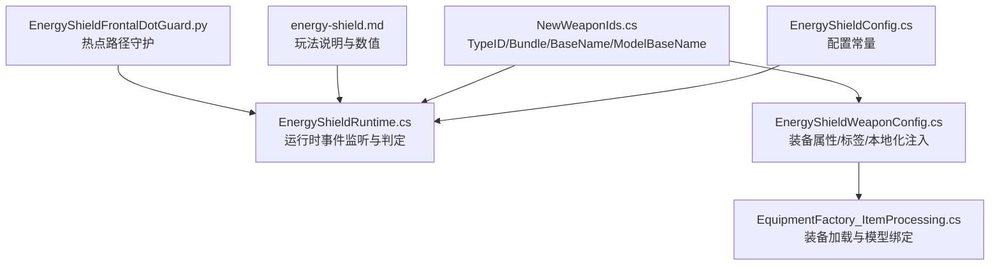
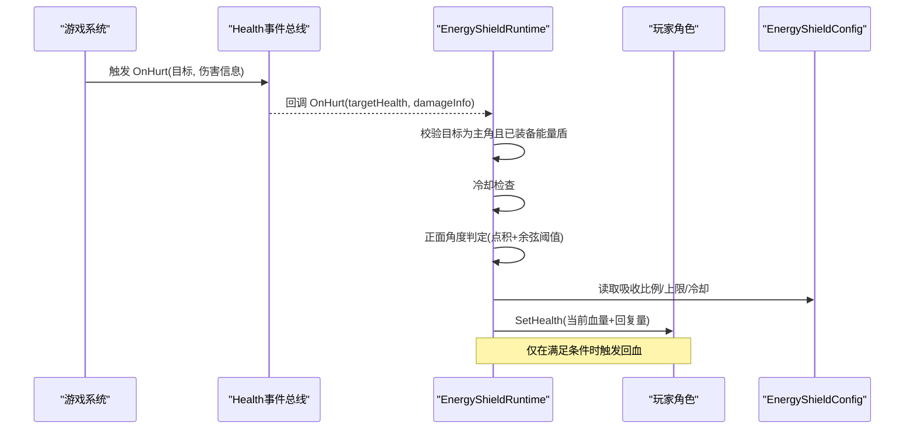
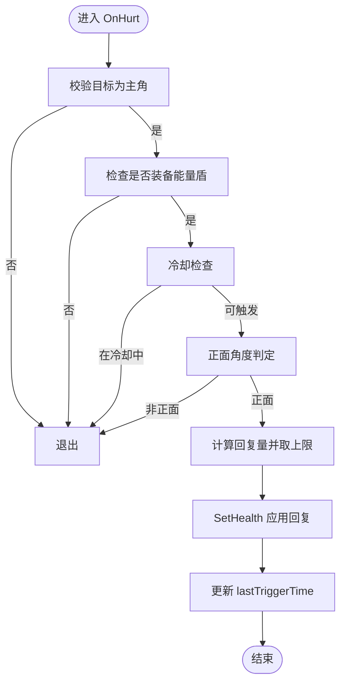
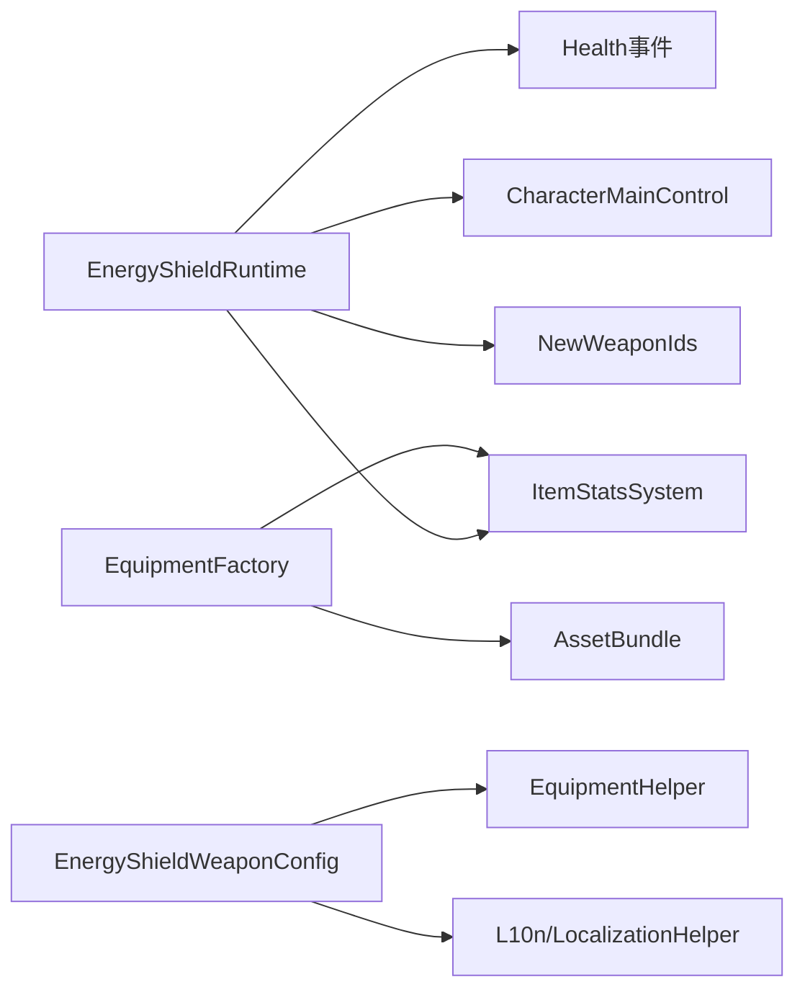

# 能量盾

<cite>
**本文引用的文件**
- [EnergyShieldConfig.cs](file://Integration/NewWeapons/EnergyShield/EnergyShieldConfig.cs)
- [EnergyShieldRuntime.cs](file://Integration/NewWeapons/EnergyShield/EnergyShieldRuntime.cs)
- [EnergyShieldWeaponConfig.cs](file://Integration/NewWeapons/EnergyShield/EnergyShieldWeaponConfig.cs)
- [NewWeaponIds.cs](file://Integration/NewWeapons/Common/NewWeaponIds.cs)
- [EquipmentFactory_ItemProcessing.cs](file://Integration/EquipmentFactory_ItemProcessing.cs)
- [energy-shield.md](file://wiki-site/docs/en/equipment/energy-shield.md)
- [EnergyShieldFrontalDotGuard.py](file://tests/EnergyShieldFrontalDotGuard.py)
</cite>

## 目录
1. [简介](#简介)
2. [项目结构](#项目结构)
3. [核心组件](#核心组件)
4. [架构总览](#架构总览)
5. [详细组件分析](#详细组件分析)
6. [依赖关系分析](#依赖关系分析)
7. [性能与资源管理](#性能与资源管理)
8. [故障排查指南](#故障排查指南)
9. [结论](#结论)
10. [附录：调优与战术建议](#附录：调优与战术建议)

## 简介
能量盾是一件图腾槽位的防御型装备，提供基础护甲加成，并在玩家正面受到攻击时，将部分伤害转化为生命值回复。其核心机制为“正面吸收”：仅当攻击来源位于玩家前方一定角度范围内时触发；侧面与背面攻击不生效。该设计强调站位与朝向，适合以正面对敌为主的近战流派。

## 项目结构
能量盾相关代码集中在 Integration/NewWeapons/EnergyShield 目录下，包含配置、运行时逻辑与装备工厂配置器；ID 常量在 Common 下集中管理；装备加载流程通过 EquipmentFactory 统一处理；文档与测试覆盖 wiki 与守护脚本。

图表来源
- [EnergyShieldConfig.cs:1-58](file://Integration/NewWeapons/EnergyShield/EnergyShieldConfig.cs#L1-L58)
- [EnergyShieldRuntime.cs:1-195](file://Integration/NewWeapons/EnergyShield/EnergyShieldRuntime.cs#L1-L195)
- [EnergyShieldWeaponConfig.cs:1-115](file://Integration/NewWeapons/EnergyShield/EnergyShieldWeaponConfig.cs#L1-L115)
- [NewWeaponIds.cs:1-51](file://Integration/NewWeapons/Common/NewWeaponIds.cs#L1-L51)
- [EquipmentFactory_ItemProcessing.cs:1-200](file://Integration/EquipmentFactory_ItemProcessing.cs#L1-L200)
- [energy-shield.md:1-38](file://wiki-site/docs/en/equipment/energy-shield.md#L1-L38)
- [EnergyShieldFrontalDotGuard.py:1-68](file://tests/EnergyShieldFrontalDotGuard.py#L1-L68)

章节来源
- [EnergyShieldConfig.cs:1-58](file://Integration/NewWeapons/EnergyShield/EnergyShieldConfig.cs#L1-L58)
- [EnergyShieldRuntime.cs:1-195](file://Integration/NewWeapons/EnergyShield/EnergyShieldRuntime.cs#L1-L195)
- [EnergyShieldWeaponConfig.cs:1-115](file://Integration/NewWeapons/EnergyShield/EnergyShieldWeaponConfig.cs#L1-L115)
- [NewWeaponIds.cs:1-51](file://Integration/NewWeapons/Common/NewWeaponIds.cs#L1-L51)
- [EquipmentFactory_ItemProcessing.cs:1-200](file://Integration/EquipmentFactory_ItemProcessing.cs#L1-L200)
- [energy-shield.md:1-38](file://wiki-site/docs/en/equipment/energy-shield.md#L1-L38)
- [EnergyShieldFrontalDotGuard.py:1-68](file://tests/EnergyShieldFrontalDotGuard.py#L1-L68)

## 核心组件
- 配置层（EnergyShieldConfig）：定义名称、描述、正面吸收比例、正面角度阈值、冷却时间、单次最大回复量、护甲加成等常量。
- 运行层（EnergyShieldRuntime）：订阅健康值受伤事件，判断是否装备能量盾、是否在冷却中、是否为正面攻击，计算并执行回血。
- 装备配置层（EnergyShieldWeaponConfig）：为能量盾 Prefab 添加标签、绑定模型、注入 BodyArmor 修正、注入本地化文本。
- ID 常量（NewWeaponIds）：集中维护能量盾的 TypeID、Bundle、BaseName、ModelBaseName 等标识。
- 装备工厂（EquipmentFactory_ItemProcessing）：负责从 AssetBundle 加载装备、自动匹配模型与 Buff、为图腾类型添加绑定标签等通用流程。

章节来源
- [EnergyShieldConfig.cs:1-58](file://Integration/NewWeapons/EnergyShield/EnergyShieldConfig.cs#L1-L58)
- [EnergyShieldRuntime.cs:1-195](file://Integration/NewWeapons/EnergyShield/EnergyShieldRuntime.cs#L1-L195)
- [EnergyShieldWeaponConfig.cs:1-115](file://Integration/NewWeapons/EnergyShield/EnergyShieldWeaponConfig.cs#L1-L115)
- [NewWeaponIds.cs:1-51](file://Integration/NewWeapons/Common/NewWeaponIds.cs#L1-L51)
- [EquipmentFactory_ItemProcessing.cs:1-200](file://Integration/EquipmentFactory_ItemProcessing.cs#L1-L200)

## 架构总览
能量盾采用“事件驱动 + 轻量判定”的架构：
- 启动阶段：装备工厂加载能量盾 Prefab，完成标签、模型、修正与本地化注入。
- 运行阶段：订阅 Health.OnHurt 事件，快速过滤非玩家与非装备状态，进行方向判定与冷却检查，最终调用 SetHealth 完成回血。
- 生命周期：玩家死亡时重置静态缓存，确保复活后冷却从干净状态开始。

图表来源
- [EnergyShieldRuntime.cs:31-116](file://Integration/NewWeapons/EnergyShield/EnergyShieldRuntime.cs#L31-L116)
- [EnergyShieldConfig.cs:22-50](file://Integration/NewWeapons/EnergyShield/EnergyShieldConfig.cs#L22-L50)

## 详细组件分析

### 配置层：EnergyShieldConfig
- 职责：集中管理能量盾的显示名、描述、品质、正面吸收比例、正面角度阈值、冷却时间、单次最大回复量、护甲加成、日志前缀等。
- 关键常量：
  - 正面吸收比例：用于计算回血量。
  - 正面角度阈值：决定判定扇区范围。
  - 触发冷却：限制单位时间内最多触发次数。
  - 单次最大回复量：防止极端情况下的过量回复。
  - 护甲加成：提供基础防御提升。

章节来源
- [EnergyShieldConfig.cs:16-55](file://Integration/NewWeapons/EnergyShield/EnergyShieldConfig.cs#L16-L55)

### 运行层：EnergyShieldRuntime
- 职责：监听受伤事件，执行装备检测、冷却检查、方向判定与回血逻辑。
- 关键流程：
  - 订阅/取消订阅：避免重复订阅与内存泄漏。
  - 早期退出：仅对主角有效，未装备或不在冷却窗口内直接返回。
  - 方向判定：使用点积与预计算的余弦阈值，避免昂贵的角度计算。
  - 回血实现：基于“伤害已扣除”的模式，加回部分伤害作为治疗，并设置冷却时间戳。
  - 生命周期：玩家死亡时重置静态缓存，保证复活后状态正确。

图表来源
- [EnergyShieldRuntime.cs:76-116](file://Integration/NewWeapons/EnergyShield/EnergyShieldRuntime.cs#L76-L116)
- [EnergyShieldRuntime.cs:121-160](file://Integration/NewWeapons/EnergyShield/EnergyShieldRuntime.cs#L121-L160)

章节来源
- [EnergyShieldRuntime.cs:23-71](file://Integration/NewWeapons/EnergyShield/EnergyShieldRuntime.cs#L23-L71)
- [EnergyShieldRuntime.cs:76-116](file://Integration/NewWeapons/EnergyShield/EnergyShieldRuntime.cs#L76-L116)
- [EnergyShieldRuntime.cs:121-160](file://Integration/NewWeapons/EnergyShield/EnergyShieldRuntime.cs#L121-L160)
- [EnergyShieldRuntime.cs:165-192](file://Integration/NewWeapons/EnergyShield/EnergyShieldRuntime.cs#L165-L192)

### 装备配置层：EnergyShieldWeaponConfig
- 职责：在装备工厂加载完成后，为能量盾 Prefab 注入标签、绑定模型、添加护甲修正、注入本地化文本。
- 关键点：
  - 标签：Totem、DontDropOnDeadInSlot、Special。
  - 模型绑定：通过 EquipmentFactory.TryBindLoadedEquipmentModel 关联模型。
  - 修正：BodyArmor 增加固定值。
  - 本地化：根据语言环境注入显示名与描述。

章节来源
- [EnergyShieldWeaponConfig.cs:25-59](file://Integration/NewWeapons/EnergyShield/EnergyShieldWeaponConfig.cs#L25-L59)
- [EnergyShieldWeaponConfig.cs:61-107](file://Integration/NewWeapons/EnergyShield/EnergyShieldWeaponConfig.cs#L61-L107)

### ID 常量：NewWeaponIds
- 职责：集中管理新武器的 TypeID、Bundle、BaseName、ModelBaseName、IconAssetName 等标识。
- 能量盾相关：
  - TypeID：用于运行时识别装备类型。
  - BaseName/ModelBaseName：用于装备工厂匹配与模型绑定。

章节来源
- [NewWeaponIds.cs:29-34](file://Integration/NewWeapons/Common/NewWeaponIds.cs#L29-L34)

### 装备工厂：EquipmentFactory_ItemProcessing
- 职责：从 AssetBundle 加载自定义装备，自动匹配模型、Buff、子弹等资源；为图腾类型添加绑定标签；注入备用显示图形。
- 与能量盾的关系：
  - 图腾类装备会获得 DontDropOnDeadInSlot 标签，确保绑定装备不会掉落。
  - 支持自动匹配模型与资源，简化配置工作。

章节来源
- [EquipmentFactory_ItemProcessing.cs:118-147](file://Integration/EquipmentFactory_ItemProcessing.cs#L118-L147)

## 依赖关系分析
- EnergyShieldRuntime 依赖：
  - Health 事件总线：接收受伤事件。
  - CharacterMainControl：获取玩家实例与朝向。
  - ItemStatsSystem：读取槽位与装备类型。
  - NewWeaponIds：识别能量盾 TypeID。
- EnergyShieldWeaponConfig 依赖：
  - EquipmentHelper：添加标签与修正。
  - L10n/LocalizationHelper：注入本地化。
- EquipmentFactory 依赖：
  - AssetBundle：加载资源。
  - ItemStatsSystem：操作 Item 与 Stats。

图表来源
- [EnergyShieldRuntime.cs:11-15](file://Integration/NewWeapons/EnergyShield/EnergyShieldRuntime.cs#L11-L15)
- [EnergyShieldRuntime.cs:165-192](file://Integration/NewWeapons/EnergyShield/EnergyShieldRuntime.cs#L165-L192)
- [EnergyShieldWeaponConfig.cs:11-13](file://Integration/NewWeapons/EnergyShield/EnergyShieldWeaponConfig.cs#L11-L13)
- [EquipmentFactory_ItemProcessing.cs:101-109](file://Integration/EquipmentFactory_ItemProcessing.cs#L101-L109)

章节来源
- [EnergyShieldRuntime.cs:11-15](file://Integration/NewWeapons/EnergyShield/EnergyShieldRuntime.cs#L11-L15)
- [EnergyShieldRuntime.cs:165-192](file://Integration/NewWeapons/EnergyShield/EnergyShieldRuntime.cs#L165-L192)
- [EnergyShieldWeaponConfig.cs:11-13](file://Integration/NewWeapons/EnergyShield/EnergyShieldWeaponConfig.cs#L11-L13)
- [EquipmentFactory_ItemProcessing.cs:101-109](file://Integration/EquipmentFactory_ItemProcessing.cs#L101-L109)

## 性能与资源管理
- 热点路径优化：
  - 方向判定使用点积与预计算余弦阈值，避免 Vector3.Angle 与归一化等昂贵操作。
  - 早期退出策略减少无效计算。
- 事件订阅管理：
  - 明确 Subscribe/Unsubscribe，避免重复订阅与内存泄漏。
  - 玩家死亡时重置静态缓存，确保状态一致性。
- 资源绑定：
  - 通过 EquipmentFactory 自动匹配模型与资源，降低手工配置成本。
  - 图腾类型自动添加绑定标签，避免掉落丢失。

章节来源
- [EnergyShieldRuntime.cs:23-27](file://Integration/NewWeapons/EnergyShield/EnergyShieldRuntime.cs#L23-L27)
- [EnergyShieldRuntime.cs:31-52](file://Integration/NewWeapons/EnergyShield/EnergyShieldRuntime.cs#L31-L52)
- [EnergyShieldRuntime.cs:66-71](file://Integration/NewWeapons/EnergyShield/EnergyShieldRuntime.cs#L66-L71)
- [EnergyShieldFrontalDotGuard.py:43-62](file://tests/EnergyShieldFrontalDotGuard.py#L43-L62)
- [EquipmentFactory_ItemProcessing.cs:128-133](file://Integration/EquipmentFactory_ItemProcessing.cs#L128-L133)

## 故障排查指南
- 症状：正面受击无回血
  - 检查是否装备能量盾（图腾槽位）。
  - 检查是否在冷却窗口内。
  - 检查攻击来源是否在正面 ±60° 范围内。
  - 查看日志前缀输出，定位异常。
- 症状：回血量异常高
  - 确认单次最大回复量上限是否生效。
  - 检查伤害信息与最终伤害计算是否正确。
- 症状：复活后冷却状态异常
  - 确认玩家死亡时是否重置静态缓存。
- 性能问题：卡顿或帧率下降
  - 确认方向判定未使用 Angle/normalized。
  - 检查是否有重复订阅或未释放的事件。

章节来源
- [EnergyShieldRuntime.cs:76-116](file://Integration/NewWeapons/EnergyShield/EnergyShieldRuntime.cs#L76-L116)
- [EnergyShieldRuntime.cs:121-160](file://Integration/NewWeapons/EnergyShield/EnergyShieldRuntime.cs#L121-L160)
- [EnergyShieldRuntime.cs:165-192](file://Integration/NewWeapons/EnergyShield/EnergyShieldRuntime.cs#L165-L192)
- [EnergyShieldFrontalDotGuard.py:43-62](file://tests/EnergyShieldFrontalDotGuard.py#L43-L62)

## 结论
能量盾通过“正面吸收”机制，将部分正面伤害转化为生命值回复，并提供基础护甲加成。其实现简洁高效，采用事件驱动与轻量判定，避免热点路径上的昂贵计算。配合正确的站位与朝向，可在单挑或正面强攻场景中显著提升生存能力。

## 附录：调优与战术建议
- 力场强度调优
  - 正面吸收比例：平衡回血效率与防滥用。
  - 正面角度阈值：扩大或缩小正面扇区，影响容错与策略。
  - 触发冷却：控制高频触发频率，避免过强。
  - 单次最大回复量：限制极端伤害下的过量回复。
  - 护甲加成：提供稳定防御提升。
- 性能优化建议
  - 保持点积+余弦阈值的正面判定，避免 Angle/normalized。
  - 尽早退出无效路径，减少分支与对象分配。
  - 合理管理事件订阅与静态缓存。
- 资源管理建议
  - 使用 EquipmentFactory 自动绑定模型与资源。
  - 图腾类型自动添加绑定标签，避免掉落丢失。
- 战术运用策略
  - 面向敌人正面交战，最大化吸收收益。
  - 避免被包围，侧背攻击无法触发吸收。
  - 搭配高输出近战武器，边打边回，延长战斗续航。
  - 针对单体 Boss（如龙王）可长时间面抗，累积回血效果显著。

章节来源
- [EnergyShieldConfig.cs:22-50](file://Integration/NewWeapons/EnergyShield/EnergyShieldConfig.cs#L22-L50)
- [energy-shield.md:19-37](file://wiki-site/docs/en/equipment/energy-shield.md#L19-L37)
- [EnergyShieldFrontalDotGuard.py:43-62](file://tests/EnergyShieldFrontalDotGuard.py#L43-L62)
- [EquipmentFactory_ItemProcessing.cs:128-133](file://Integration/EquipmentFactory_ItemProcessing.cs#L128-L133)