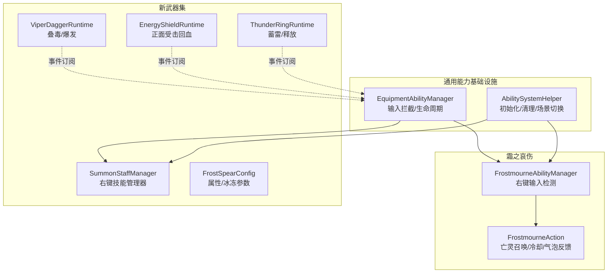
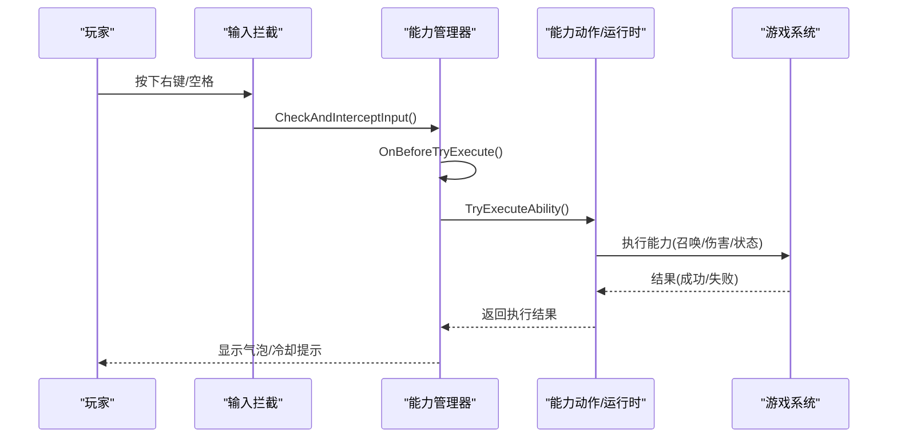
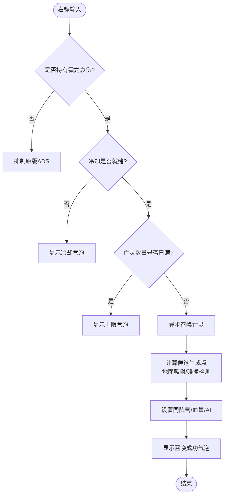
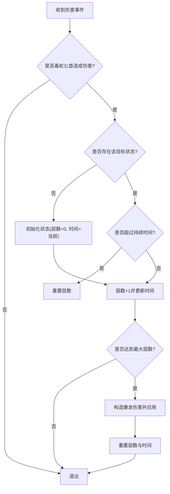
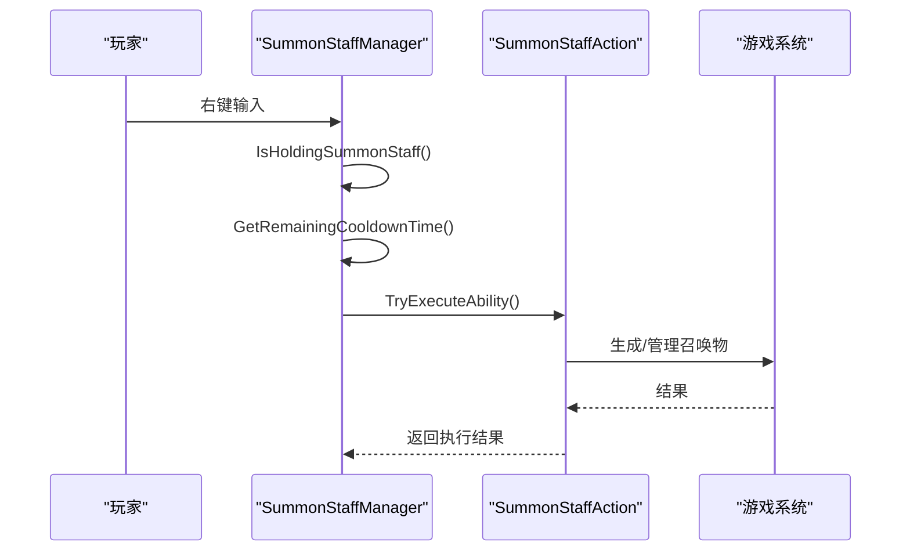
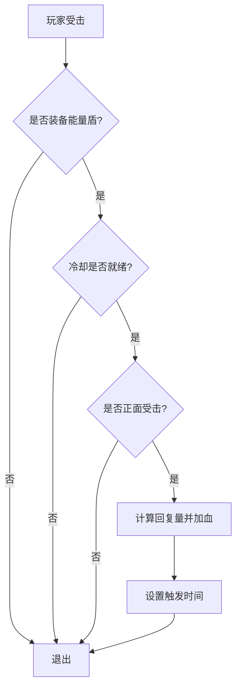
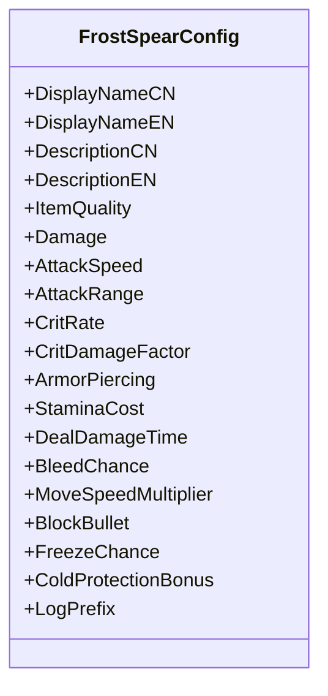
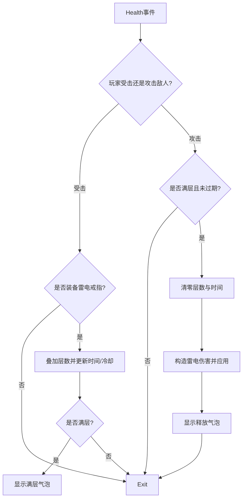
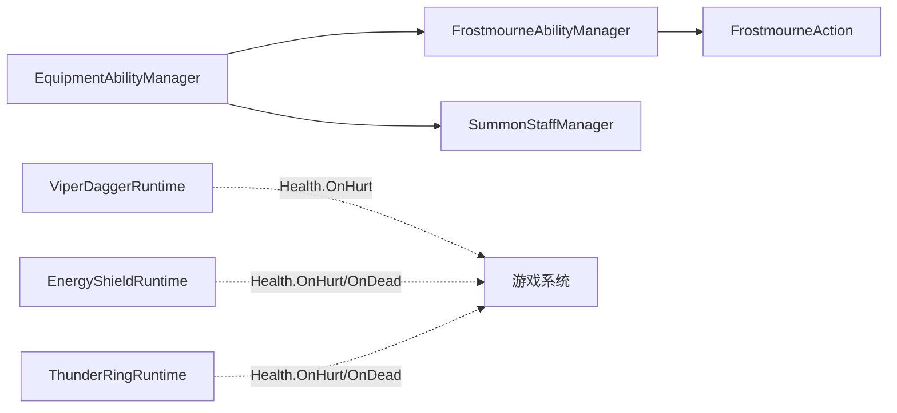

# 自定义武器系统

<cite>
**本文引用的文件**
- [AbilitySystemHelper.cs](file://Common/Equipment/AbilitySystemHelper.cs)
- [EquipmentAbilityManager.cs](file://Common/Equipment/EquipmentAbilityManager.cs)
- [FrostmourneAbilityManager.cs](file://Integration/Frostmourne/FrostmourneAbilityManager.cs)
- [FrostmourneAction.cs](file://Integration/Frostmourne/FrostmourneAction.cs)
- [ViperDaggerRuntime.cs](file://Integration/NewWeapons/ViperDagger/ViperDaggerRuntime.cs)
- [SummonStaffManager.cs](file://Integration/NewWeapons/SummonStaff/SummonStaffManager.cs)
- [EnergyShieldRuntime.cs](file://Integration/NewWeapons/EnergyShield/EnergyShieldRuntime.cs)
- [FrostSpearConfig.cs](file://Integration/NewWeapons/FrostSpear/FrostSpearConfig.cs)
- [ThunderRingRuntime.cs](file://Integration/NewWeapons/ThunderRing/ThunderRingRuntime.cs)
</cite>

## 目录
1. [简介](#简介)
2. [项目结构](#项目结构)
3. [核心组件](#核心组件)
4. [架构总览](#架构总览)
5. [详细组件分析](#详细组件分析)
6. [依赖关系分析](#依赖关系分析)
7. [性能考量](#性能考量)
8. [故障排查指南](#故障排查指南)
9. [结论](#结论)
10. [附录](#附录)

## 简介
本技术文档面向 BossRushMod 的自定义武器系统，围绕以下六件自定义武器的实现原理与使用策略进行系统化说明：霜之哀伤（亡灵召唤与冰焰特效）、毒蛇匕首（毒伤叠加与持续伤害）、召唤法杖（召唤物生命周期与AI控制）、能量盾（防护力场与伤害吸收）、冰霜长矛（冰系攻击模式与冻结效果）、雷电戒指（连锁闪电算法与目标选择）。同时给出武器配置结构、能力系统扩展方式、特效系统集成方法，并提供实战技巧与搭配建议。

## 项目结构
BossRushMod 将通用能力基础设施置于 Common/Equipment，具体武器逻辑位于 Integration/Frostmourne 与 Integration/NewWeapons 下各子目录。每个武器通常包含：
- 配置类：定义名称、描述、数值参数等
- 运行时或动作类：实现触发条件、输入拦截、战斗逻辑、状态管理
- 管理器基类：提供统一的输入拦截、生命周期、场景切换处理

**图示来源**
- [EquipmentAbilityManager.cs:18-140](file://Common/Equipment/EquipmentAbilityManager.cs#L18-L140)
- [AbilitySystemHelper.cs:32-135](file://Common/Equipment/AbilitySystemHelper.cs#L32-L135)
- [FrostmourneAbilityManager.cs:18-140](file://Integration/Frostmourne/FrostmourneAbilityManager.cs#L18-L140)
- [FrostmourneAction.cs:22-123](file://Integration/Frostmourne/FrostmourneAction.cs#L22-L123)
- [ViperDaggerRuntime.cs:20-109](file://Integration/NewWeapons/ViperDagger/ViperDaggerRuntime.cs#L20-L109)
- [SummonStaffManager.cs:17-112](file://Integration/NewWeapons/SummonStaff/SummonStaffManager.cs#L17-L112)
- [EnergyShieldRuntime.cs:18-116](file://Integration/NewWeapons/EnergyShield/EnergyShieldRuntime.cs#L18-L116)
- [FrostSpearConfig.cs:11-54](file://Integration/NewWeapons/FrostSpear/FrostSpearConfig.cs#L11-L54)
- [ThunderRingRuntime.cs:18-110](file://Integration/NewWeapons/ThunderRing/ThunderRingRuntime.cs#L18-L110)

**章节来源**
- [EquipmentAbilityManager.cs:18-140](file://Common/Equipment/EquipmentAbilityManager.cs#L18-L140)
- [AbilitySystemHelper.cs:32-135](file://Common/Equipment/AbilitySystemHelper.cs#L32-L135)

## 核心组件
- 装备能力管理器基类：提供单例、输入拦截、能力注册/注销、场景切换重建、动作创建与销毁的统一框架。子类通过重写获取配置、输入动作名、创建动作等方法接入具体武器逻辑。
- 能力系统辅助类：封装初始化、场景切换处理、延迟检查装备、清理等通用流程，降低各武器集成成本。
- 武器运行时/动作：基于基类或事件订阅实现具体机制（如叠毒、正面回血、蓄雷释放、召唤亡灵等）。

**章节来源**
- [EquipmentAbilityManager.cs:18-140](file://Common/Equipment/EquipmentAbilityManager.cs#L18-L140)
- [AbilitySystemHelper.cs:32-135](file://Common/Equipment/AbilitySystemHelper.cs#L32-L135)

## 架构总览
整体采用“基类+具体管理器/运行时”的分层架构：
- 输入层：通过反射缓存 InputAction 或键盘按键检测，统一拦截右键（ADS）或默认键位。
- 能力层：EquipmentAbilityManager 负责激活、执行、生命周期；具体管理器（如 FrostmourneAbilityManager、SummonStaffManager）注入持有校验、冷却提示、气泡反馈。
- 效果层：各武器运行时监听 Health 事件或直接创建动作对象，完成伤害、状态、特效调用。

**图示来源**
- [EquipmentAbilityManager.cs:197-428](file://Common/Equipment/EquipmentAbilityManager.cs#L197-L428)
- [FrostmourneAbilityManager.cs:99-158](file://Integration/Frostmourne/FrostmourneAbilityManager.cs#L99-L158)
- [FrostmourneAction.cs:94-123](file://Integration/Frostmourne/FrostmourneAction.cs#L94-L123)

## 详细组件分析

### 霜之哀伤：亡灵召唤与冰焰特效
- 输入与持有校验：管理器在 Update 中检测右键输入，并校验是否持有霜之哀伤；若未持有则抑制原版 ADS 行为。
- 冷却与上限：读取动作剩余冷却时间，若未满且达到最大亡灵数量则弹出提示气泡。
- 召唤流程：异步生成最多 5 只僵尸，按方位与半径缩放计算候选点，地面吸附与碰撞检测避免卡墙；设置同阵营、血量、AI 追踪敌人；记录存活列表用于清理与跟随。
- 特效与反馈：通过气泡提示冷却、已满、召唤成功等信息；可结合武器配置调整召唤数量、半径、血量等。

**图示来源**
- [FrostmourneAbilityManager.cs:99-158](file://Integration/Frostmourne/FrostmourneAbilityManager.cs#L99-L158)
- [FrostmourneAction.cs:130-286](file://Integration/Frostmourne/FrostmourneAction.cs#L130-L286)

**章节来源**
- [FrostmourneAbilityManager.cs:18-158](file://Integration/Frostmourne/FrostmourneAbilityManager.cs#L18-L158)
- [FrostmourneAction.cs:22-286](file://Integration/Frostmourne/FrostmourneAction.cs#L22-L286)

### 毒蛇匕首：毒伤叠加与持续伤害
- 事件订阅：订阅 Health.OnHurt，仅当伤害来自毒蛇匕首且由玩家造成时生效。
- 叠毒机制：为每个目标维护毒素层数与最近施加时间；超时重置层数；满层触发爆发伤害并重置层数。
- 性能优化：不持有匕首时回调立即返回；定期清理过期状态，避免字典膨胀。
- 反馈：满层爆发时显示气泡提示。

**图示来源**
- [ViperDaggerRuntime.cs:82-171](file://Integration/NewWeapons/ViperDagger/ViperDaggerRuntime.cs#L82-L171)

**章节来源**
- [ViperDaggerRuntime.cs:20-171](file://Integration/NewWeapons/ViperDagger/ViperDaggerRuntime.cs#L20-L171)

### 召唤法杖：召唤物生命周期与AI控制
- 输入与持有校验：管理器检测右键输入并校验是否持有召唤法杖；若未持有则抑制原版 ADS。
- 技能执行：读取动作剩余冷却时间，若就绪则尝试执行能力；管理器负责创建对应动作组件。
- 生命周期：场景切换时重置预设缓存；动作内部负责生成、跟随、清理等。

**图示来源**
- [SummonStaffManager.cs:92-112](file://Integration/NewWeapons/SummonStaff/SummonStaffManager.cs#L92-L112)

**章节来源**
- [SummonStaffManager.cs:17-112](file://Integration/NewWeapons/SummonStaff/SummonStaffManager.cs#L17-L112)

### 能量盾：防护力场与伤害吸收
- 事件订阅：订阅 Health.OnHurt 与 OnDead；玩家死亡时重置冷却。
- 正面判定：根据攻击来源位置与玩家朝向计算夹角余弦，判断是否在正面阈值范围内。
- 回复机制：对受到的伤害按比例回复生命值，限制单次回复上限与触发冷却。
- 装备检测：扫描角色槽位中以 “Totem” 开头的槽位，匹配能量盾类型ID。

**图示来源**
- [EnergyShieldRuntime.cs:76-116](file://Integration/NewWeapons/EnergyShield/EnergyShieldRuntime.cs#L76-L116)
- [EnergyShieldRuntime.cs:121-160](file://Integration/NewWeapons/EnergyShield/EnergyShieldRuntime.cs#L121-L160)

**章节来源**
- [EnergyShieldRuntime.cs:18-116](file://Integration/NewWeapons/EnergyShield/EnergyShieldRuntime.cs#L18-L116)
- [EnergyShieldRuntime.cs:121-160](file://Integration/NewWeapons/EnergyShield/EnergyShieldRuntime.cs#L121-L160)

### 冰霜长矛：冰系攻击模式与冻结效果
- 配置驱动：通过 FrostSpearConfig 定义品质、伤害、攻速、范围、暴击、穿透、体力消耗、格挡比例等基础属性。
- 冰冻机制：每次刺击附带高概率冰冻减速；提供寒冷防护加成；以稳定控场为核心定位。
- 使用策略：利用较长攻击范围保持安全距离，配合冻结效果压制敌人行动。

**图示来源**
- [FrostSpearConfig.cs:11-54](file://Integration/NewWeapons/FrostSpear/FrostSpearConfig.cs#L11-L54)

**章节来源**
- [FrostSpearConfig.cs:11-54](file://Integration/NewWeapons/FrostSpear/FrostSpearConfig.cs#L11-L54)

### 雷电戒指：连锁闪电与目标选择
- 双重机制：玩家受击时叠加电能层数；玩家攻击敌人时若满层则释放雷电伤害。
- 状态管理：维护当前层数、最近叠加时间、冷却时间；支持过期清零与死亡重置。
- 目标选择：直接对当前被攻击的目标释放雷电伤害，避免递归触发（释放伤害 fromWeaponItemID 设为 0）。
- 反馈：满层与释放时显示气泡提示。

**图示来源**
- [ThunderRingRuntime.cs:87-196](file://Integration/NewWeapons/ThunderRing/ThunderRingRuntime.cs#L87-L196)

**章节来源**
- [ThunderRingRuntime.cs:18-196](file://Integration/NewWeapons/ThunderRing/ThunderRingRuntime.cs#L18-L196)

## 依赖关系分析
- 输入依赖：EquipmentAbilityManager 通过反射缓存 InputAction 或键盘按键检测，确保在不同场景与版本下的兼容性。
- 事件依赖：毒蛇匕首、能量盾、雷电戒指均订阅 Health 事件，需保证事件生命周期与 Mod 卸载时的正确取消订阅。
- 资源依赖：霜之哀伤依赖角色预设查找与 AI 组件；召唤法杖依赖动作组件与预设缓存。
- 配置依赖：所有武器通过配置类暴露可调参数，便于平衡性与本地化。

**图示来源**
- [EquipmentAbilityManager.cs:197-428](file://Common/Equipment/EquipmentAbilityManager.cs#L197-L428)
- [FrostmourneAbilityManager.cs:99-158](file://Integration/Frostmourne/FrostmourneAbilityManager.cs#L99-L158)
- [ViperDaggerRuntime.cs:82-171](file://Integration/NewWeapons/ViperDagger/ViperDaggerRuntime.cs#L82-L171)
- [EnergyShieldRuntime.cs:76-116](file://Integration/NewWeapons/EnergyShield/EnergyShieldRuntime.cs#L76-L116)
- [ThunderRingRuntime.cs:87-196](file://Integration/NewWeapons/ThunderRing/ThunderRingRuntime.cs#L87-L196)

**章节来源**
- [EquipmentAbilityManager.cs:197-428](file://Common/Equipment/EquipmentAbilityManager.cs#L197-L428)
- [ViperDaggerRuntime.cs:82-171](file://Integration/NewWeapons/ViperDagger/ViperDaggerRuntime.cs#L82-L171)
- [EnergyShieldRuntime.cs:76-116](file://Integration/NewWeapons/EnergyShield/EnergyShieldRuntime.cs#L76-L116)
- [ThunderRingRuntime.cs:87-196](file://Integration/NewWeapons/ThunderRing/ThunderRingRuntime.cs#L87-L196)

## 性能考量
- 事件订阅与早期退出：毒蛇匕首、能量盾、雷电戒指均在回调开头进行快速过滤，避免无谓计算。
- 缓存与复用：能力管理器缓存 InputAction 与方法引用；霜之哀伤缓存墙层掩码与碰撞缓冲数组；雷电戒指缓存装备检测结果。
- 异步与帧间隔：霜之哀伤异步召唤并在每只之间让出一帧，避免卡顿；定期清理过期状态，防止内存泄漏。
- 场景切换处理：管理器在场景切换后重建能力动作，重置预设缓存，确保稳定性。

[本节为通用性能指导，无需特定文件来源]

## 故障排查指南
- 输入无效：检查是否已缓存 InputAction；确认 IsGameplayInputAllowed 条件（输入激活、时间缩放、光标锁定、UI 遮挡等）。
- 能力未执行：核对 OnBeforeTryExecute 持有校验；查看能力动作是否创建成功；确认目标角色绑定是否正确。
- 召唤失败：检查预设查找是否成功；验证生成点有效性（地面吸附、碰撞检测）；确认角色阵营与 AI 组件存在。
- 事件未触发：确认订阅是否成功；检查 early-exit 条件（武器类型ID、目标是否为玩家、是否持有装备）。
- 状态异常：检查层数/冷却/过期逻辑；在玩家死亡时是否正确重置状态。

**章节来源**
- [EquipmentAbilityManager.cs:197-428](file://Common/Equipment/EquipmentAbilityManager.cs#L197-L428)
- [FrostmourneAbilityManager.cs:260-323](file://Integration/Frostmourne/FrostmourneAbilityManager.cs#L260-L323)
- [ViperDaggerRuntime.cs:82-171](file://Integration/NewWeapons/ViperDagger/ViperDaggerRuntime.cs#L82-L171)
- [EnergyShieldRuntime.cs:76-116](file://Integration/NewWeapons/EnergyShield/EnergyShieldRuntime.cs#L76-L116)
- [ThunderRingRuntime.cs:87-196](file://Integration/NewWeapons/ThunderRing/ThunderRingRuntime.cs#L87-L196)

## 结论
BossRushMod 的自定义武器系统通过统一的能力管理器与辅助类，实现了高内聚、低耦合的武器逻辑扩展。各武器围绕事件订阅与输入拦截构建差异化机制：霜之哀伤侧重召唤与控场、毒蛇匕首强调叠毒爆发、召唤法杖聚焦召唤物管理、能量盾提供正面防御回复、冰霜长矛以稳定冰冻控场为核心、雷电戒指实现受击蓄能攻击释放。通过配置化与事件化设计，系统具备良好的可扩展性与可维护性。

[本节为总结性内容，无需特定文件来源]

## 附录
- 武器配置结构：
  - 名称与描述：本地化字符串，便于多语言展示
  - 物品属性：品质、伤害、攻速、范围、暴击、穿透、体力消耗、格挡比例等
  - 特殊参数：冰冻概率、寒冷防护、叠毒层数与持续时间、释放伤害、冷却与时长等
- 能力系统扩展方式：
  - 继承 EquipmentAbilityManager，实现 GetConfig、GetInputActionName、CreateAbilityAction
  - 在管理器中注入持有校验、冷却提示、气泡反馈
  - 使用 AbilitySystemHelper 进行初始化、场景切换与清理
- 特效系统集成方法：
  - 通过气泡系统提供即时反馈
  - 结合预设与 AI 组件实现召唤物行为
  - 使用 DamageInfo 与元素因子实现元素伤害与特效联动

[本节为概念性内容，无需特定文件来源]