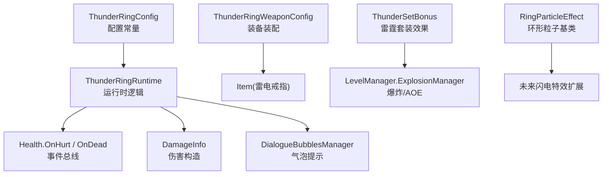
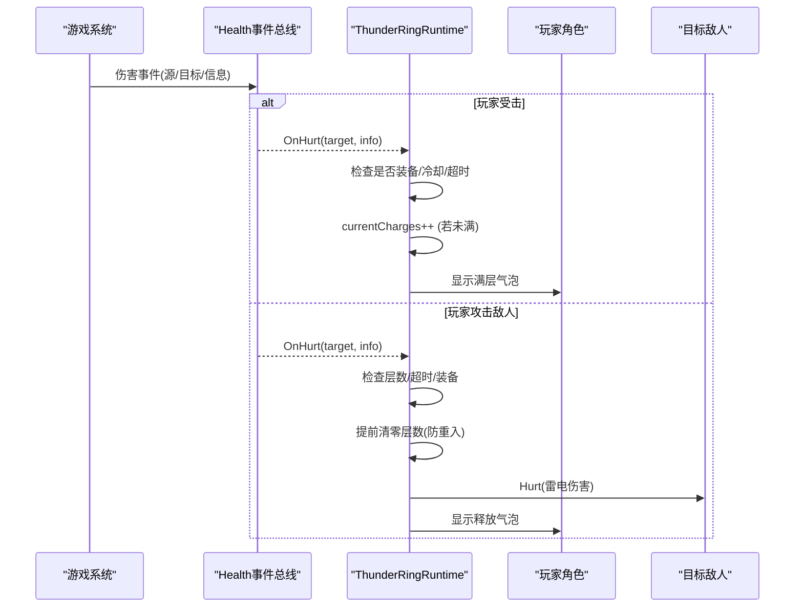
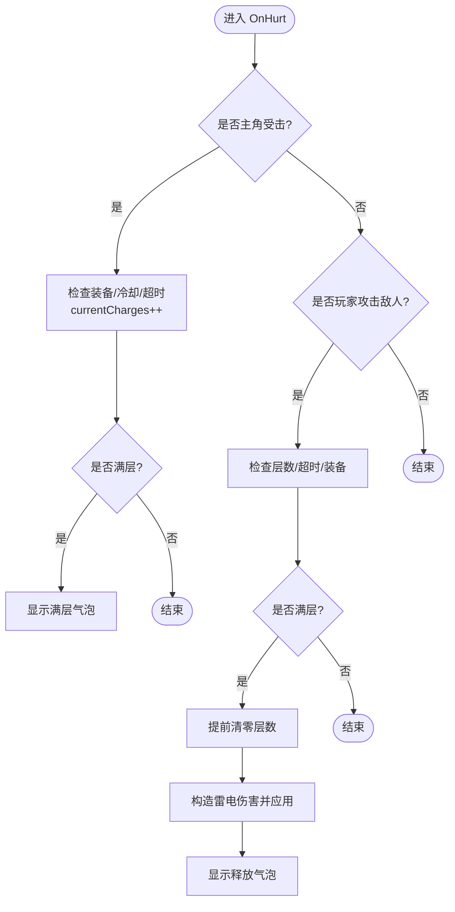
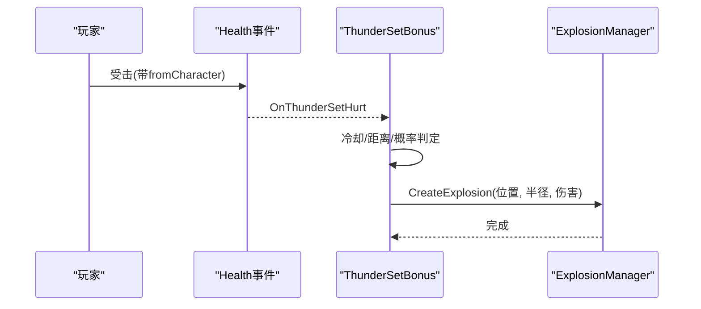
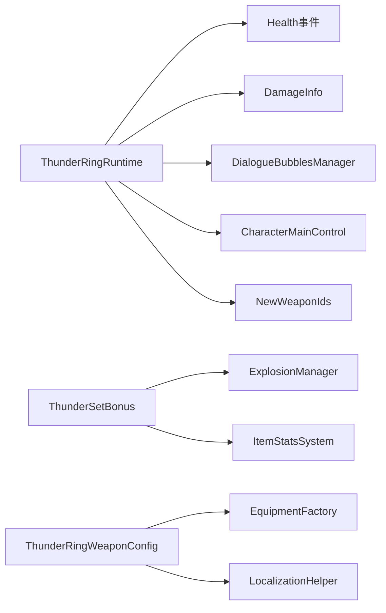

# 雷电戒指

<cite>
**本文引用的文件**
- [ThunderRingConfig.cs](file://Integration/NewWeapons/ThunderRing/ThunderRingConfig.cs)
- [ThunderRingRuntime.cs](file://Integration/NewWeapons/ThunderRing/ThunderRingRuntime.cs)
- [ThunderRingWeaponConfig.cs](file://Integration/NewWeapons/ThunderRing/ThunderRingWeaponConfig.cs)
- [ThunderSetBonus.cs](file://Integration/Bonus/ThunderSetBonus.cs)
- [RingParticleEffect.cs](file://Common/Effects/RingParticleEffect.cs)
- [thunder-ring.md](file://wiki-site/docs/en/equipment/thunder-ring.md)
- [thunder-set.md](file://wiki-site/docs/en/equipment/thunder-set.md)
</cite>

## 目录
1. [简介](#简介)
2. [项目结构](#项目结构)
3. [核心组件](#核心组件)
4. [架构总览](#架构总览)
5. [详细组件分析](#详细组件分析)
6. [依赖关系分析](#依赖关系分析)
7. [性能考量](#性能考量)
8. [故障排查指南](#故障排查指南)
9. [结论](#结论)
10. [附录](#附录)

## 简介
雷电戒指是一件图腾槽位的“受击蓄能、攻击释放”的高风险高回报装备。玩家每次受到伤害会叠加电能层数，达到上限后下一次攻击将释放额外雷电伤害并清空层数。该机制通过全局事件监听与运行时状态管理实现，具备冷却、超时清零、死亡重置等健壮性设计。同时，雷电套装提供电抗加成与近身受击概率反击的AOE能力，可与戒指形成互补的电系流派玩法。

## 项目结构
围绕雷电戒指的实现，主要涉及以下模块：
- 配置层：定义名称、描述、品质、数值参数（最大层数、持续时间、伤害、冷却）。
- 运行层：订阅健康事件，处理受击蓄能与攻击释放逻辑，包含缓存与防重入保护。
- 装备装配层：在资源加载后为物品注入标签、模型绑定与本地化文案。
- 套装联动：雷霆套装提供被动电抗与近身受击概率反击AOE。
- 特效基类：通用环形粒子系统，可用于后续扩展闪电视觉表现。

图表来源
- [ThunderRingConfig.cs:1-54](file://Integration/NewWeapons/ThunderRing/ThunderRingConfig.cs#L1-L54)
- [ThunderRingRuntime.cs:1-284](file://Integration/NewWeapons/ThunderRing/ThunderRingRuntime.cs#L1-L284)
- [ThunderRingWeaponConfig.cs:1-99](file://Integration/NewWeapons/ThunderRing/ThunderRingWeaponConfig.cs#L1-L99)
- [ThunderSetBonus.cs:1-247](file://Integration/Bonus/ThunderSetBonus.cs#L1-L247)
- [RingParticleEffect.cs:1-501](file://Common/Effects/RingParticleEffect.cs#L1-L501)

章节来源
- [ThunderRingConfig.cs:1-54](file://Integration/NewWeapons/ThunderRing/ThunderRingConfig.cs#L1-L54)
- [ThunderRingRuntime.cs:1-284](file://Integration/NewWeapons/ThunderRing/ThunderRingRuntime.cs#L1-L284)
- [ThunderRingWeaponConfig.cs:1-99](file://Integration/NewWeapons/ThunderRing/ThunderRingWeaponConfig.cs#L1-L99)
- [ThunderSetBonus.cs:1-247](file://Integration/Bonus/ThunderSetBonus.cs#L1-L247)
- [RingParticleEffect.cs:1-501](file://Common/Effects/RingParticleEffect.cs#L1-L501)

## 核心组件
- 配置常量：定义最大层数、持续时间、释放伤害、受击冷却、日志前缀等。
- 运行时逻辑：订阅 Health 事件，区分“玩家受击蓄能”和“玩家攻击释放”，含冷却、超时、死亡重置、防递归释放。
- 装备装配：识别雷电戒指 prefab baseName，注入 Totem/DontDropOnDeadInSlot/Special 标签，绑定模型与本地化。
- 雷霆套装：被动电抗提升；近身受击概率触发以玩家为中心的 AOE 电击，使用 ExplosionManager 创建爆炸。
- 粒子基类：可复用的环形粒子系统，支持 Local/World 双层发射器、共享材质纹理缓存，便于扩展闪电视觉效果。

章节来源
- [ThunderRingConfig.cs:1-54](file://Integration/NewWeapons/ThunderRing/ThunderRingConfig.cs#L1-L54)
- [ThunderRingRuntime.cs:1-284](file://Integration/NewWeapons/ThunderRing/ThunderRingRuntime.cs#L1-L284)
- [ThunderRingWeaponConfig.cs:1-99](file://Integration/NewWeapons/ThunderRing/ThunderRingWeaponConfig.cs#L1-L99)
- [ThunderSetBonus.cs:1-247](file://Integration/Bonus/ThunderSetBonus.cs#L1-L247)
- [RingParticleEffect.cs:1-501](file://Common/Effects/RingParticleEffect.cs#L1-L501)

## 架构总览
雷电戒指采用“事件驱动 + 静态状态机”的轻量架构：
- 事件入口：Health.OnHurt/OnDead 统一接入。
- 状态机：维护当前电能层数、最后充能时间、充能冷却时间、帧级装备检查缓存。
- 分支处理：按“是否主角受击”“是否有攻击者且来自玩家”分流到蓄能或释放路径。
- 安全边界：提前清零层数避免重入；死亡时重置状态；未装备时快速返回。

图表来源
- [ThunderRingRuntime.cs:84-196](file://Integration/NewWeapons/ThunderRing/ThunderRingRuntime.cs#L84-L196)

章节来源
- [ThunderRingRuntime.cs:84-196](file://Integration/NewWeapons/ThunderRing/ThunderRingRuntime.cs#L84-L196)

## 详细组件分析

### 雷电戒指运行时（蓄能-释放）
- 事件订阅与生命周期：启动时订阅 Health.OnHurt/OnDead，停止时取消订阅并清理静态缓存。
- 受击蓄能：仅对主角生效；受击冷却防止瞬时叠满；8秒无受击则层数清零；满层时提示。
- 攻击释放：仅在满层且未过期时触发；先清零再造成伤害以避免重入；伤害类型为普通伤害并附加雷元素因子；释放后提示。
- 装备检测：按帧缓存检测结果，遍历图腾槽位匹配雷电戒指 TypeID，异常回退忽略。

图表来源
- [ThunderRingRuntime.cs:84-196](file://Integration/NewWeapons/ThunderRing/ThunderRingRuntime.cs#L84-L196)

章节来源
- [ThunderRingRuntime.cs:84-196](file://Integration/NewWeapons/ThunderRing/ThunderRingRuntime.cs#L84-L196)

### 雷电戒指配置与装配
- 配置：定义名称、描述、品质、最大层数、持续时间、释放伤害、受击冷却、日志前缀。
- 装配：识别 baseName（含后缀），注入图腾相关标签，绑定模型，注入本地化文案。

章节来源
- [ThunderRingConfig.cs:1-54](file://Integration/NewWeapons/ThunderRing/ThunderRingConfig.cs#L1-L54)
- [ThunderRingWeaponConfig.cs:24-99](file://Integration/NewWeapons/ThunderRing/ThunderRingWeaponConfig.cs#L24-L99)

### 雷霆套装（电抗+反击AOE）
- 被动：电抗提升（降低电伤系数）。
- 主动反击：近身受击（距离判定）、非自伤、冷却限制、概率触发；以玩家为中心创建爆炸，附带雷元素伤害。
- 生命周期：激活时注册事件，停用/死亡时移除事件并重置冷却。

图表来源
- [ThunderSetBonus.cs:187-241](file://Integration/Bonus/ThunderSetBonus.cs#L187-L241)

章节来源
- [ThunderSetBonus.cs:187-241](file://Integration/Bonus/ThunderSetBonus.cs#L187-L241)

### 闪电特效与音效（可扩展）
- 视觉：可使用 RingParticleEffect 作为基础，构建环形分布的粒子发射器，支持 Local/World 双层空间，共享材质与纹理以降低开销。
- 音效：当前雷电戒指与套装代码中未直接集成音效播放；可在释放/反击时机调用音频管理器进行反馈（需结合现有音频接口扩展）。
- 性能：共享材质/纹理、控制发射率与粒子数量、及时停止与销毁实例。

章节来源
- [RingParticleEffect.cs:1-501](file://Common/Effects/RingParticleEffect.cs#L1-L501)

## 依赖关系分析
- 雷电戒指运行时依赖：
  - Health 事件总线（受击/死亡事件）
  - DamageInfo（构造雷电伤害）
  - DialogueBubblesManager（气泡提示）
  - CharacterMainControl（获取玩家与槽位信息）
  - NewWeaponIds（类型标识）
- 雷霆套装依赖：
  - LevelManager.ExplosionManager（AOE爆炸）
  - ItemStatsSystem（Stat/Modifier 电抗调整）
- 装配依赖：
  - EquipmentFactory（模型绑定）
  - LocalizationHelper（本地化注入）

图表来源
- [ThunderRingRuntime.cs:1-284](file://Integration/NewWeapons/ThunderRing/ThunderRingRuntime.cs#L1-L284)
- [ThunderSetBonus.cs:1-247](file://Integration/Bonus/ThunderSetBonus.cs#L1-L247)
- [ThunderRingWeaponConfig.cs:1-99](file://Integration/NewWeapons/ThunderRing/ThunderRingWeaponConfig.cs#L1-L99)

章节来源
- [ThunderRingRuntime.cs:1-284](file://Integration/NewWeapons/ThunderRing/ThunderRingRuntime.cs#L1-L284)
- [ThunderSetBonus.cs:1-247](file://Integration/Bonus/ThunderSetBonus.cs#L1-L247)
- [ThunderRingWeaponConfig.cs:1-99](file://Integration/NewWeapons/ThunderRing/ThunderRingWeaponConfig.cs#L1-L99)

## 性能考量
- 事件回调最小化计算：未装备时立即返回；帧级缓存装备检测结果。
- 防重入：释放前先清零层数，避免 Hurt 回调再次触发无限递归。
- 粒子系统优化：共享材质与纹理，减少 GC；按需停止发射并在结束后销毁对象。
- AOE 爆炸：使用内置 ExplosionManager，复用引擎能力，避免自定义物理计算。

章节来源
- [ThunderRingRuntime.cs:198-237](file://Integration/NewWeapons/ThunderRing/ThunderRingRuntime.cs#L198-L237)
- [RingParticleEffect.cs:23-41](file://Common/Effects/RingParticleEffect.cs#L23-L41)
- [RingParticleEffect.cs:335-425](file://Common/Effects/RingParticleEffect.cs#L335-L425)
- [ThunderSetBonus.cs:218-234](file://Integration/Bonus/ThunderSetBonus.cs#L218-L234)

## 故障排查指南
- 症状：蓄能不增加或释放不触发
  - 检查是否装备了雷电戒指（图腾槽位）；确认未处于冷却或已过期。
  - 查看日志前缀输出，确认订阅成功与事件回调执行。
- 症状：释放后仍继续触发
  - 确认释放路径已提前清零层数；检查是否存在其他来源重复调用。
- 症状：死亡后仍有残留层数
  - 确认死亡回调已重置静态缓存；检查复活流程是否正确。
- 症状：套装反击不触发
  - 检查是否在范围内、冷却是否就绪、是否来自真实攻击者；确认 ExplosionManager 可用。

章节来源
- [ThunderRingRuntime.cs:60-82](file://Integration/NewWeapons/ThunderRing/ThunderRingRuntime.cs#L60-L82)
- [ThunderRingRuntime.cs:147-196](file://Integration/NewWeapons/ThunderRing/ThunderRingRuntime.cs#L147-L196)
- [ThunderSetBonus.cs:175-185](file://Integration/Bonus/ThunderSetBonus.cs#L175-L185)
- [ThunderSetBonus.cs:187-241](file://Integration/Bonus/ThunderSetBonus.cs#L187-L241)

## 结论
雷电戒指通过简洁的事件驱动与状态机实现了“高风险高回报”的群体输出潜力：在密集敌人环境中，频繁受击可快速叠满并配合高爆发武器打出稳定雷电释放。雷霆套装提供电抗与近身反击AOE，适合持续多目标的战斗节奏。建议优先保证自身生存与受击频率，合理搭配高爆发近战武器，最大化雷电戒指的循环输出效率。

## 附录

### 连锁闪电算法说明（基于当前实现）
- 目标选择逻辑：当前实现为“对最近一次被玩家攻击的目标施加额外雷电伤害”，并非传统意义上的弹跳链式闪电。
- 弹跳路径计算：未实现多目标弹跳路径；如需扩展，可在释放阶段扫描周围敌人并按距离排序，依次应用伤害。
- 伤害衰减机制：当前为固定额外伤害；如需衰减，可在弹跳链上逐次乘以衰减系数。

章节来源
- [ThunderRingRuntime.cs:147-196](file://Integration/NewWeapons/ThunderRing/ThunderRingRuntime.cs#L147-L196)

### 运行时组件的事件处理、自动触发与范围检测
- 事件处理：Health.OnHurt/OnDead 统一入口，区分主角受击与玩家攻击。
- 自动触发：满层后下一次攻击自动释放；死亡时重置状态。
- 范围检测：套装反击使用距离平方比较进行近身判定；戒指释放当前无范围检测（单目标）。

章节来源
- [ThunderRingRuntime.cs:84-196](file://Integration/NewWeapons/ThunderRing/ThunderRingRuntime.cs#L84-L196)
- [ThunderSetBonus.cs:187-241](file://Integration/Bonus/ThunderSetBonus.cs#L187-L241)

### 视觉效果与音效反馈
- 视觉：可使用 RingParticleEffect 构建环形粒子特效，支持多层发射器与共享材质纹理。
- 音效：当前未集成音效；建议在释放/反击时机调用音频管理器播放雷声与命中反馈。

章节来源
- [RingParticleEffect.cs:1-501](file://Common/Effects/RingParticleEffect.cs#L1-L501)

### 电系流派搭配与AOE技巧
- 装备搭配：雷电戒指 + 雷霆套装（电抗+反击AOE）；配合高爆发近战武器（如长柄武器）提高释放频率。
- AOE技巧：在密集敌人区域保持受击频率，尽快叠满并释放；利用套装反击在近距离群战中补充伤害。
- 群体伤害优化：优先选择能频繁触发的敌人类型（如远程骚扰型），确保稳定叠层；避免低密度阶段浪费层数。

章节来源
- [thunder-ring.md:1-37](file://wiki-site/docs/en/equipment/thunder-ring.md#L1-L37)
- [thunder-set.md:1-55](file://wiki-site/docs/en/equipment/thunder-set.md#L1-L55)

### 地形互动、敌人适配与战斗节奏建议
- 地形互动：当前未实现特殊地形交互；可通过扩展范围检测加入掩体/障碍规避。
- 敌人适配：对慢速固定Boss易于稳定叠层；对高速分散敌人需走位贴近以触发套装反击。
- 节奏控制：避免囤积第5层，尽快释放以提升总输出；在Boss战分阶段规划蓄能窗口。

章节来源
- [thunder-ring.md:26-36](file://wiki-site/docs/en/equipment/thunder-ring.md#L26-L36)
- [thunder-set.md:45-55](file://wiki-site/docs/en/equipment/thunder-set.md#L45-L55)