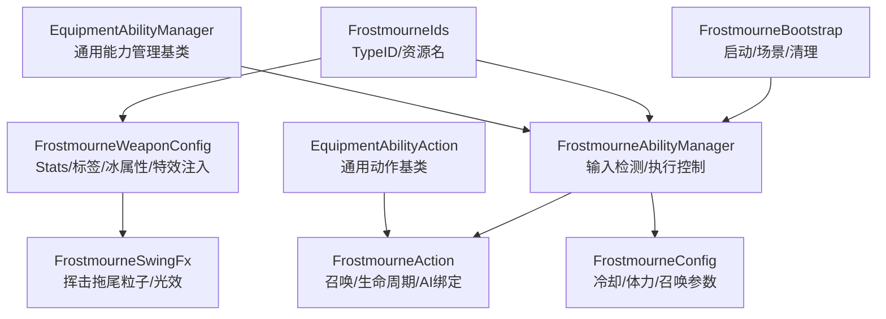
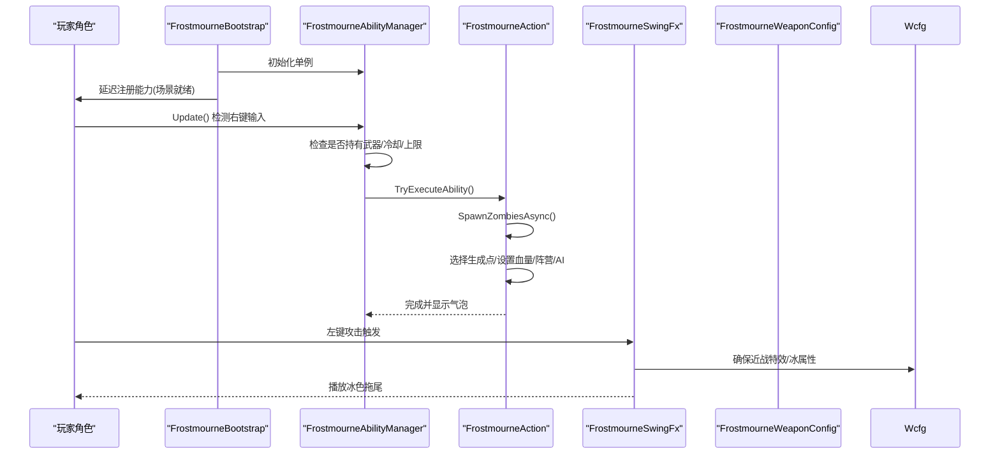
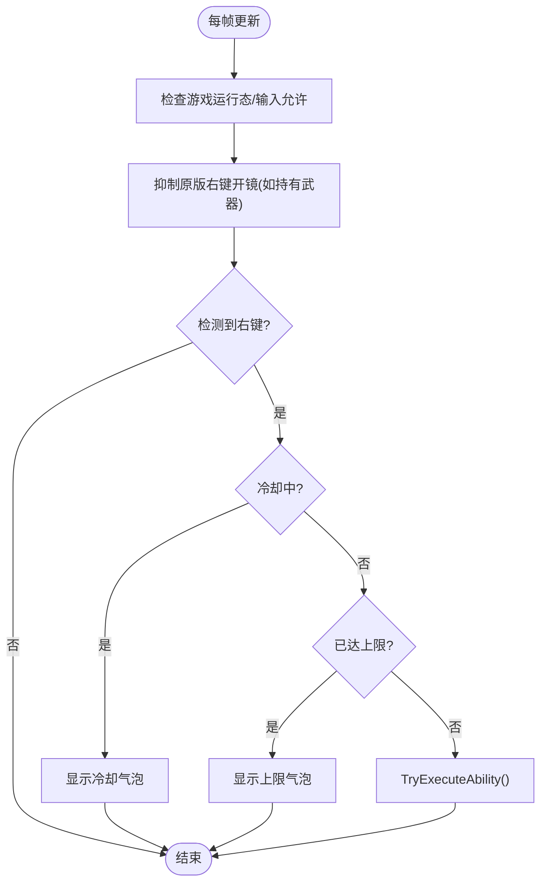
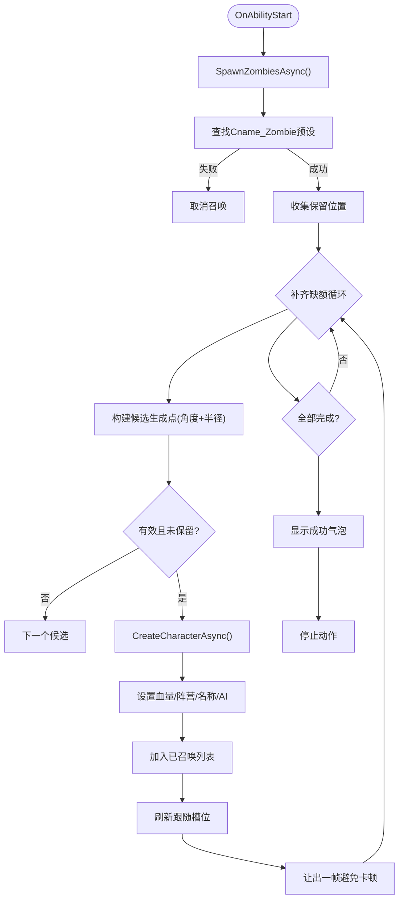
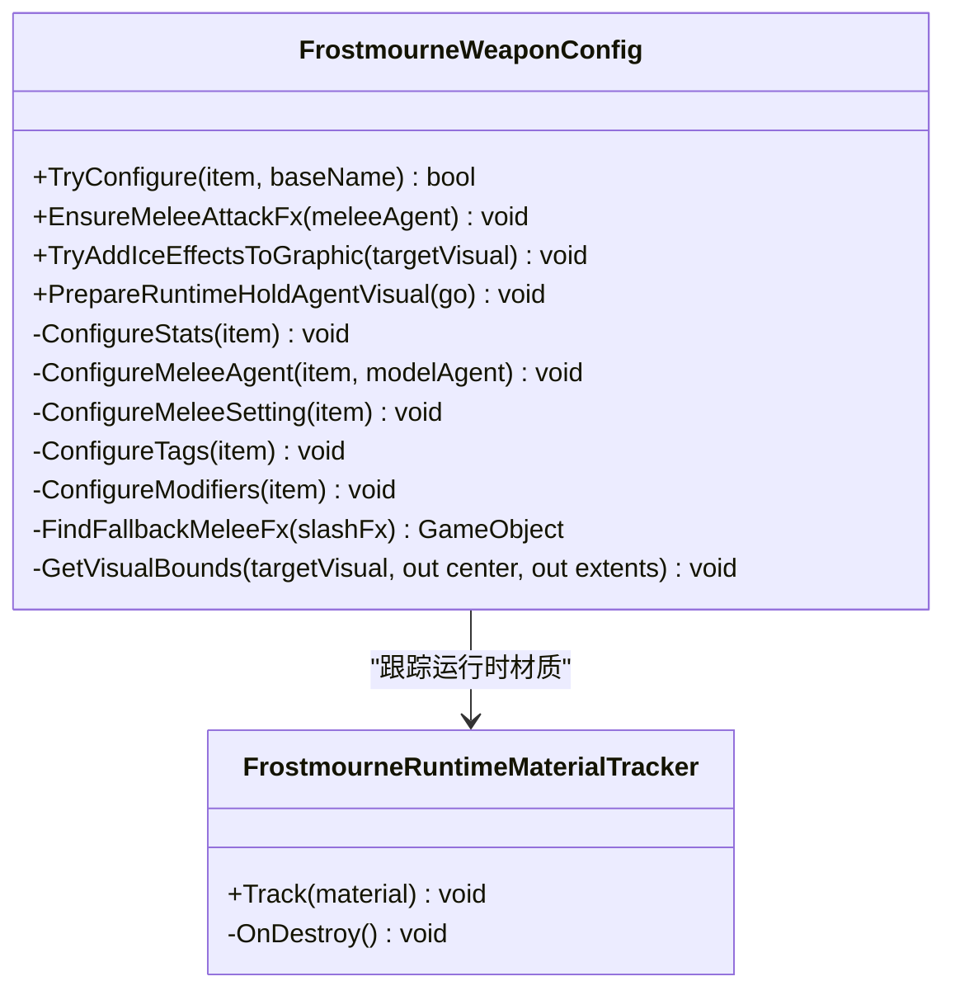
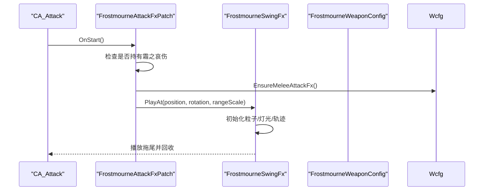
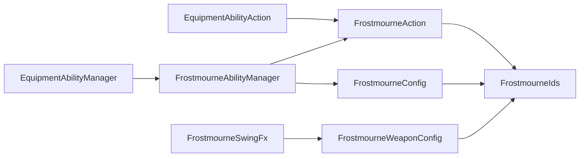

# 霜之哀伤

<cite>
**本文引用的文件**
- [FrostmourneBootstrap.cs](file://Integration/Frostmourne/FrostmourneBootstrap.cs)
- [FrostmourneAbilityManager.cs](file://Integration/Frostmourne/FrostmourneAbilityManager.cs)
- [FrostmourneAction.cs](file://Integration/Frostmourne/FrostmourneAction.cs)
- [FrostmourneConfig.cs](file://Integration/Frostmourne/FrostmourneConfig.cs)
- [FrostmourneIds.cs](file://Integration/Frostmourne/FrostmourneIds.cs)
- [FrostmourneSwingFx.cs](file://Integration/Frostmourne/FrostmourneSwingFx.cs)
- [FrostmourneWeaponConfig.cs](file://Integration/Frostmourne/FrostmourneWeaponConfig.cs)
- [EquipmentAbilityManager.cs](file://Common/Equipment/EquipmentAbilityManager.cs)
- [EquipmentAbilityAction.cs](file://Common/Equipment/EquipmentAbilityAction.cs)
</cite>

## 目录
1. [简介](#简介)
2. [项目结构](#项目结构)
3. [核心组件](#核心组件)
4. [架构总览](#架构总览)
5. [详细组件分析](#详细组件分析)
6. [依赖关系分析](#依赖关系分析)
7. [性能考量](#性能考量)
8. [故障排查指南](#故障排查指南)
9. [结论](#结论)
10. [附录：配置与使用模式](#附录：配置与使用模式)

## 简介
本技术文档围绕“霜之哀伤”武器展开，系统性说明其亡灵召唤机制、冰焰特效系统、能力管理器工作流、动作触发机制与配置文件结构。同时提供战斗技巧、搭配建议与性能调优指南，并给出可复用的实现模式与代码片段路径，帮助开发者快速理解与扩展类似自定义武器功能。

## 项目结构
霜之哀伤模块位于 Integration/Frostmourne 目录下，采用“启动器 + 能力管理器 + 动作 + 配置 + 特效 + 武器装配”的分层组织方式：
- 启动与场景集成：FrostmourneBootstrap.cs
- 右键能力输入与执行：FrostmourneAbilityManager.cs（继承通用能力管理器）
- 召唤逻辑与AI绑定：FrostmourneAction.cs（继承通用能力动作）
- 参数与描述：FrostmourneConfig.cs
- 常量与资源标识：FrostmourneIds.cs
- 左键挥击拖尾特效：FrostmourneSwingFx.cs
- 武器装配与属性注入：FrostmourneWeaponConfig.cs

图表来源
- [FrostmourneBootstrap.cs:21-147](file://Integration/Frostmourne/FrostmourneBootstrap.cs#L21-L147)
- [FrostmourneAbilityManager.cs:18-139](file://Integration/Frostmourne/FrostmourneAbilityManager.cs#L18-L139)
- [FrostmourneAction.cs:22-133](file://Integration/Frostmourne/FrostmourneAction.cs#L22-L133)
- [FrostmourneConfig.cs:12-86](file://Integration/Frostmourne/FrostmourneConfig.cs#L12-L86)
- [FrostmourneSwingFx.cs:17-134](file://Integration/Frostmourne/FrostmourneSwingFx.cs#L17-L134)
- [FrostmourneWeaponConfig.cs:26-150](file://Integration/Frostmourne/FrostmourneWeaponConfig.cs#L26-L150)
- [EquipmentAbilityManager.cs:15-139](file://Common/Equipment/EquipmentAbilityManager.cs#L15-L139)
- [EquipmentAbilityAction.cs:15-198](file://Common/Equipment/EquipmentAbilityAction.cs#L15-L198)

章节来源
- [FrostmourneBootstrap.cs:21-147](file://Integration/Frostmourne/FrostmourneBootstrap.cs#L21-L147)
- [FrostmourneAbilityManager.cs:18-139](file://Integration/Frostmourne/FrostmourneAbilityManager.cs#L18-L139)
- [FrostmourneAction.cs:22-133](file://Integration/Frostmourne/FrostmourneAction.cs#L22-L133)
- [FrostmourneConfig.cs:12-86](file://Integration/Frostmourne/FrostmourneConfig.cs#L12-L86)
- [FrostmourneSwingFx.cs:17-134](file://Integration/Frostmourne/FrostmourneSwingFx.cs#L17-L134)
- [FrostmourneWeaponConfig.cs:26-150](file://Integration/Frostmourne/FrostmourneWeaponConfig.cs#L26-L150)
- [EquipmentAbilityManager.cs:15-139](file://Common/Equipment/EquipmentAbilityManager.cs#L15-L139)
- [EquipmentAbilityAction.cs:15-198](file://Common/Equipment/EquipmentAbilityAction.cs#L15-L198)

## 核心组件
- 能力管理器（FrostmourneAbilityManager）：负责右键输入检测、持有判定、冷却提示、调用能力动作。
- 能力动作（FrostmourneAction）：负责异步召唤亡灵、生成点选择、AI绑定、跟随槽位、生命周期清理。
- 武器装配（FrostmourneWeaponConfig）：为物品注入近战 Stats、冰属性、标签、ColdProtection 修饰符、本地化、运行时材质追踪与冰焰环绕。
- 挥击特效（FrostmourneSwingFx）：在攻击开始时注入冰色拖尾粒子与灯光，按范围缩放动画轨迹。
- 配置（FrostmourneConfig）：定义冷却时间、体力消耗、召唤数量/半径/血量、持续时间等可调参数。
- 启动器（FrostmourneBootstrap）：创建单例能力管理器、场景切换处理、延迟绑定到玩家、全局清理。

章节来源
- [FrostmourneAbilityManager.cs:18-139](file://Integration/Frostmourne/FrostmourneAbilityManager.cs#L18-L139)
- [FrostmourneAction.cs:22-133](file://Integration/Frostmourne/FrostmourneAction.cs#L22-L133)
- [FrostmourneWeaponConfig.cs:26-150](file://Integration/Frostmourne/FrostmourneWeaponConfig.cs#L26-L150)
- [FrostmourneSwingFx.cs:17-134](file://Integration/Frostmourne/FrostmourneSwingFx.cs#L17-L134)
- [FrostmourneConfig.cs:12-86](file://Integration/Frostmourne/FrostmourneConfig.cs#L12-L86)
- [FrostmourneBootstrap.cs:21-147](file://Integration/Frostmourne/FrostmourneBootstrap.cs#L21-L147)

## 架构总览
整体流程：
- 启动阶段：Bootstrap 创建 FrostmourneAbilityManager 单例，并在游戏场景加载后延迟将能力注册到当前玩家。
- 输入阶段：每帧检测 ADS（右键），若持有霜之哀伤且不在冷却中，则尝试执行能力。
- 动作阶段：FrostmourneAction 异步在玩家周围多个方位生成最多 5 只亡灵，设置阵营、血量、AI 行为，并加入跟随槽位。
- 特效阶段：左键攻击时通过 Harmony 钩子注入冰色拖尾粒子与灯光；运行时为模型添加冰焰环绕效果。
- 清理阶段：场景切换或退出时统一清理召唤物与静态缓存。

图表来源
- [FrostmourneBootstrap.cs:21-147](file://Integration/Frostmourne/FrostmourneBootstrap.cs#L21-L147)
- [FrostmourneAbilityManager.cs:25-139](file://Integration/Frostmourne/FrostmourneAbilityManager.cs#L25-L139)
- [FrostmourneAction.cs:94-286](file://Integration/Frostmourne/FrostmourneAction.cs#L94-L286)
- [FrostmourneSwingFx.cs:17-134](file://Integration/Frostmourne/FrostmourneSwingFx.cs#L17-L134)
- [FrostmourneWeaponConfig.cs:275-346](file://Integration/Frostmourne/FrostmourneWeaponConfig.cs#L275-L346)

## 详细组件分析

### 能力管理器（FrostmourneAbilityManager）
- 职责：
  - 继承 EquipmentAbilityManager，统一管理输入拦截、能力激活与执行。
  - 每帧检测 ADS 输入，校验是否持有霜之哀伤、是否在冷却、是否达到召唤上限。
  - 向玩家展示冷却与上限提示气泡。
  - 抑制原版右键开镜输入以避免冲突。
- 关键流程：
  - Update/LateUpdate：优先抑制原版 ADS，再处理召唤输入。
  - HandleSummonInput：读取剩余冷却、上限状态，调用 TryExecuteAbility。
  - IsHoldingFrostmourne：检查近战/手持是否为该武器 TypeID。
  - OnBeforeTryExecute：持有判定。
  - OnSceneChanged：重置预设缓存，重建能力动作。

图表来源
- [FrostmourneAbilityManager.cs:25-139](file://Integration/Frostmourne/FrostmourneAbilityManager.cs#L25-L139)
- [FrostmourneAbilityManager.cs:160-225](file://Integration/Frostmourne/FrostmourneAbilityManager.cs#L160-L225)
- [FrostmourneAbilityManager.cs:227-323](file://Integration/Frostmourne/FrostmourneAbilityManager.cs#L227-L323)

章节来源
- [FrostmourneAbilityManager.cs:25-139](file://Integration/Frostmourne/FrostmourneAbilityManager.cs#L25-L139)
- [FrostmourneAbilityManager.cs:160-225](file://Integration/Frostmourne/FrostmourneAbilityManager.cs#L160-L225)
- [FrostmourneAbilityManager.cs:227-323](file://Integration/Frostmourne/FrostmourneAbilityManager.cs#L227-L323)

### 能力动作与亡灵召唤（FrostmourneAction）
- 职责：
  - 实现“亡灵召唤”动作：在玩家周围多方位生成最多 5 只 Cname_Zombie。
  - 设置僵尸血量、同阵营、禁止掉落、名称、AI 行为。
  - 维护已召唤列表，清理死亡引用，刷新跟随槽位。
  - 异步生成避免卡顿，支持请求失效中断。
- 关键算法：
  - 生成点候选：基于角度偏移与半径缩放，结合地面吸附与碰撞检测，排除保留位置。
  - 存活计数：定期清理死亡引用，保证上限判断准确。
  - AI 绑定：设置 AICharacterController 参数，使其自然寻敌。
- 生命周期：
  - OnAbilityStart：标记开始，启动异步召唤。
  - OnAbilityUpdate：等待异步完成，超时停止。
  - OnAbilityStop/OnDestroy：重置状态，防止重复执行。
  - CleanupAllSummonedZombies：场景退出时销毁所有召唤物。

图表来源
- [FrostmourneAction.cs:94-286](file://Integration/Frostmourne/FrostmourneAction.cs#L94-L286)
- [FrostmourneAction.cs:288-384](file://Integration/Frostmourne/FrostmourneAction.cs#L288-L384)
- [FrostmourneAction.cs:386-478](file://Integration/Frostmourne/FrostmourneAction.cs#L386-L478)
- [FrostmourneAction.cs:480-658](file://Integration/Frostmourne/FrostmourneAction.cs#L480-L658)

章节来源
- [FrostmourneAction.cs:94-286](file://Integration/Frostmourne/FrostmourneAction.cs#L94-L286)
- [FrostmourneAction.cs:288-384](file://Integration/Frostmourne/FrostmourneAction.cs#L288-L384)
- [FrostmourneAction.cs:386-478](file://Integration/Frostmourne/FrostmourneAction.cs#L386-L478)
- [FrostmourneAction.cs:480-658](file://Integration/Frostmourne/FrostmourneAction.cs#L480-L658)

### 武器装配与冰属性（FrostmourneWeaponConfig）
- 职责：
  - 为物品注入 11 个近战 Stats（伤害、攻速、暴击、穿透、射程等）。
  - 添加 ItemAgent_MeleeWeapon 与 ItemSetting_MeleeWeapon（冰元素、冻伤 buff 概率）。
  - 添加标签、ColdProtection +2 修饰符、宝石槽位、本地化。
  - 运行时为模型添加冰焰环绕（复制烟雾粒子、重染材质与灯光）。
  - 修复运动模糊、渲染层、材质着色器兼容性问题。
- 关键点：
  - EnsureMeleeAttackFx：复用其他武器的 slash/hit 特效作为回退，并应用自定义缩放策略。
  - TryAddIceEffectsToGraphic：动态为模型添加冰焰环绕，计算包围盒并调整粒子形状与速度。
  - FrostmourneRuntimeMaterialTracker：跟踪运行时创建的材质，对象销毁时释放。

图表来源
- [FrostmourneWeaponConfig.cs:26-150](file://Integration/Frostmourne/FrostmourneWeaponConfig.cs#L26-L150)
- [FrostmourneWeaponConfig.cs:275-346](file://Integration/Frostmourne/FrostmourneWeaponConfig.cs#L275-L346)
- [FrostmourneWeaponConfig.cs:346-642](file://Integration/Frostmourne/FrostmourneWeaponConfig.cs#L346-L642)
- [FrostmourneWeaponConfig.cs:904-947](file://Integration/Frostmourne/FrostmourneWeaponConfig.cs#L904-L947)

章节来源
- [FrostmourneWeaponConfig.cs:26-150](file://Integration/Frostmourne/FrostmourneWeaponConfig.cs#L26-L150)
- [FrostmourneWeaponConfig.cs:275-346](file://Integration/Frostmourne/FrostmourneWeaponConfig.cs#L275-L346)
- [FrostmourneWeaponConfig.cs:346-642](file://Integration/Frostmourne/FrostmourneWeaponConfig.cs#L346-L642)
- [FrostmourneWeaponConfig.cs:904-947](file://Integration/Frostmourne/FrostmourneWeaponConfig.cs#L904-L947)

### 挥击拖尾特效（FrostmourneSwingFx）
- 职责：
  - 通过 Harmony 钩子在 CA_Attack.OnStart 时检测是否持有霜之哀伤，并注入冰色拖尾。
  - 根据武器攻击范围缩放拖尾距离与尺寸，沿扇形轨迹旋转。
  - 重染粒子颜色与透明度，关闭发射后回收至对象池。
- 性能优化：
  - 对象池限制最大实例数，超限时销毁。
  - 粒子发射在后期关闭，减少持续开销。
  - 仅对目标模型注入一次，避免重复。

图表来源
- [FrostmourneSwingFx.cs:17-134](file://Integration/Frostmourne/FrostmourneSwingFx.cs#L17-L134)
- [FrostmourneSwingFx.cs:152-225](file://Integration/Frostmourne/FrostmourneSwingFx.cs#L152-L225)
- [FrostmourneSwingFx.cs:227-338](file://Integration/Frostmourne/FrostmourneSwingFx.cs#L227-L338)
- [FrostmourneWeaponConfig.cs:275-346](file://Integration/Frostmourne/FrostmourneWeaponConfig.cs#L275-L346)

章节来源
- [FrostmourneSwingFx.cs:17-134](file://Integration/Frostmourne/FrostmourneSwingFx.cs#L17-L134)
- [FrostmourneSwingFx.cs:152-225](file://Integration/Frostmourne/FrostmourneSwingFx.cs#L152-L225)
- [FrostmourneSwingFx.cs:227-338](file://Integration/Frostmourne/FrostmourneSwingFx.cs#L227-L338)
- [FrostmourneWeaponConfig.cs:275-346](file://Integration/Frostmourne/FrostmourneWeaponConfig.cs#L275-L346)

### 启动与场景集成（FrostmourneBootstrap）
- 职责：
  - 创建 FrostmourneAbilityManager 单例并持久化。
  - 场景加载后延迟绑定能力到玩家，避免角色未就绪导致失败。
  - 清理静态数据、召唤物与额外掉落订阅。
- 蓝Boss额外掉落：
  - 在特定条件下有概率将霜之哀伤加入 Boss 的库存或 BossRush 奖励箱。

章节来源
- [FrostmourneBootstrap.cs:21-147](file://Integration/Frostmourne/FrostmourneBootstrap.cs#L21-L147)
- [FrostmourneBootstrap.cs:150-335](file://Integration/Frostmourne/FrostmourneBootstrap.cs#L150-L335)

## 依赖关系分析
- 通用基类依赖：
  - FrostmourneAbilityManager 依赖 EquipmentAbilityManager，复用输入缓存、生命周期、场景切换与动作创建。
  - FrostmourneAction 依赖 EquipmentAbilityAction，复用冷却、体力、音效、硬件同步等通用逻辑。
- 外部系统集成：
  - 通过 CharacterMainControl、ItemAgent_MeleeWeapon、AICharacterController、Duckov.UI.DialogueBubbles 等进行交互。
  - 通过 Harmony 钩子 CA_Attack.OnStart 注入挥击特效。
- 资源与配置：
  - 依赖 FrostmourneIds 中的 TypeID、资源路径、图标名等常量。
  - 依赖 FrostmourneConfig 中的冷却、体力、召唤参数等配置。

图表来源
- [EquipmentAbilityManager.cs:15-139](file://Common/Equipment/EquipmentAbilityManager.cs#L15-L139)
- [EquipmentAbilityAction.cs:15-198](file://Common/Equipment/EquipmentAbilityAction.cs#L15-L198)
- [FrostmourneAbilityManager.cs:18-139](file://Integration/Frostmourne/FrostmourneAbilityManager.cs#L18-L139)
- [FrostmourneAction.cs:22-133](file://Integration/Frostmourne/FrostmourneAction.cs#L22-L133)
- [FrostmourneConfig.cs:12-86](file://Integration/Frostmourne/FrostmourneConfig.cs#L12-L86)
- [FrostmourneIds.cs:7-36](file://Integration/Frostmourne/FrostmourneIds.cs#L7-L36)
- [FrostmourneSwingFx.cs:17-134](file://Integration/Frostmourne/FrostmourneSwingFx.cs#L17-L134)
- [FrostmourneWeaponConfig.cs:26-150](file://Integration/Frostmourne/FrostmourneWeaponConfig.cs#L26-L150)

章节来源
- [EquipmentAbilityManager.cs:15-139](file://Common/Equipment/EquipmentAbilityManager.cs#L15-L139)
- [EquipmentAbilityAction.cs:15-198](file://Common/Equipment/EquipmentAbilityAction.cs#L15-L198)
- [FrostmourneAbilityManager.cs:18-139](file://Integration/Frostmourne/FrostmourneAbilityManager.cs#L18-L139)
- [FrostmourneAction.cs:22-133](file://Integration/Frostmourne/FrostmourneAction.cs#L22-L133)
- [FrostmourneConfig.cs:12-86](file://Integration/Frostmourne/FrostmourneConfig.cs#L12-L86)
- [FrostmourneIds.cs:7-36](file://Integration/Frostmourne/FrostmourneIds.cs#L7-L36)
- [FrostmourneSwingFx.cs:17-134](file://Integration/Frostmourne/FrostmourneSwingFx.cs#L17-L134)
- [FrostmourneWeaponConfig.cs:26-150](file://Integration/Frostmourne/FrostmourneWeaponConfig.cs#L26-L150)

## 性能考量
- 召唤性能：
  - 异步生成与逐只让出一帧，避免主线程阻塞。
  - 使用 OverlapCapsuleNonAlloc 进行碰撞检测，减少分配。
  - 缓存墙掩码与僵尸预设，降低反射与查找开销。
- 特效性能：
  - 挥击拖尾使用对象池，限制最大实例数，结束后回收。
  - 粒子发射在后期关闭，减少持续开销。
  - 运行时材质追踪，对象销毁时释放，避免内存泄漏。
- 输入与UI：
  - 冷却气泡间隔显示，避免频繁 UI 调用。
  - 抑制原版右键开镜，减少无效输入处理。

[本节为通用性能讨论，不直接分析具体文件]

## 故障排查指南
- 无法召唤：
  - 检查是否持有霜之哀伤（IsHoldingFrostmourne）。
  - 检查冷却时间与召唤上限（GetRemainingCooldownTime、IsSummonCapReached）。
  - 查看日志中是否找到 Cname_Zombie 预设（FindZombiePreset）。
- 召唤物未跟随：
  - 确认已刷新跟随槽位（RefreshSummonedZombieFollowerSlots）。
  - 检查 AICharacterController 是否被正确设置（SetupZombieAI）。
- 特效不显示：
  - 确认 CA_Attack.OnStart 钩子生效（FrostmourneAttackFxPatch）。
  - 检查 EnsureMeleeAttackFx 与 TryAddIceEffectsToGraphic 是否执行。
- 场景切换异常：
  - 确认 OnSceneChanged 重置了预设缓存（ResetPresetCache）。
  - 确认 CleanupAllSummonedZombies 清理了召唤物。

章节来源
- [FrostmourneAbilityManager.cs:227-323](file://Integration/Frostmourne/FrostmourneAbilityManager.cs#L227-L323)
- [FrostmourneAction.cs:386-478](file://Integration/Frostmourne/FrostmourneAction.cs#L386-L478)
- [FrostmourneAction.cs:528-658](file://Integration/Frostmourne/FrostmourneAction.cs#L528-L658)
- [FrostmourneSwingFx.cs:17-134](file://Integration/Frostmourne/FrostmourneSwingFx.cs#L17-L134)
- [FrostmourneWeaponConfig.cs:275-346](file://Integration/Frostmourne/FrostmourneWeaponConfig.cs#L275-L346)
- [FrostmourneBootstrap.cs:21-147](file://Integration/Frostmourne/FrostmourneBootstrap.cs#L21-L147)

## 结论
霜之哀伤模块通过清晰的分层设计与通用能力框架，实现了稳定的亡灵召唤机制、完善的冰焰特效系统与高效的性能优化策略。其模块化结构便于扩展与复用，适合用于开发更多自定义武器与技能。

[本节为总结性内容，不直接分析具体文件]

## 附录：配置与使用模式
- 配置项（FrostmourneConfig）：
  - 冷却时间：10 秒
  - 启动体力消耗：14
  - 召唤数量：5
  - 召唤半径：2.5 米
  - 僵尸血量：100
  - 动作持续时间：1.5 秒
- 使用模式：
  - 右键触发召唤，需持有霜之哀伤且不在冷却中。
  - 左键攻击触发冰色拖尾特效。
  - 场景切换后自动重新绑定能力。
- 代码片段路径（示例）：
  - 能力注册与场景绑定：[FrostmourneBootstrap.cs:21-147](file://Integration/Frostmourne/FrostmourneBootstrap.cs#L21-L147)
  - 输入检测与执行：[FrostmourneAbilityManager.cs:25-139](file://Integration/Frostmourne/FrostmourneAbilityManager.cs#L25-L139)
  - 召唤逻辑与AI绑定：[FrostmourneAction.cs:94-286](file://Integration/Frostmourne/FrostmourneAction.cs#L94-L286)
  - 挥击特效注入：[FrostmourneSwingFx.cs:17-134](file://Integration/Frostmourne/FrostmourneSwingFx.cs#L17-L134)
  - 武器装配与冰属性：[FrostmourneWeaponConfig.cs:26-150](file://Integration/Frostmourne/FrostmourneWeaponConfig.cs#L26-L150)

章节来源
- [FrostmourneConfig.cs:12-86](file://Integration/Frostmourne/FrostmourneConfig.cs#L12-L86)
- [FrostmourneBootstrap.cs:21-147](file://Integration/Frostmourne/FrostmourneBootstrap.cs#L21-L147)
- [FrostmourneAbilityManager.cs:25-139](file://Integration/Frostmourne/FrostmourneAbilityManager.cs#L25-L139)
- [FrostmourneAction.cs:94-286](file://Integration/Frostmourne/FrostmourneAction.cs#L94-L286)
- [FrostmourneSwingFx.cs:17-134](file://Integration/Frostmourne/FrostmourneSwingFx.cs#L17-L134)
- [FrostmourneWeaponConfig.cs:26-150](file://Integration/Frostmourne/FrostmourneWeaponConfig.cs#L26-L150)