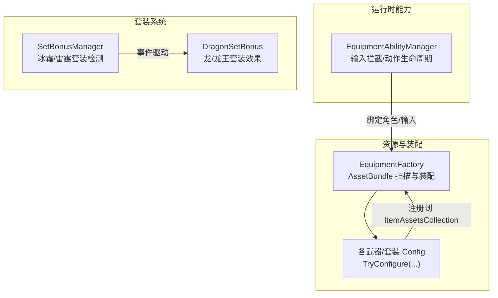
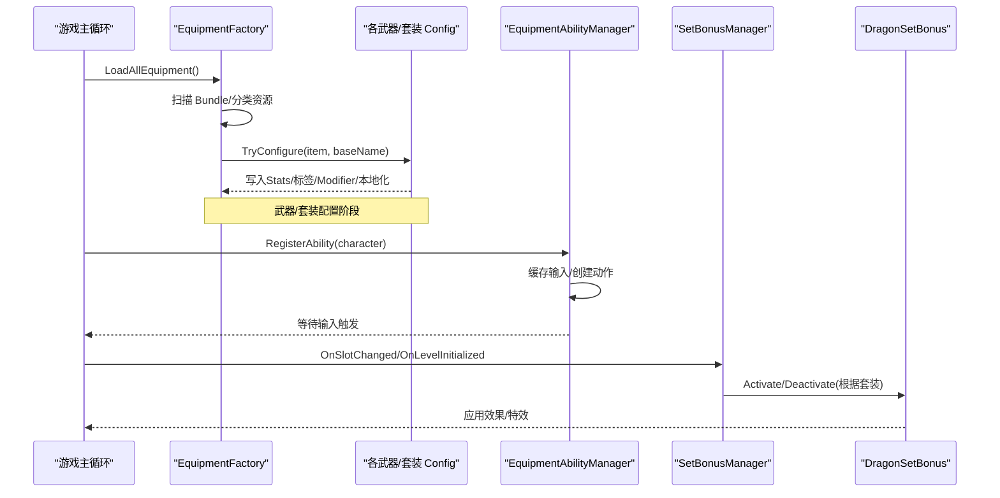
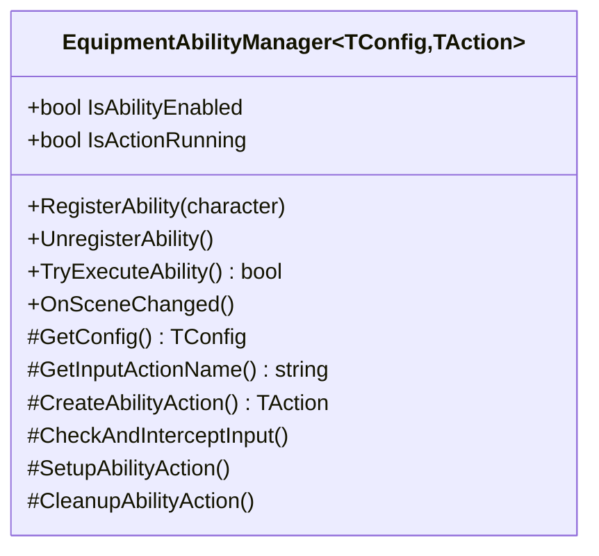
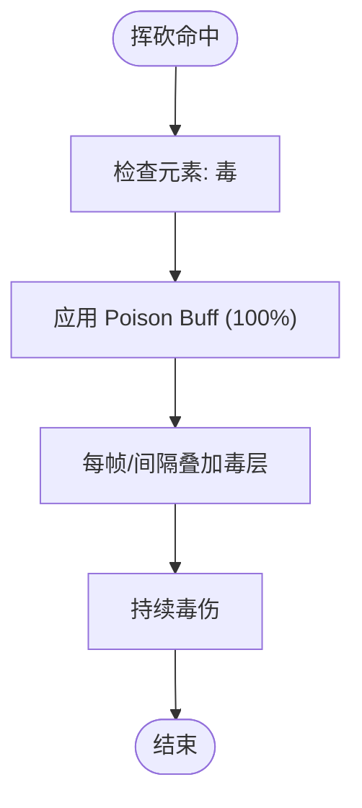
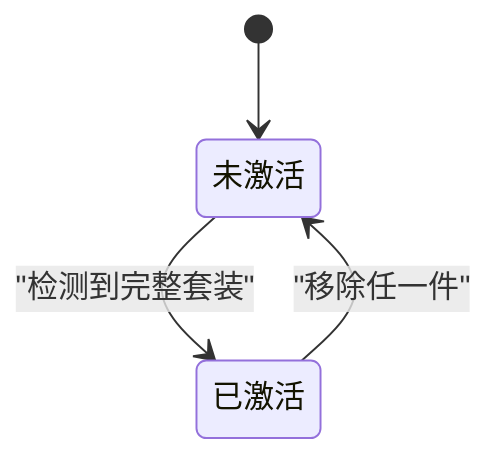
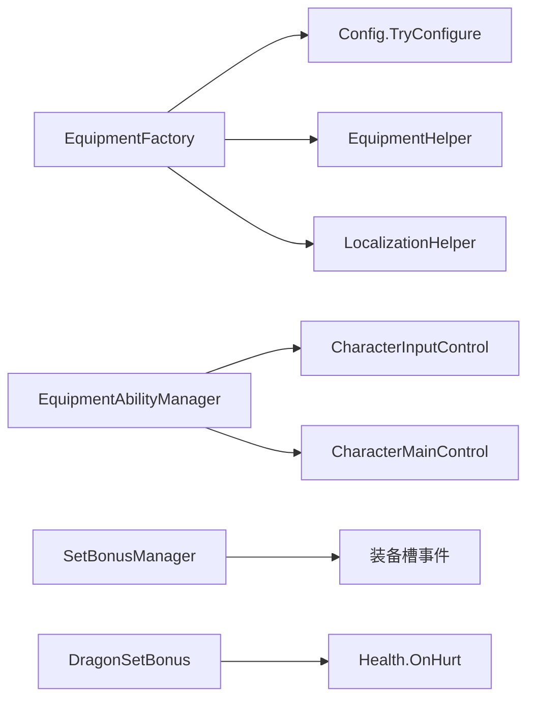

# 装备与物品系统

<cite>
**本文引用的文件**
- [EquipmentFactory.cs](file://Integration/EquipmentFactory.cs)
- [EquipmentAbilityManager.cs](file://Common/Equipment/EquipmentAbilityManager.cs)
- [SetBonusManager.cs](file://Integration/Bonus/SetBonusManager.cs)
- [DragonSetBonus.cs](file://Integration/Bonus/DragonSetBonus.cs)
- [ViperDaggerWeaponConfig.cs](file://Integration/NewWeapons/ViperDagger/ViperDaggerWeaponConfig.cs)
- [SummonStaffWeaponConfig.cs](file://Integration/NewWeapons/SummonStaff/SummonStaffWeaponConfig.cs)
- [EnergyShieldWeaponConfig.cs](file://Integration/NewWeapons/EnergyShield/EnergyShieldWeaponConfig.cs)
- [FrostSpearWeaponConfig.cs](file://Integration/NewWeapons/FrostSpear/FrostSpearWeaponConfig.cs)
- [ThunderRingWeaponConfig.cs](file://Integration/NewWeapons/ThunderRing/ThunderRingWeaponConfig.cs)
</cite>

## 目录
1. [简介](#简介)
2. [项目结构](#项目结构)
3. [核心组件](#核心组件)
4. [架构总览](#架构总览)
5. [详细组件分析](#详细组件分析)
6. [依赖关系分析](#依赖关系分析)
7. [性能考量](#性能考量)
8. [故障排查指南](#故障排查指南)
9. [结论](#结论)
10. [附录](#附录)

## 简介
本文件面向 BossRushMod 的装备与物品系统，系统化阐述装备框架、能力系统、套装机制以及六件自定义武器（霜之哀伤、毒蛇匕首、召唤法杖、能量盾、冰霜长矛、雷电戒指）的实现要点。同时说明物品注册流程、TypeID 分配规则、生命周期管理，并提供搭配建议与获取指引。

## 项目结构
BossRushMod 将装备加载、配置与运行时行为解耦：
- 资源加载与装配：通过工厂从 AssetBundle 扫描并识别装备/武器/图腾/子弹/Buff，自动注入标签、模型、Buff、Bullet、本地化等。
- 能力系统：提供统一的能力管理器基类，负责输入拦截、动作生命周期、场景切换重建。
- 套装系统：监听装备槽变化，检测套装组合并激活/停用对应效果。
- 新武器配置器：为每件新武器在加载后追加 Stats、MeleeSetting、Modifier、标签与本地化。

**图示来源**
- [EquipmentFactory.cs:176-749](file://Integration/EquipmentFactory.cs#L176-L749)
- [EquipmentAbilityManager.cs:18-577](file://Common/Equipment/EquipmentAbilityManager.cs#L18-L577)
- [SetBonusManager.cs:26-225](file://Integration/Bonus/SetBonusManager.cs#L26-L225)
- [DragonSetBonus.cs:35-707](file://Integration/Bonus/DragonSetBonus.cs#L35-L707)

**章节来源**
- [EquipmentFactory.cs:176-749](file://Integration/EquipmentFactory.cs#L176-L749)
- [EquipmentAbilityManager.cs:18-577](file://Common/Equipment/EquipmentAbilityManager.cs#L18-L577)
- [SetBonusManager.cs:26-225](file://Integration/Bonus/SetBonusManager.cs#L26-L225)
- [DragonSetBonus.cs:35-707](file://Integration/Bonus/DragonSetBonus.cs#L35-L707)

## 核心组件
- 装备工厂（EquipmentFactory）
  - 自动扫描 Assets/Equipment 下的 AssetBundle，识别 Item/ItemAgent/Projectile/Buff，按命名约定归类并注入标签、模型、Buff、Bullet、本地化。
  - 支持近战武器注册（避免被误识别为枪械），并在加载完成后调用各武器/套装 Config.TryConfigure 完成最终配置。
- 能力管理器（EquipmentAbilityManager<TConfig,TAction>）
  - 抽象基类，封装输入缓存、输入拦截、能力激活/停用、场景切换重建、动作对象生命周期管理。
  - 子类只需实现配置获取、输入动作名、动作创建钩子。
- 套装管理器（SetBonusManager）
  - 监听装备槽变化与场景初始化，基于 TypeID 匹配冰霜/雷霆套装并激活/停用。
- 龙/龙王套装（DragonSetBonus）
  - 基于名称匹配龙头/龙甲或龙王之冕/龙王鳞铠，触发火焰伤害转治疗、物理减伤、眼部红光特效。

**章节来源**
- [EquipmentFactory.cs:176-749](file://Integration/EquipmentFactory.cs#L176-L749)
- [EquipmentAbilityManager.cs:18-577](file://Common/Equipment/EquipmentAbilityManager.cs#L18-L577)
- [SetBonusManager.cs:26-225](file://Integration/Bonus/SetBonusManager.cs#L26-L225)
- [DragonSetBonus.cs:35-707](file://Integration/Bonus/DragonSetBonus.cs#L35-L707)

## 架构总览
装备与物品系统的运行流程如下：
- 启动时扫描并加载 AssetBundle，分类收集 Item/Model/Bullet/Buff。
- 对每个 Item 执行类型识别与关联资源（模型、Buff、Bullet）。
- 调用各武器/套装 Config.TryConfigure 写入 Stats、标签、Modifier、本地化。
- 运行时通过能力管理器拦截输入并执行能力；套装系统响应装备槽变化激活/停用套装效果。

**图示来源**
- [EquipmentFactory.cs:176-749](file://Integration/EquipmentFactory.cs#L176-L749)
- [EquipmentAbilityManager.cs:18-577](file://Common/Equipment/EquipmentAbilityManager.cs#L18-L577)
- [SetBonusManager.cs:26-225](file://Integration/Bonus/SetBonusManager.cs#L26-L225)
- [DragonSetBonus.cs:35-707](file://Integration/Bonus/DragonSetBonus.cs#L35-L707)

## 详细组件分析

### 装备框架与能力系统
- 装备基类与类型识别
  - EquipmentType 枚举覆盖头盔、护甲、背包、面罩、耳机、枪械、图腾、近战武器。
  - 通过 Prefab 名称解析类型，自动添加对应 Tag（如 Gun/Weapon/Totem）。
- 能力管理器基类
  - 单例模式、输入反射缓存、Update 中检测输入、TryExecuteAbility 统一执行入口。
  - 场景切换时重建动作对象，确保角色引用正确。
  - 子类需实现 GetConfig、GetInputActionName、CreateAbilityAction。

**图示来源**
- [EquipmentAbilityManager.cs:18-577](file://Common/Equipment/EquipmentAbilityManager.cs#L18-L577)

**章节来源**
- [EquipmentFactory.cs:114-127](file://Integration/EquipmentFactory.cs#L114-L127)
- [EquipmentAbilityManager.cs:18-577](file://Common/Equipment/EquipmentAbilityManager.cs#L18-L577)

### 自定义武器实现

#### 毒蛇匕首（毒伤机制）
- 配置要点
  - 注入近战 Stats（伤害、攻速、暴击、穿透、范围、体力消耗等）。
  - 设置 MeleeSetting 元素为毒，并绑定原版 Poison Buff，100% 触发中毒。
  - 添加 Weapon/MeleeWeapon/Special 标签，标记为近战武器。
  - 绑定模型与本地化。
- 运行时行为
  - 命中敌人施加中毒 Buff，配合游戏内毒伤持续计算。

**图示来源**
- [ViperDaggerWeaponConfig.cs:164-191](file://Integration/NewWeapons/ViperDagger/ViperDaggerWeaponConfig.cs#L164-L191)

**章节来源**
- [ViperDaggerWeaponConfig.cs:50-101](file://Integration/NewWeapons/ViperDagger/ViperDaggerWeaponConfig.cs#L50-L101)
- [ViperDaggerWeaponConfig.cs:103-205](file://Integration/NewWeapons/ViperDagger/ViperDaggerWeaponConfig.cs#L103-L205)

#### 召唤法杖（召唤物系统）
- 配置要点
  - 注入近战 Stats（偏弱定位）。
  - 设置 MeleeSetting 为物理元素，无额外 Buff。
  - 添加 Weapon/MeleeWeapon/Special 标签，绑定模型与本地化。
- 说明
  - 具体召唤逻辑由上层能力/控制器实现，此处完成基础武器装配与标签。

**章节来源**
- [SummonStaffWeaponConfig.cs:50-88](file://Integration/NewWeapons/SummonStaff/SummonStaffWeaponConfig.cs#L50-L88)
- [SummonStaffWeaponConfig.cs:90-175](file://Integration/NewWeapons/SummonStaff/SummonStaffWeaponConfig.cs#L90-L175)

#### 能量盾（防护机制）
- 配置要点
  - 作为图腾类装备，添加 Totem/Special 标签。
  - 通过 Modifier 增加 BodyArmor（护甲值提升）。
  - 绑定模型与本地化。
- 说明
  - 防护效果以护甲加成体现，实际护盾可视化/交互由上层实现。

**章节来源**
- [EnergyShieldWeaponConfig.cs:25-59](file://Integration/NewWeapons/EnergyShield/EnergyShieldWeaponConfig.cs#L25-L59)
- [EnergyShieldWeaponConfig.cs:61-90](file://Integration/NewWeapons/EnergyShield/EnergyShieldWeaponConfig.cs#L61-L90)

#### 冰霜长矛（冰系攻击）
- 配置要点
  - 注入近战 Stats。
  - 设置 MeleeSetting 元素为冰，并绑定 Cold Buff，按配置概率触发冰冻。
  - 添加 ColdProtection Modifier（抗寒提升）。
  - 添加 Weapon/MeleeWeapon/Special 标签，绑定模型与本地化。
- 说明
  - 冰冻效果由游戏内 Cold Buff 驱动，配合控制与减速。

**章节来源**
- [FrostSpearWeaponConfig.cs:50-90](file://Integration/NewWeapons/FrostSpear/FrostSpearWeaponConfig.cs#L50-L90)
- [FrostSpearWeaponConfig.cs:151-182](file://Integration/NewWeapons/FrostSpear/FrostSpearWeaponConfig.cs#L151-L182)
- [FrostSpearWeaponConfig.cs:198-208](file://Integration/NewWeapons/FrostSpear/FrostSpearWeaponConfig.cs#L198-L208)

#### 雷电戒指（连锁闪电效果）
- 配置要点
  - 作为图腾类装备，添加 Totem/Special 标签。
  - 绑定模型与本地化。
- 说明
  - 连锁闪电的具体触发与弹射逻辑由上层能力/控制器实现，此处完成基础装配。

**章节来源**
- [ThunderRingWeaponConfig.cs:24-55](file://Integration/NewWeapons/ThunderRing/ThunderRingWeaponConfig.cs#L24-L55)
- [ThunderRingWeaponConfig.cs:57-74](file://Integration/NewWeapons/ThunderRing/ThunderRingWeaponConfig.cs#L57-L74)

#### 霜之哀伤（亡灵召唤与冰焰特效）
- 说明
  - 该武器属于 Boss/特殊内容范畴，其能力与特效通常由独立能力管理器与特效管线实现。
  - 若需要将其纳入通用装备框架，可参考上述武器配置器模式：在加载后调用对应 Config.TryConfigure 完成 Stats/标签/本地化，并通过能力管理器处理输入与特效。

[本节为概念性说明，不直接分析具体文件]

### 套装系统完整实现
- 龙套装与龙王套装
  - 通过名称匹配“龙头/龙甲”或“龙王之冕/龙王鳞铠”，同时穿戴时激活。
  - 效果：免疫火焰伤害并将部分转化为治疗；附加物理减伤（通过 Modifier 系统）；头部红光呼吸灯特效。
  - 事件：订阅装备槽变化与场景初始化，动态激活/停用。
- 冰霜套装与雷霆套装
  - 通过 TypeID 精确匹配头盔与护甲组合，避免名称歧义。
  - 效果：分别激活对应的冰霜/雷霆增益（由各自模块实现）。
  - 事件：统一由 SetBonusManager 监听槽位变化并分发激活/停用。

**图示来源**
- [DragonSetBonus.cs:245-351](file://Integration/Bonus/DragonSetBonus.cs#L245-L351)
- [SetBonusManager.cs:155-220](file://Integration/Bonus/SetBonusManager.cs#L155-L220)

**章节来源**
- [DragonSetBonus.cs:35-707](file://Integration/Bonus/DragonSetBonus.cs#L35-L707)
- [SetBonusManager.cs:26-225](file://Integration/Bonus/SetBonusManager.cs#L26-L225)

## 依赖关系分析
- 装备工厂依赖
  - 资源：AssetBundle、Item/ItemAgent/Projectile/Buff。
  - 配置：各武器/套装 Config.TryConfigure。
  - 工具：EquipmentHelper（标签/Modifier）、LocalizationHelper（本地化）。
- 能力管理器依赖
  - 输入系统：CharacterInputControl（反射缓存）。
  - 角色：CharacterMainControl（StartAction）。
- 套装系统依赖
  - 事件：装备槽变化事件、场景初始化事件。
  - 状态：当前头盔/护甲 TypeID 或名称匹配。

**图示来源**
- [EquipmentFactory.cs:501-749](file://Integration/EquipmentFactory.cs#L501-L749)
- [EquipmentAbilityManager.cs:197-331](file://Common/Equipment/EquipmentAbilityManager.cs#L197-L331)
- [SetBonusManager.cs:47-126](file://Integration/Bonus/SetBonusManager.cs#L47-L126)
- [DragonSetBonus.cs:203-236](file://Integration/Bonus/DragonSetBonus.cs#L203-L236)

**章节来源**
- [EquipmentFactory.cs:501-749](file://Integration/EquipmentFactory.cs#L501-L749)
- [EquipmentAbilityManager.cs:197-331](file://Common/Equipment/EquipmentAbilityManager.cs#L197-L331)
- [SetBonusManager.cs:47-126](file://Integration/Bonus/SetBonusManager.cs#L47-L126)
- [DragonSetBonus.cs:203-236](file://Integration/Bonus/DragonSetBonus.cs#L203-L236)

## 性能考量
- 反射缓存
  - 能力管理器缓存 InputAction 引用与方法，避免每帧反射开销。
  - 龙套装缓存装备槽事件 FieldInfo，减少重复反射。
- 资源与对象复用
  - 装备工厂维护已加载模型/子弹/Buff 字典，避免重复加载。
  - 龙套装眼睛特效使用协程控制呼吸灯，避免多余计算。
- 事件驱动
  - 套装系统仅在装备槽变化或场景初始化时检测，避免轮询。

**章节来源**
- [EquipmentAbilityManager.cs:219-331](file://Common/Equipment/EquipmentAbilityManager.cs#L219-L331)
- [DragonSetBonus.cs:118-130](file://Integration/Bonus/DragonSetBonus.cs#L118-L130)
- [EquipmentFactory.cs:134-157](file://Integration/EquipmentFactory.cs#L134-L157)

## 故障排查指南
- 装备未生效
  - 确认 AssetBundle 路径与命名规范（_Item/_Model/_Bullet/_Buff）。
  - 检查是否调用了对应 Config.TryConfigure（EquipmentFactory 在加载后会调用）。
  - 查看日志输出中的“发现 Item/Model/Bullet/Buff”与“成功加载”信息。
- 能力无法触发
  - 确认能力管理器已 RegisterAbility 并绑定到目标角色。
  - 检查输入动作名是否正确，反射缓存是否成功。
  - 场景切换后是否调用 RebindToCharacter/OnSceneChanged 重建动作。
- 套装未激活
  - 龙/龙王套装：确认名称匹配（龙头/龙甲或龙王之冕/龙王鳞铠）。
  - 冰霜/雷霆套装：确认 TypeID 匹配且装备槽为头盔/护甲。
  - 检查事件注册是否成功（装备槽变化/场景初始化）。

**章节来源**
- [EquipmentFactory.cs:501-749](file://Integration/EquipmentFactory.cs#L501-L749)
- [EquipmentAbilityManager.cs:197-331](file://Common/Equipment/EquipmentAbilityManager.cs#L197-L331)
- [SetBonusManager.cs:47-126](file://Integration/Bonus/SetBonusManager.cs#L47-L126)
- [DragonSetBonus.cs:245-351](file://Integration/Bonus/DragonSetBonus.cs#L245-L351)

## 结论
BossRushMod 的装备与物品系统通过“工厂装配 + 配置器注入 + 能力管理器 + 套装事件驱动”的分层设计，实现了高扩展性与低耦合。新武器仅需遵循命名规范与配置器接口即可接入；套装系统通过事件驱动与精确匹配保证稳定性。结合性能优化（反射缓存、资源复用、事件驱动），整体具备良好可扩展性与运行效率。

## 附录

### 物品注册机制与 TypeID 分配规则
- 注册时机
  - 装备工厂加载 AssetBundle 后，对每个 Item 调用 ItemAssetsCollection.AddDynamicEntry 完成注册。
- TypeID 分配
  - 建议在 AssetBundle 中为每个物品设置唯一 TypeID（装备建议 600000+，图腾建议 600100+）。
  - 近战武器可通过 RegisterMeleeWeapon 防止被误识别为枪械。
- 生命周期
  - 工厂维护 loadedModels/loadedGuns/loadedBuffs/loadedBullets 字典，避免重复加载。
  - 场景切换时能力管理器重建动作对象，确保角色引用有效。

**章节来源**
- [EquipmentFactory.cs:176-387](file://Integration/EquipmentFactory.cs#L176-L387)
- [EquipmentFactory.cs:501-749](file://Integration/EquipmentFactory.cs#L501-L749)

### 装备搭配建议
- 生存向
  - 龙/龙王套装：火焰转治疗 + 物理减伤，适合高火伤环境。
  - 能量盾：BodyArmor 提升，增强坦度。
- 控制向
  - 冰霜长矛：冰系元素 + 冰冻 Buff，配合控场与减速。
- 持续输出
  - 毒蛇匕首：稳定毒伤，适合持久战。
- 辅助/爆发
  - 雷电戒指：图腾位占用，配合上层连锁闪电实现范围爆发。
  - 召唤法杖：偏弱近战，侧重召唤物协同。

### 物品获取指南
- 常规掉落
  - 通过 Boss 掉落、宝箱、商人购买等方式获得。
- 特殊获取
  - 部分装备可能限定于特定模式或活动（如 ModeD/ModeE/ModeF/ModeG/ZombieMode 等）。
- 调试与测试
  - 可使用 DebugAndTools 中的物品生成器进行快速验证与平衡性测试。

[本节为通用指导，不直接分析具体文件]