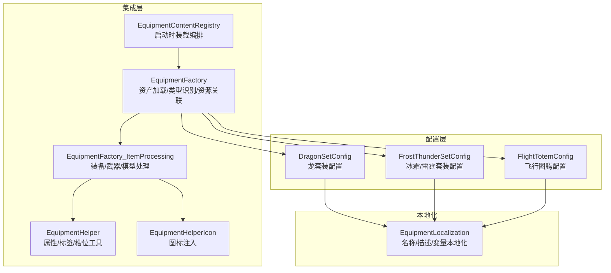
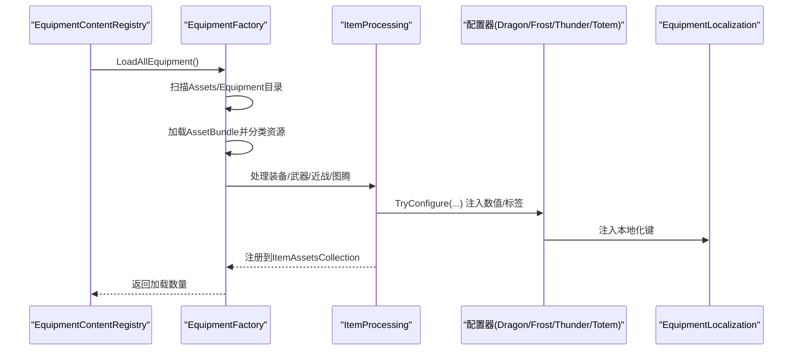
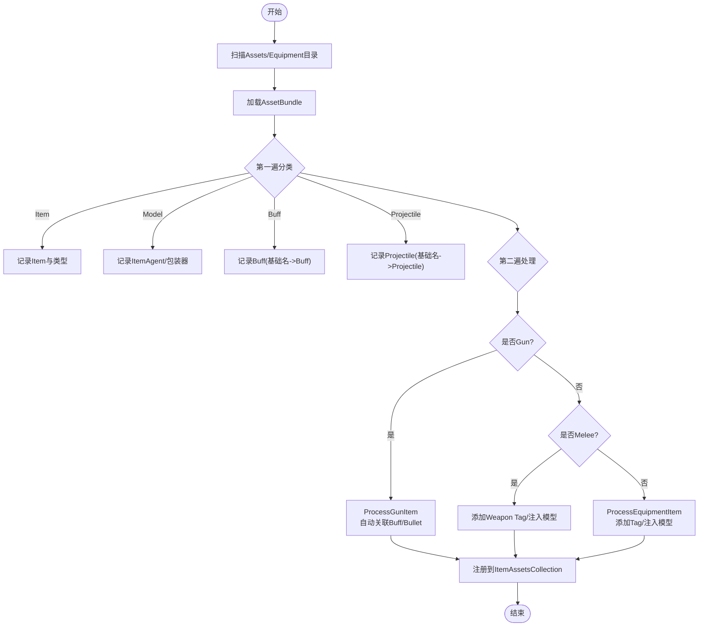
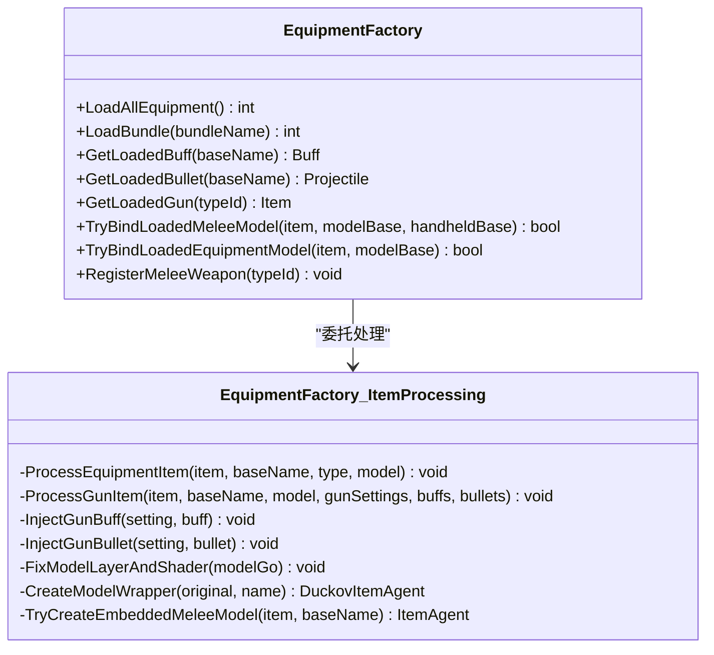
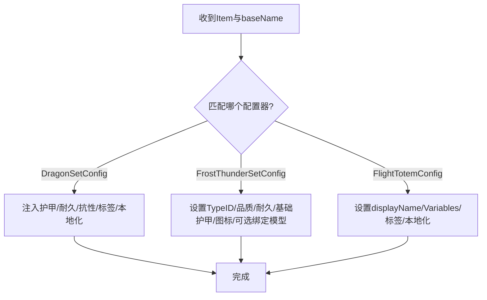
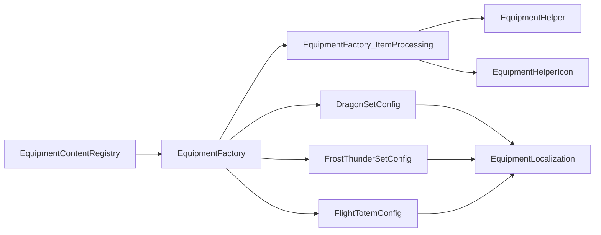

# 装备框架与工厂系统

<cite>
**本文引用的文件**
- [EquipmentFactory.cs](file://Integration/EquipmentFactory.cs)
- [EquipmentFactory_ItemProcessing.cs](file://Integration/EquipmentFactory_ItemProcessing.cs)
- [EquipmentHelper.cs](file://Integration/EquipmentHelper.cs)
- [EquipmentHelperIcon.cs](file://Integration/EquipmentHelperIcon.cs)
- [EquipmentContentRegistry.cs](file://Integration/EquipmentContentRegistry.cs)
- [DragonSetConfig.cs](file://Integration/Config/DragonSetConfig.cs)
- [FrostThunderSetConfig.cs](file://Integration/Config/FrostThunderSetConfig.cs)
- [FlightTotemConfig.cs](file://Integration/Config/FlightTotemConfig.cs)
- [EquipmentLocalization.cs](file://Localization/EquipmentLocalization.cs)
</cite>

## 目录
1. [简介](#简介)
2. [项目结构](#项目结构)
3. [核心组件](#核心组件)
4. [架构总览](#架构总览)
5. [详细组件分析](#详细组件分析)
6. [依赖关系分析](#依赖关系分析)
7. [性能考量](#性能考量)
8. [故障排查指南](#故障排查指南)
9. [结论](#结论)
10. [附录：自定义装备开发指南](#附录自定义装备开发指南)

## 简介
本技术文档围绕 BossRushMod 的装备框架与工厂系统，系统性说明 EquipmentFactory 的核心架构、AssetBundle 自动加载机制、物品类型识别算法、资源关联逻辑、Buff/Projectile 自动匹配、近战武器特殊处理、模型绑定与 Shader 修复、层级设置等底层实现。同时提供自定义装备的开发指南，包括 TypeID 分配规则、本地化键配置与性能优化建议。

## 项目结构
BossRushMod 将装备系统的“加载与装配”职责集中在 Integration 目录下，配合 Config 子目录中的各套装/图腾配置器，以及 Localization 下的本地化注入模块，形成“工厂 + 配置 + 本地化”的分层结构。

图表来源
- [EquipmentContentRegistry.cs:8-61](file://Integration/EquipmentContentRegistry.cs#L8-L61)
- [EquipmentFactory.cs:176-249](file://Integration/EquipmentFactory.cs#L176-L249)
- [EquipmentFactory_ItemProcessing.cs:118-222](file://Integration/EquipmentFactory_ItemProcessing.cs#L118-L222)
- [DragonSetConfig.cs:62-84](file://Integration/Config/DragonSetConfig.cs#L62-L84)
- [FrostThunderSetConfig.cs:45-81](file://Integration/Config/FrostThunderSetConfig.cs#L45-L81)
- [FlightTotemConfig.cs:49-65](file://Integration/Config/FlightTotemConfig.cs#L49-L65)
- [EquipmentLocalization.cs:102-123](file://Localization/EquipmentLocalization.cs#L102-L123)

章节来源
- [EquipmentContentRegistry.cs:8-61](file://Integration/EquipmentContentRegistry.cs#L8-L61)
- [EquipmentFactory.cs:176-249](file://Integration/EquipmentFactory.cs#L176-L249)

## 核心组件
- EquipmentFactory：负责 AssetBundle 扫描与加载、资源分类、类型识别、Buff/Bullet 自动匹配、模型注入、注册到游戏物品系统。
- EquipmentFactory_ItemProcessing：细化装备/武器处理流程，包含 ItemGraphic 注入、Sockets 节点整理、Shader/Layer 修复、内嵌近战模型创建等。
- EquipmentHelper：通用工具，添加 Modifier、Constant、Tag、宝石槽位等。
- EquipmentHelperIcon：多路径图标注入（PNG/AssetBundle），解决占位 Item 的显示问题。
- 配置器（DragonSetConfig、FrostThunderSetConfig、FlightTotemConfig）：为特定装备/图腾注入数值、标签、本地化键与变量。
- EquipmentLocalization：集中管理所有装备/ Buff/ Boss 名称与描述的本地化注入。

章节来源
- [EquipmentFactory.cs:114-173](file://Integration/EquipmentFactory.cs#L114-L173)
- [EquipmentFactory_ItemProcessing.cs:118-222](file://Integration/EquipmentFactory_ItemProcessing.cs#L118-L222)
- [EquipmentHelper.cs:25-178](file://Integration/EquipmentHelper.cs#L25-L178)
- [EquipmentHelperIcon.cs:26-104](file://Integration/EquipmentHelperIcon.cs#L26-L104)
- [DragonSetConfig.cs:27-84](file://Integration/Config/DragonSetConfig.cs#L27-L84)
- [FrostThunderSetConfig.cs:17-81](file://Integration/Config/FrostThunderSetConfig.cs#L17-L81)
- [FlightTotemConfig.cs:18-65](file://Integration/Config/FlightTotemConfig.cs#L18-L65)
- [EquipmentLocalization.cs:102-123](file://Localization/EquipmentLocalization.cs#L102-L123)

## 架构总览
装备加载的生命周期由 EquipmentContentRegistry 在启动阶段触发，调用 EquipmentFactory.LoadAllEquipment() 扫描并加载 Assets/Equipment 下所有无扩展名的 AssetBundle。工厂内部对 Bundle 进行两遍遍历：第一遍分类收集 Item/Model/Buff/Projectile；第二遍按类型执行差异化处理（装备/武器/近战/图腾），并依次调用各类配置器完成数值、标签、本地化与资源绑定。

图表来源
- [EquipmentContentRegistry.cs:8-61](file://Integration/EquipmentContentRegistry.cs#L8-L61)
- [EquipmentFactory.cs:176-249](file://Integration/EquipmentFactory.cs#L176-L249)
- [EquipmentFactory_ItemProcessing.cs:118-222](file://Integration/EquipmentFactory_ItemProcessing.cs#L118-L222)
- [DragonSetConfig.cs:62-84](file://Integration/Config/DragonSetConfig.cs#L62-L84)
- [FrostThunderSetConfig.cs:45-81](file://Integration/Config/FrostThunderSetConfig.cs#L45-L81)
- [FlightTotemConfig.cs:49-65](file://Integration/Config/FlightTotemConfig.cs#L49-L65)
- [EquipmentLocalization.cs:102-123](file://Localization/EquipmentLocalization.cs#L102-L123)

## 详细组件分析

### EquipmentFactory：资产加载与类型识别
- 自动加载：LoadAllEquipment 扫描 mod 目录下的 Assets/Equipment，跳过 .manifest 与非 bundle 文件，逐个调用 LoadBundle。
- 类型识别：ParseEquipmentTypeFromName 通过名称后缀判断装备/武器/近战/图腾；ExtractBaseName 去除 _Item/_Model/_Bullet/_Buff 等后缀得到基础名；ExtractWeaponPrefix 从武器基础名提取前缀用于匹配同名 Buff/Bullet。
- 资源分类：第一遍遍历收集 Item/Model/Buff/Projectile，并按基础名建立索引；第二遍根据类型执行差异化处理。
- 缓存：维护 loadedModels、loadedBuffs、loadedBullets、loadedGuns、loadedBundles 等静态缓存，避免重复加载与查找。
- 近战武器保护：customMeleeWeaponTypeIds 防止被误识别为枪械；RegisterMeleeWeapon 可显式注册。

图表来源
- [EquipmentFactory.cs:176-249](file://Integration/EquipmentFactory.cs#L176-L249)
- [EquipmentFactory.cs:399-494](file://Integration/EquipmentFactory.cs#L399-L494)
- [EquipmentFactory.cs:496-749](file://Integration/EquipmentFactory.cs#L496-L749)

章节来源
- [EquipmentFactory.cs:176-249](file://Integration/EquipmentFactory.cs#L176-L249)
- [EquipmentFactory.cs:399-494](file://Integration/EquipmentFactory.cs#L399-L494)
- [EquipmentFactory.cs:496-749](file://Integration/EquipmentFactory.cs#L496-L749)

### EquipmentFactory_ItemProcessing：装备/武器处理与底层细节
- 装备处理：ProcessEquipmentItem 添加对应 Tag（如 Helmat/Armor/Backpack/FaceMask/Headset），图腾额外添加 DontDropOnDeadInSlot；若未配置 EquipmentModel，则注入；并为假人显示备用路径注入 ItemGraphic。
- 武器处理：ProcessGunItem 添加 Gun Tag，获取 ItemSetting_Gun；若 buff/bulletPfb 未配置，则基于武器前缀自动匹配同名 Buff/Bullet；注入 ItemGraphicInfo_Gun，确保手持/掉落显示正确。
- Sockets 整理：确保 Muzzle/Muzzle2/Tec 节点位于 Sockets 父节点下，避免枪口特效错位；针对龙息武器做位置微调。
- 模型修复：FixModelLayerAndShader 递归设置 Layer 为 Character Layer（常量 9），并将材质 Shader 替换为游戏使用的 SodaCraft/SodaCharacter。
- 运行时包装器：CreateModelWrapper 为缺少 DuckovItemAgent 的模型创建运行时副本并添加组件，避免直接修改只读 Bundle 对象。
- 内嵌近战模型：TryCreateEmbeddedMeleeModel 检测 3D 渲染节点，复制 prefab，移除冲突组件，添加 ItemAgent_MeleeWeapon，初始化 socketsList，设置层级与 Shader，隐藏模板位置。

图表来源
- [EquipmentFactory.cs:176-387](file://Integration/EquipmentFactory.cs#L176-L387)
- [EquipmentFactory_ItemProcessing.cs:118-222](file://Integration/EquipmentFactory_ItemProcessing.cs#L118-L222)
- [EquipmentFactory_ItemProcessing.cs:310-401](file://Integration/EquipmentFactory_ItemProcessing.cs#L310-L401)
- [EquipmentFactory_ItemProcessing.cs:403-477](file://Integration/EquipmentFactory_ItemProcessing.cs#L403-L477)

章节来源
- [EquipmentFactory_ItemProcessing.cs:118-222](file://Integration/EquipmentFactory_ItemProcessing.cs#L118-L222)
- [EquipmentFactory_ItemProcessing.cs:310-401](file://Integration/EquipmentFactory_ItemProcessing.cs#L310-L401)
- [EquipmentFactory_ItemProcessing.cs:403-477](file://Integration/EquipmentFactory_ItemProcessing.cs#L403-L477)

### 配置器：数值、标签与本地化注入
- DragonSetConfig：识别龙头/龙甲基础名，注入护甲值、耐久度、元素抗性、风暴/寒冷防护、爆头伤害加成、视野角度等，并添加 Repairable/Special 标签与本地化键。
- FrostThunderSetConfig：识别冰霜/雷霆四件套基础名或 TypeID，设置 TypeID、品质、耐久、基础护甲修正、图标注入，必要时绑定已加载模型。
- FlightTotemConfig：识别飞行图腾基础名，设置 displayName、CustomData 变量（能力键、速度、体力消耗等）、Special 标签与本地化键。

图表来源
- [DragonSetConfig.cs:62-84](file://Integration/Config/DragonSetConfig.cs#L62-L84)
- [DragonSetConfig.cs:113-202](file://Integration/Config/DragonSetConfig.cs#L113-L202)
- [FrostThunderSetConfig.cs:45-81](file://Integration/Config/FrostThunderSetConfig.cs#L45-L81)
- [FrostThunderSetConfig.cs:113-149](file://Integration/Config/FrostThunderSetConfig.cs#L113-L149)
- [FlightTotemConfig.cs:49-65](file://Integration/Config/FlightTotemConfig.cs#L49-L65)
- [FlightTotemConfig.cs:70-126](file://Integration/Config/FlightTotemConfig.cs#L70-L126)

章节来源
- [DragonSetConfig.cs:62-84](file://Integration/Config/DragonSetConfig.cs#L62-L84)
- [FrostThunderSetConfig.cs:45-81](file://Integration/Config/FrostThunderSetConfig.cs#L45-L81)
- [FlightTotemConfig.cs:49-65](file://Integration/Config/FlightTotemConfig.cs#L49-L65)

### 本地化：名称、描述与变量
- EquipmentLocalization 统一管理装备/Boss/Buff 的名称与描述本地化，支持按 TypeID/BuffID 注入 Item_xxx/Buff_xxx 键。
- FlightTotemConfig 使用 L10n.T 生成多语言文本，并通过 LocalizationHelper 注入 Var_ 前缀的 CustomData 键与数值展示。
- 龙套装/龙王套装/幽灵女巫/龙息武器/龙焰灼烧 Buff 均在此集中注入，保证 UI 显示一致性。

章节来源
- [EquipmentLocalization.cs:102-123](file://Localization/EquipmentLocalization.cs#L102-L123)
- [EquipmentLocalization.cs:167-206](file://Localization/EquipmentLocalization.cs#L167-L206)
- [EquipmentLocalization.cs:244-338](file://Localization/EquipmentLocalization.cs#L244-L338)
- [EquipmentLocalization.cs:460-544](file://Localization/EquipmentLocalization.cs#L460-L544)
- [EquipmentLocalization.cs:602-698](file://Localization/EquipmentLocalization.cs#L602-L698)
- [FlightTotemConfig.cs:70-126](file://Integration/Config/FlightTotemConfig.cs#L70-L126)

## 依赖关系分析
- EquipmentContentRegistry 在启动阶段调用 EquipmentFactory.LoadAllEquipment，随后注册新武器占位符与运行期预热。
- EquipmentFactory 依赖 EquipmentFactory_ItemProcessing 完成具体装配；依赖 EquipmentHelper 添加属性/标签；依赖 EquipmentHelperIcon 注入图标。
- 各配置器依赖 EquipmentLocalization 注入本地化键，部分依赖 EquipmentFactory 提供的模型绑定能力。

图表来源
- [EquipmentContentRegistry.cs:8-61](file://Integration/EquipmentContentRegistry.cs#L8-L61)
- [EquipmentFactory.cs:176-249](file://Integration/EquipmentFactory.cs#L176-L249)
- [EquipmentFactory_ItemProcessing.cs:118-222](file://Integration/EquipmentFactory_ItemProcessing.cs#L118-L222)
- [DragonSetConfig.cs:62-84](file://Integration/Config/DragonSetConfig.cs#L62-L84)
- [FrostThunderSetConfig.cs:45-81](file://Integration/Config/FrostThunderSetConfig.cs#L45-L81)
- [FlightTotemConfig.cs:49-65](file://Integration/Config/FlightTotemConfig.cs#L49-L65)
- [EquipmentLocalization.cs:102-123](file://Localization/EquipmentLocalization.cs#L102-L123)

章节来源
- [EquipmentContentRegistry.cs:8-61](file://Integration/EquipmentContentRegistry.cs#L8-L61)
- [EquipmentFactory.cs:176-249](file://Integration/EquipmentFactory.cs#L176-L249)

## 性能考量
- 避免重复加载：loadedBundles 集合防止重复加载同一 AssetBundle；静态字典缓存模型/Buff/Bullet/Gun，减少查找开销。
- 延迟与批量：LoadAllEquipment 一次性扫描并加载，适合启动阶段；对于大型 Bundle，建议拆分以减少首次加载时间。
- 资源复用：图标加载使用内存缓存（equipmentBundleSprites），避免重复解码 PNG。
- 模型包装器：为缺少组件的模型创建运行时副本，避免直接修改只读 Bundle 对象导致的序列化问题。
- Shader/Layer 修复：仅在加载时执行一次，后续复用；注意避免频繁反射访问。

[本节为通用指导，不直接分析具体文件]

## 故障排查指南
- 未找到 AssetBundle：检查 Assets/Equipment 目录是否存在对应无扩展名 Bundle；确认文件名与传入参数一致。
- 类型识别失败：核对 Prefab 命名是否符合规范（如 _Helmet_Item/_Gun_Item/_Melee_Sword 等）；确保名称中包含识别关键字。
- 武器无子弹/Buff：确认存在同名前缀的 Bullet/Buff 预制体（如 Dragon_Bullet/Dragon_Buff）；或手动在 ItemSetting_Gun 中配置。
- 模型不显示：检查 FixModelLayerAndShader 是否成功替换 Shader；确认 Sockets 节点是否正确组织；验证 ItemGraphic 是否有效。
- 近战武器被误识别为枪械：使用 RegisterMeleeWeapon 显式注册 TypeID，或在名称中使用 _melee_/sword/axe 等关键词。
- 图标不显示：优先放置 PNG 于 Assets/Equipment/{bundle}/{icon}.png；其次尝试放入 AssetBundle；最后回退到克隆源图标。

章节来源
- [EquipmentFactory.cs:176-249](file://Integration/EquipmentFactory.cs#L176-L249)
- [EquipmentFactory.cs:399-494](file://Integration/EquipmentFactory.cs#L399-L494)
- [EquipmentFactory_ItemProcessing.cs:310-401](file://Integration/EquipmentFactory_ItemProcessing.cs#L310-L401)
- [EquipmentFactory_ItemProcessing.cs:640-796](file://Integration/EquipmentFactory_ItemProcessing.cs#L640-L796)
- [EquipmentHelperIcon.cs:62-104](file://Integration/EquipmentHelperIcon.cs#L62-L104)

## 结论
EquipmentFactory 提供了完整的装备/武器加载与装配管线，通过命名约定与自动匹配机制降低内容制作成本；结合配置器与本地化模块，实现了数值、标签、UI 文本的统一管理。遵循本文的命名规范与开发指南，可高效扩展自定义装备，并确保稳定性与性能。

[本节为总结性内容，不直接分析具体文件]

## 附录：自定义装备开发指南

### 资源与命名规范
- 资源目录：将 AssetBundle 放置在 mod 目录下的 Assets/Equipment 中，文件名无扩展名。
- 命名格式：{自定义名}_{类型}_{后缀}
  - 装备类：Helmet_Item/Helmet_Model、Armor_Item/Armor_Model、Backpack_Item/Backpack_Model、FaceMask_Item/FaceMask_Model、Headset_Item/Headset_Model、Totem_Item/Totem_Model
  - 武器类：Gun_Item（可选 Gun_Model）、Bullet、Buff
  - 示例：Dragon_Gun_Item、Dragon_Bullet、Dragon_Buff、MyGear_Helmet_Item、MyGear_Armor_Model
- 自动匹配：Dragon_Gun_Item 会尝试匹配 Dragon_Gun_Model、Dragon_Bullet、Dragon_Buff；武器的 Buff/Bullet 会自动注入到 ItemSetting_Gun。

章节来源
- [EquipmentFactory.cs:17-70](file://Integration/EquipmentFactory.cs#L17-L70)
- [EquipmentFactory.cs:418-494](file://Integration/EquipmentFactory.cs#L418-L494)

### 预制体配置要求
- 装备 Item：必须包含 Item 组件与唯一 TypeID（建议 600000+）；无需手动配置 tags，工厂会自动添加。
- 图腾 Item：需配置 displayName（本地化键名）、quality（1-8）；工厂自动添加 Totem 与绑定标签。
- 武器 Item：需包含 Item 与 ItemSetting_Gun 组件，配置 triggerMode/reloadMode 等基础属性；bulletPfb 与 buff 可不配置，工厂自动关联同名资源。
- Buff：需包含 Buff 组件，配置 id、maxLayers、displayName/description、limitedLifeTime/totalLifeTime、effects。
- Projectile：需包含 Projectile 组件，配置 radius、hitFx（可选）。

章节来源
- [EquipmentFactory.cs:51-84](file://Integration/EquipmentFactory.cs#L51-L84)

### Buff 与 Projectile 自动匹配机制
- 武器前缀提取：从武器基础名（如 Dragon_Gun）去除 _Gun/_Weapon 等后缀得到前缀（Dragon）。
- 匹配规则：若 ItemSetting_Gun.buff 为空，则查找同名前缀的 Buff（Dragon_Buff）并注入；若 bulletPfb 为空且非特例武器，则查找同名前缀的 Projectile（Dragon_Bullet）并注入。
- 缓存：loadedBuffs 与 loadedBullets 以基础名为键，便于快速查找。

章节来源
- [EquipmentFactory_ItemProcessing.cs:182-205](file://Integration/EquipmentFactory_ItemProcessing.cs#L182-L205)
- [EquipmentFactory_ItemProcessing.cs:224-262](file://Integration/EquipmentFactory_ItemProcessing.cs#L224-L262)
- [EquipmentFactory.cs:478-494](file://Integration/EquipmentFactory.cs#L478-L494)

### 近战武器特殊处理流程
- 识别：名称包含 _melee_/sword/axe 等关键词将被识别为近战武器；或通过 RegisterMeleeWeapon 显式注册 TypeID。
- 处理：仅添加 Weapon Tag；若存在模型，则注入 ItemGraphic；若无独立模型，工厂尝试创建内嵌模型（复制 prefab、移除冲突组件、添加 ItemAgent_MeleeWeapon、初始化 socketsList、设置层级与 Shader）。
- 防误识别：已注册的 TypeID 会被从枪械识别中排除，并移除 ItemSetting_Gun 组件。

章节来源
- [EquipmentFactory.cs:418-454](file://Integration/EquipmentFactory.cs#L418-L454)
- [EquipmentFactory.cs:563-588](file://Integration/EquipmentFactory.cs#L563-L588)
- [EquipmentFactory_ItemProcessing.cs:403-477](file://Integration/EquipmentFactory_ItemProcessing.cs#L403-L477)

### 模型绑定、Shader 修复与层级设置
- 模型绑定：TryBindLoadedEquipmentModel/TryBindLoadedMeleeModel 将已加载的 ItemAgent 绑定到物品，并注入 EquipmentModel/ItemGraphic。
- Shader 修复：FixModelLayerAndShader 递归设置 Layer 为 Character Layer（9），并将材质 Shader 替换为 SodaCraft/SodaCharacter。
- 层级设置：SetLayerRecursively 确保整个模型树处于正确的渲染层，避免遮挡或不可见。

章节来源
- [EquipmentFactory.cs:328-370](file://Integration/EquipmentFactory.cs#L328-L370)
- [EquipmentFactory_ItemProcessing.cs:310-352](file://Integration/EquipmentFactory_ItemProcessing.cs#L310-L352)
- [EquipmentFactory_ItemProcessing.cs:479-486](file://Integration/EquipmentFactory_ItemProcessing.cs#L479-L486)

### 自定义装备开发步骤
1. 准备 AssetBundle：包含 Item、Model、可选 Bullet/Buff，按命名规范命名。
2. 配置 Item：设置 TypeID（建议 600000+）、displayName（本地化键）、quality（图腾需要）。
3. 配置武器：添加 ItemSetting_Gun，填写基础属性；如需自定义 Bullet/Buff，可省略，工厂自动匹配。
4. 注册近战武器（如适用）：调用 RegisterMeleeWeapon(TypeID)。
5. 本地化：在 EquipmentLocalization 或对应配置器中注入名称/描述/变量键。
6. 图标：放置 PNG 于 Assets/Equipment/{bundle}/{icon}.png，或使用 EquipmentHelperIcon 的多路径加载。
7. 测试：调用 LoadAllEquipment 或 LoadBundle，检查日志输出与游戏内显示。

章节来源
- [EquipmentFactory.cs:176-249](file://Integration/EquipmentFactory.cs#L176-L249)
- [EquipmentFactory.cs:380-387](file://Integration/EquipmentFactory.cs#L380-L387)
- [EquipmentHelperIcon.cs:62-104](file://Integration/EquipmentHelperIcon.cs#L62-L104)
- [EquipmentLocalization.cs:102-123](file://Localization/EquipmentLocalization.cs#L102-L123)

### TypeID 分配规则
- 装备类建议从 600000 起分配，图腾类建议从 600100 起分配，避免与游戏内置 ID 冲突。
- 每个物品 TypeID 必须唯一；可通过 IsCustomEquipment 检查是否已被工厂加载。

章节来源
- [EquipmentFactory.cs:51-84](file://Integration/EquipmentFactory.cs#L51-L84)
- [EquipmentFactory.cs:372-378](file://Integration/EquipmentFactory.cs#L372-L378)

### 本地化键配置
- 名称/描述：在配置器或 EquipmentLocalization 中注入 displayName 与 description 的本地化键（如 BossRush_FlightTotem）。
- 变量本地化：CustomData 变量键需加 Var_ 前缀（如 Var_Flight_MaxUpwardSpeed），并注入对应值。
- 兼容键：可同时注入原始键（如“龙头”、“龙甲”）与 Item_xxx/Buff_xxx 键，确保不同版本兼容性。

章节来源
- [FlightTotemConfig.cs:70-126](file://Integration/Config/FlightTotemConfig.cs#L70-L126)
- [EquipmentLocalization.cs:167-206](file://Localization/EquipmentLocalization.cs#L167-L206)
- [EquipmentLocalization.cs:244-338](file://Localization/EquipmentLocalization.cs#L244-L338)
- [EquipmentLocalization.cs:460-544](file://Localization/EquipmentLocalization.cs#L460-L544)

### 性能优化建议
- 拆分 Bundle：将大型 Bundle 拆分为多个小 Bundle，减少首次加载时间。
- 预加载关键资源：在启动阶段调用 WarmupProjectileCache 等方法预热常用资源。
- 避免重复反射：尽量在加载阶段完成反射操作，运行时避免频繁反射访问。
- 图标缓存：利用 EquipmentHelperIcon 的 Sprite 缓存，避免重复解码 PNG。

章节来源
- [EquipmentContentRegistry.cs:30-32](file://Integration/EquipmentContentRegistry.cs#L30-L32)
- [EquipmentHelperIcon.cs:31-51](file://Integration/EquipmentHelperIcon.cs#L31-L51)