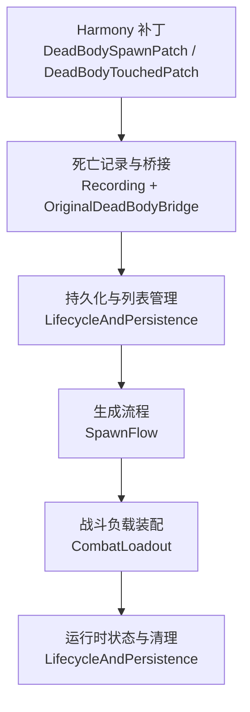
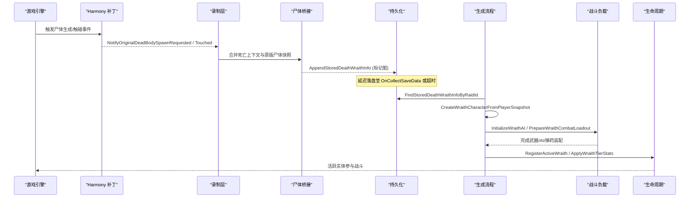
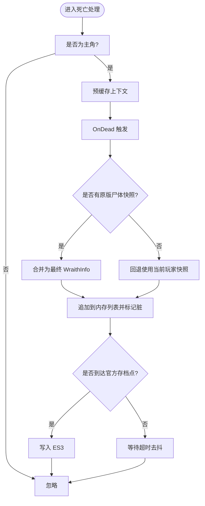
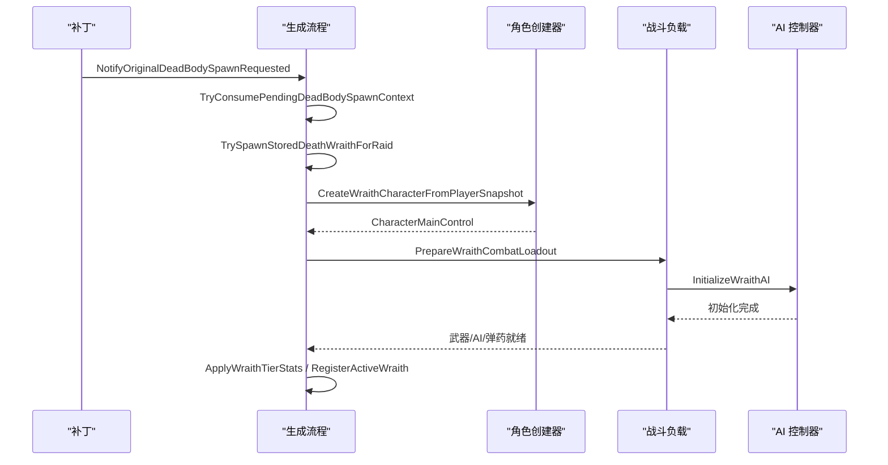
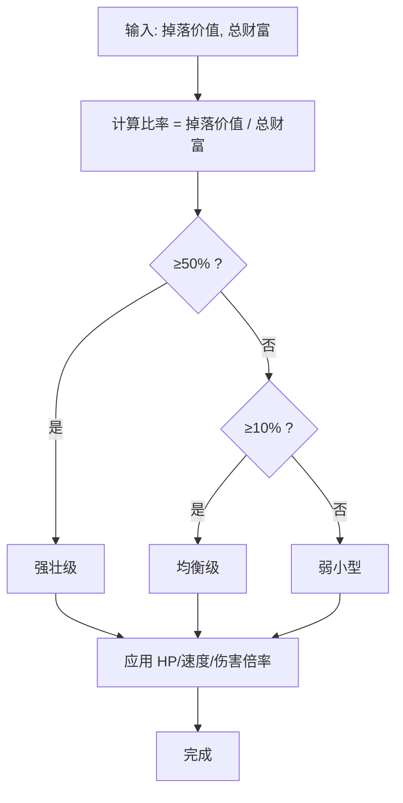
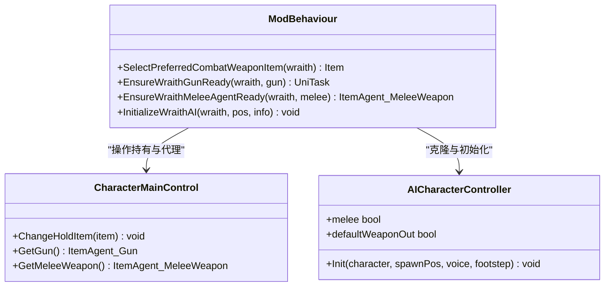
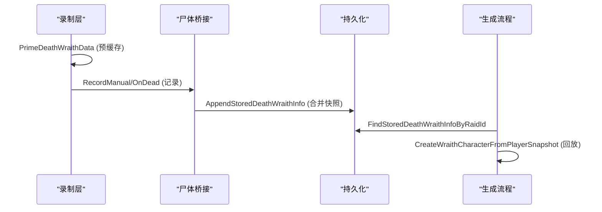
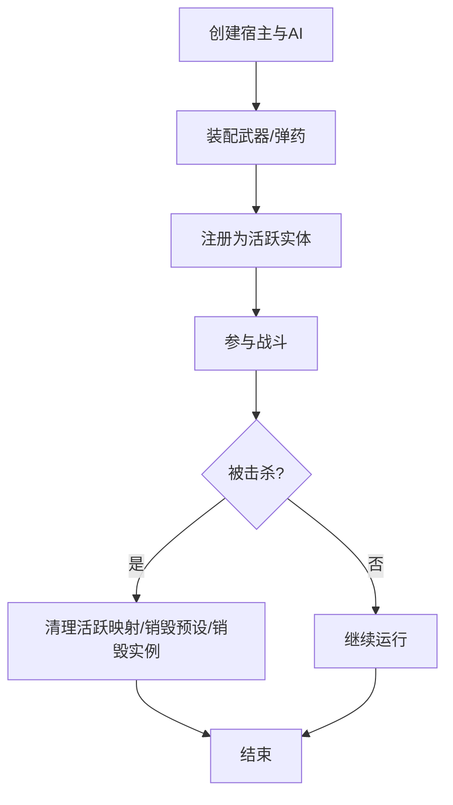

# 死亡亡魂系统

<cite>
**本文引用的文件**
- [DeathWraithSystem.cs](file://Integration/DeathWraith/DeathWraithSystem.cs)
- [DeathWraithRecording.cs](file://Integration/DeathWraith/DeathWraithRecording.cs)
- [DeathWraithOriginalDeadBodyBridge.cs](file://Integration/DeathWraith/DeathWraithOriginalDeadBodyBridge.cs)
- [DeathWraithSpawnFlow.cs](file://Integration/DeathWraith/DeathWraithSpawnFlow.cs)
- [DeathWraithCombatLoadout.cs](file://Integration/DeathWraith/DeathWraithCombatLoadout.cs)
- [DeathWraithLifecycleAndPersistence.cs](file://Integration/DeathWraith/DeathWraithLifecycleAndPersistence.cs)
- [Config.cs](file://Config/Config.cs)
- [DeadBodySpawnPatch.cs](file://Patches/Death/DeadBodySpawnPatch.cs)
- [DeadBodyTouchedPatch.cs](file://Patches/Death/DeadBodyTouchedPatch.cs)
</cite>

## 目录
1. [简介](#简介)
2. [项目结构](#项目结构)
3. [核心组件](#核心组件)
4. [架构总览](#架构总览)
5. [详细组件分析](#详细组件分析)
6. [依赖关系分析](#依赖关系分析)
7. [性能考量](#性能考量)
8. [故障排查指南](#故障排查指南)
9. [结论](#结论)
10. [附录](#附录)

## 简介
本技术文档围绕“死亡亡魂系统”展开，系统性说明玩家死亡检测、状态保存与场景切换逻辑；详述亡魂生成流程（角色复制、装备继承、技能还原）；解释强度分级算法（难度计算、属性缩放与平衡性调整）；说明战斗负载配置的动态生成（武器选择、技能分配、AI行为设置）；介绍录制系统的实现（动作捕捉、时间轴同步与回放机制）；提供生命周期管理（对象创建、资源管理与内存优化策略），并给出性能调优建议与常见问题解决方案。

## 项目结构
死亡亡魂系统由多个 partial 类组成，职责清晰、边界明确：
- DeathWraithSystem.cs：系统常量、字段、事件绑定、配置开关、缓存与去抖存储等基础设施。
- DeathWraithRecording.cs：死亡前预缓存、死亡时记录、玩家外观与近战快照捕获、上下文构建与有效性校验。
- DeathWraithOriginalDeadBodyBridge.cs：与原版尸体系统对接，合并死亡数据，确保位置、局号、子场景一致。
- DeathWraithSpawnFlow.cs：触发亡魂生成的入口，协调从存档读取到实例化、初始化、注册活跃实体。
- DeathWraithCombatLoadout.cs：动态战斗负载（武器选择、子弹补给、近战代理补齐、AI控制器克隆与初始化）。
- DeathWraithLifecycleAndPersistence.cs：等级分类、显示名生成、属性缩放、持久化列表读写、活跃实体清理与销毁。
- Patches：通过 Harmony 补丁将原版尸体生成与触碰事件桥接到本系统。
- Config：系统开关控制。

**图示来源**
- [DeadBodySpawnPatch.cs:12-25](file://Patches/Death/DeadBodySpawnPatch.cs#L12-L25)
- [DeadBodyTouchedPatch.cs:12-25](file://Patches/Death/DeadBodyTouchedPatch.cs#L12-L25)
- [DeathWraithRecording.cs:66-133](file://Integration/DeathWraith/DeathWraithRecording.cs#L66-L133)
- [DeathWraithOriginalDeadBodyBridge.cs:10-45](file://Integration/DeathWraith/DeathWraithOriginalDeadBodyBridge.cs#L10-L45)
- [DeathWraithSpawnFlow.cs:27-78](file://Integration/DeathWraith/DeathWraithSpawnFlow.cs#L27-L78)
- [DeathWraithCombatLoadout.cs:27-109](file://Integration/DeathWraith/DeathWraithCombatLoadout.cs#L27-L109)
- [DeathWraithLifecycleAndPersistence.cs:68-87](file://Integration/DeathWraith/DeathWraithLifecycleAndPersistence.cs#L68-L87)

**章节来源**
- [DeathWraithSystem.cs:127-186](file://Integration/DeathWraith/DeathWraithSystem.cs#L127-L186)
- [Config.cs:1115-1126](file://Config/Config.cs#L1115-L1126)

## 核心组件
- 系统与配置
  - 系统开关：IsDeathWraithSystemEnabled() 决定模块是否启用。
  - 事件绑定：在 Health.OnHurt/OnDead、SavesSystem.OnCollectSaveData 上订阅/解绑，保证启动/关闭时的正确生命周期。
  - 内存缓存与去抖：_deathWraithListCache 作为权威副本，仅在官方存档点或超时后落盘，避免死亡帧卡顿。
- 录制与桥接
  - 死亡前预缓存：PrimeDeathWraithData 在致死伤害前抓取玩家状态，避免后续背包清空导致数据丢失。
  - 死亡记录：RecordDeathWraithData 统一入口，结合 OriginalDeadBodyBridge 合并原版尸体快照。
  - 外观与近战快照：捕获捏脸数据与绑定近战武器，用于后续还原。
- 生成流程
  - 触发：NotifyOriginalDeadBodySpawnRequested/NotifyOriginalDeadBodyLootboxCreated 匹配位置与子场景后调用 TrySpawnStoredDeathWraithForRaid。
  - 实例化：CreateWraithCharacterFromPlayerSnapshot 使用 CharacterCreator 创建宿主，恢复物品树、面部数据与绑定近战。
  - 初始化：NormalizeDamageMultiplier、RestoreWraithMaxHealthSnapshot、ApplyBossStatMultiplier、InitializeWraithAI、PrepareWraithCombatLoadout、ApplyWraithTierStats。
- 战斗负载
  - 武器选择：优先主副武器枪械，其次近战，最后回退主副武器。
  - AI 控制器：根据武器类型选择预设并克隆 AI 控制器，初始化后不强制锁定仇恨目标。
  - 弹药补给：解析对应子弹类型，补充至容量阈值，设置弹匣变量并装载。
  - 近战兜底：若未自动装配近战代理，则运行时注入 ItemAgent_MeleeWeapon 并补齐 socket、动画、声音等默认值。
- 生命周期与持久化
  - 等级分类：ClassifyWraithTier 基于掉落价值与总财富比例划分 Weak/Balanced/Strong。
  - 属性缩放：按等级对 MaxHealth、MoveSpeed/WalkSpeed/RunSpeed、Moveability、Gun/Melee 伤害倍率进行放大。
  - 活跃实体管理：activeWraithsByRaidId、activeWraithRaidIdByCharacter、spawningWraithRaidIds 防止重复生成与泄漏。
  - 清理：场景切换、配置关闭、击杀、超出记录上限时清理与销毁。

**章节来源**
- [DeathWraithSystem.cs:187-240](file://Integration/DeathWraith/DeathWraithSystem.cs#L187-L240)
- [DeathWraithRecording.cs:66-133](file://Integration/DeathWraith/DeathWraithRecording.cs#L66-L133)
- [DeathWraithOriginalDeadBodyBridge.cs:10-45](file://Integration/DeathWraith/DeathWraithOriginalDeadBodyBridge.cs#L10-L45)
- [DeathWraithSpawnFlow.cs:133-247](file://Integration/DeathWraith/DeathWraithSpawnFlow.cs#L133-L247)
- [DeathWraithCombatLoadout.cs:184-233](file://Integration/DeathWraith/DeathWraithCombatLoadout.cs#L184-L233)
- [DeathWraithLifecycleAndPersistence.cs:96-103](file://Integration/DeathWraith/DeathWraithLifecycleAndPersistence.cs#L96-L103)
- [DeathWraithLifecycleAndPersistence.cs:175-294](file://Integration/DeathWraith/DeathWraithLifecycleAndPersistence.cs#L175-L294)

## 架构总览
系统以事件驱动为核心，贯穿“死亡录制—持久化—生成—战斗装配—生命周期管理”的闭环。Harmony 补丁将原版尸体事件接入系统；录制层负责在关键时间点捕获并合并数据；生成层依据存档信息异步创建并初始化；战斗层动态装配武器与 AI；生命周期层负责清理与资源释放。

**图示来源**
- [DeadBodySpawnPatch.cs:12-25](file://Patches/Death/DeadBodySpawnPatch.cs#L12-L25)
- [DeadBodyTouchedPatch.cs:12-25](file://Patches/Death/DeadBodyTouchedPatch.cs#L12-L25)
- [DeathWraithRecording.cs:66-133](file://Integration/DeathWraith/DeathWraithRecording.cs#L66-L133)
- [DeathWraithOriginalDeadBodyBridge.cs:99-165](file://Integration/DeathWraith/DeathWraithOriginalDeadBodyBridge.cs#L99-L165)
- [DeathWraithSpawnFlow.cs:133-247](file://Integration/DeathWraith/DeathWraithSpawnFlow.cs#L133-L247)
- [DeathWraithCombatLoadout.cs:27-109](file://Integration/DeathWraith/DeathWraithCombatLoadout.cs#L27-L109)
- [DeathWraithLifecycleAndPersistence.cs:407-473](file://Integration/DeathWraith/DeathWraithLifecycleAndPersistence.cs#L407-L473)

## 详细组件分析

### 死亡检测与状态保存
- 死亡前预缓存：在 Health.OnHurt 中判断是否为主角且当前生命值为非正，构建 PendingDeathWraithContext 并缓存，限制有效期（帧差与时限）。
- 死亡记录：Health.OnDead 统一入口，优先使用已缓存上下文，否则重建；随后尝试合并原版尸体快照。
- 原版尸体桥接：当收到原版尸体生成通知时，记录 OriginalDeadBodyInfo，并在合适时机与 pending context 合并，确保 raidID、subSceneID、worldPosition 一致。
- 持久化：AppendStoredDeathWraithInfo 维护列表、去重、限制长度，并标记脏；FlushDeathWraithListIfDirty 在官方存档点或超时后写盘。

**图示来源**
- [DeathWraithRecording.cs:66-133](file://Integration/DeathWraith/DeathWraithRecording.cs#L66-L133)
- [DeathWraithRecording.cs:642-713](file://Integration/DeathWraith/DeathWraithRecording.cs#L642-L713)
- [DeathWraithOriginalDeadBodyBridge.cs:99-165](file://Integration/DeathWraith/DeathWraithOriginalDeadBodyBridge.cs#L99-L165)
- [DeathWraithLifecycleAndPersistence.cs:407-473](file://Integration/DeathWraith/DeathWraithLifecycleAndPersistence.cs#L407-L473)

**章节来源**
- [DeathWraithRecording.cs:66-133](file://Integration/DeathWraith/DeathWraithRecording.cs#L66-L133)
- [DeathWraithOriginalDeadBodyBridge.cs:10-45](file://Integration/DeathWraith/DeathWraithOriginalDeadBodyBridge.cs#L10-L45)
- [DeathWraithLifecycleAndPersistence.cs:407-473](file://Integration/DeathWraith/DeathWraithLifecycleAndPersistence.cs#L407-L473)

### 亡魂生成流程（角色复制、装备继承、技能还原）
- 触发条件：原版尸体生成或遗失物箱创建时，匹配 subSceneID 与 worldPosition 后消费 pending 上下文。
- 角色复制：通过 LevelManager.CharacterCreator 创建宿主，优先使用死亡时物品树，否则回退默认容器；应用面部数据与绑定近战。
- 装备继承：刷新装备代理，选择首选武器并切换持有；枪械路径补弹并装载，近战路径兜底注入代理并绑定 socket。
- 技能还原：克隆 AI 控制器并初始化，保持自然感知（不强制锁定仇恨），同步战斗模式（枪战/近战）。

**图示来源**
- [DeathWraithSpawnFlow.cs:27-78](file://Integration/DeathWraith/DeathWraithSpawnFlow.cs#L27-L78)
- [DeathWraithSpawnFlow.cs:133-247](file://Integration/DeathWraith/DeathWraithSpawnFlow.cs#L133-L247)
- [DeathWraithSpawnFlow.cs:253-332](file://Integration/DeathWraith/DeathWraithSpawnFlow.cs#L253-L332)
- [DeathWraithCombatLoadout.cs:184-233](file://Integration/DeathWraith/DeathWraithCombatLoadout.cs#L184-L233)
- [DeathWraithCombatLoadout.cs:27-109](file://Integration/DeathWraith/DeathWraithCombatLoadout.cs#L27-L109)

**章节来源**
- [DeathWraithSpawnFlow.cs:133-247](file://Integration/DeathWraith/DeathWraithSpawnFlow.cs#L133-L247)
- [DeathWraithSpawnFlow.cs:253-332](file://Integration/DeathWraith/DeathWraithSpawnFlow.cs#L253-L332)
- [DeathWraithCombatLoadout.cs:184-233](file://Integration/DeathWraith/DeathWraithCombatLoadout.cs#L184-L233)

### 强度分级系统（难度计算、属性缩放、平衡性调整）
- 难度计算：ClassifyWraithTier 基于 droppedItemsValue / playerTotalWealth 的比例划分三档。
- 属性缩放：
  - 移速：WalkSpeed/RunSpeed/MoveSpeed 按等级乘以不同倍率。
  - 机动性：Moveability 目标值随等级变化。
  - 伤害：GunDamageMultiplier/MeleeDamageMultiplier 按等级放大。
  - 生命：MaxHealth 按等级显著放大，并在生成时恢复快照值。
- 平衡性调整：通过 NormalizeDamageMultiplier 与 ApplyBossStatMultiplier 确保与其他 Boss 生成路径一致，避免异常高伤。

**图示来源**
- [DeathWraithLifecycleAndPersistence.cs:96-103](file://Integration/DeathWraith/DeathWraithLifecycleAndPersistence.cs#L96-L103)
- [DeathWraithLifecycleAndPersistence.cs:175-294](file://Integration/DeathWraith/DeathWraithLifecycleAndPersistence.cs#L175-L294)

**章节来源**
- [DeathWraithLifecycleAndPersistence.cs:96-103](file://Integration/DeathWraith/DeathWraithLifecycleAndPersistence.cs#L96-L103)
- [DeathWraithLifecycleAndPersistence.cs:175-294](file://Integration/DeathWraith/DeathWraithLifecycleAndPersistence.cs#L175-L294)

### 战斗负载配置（武器选择、技能分配、AI 行为设置）
- 武器选择：优先主副武器中的枪械，其次近战，最后回退主副武器。
- 技能分配：枪械路径解析子弹原型并补充库存，设置弹匣变量并装载；近战路径兜底注入代理并补齐 socket、动画、声音等默认值。
- AI 行为：根据武器类型选择固定 AI 宿主预设并克隆控制器；初始化后不强制锁定玩家距离，保持自然感知。

**图示来源**
- [DeathWraithCombatLoadout.cs:184-233](file://Integration/DeathWraith/DeathWraithCombatLoadout.cs#L184-L233)
- [DeathWraithCombatLoadout.cs:235-361](file://Integration/DeathWraith/DeathWraithCombatLoadout.cs#L235-L361)
- [DeathWraithCombatLoadout.cs:547-583](file://Integration/DeathWraith/DeathWraithCombatLoadout.cs#L547-L583)
- [DeathWraithCombatLoadout.cs:602-660](file://Integration/DeathWraith/DeathWraithCombatLoadout.cs#L602-L660)
- [DeathWraithCombatLoadout.cs:27-109](file://Integration/DeathWraith/DeathWraithCombatLoadout.cs#L27-L109)

**章节来源**
- [DeathWraithCombatLoadout.cs:27-109](file://Integration/DeathWraith/DeathWraithCombatLoadout.cs#L27-L109)
- [DeathWraithCombatLoadout.cs:184-233](file://Integration/DeathWraith/DeathWraithCombatLoadout.cs#L184-L233)
- [DeathWraithCombatLoadout.cs:235-361](file://Integration/DeathWraith/DeathWraithCombatLoadout.cs#L235-L361)
- [DeathWraithCombatLoadout.cs:547-583](file://Integration/DeathWraith/DeathWraithCombatLoadout.cs#L547-L583)
- [DeathWraithCombatLoadout.cs:602-660](file://Integration/DeathWraith/DeathWraithCombatLoadout.cs#L602-L660)

### 录制系统（动作捕捉、时间轴同步、回放机制）
- 动作捕捉：在致死前预缓存上下文，捕获玩家名称、预设名、面部数据、语音、脚步声材质、绑定近战快照、掉落价值、总财富、最大生命值等。
- 时间轴同步：通过帧差与时限校验 pending 上下文新鲜度；与原版尸体快照合并时校验 raidID/subSceneID/worldPosition 一致性。
- 回放机制：生成时恢复物品树、面部数据与绑定近战；AI 控制器克隆并初始化；战斗负载装配完成后进入战斗。

**图示来源**
- [DeathWraithRecording.cs:66-133](file://Integration/DeathWraith/DeathWraithRecording.cs#L66-L133)
- [DeathWraithRecording.cs:205-320](file://Integration/DeathWraith/DeathWraithRecording.cs#L205-L320)
- [DeathWraithOriginalDeadBodyBridge.cs:99-165](file://Integration/DeathWraith/DeathWraithOriginalDeadBodyBridge.cs#L99-L165)
- [DeathWraithSpawnFlow.cs:253-332](file://Integration/DeathWraith/DeathWraithSpawnFlow.cs#L253-L332)

**章节来源**
- [DeathWraithRecording.cs:66-133](file://Integration/DeathWraith/DeathWraithRecording.cs#L66-L133)
- [DeathWraithRecording.cs:205-320](file://Integration/DeathWraith/DeathWraithRecording.cs#L205-L320)
- [DeathWraithOriginalDeadBodyBridge.cs:99-165](file://Integration/DeathWraith/DeathWraithOriginalDeadBodyBridge.cs#L99-L165)
- [DeathWraithSpawnFlow.cs:253-332](file://Integration/DeathWraith/DeathWraithSpawnFlow.cs#L253-L332)

### 生命周期管理（对象创建、资源管理、内存优化）
- 对象创建：通过 CharacterCreator 创建宿主，克隆 AI 控制器，按需注入近战代理。
- 资源管理：运行时创建 CharacterRandomPreset 副本并命名标识，销毁时释放；武器/弹药/子弹通过 Inventory 管理。
- 内存优化：亡魂列表采用内存权威副本 + 延迟落盘；去抖延迟较长以避免抬回去动画期间刷盘造成卡顿；切换存档槽时清空缓存避免串档。

**图示来源**
- [DeathWraithSpawnFlow.cs:133-247](file://Integration/DeathWraith/DeathWraithSpawnFlow.cs#L133-L247)
- [DeathWraithCombatLoadout.cs:184-233](file://Integration/DeathWraith/DeathWraithCombatLoadout.cs#L184-L233)
- [DeathWraithLifecycleAndPersistence.cs:68-87](file://Integration/DeathWraith/DeathWraithLifecycleAndPersistence.cs#L68-L87)
- [DeathWraithLifecycleAndPersistence.cs:635-676](file://Integration/DeathWraith/DeathWraithLifecycleAndPersistence.cs#L635-L676)

**章节来源**
- [DeathWraithSpawnFlow.cs:133-247](file://Integration/DeathWraith/DeathWraithSpawnFlow.cs#L133-L247)
- [DeathWraithCombatLoadout.cs:184-233](file://Integration/DeathWraith/DeathWraithCombatLoadout.cs#L184-L233)
- [DeathWraithLifecycleAndPersistence.cs:68-87](file://Integration/DeathWraith/DeathWraithLifecycleAndPersistence.cs#L68-L87)
- [DeathWraithLifecycleAndPersistence.cs:635-676](file://Integration/DeathWraith/DeathWraithLifecycleAndPersistence.cs#L635-L676)

## 依赖关系分析
- 外部依赖
  - HarmonyLib：用于补丁 DeadBodyManager 方法。
  - Duckov 框架：LevelManager、CharacterMainControl、MultiSceneCore、RaidUtilities、SavesSystem、EconomyManager 等。
  - ItemStatsSystem：ItemTreeData、Item、Slot、Inventory、Stat 等。
  - Cysharp.Threading.Tasks：UniTask 异步流程。
- 内部耦合
  - Recording 与 OriginalDeadBodyBridge 强耦合于死亡事件与尸体快照。
  - SpawnFlow 依赖 CombatLoadout 完成战斗装配。
  - Lifecycle 管理所有活跃实体与持久化列表，贯穿系统生命周期。

**图示来源**
- [DeadBodySpawnPatch.cs:12-25](file://Patches/Death/DeadBodySpawnPatch.cs#L12-L25)
- [DeadBodyTouchedPatch.cs:12-25](file://Patches/Death/DeadBodyTouchedPatch.cs#L12-L25)
- [DeathWraithRecording.cs:66-133](file://Integration/DeathWraith/DeathWraithRecording.cs#L66-L133)
- [DeathWraithOriginalDeadBodyBridge.cs:99-165](file://Integration/DeathWraith/DeathWraithOriginalDeadBodyBridge.cs#L99-L165)
- [DeathWraithSpawnFlow.cs:133-247](file://Integration/DeathWraith/DeathWraithSpawnFlow.cs#L133-L247)
- [DeathWraithCombatLoadout.cs:184-233](file://Integration/DeathWraith/DeathWraithCombatLoadout.cs#L184-L233)
- [DeathWraithLifecycleAndPersistence.cs:68-87](file://Integration/DeathWraith/DeathWraithLifecycleAndPersistence.cs#L68-L87)

**章节来源**
- [DeathWraithSystem.cs:187-240](file://Integration/DeathWraith/DeathWraithSystem.cs#L187-L240)
- [DeathWraithRecording.cs:66-133](file://Integration/DeathWraith/DeathWraithRecording.cs#L66-L133)
- [DeathWraithSpawnFlow.cs:133-247](file://Integration/DeathWraith/DeathWraithSpawnFlow.cs#L133-L247)

## 性能考量
- 延迟落盘：亡魂列表仅标记脏，在官方存档点或超时后写盘，避免死亡帧序列化整表导致卡顿。
- 去抖策略：DEATH_WRAITH_SAVE_DELAY 设为较长延迟，防止在抬回去动画期间刷盘。
- 缓存预热：CharacterRandomPreset 缓存一次，避免重复查找。
- 反射最小化：反射字段与方法仅在必要时使用，并加异常保护。
- 内存管理：运行时创建的预设副本在销毁时释放；活跃实体映射及时清理。

[本节为通用指导，无需特定文件引用]

## 故障排查指南
- 亡魂未生成
  - 检查 IsDeathWraithSystemEnabled() 是否为真。
  - 确认原版尸体生成/触碰事件是否被补丁捕获。
  - 验证 subSceneID 与 worldPosition 匹配逻辑。
- 亡魂无武器或无法攻击
  - 检查 SelectPreferredCombatWeaponItem 是否能找到武器。
  - 枪械路径：确认子弹原型解析与库存补充成功。
  - 近战路径：确认运行时注入代理与 socket 初始化成功。
- 属性异常
  - 查看 ApplyWraithTierStats 日志，确认各 Stat 修改是否生效。
  - 检查 RestoreWraithMaxHealthSnapshot 缩放值是否合法。
- 内存泄漏或卡顿
  - 确认场景切换时 ClearDeathWraithState 是否执行。
  - 检查 activeWraithsByRaidId 与 activeWraithRaidIdByCharacter 是否成对清理。
  - 观察去抖落盘是否触发，避免频繁序列化。

**章节来源**
- [DeathWraithSystem.cs:187-240](file://Integration/DeathWraith/DeathWraithSystem.cs#L187-L240)
- [DeathWraithSpawnFlow.cs:133-247](file://Integration/DeathWraith/DeathWraithSpawnFlow.cs#L133-L247)
- [DeathWraithCombatLoadout.cs:184-233](file://Integration/DeathWraith/DeathWraithCombatLoadout.cs#L184-L233)
- [DeathWraithLifecycleAndPersistence.cs:68-87](file://Integration/DeathWraith/DeathWraithLifecycleAndPersistence.cs#L68-L87)

## 结论
死亡亡魂系统通过事件驱动与分层设计，实现了从死亡录制、持久化到生成与战斗装配的完整闭环。强度分级与属性缩放保证了挑战性与平衡性；延迟落盘与缓存策略提升了性能；生命周期管理确保了资源安全。整体架构清晰、可扩展性强，适合在高并发与复杂场景中稳定运行。

[本节为总结，无需特定文件引用]

## 附录
- 配置项
  - enableDeathWraithSystem：控制系统开关，默认开启。
- 关键常量
  - DEATH_WRAITH_LIST_SAVE_KEY、DEATH_WRAITH_BOUND_MELEE_SAVE_KEY、DEATH_WRAITH_NAME_KEY_PREFIX
  - DEATH_WRAITH_GUN_AI_PRESET_NAME、DEATH_WRAITH_MELEE_AI_PRESET_NAME
  - DEATH_WRAITH_PENDING_MAX_AGE_SECONDS、DEATH_WRAITH_PENDING_MAX_FRAME_DELTA
  - DEATH_WRAITH_SAVE_DELAY

**章节来源**
- [Config.cs:1115-1126](file://Config/Config.cs#L1115-L1126)
- [DeathWraithSystem.cs:127-186](file://Integration/DeathWraith/DeathWraithSystem.cs#L127-L186)