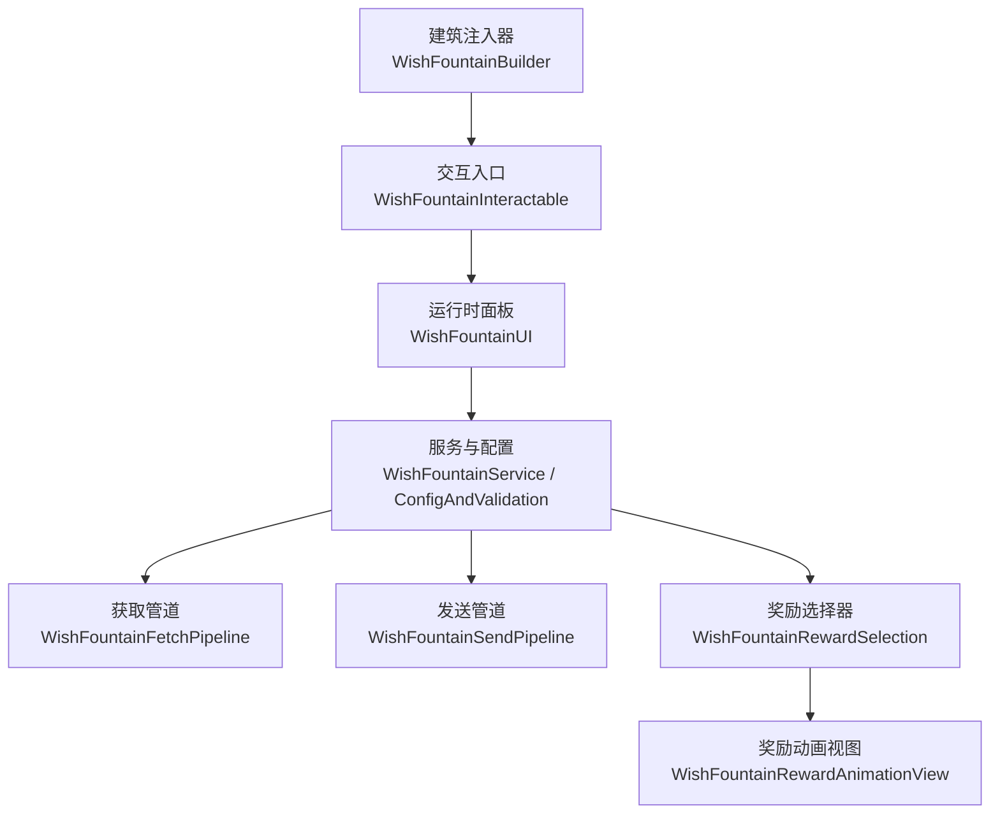
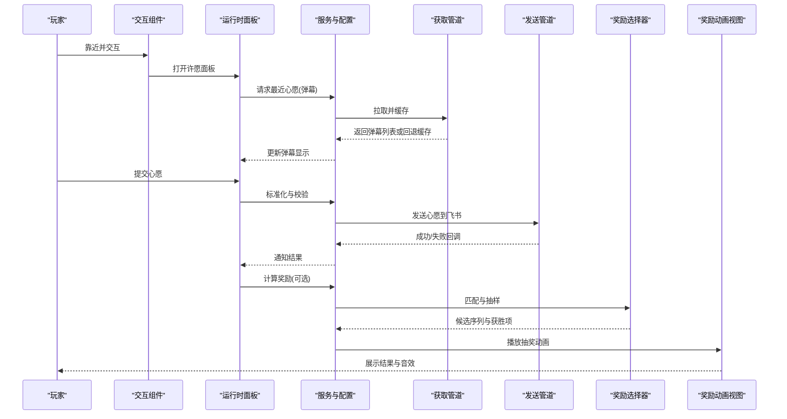
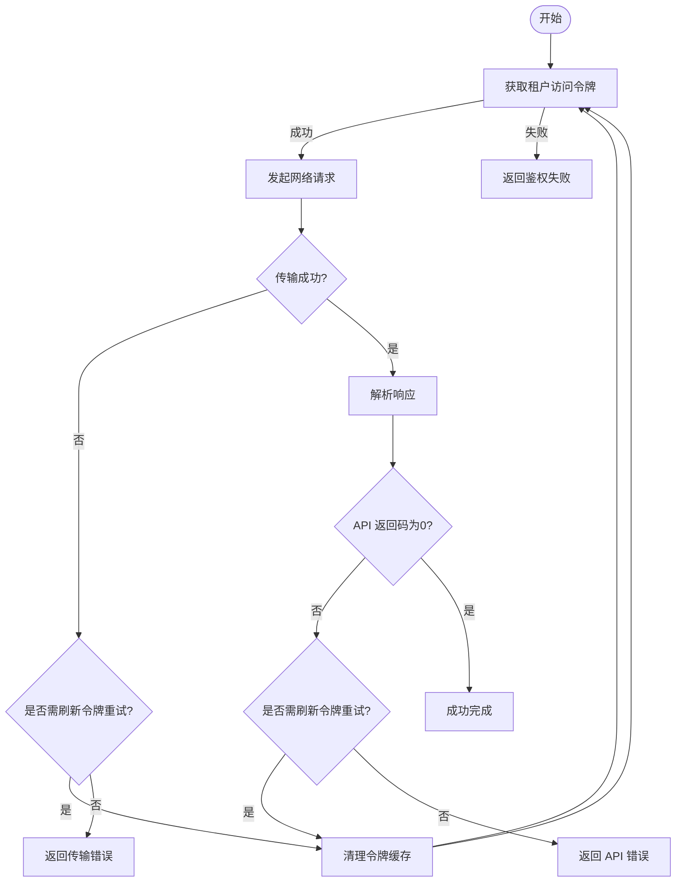
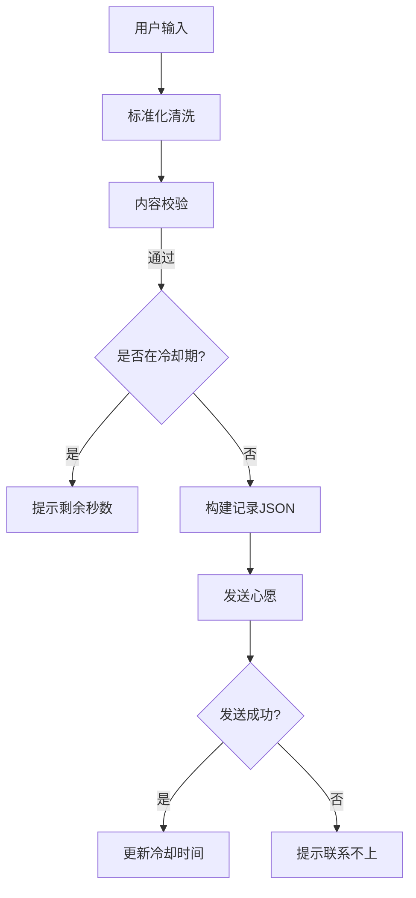
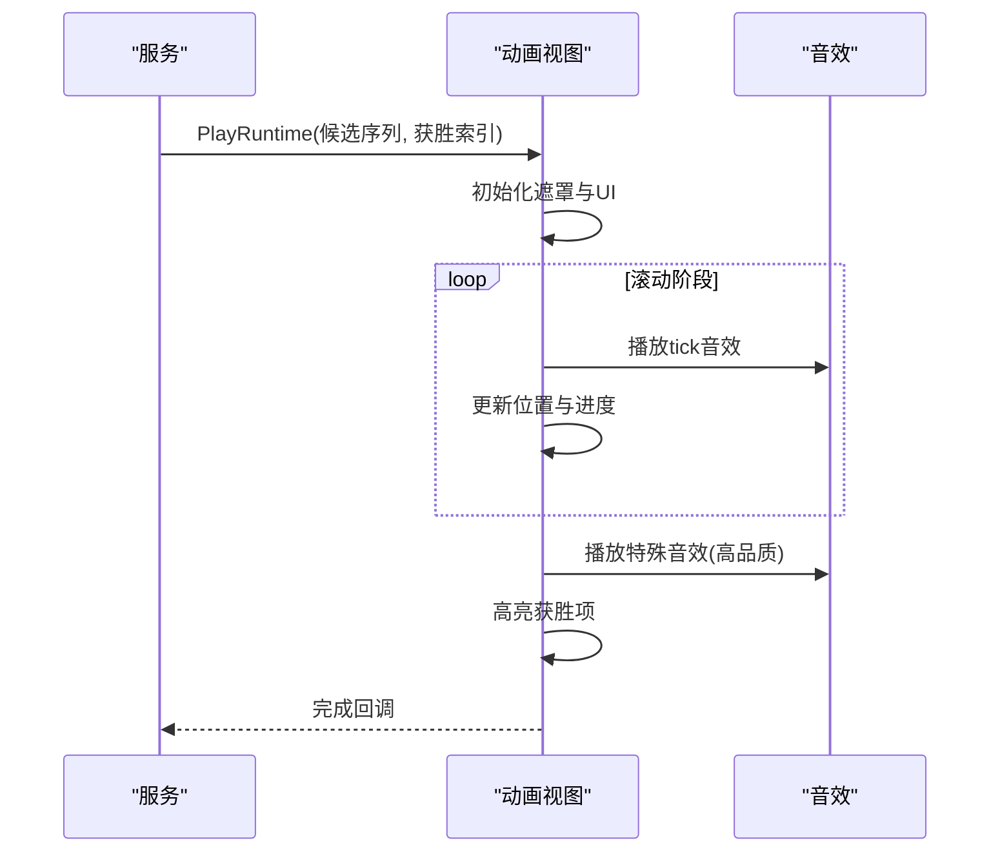
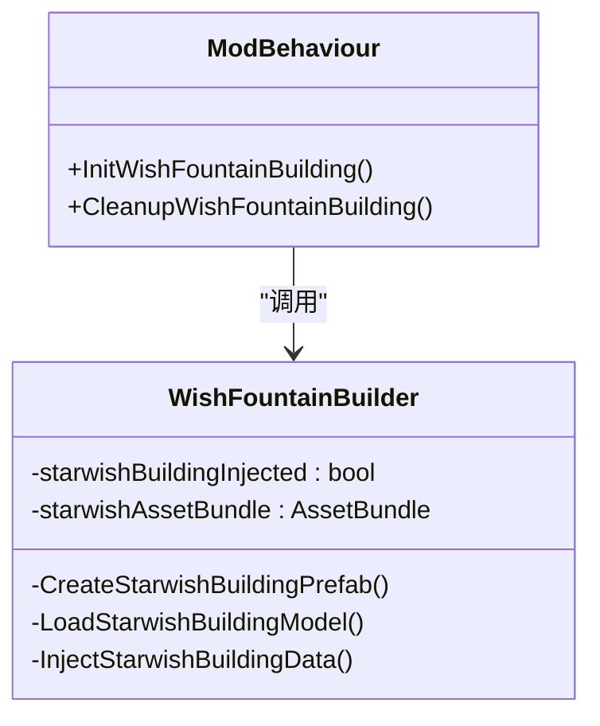
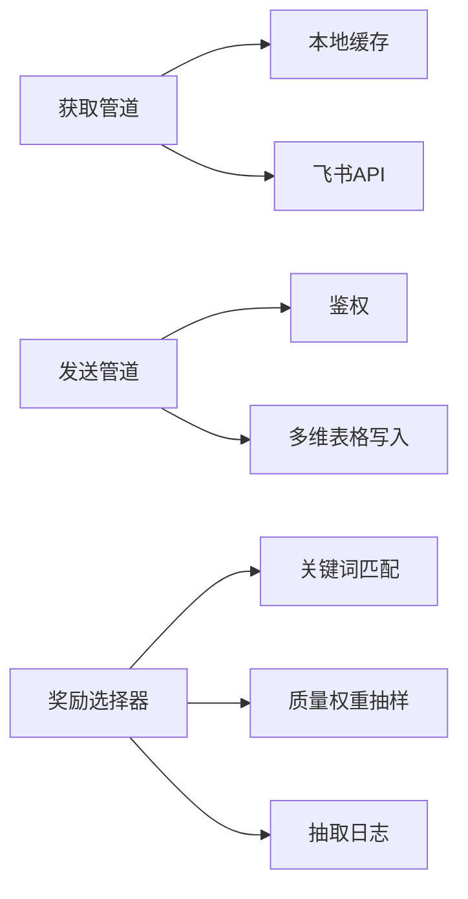
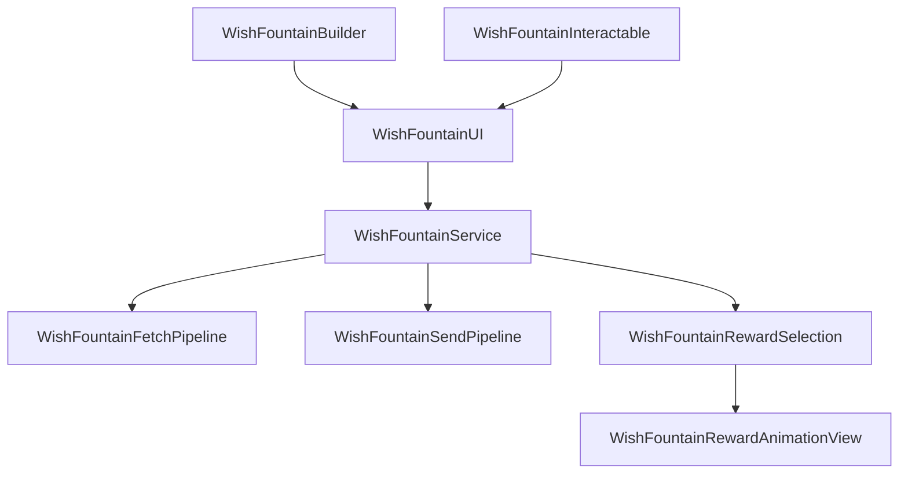

# 许愿台系统

<cite>
**本文引用的文件**
- [WishFountainBuilder.cs](file://Integration/WishFountain/WishFountainBuilder.cs)
- [WishFountainInteractable.cs](file://Integration/WishFountain/WishFountainInteractable.cs)
- [WishFountainUI.cs](file://Integration/WishFountain/WishFountainUI.cs)
- [WishFountainService.cs](file://Integration/WishFountain/WishFountainService.cs)
- [WishFountainFetchPipeline.cs](file://Integration/WishFountain/WishFountainFetchPipeline.cs)
- [WishFountainSendPipeline.cs](file://Integration/WishFountain/WishFountainSendPipeline.cs)
- [WishFountainRewardSelection.cs](file://Integration/WishFountain/WishFountainRewardSelection.cs)
- [WishFountainRewardAnimationView.cs](file://Integration/WishFountain/WishFountainRewardAnimationView.cs)
- [WishFountainConfigAndValidation.cs](file://Integration/WishFountain/WishFountainConfigAndValidation.cs)
</cite>

## 目录
1. [简介](#简介)
2. [项目结构](#项目结构)
3. [核心组件](#核心组件)
4. [架构总览](#架构总览)
5. [详细组件分析](#详细组件分析)
6. [依赖关系分析](#依赖关系分析)
7. [性能与稳定性](#性能与稳定性)
8. [故障排查指南](#故障排查指南)
9. [结论](#结论)
10. [附录](#附录)

## 简介
本技术文档面向“许愿台系统”，覆盖在线 API 集成、愿望记录流程、奖励发放动画、构建器设计模式以及获取/发送管道与奖励选择器的实现细节。文档同时提供网络异常处理、API 限流与缓存策略的最佳实践，帮助开发者快速理解并扩展该模块。

## 项目结构
许愿台系统位于 Integration/WishFountain 目录下，采用分层职责清晰的模块化组织：
- 交互与构建：建筑注入、交互触发、运行时 UI 面板
- 服务与配置：飞书鉴权、加密配置、文本标准化与校验
- 管道层：获取弹幕（读取心愿）与发送心愿到多维表格
- 奖励系统：基于关键词匹配与权重抽样的奖励池选择与动画展示

图表来源
- [WishFountainInteractable.cs:20-111](file://Integration/WishFountain/WishFountainInteractable.cs#L20-L111)
- [WishFountainUI.cs:25-129](file://Integration/WishFountain/WishFountainUI.cs#L25-L129)
- [WishFountainService.cs:37-164](file://Integration/WishFountain/WishFountainService.cs#L37-L164)
- [WishFountainFetchPipeline.cs:15-85](file://Integration/WishFountain/WishFountainFetchPipeline.cs#L15-L85)
- [WishFountainSendPipeline.cs:21-367](file://Integration/WishFountain/WishFountainSendPipeline.cs#L21-L367)
- [WishFountainRewardSelection.cs:21-124](file://Integration/WishFountain/WishFountainRewardSelection.cs#L21-L124)
- [WishFountainRewardAnimationView.cs:16-139](file://Integration/WishFountain/WishFountainRewardAnimationView.cs#L16-L139)
- [WishFountainBuilder.cs:30-155](file://Integration/WishFountain/WishFountainBuilder.cs#L30-L155)

章节来源
- [WishFountainBuilder.cs:30-155](file://Integration/WishFountain/WishFountainBuilder.cs#L30-L155)
- [WishFountainInteractable.cs:20-111](file://Integration/WishFountain/WishFountainInteractable.cs#L20-L111)
- [WishFountainUI.cs:25-129](file://Integration/WishFountain/WishFountainUI.cs#L25-L129)
- [WishFountainService.cs:37-164](file://Integration/WishFountain/WishFountainService.cs#L37-L164)

## 核心组件
- 建筑注入器：将许愿台建筑注入游戏建造系统，预创建 View，管理粒子与模型资源。
- 交互组件：继承基础交互，控制可交互状态并在超时时打开 UI。
- 运行时面板：动态创建原版风格面板，支持多行输入、字数统计、匿名选项、弹幕预热与显示。
- 服务与配置：加载并解密飞书应用配置；提供文本标准化与内容校验；维护冷却时间、Token 缓存等。
- 获取管道：拉取最近心愿记录，鉴权失败或网络异常时回退本地缓存；TTL 短缓存避免重复请求。
- 发送管道：封装飞书多维表格写入，带鉴权、重试、限流与错误提示。
- 奖励选择器：基于关键词匹配类别与物品，按质量权重与类别偏置抽样，输出候选序列与获胜项。
- 奖励动画视图：运行时遮罩层，滚动抽奖动画、高亮获奖项、播放音效，超时保护。

章节来源
- [WishFountainBuilder.cs:104-155](file://Integration/WishFountain/WishFountainBuilder.cs#L104-L155)
- [WishFountainInteractable.cs:77-108](file://Integration/WishFountain/WishFountainInteractable.cs#L77-L108)
- [WishFountainUI.cs:80-129](file://Integration/WishFountain/WishFountainUI.cs#L80-L129)
- [WishFountainService.cs:37-164](file://Integration/WishFountain/WishFountainService.cs#L37-L164)
- [WishFountainFetchPipeline.cs:29-85](file://Integration/WishFountain/WishFountainFetchPipeline.cs#L29-L85)
- [WishFountainSendPipeline.cs:191-367](file://Integration/WishFountain/WishFountainSendPipeline.cs#L191-L367)
- [WishFountainRewardSelection.cs:23-124](file://Integration/WishFountain/WishFountainRewardSelection.cs#L23-L124)
- [WishFountainRewardAnimationView.cs:80-139](file://Integration/WishFountain/WishFountainRewardAnimationView.cs#L80-L139)

## 架构总览
许愿台系统以“服务”为核心，协调 UI、管道与奖励系统。建筑注入器负责在场景内注册交互点与资源；交互组件触发 UI；UI 调用服务进行数据校验与网络操作；服务通过获取/发送管道与飞书 API 通信；奖励选择器根据心愿内容生成候选序列，并由动画视图呈现结果。

图表来源
- [WishFountainInteractable.cs:77-108](file://Integration/WishFountain/WishFountainInteractable.cs#L77-L108)
- [WishFountainUI.cs:253-333](file://Integration/WishFountain/WishFountainUI.cs#L253-L333)
- [WishFountainFetchPipeline.cs:87-207](file://Integration/WishFountain/WishFountainFetchPipeline.cs#L87-L207)
- [WishFountainSendPipeline.cs:191-367](file://Integration/WishFountain/WishFountainSendPipeline.cs#L191-L367)
- [WishFountainRewardSelection.cs:723-748](file://Integration/WishFountain/WishFountainRewardSelection.cs#L723-L748)
- [WishFountainRewardAnimationView.cs:80-139](file://Integration/WishFountain/WishFountainRewardAnimationView.cs#L80-L139)

## 详细组件分析

### 在线 API 集成机制（获取与发送）
- 鉴权与 Token 缓存：使用租户访问令牌接口获取 token，缓存到期前预留刷新缓冲；当响应指示 token 失效时自动清理并重试一次。
- 网络请求与超时：统一设置请求超时；对传输错误与 API 错误分别处理，提取友好错误信息。
- 限流与并发控制：全局发送冷却时间防止频繁提交；IsSending 标志避免重复提交。
- 数据同步策略：获取弹幕优先服务端，失败回退本地缓存；弹幕结果短 TTL 缓存减少重复请求；本地缓存持久化至磁盘。

图表来源
- [WishFountainSendPipeline.cs:38-118](file://Integration/WishFountain/WishFountainSendPipeline.cs#L38-L118)
- [WishFountainSendPipeline.cs:163-189](file://Integration/WishFountain/WishFountainSendPipeline.cs#L163-L189)
- [WishFountainSendPipeline.cs:191-367](file://Integration/WishFountain/WishFountainSendPipeline.cs#L191-L367)
- [WishFountainFetchPipeline.cs:87-207](file://Integration/WishFountain/WishFountainFetchPipeline.cs#L87-L207)

章节来源
- [WishFountainSendPipeline.cs:38-118](file://Integration/WishFountain/WishFountainSendPipeline.cs#L38-L118)
- [WishFountainSendPipeline.cs:163-189](file://Integration/WishFountain/WishFountainSendPipeline.cs#L163-L189)
- [WishFountainSendPipeline.cs:191-367](file://Integration/WishFountain/WishFountainSendPipeline.cs#L191-L367)
- [WishFountainFetchPipeline.cs:87-207](file://Integration/WishFountain/WishFountainFetchPipeline.cs#L87-L207)

### 愿望记录流程（提交、状态跟踪、批量处理）
- 文本标准化：全角转半角、空白折叠、换行统一、首尾空行去除。
- 内容校验：长度下限、有效字符数、同字符占比、重复行检测、链接/联系方式/引流检测、敏感词过滤。
- 提交流程：检查冷却时间与发送中状态；构造 JSON 记录；发送后更新冷却时间；失败保留输入供重试。
- 批量处理：弹幕读取支持分页大小限制与排序；展示时选取最新一定比例与随机采样混合，打乱顺序。

图表来源
- [WishFountainConfigAndValidation.cs:420-501](file://Integration/WishFountain/WishFountainConfigAndValidation.cs#L420-L501)
- [WishFountainConfigAndValidation.cs:521-741](file://Integration/WishFountain/WishFountainConfigAndValidation.cs#L521-L741)
- [WishFountainSendPipeline.cs:191-367](file://Integration/WishFountain/WishFountainSendPipeline.cs#L191-L367)
- [WishFountainFetchPipeline.cs:626-690](file://Integration/WishFountain/WishFountainFetchPipeline.cs#L626-L690)

章节来源
- [WishFountainConfigAndValidation.cs:420-501](file://Integration/WishFountain/WishFountainConfigAndValidation.cs#L420-L501)
- [WishFountainConfigAndValidation.cs:521-741](file://Integration/WishFountain/WishFountainConfigAndValidation.cs#L521-L741)
- [WishFountainSendPipeline.cs:191-367](file://Integration/WishFountain/WishFountainSendPipeline.cs#L191-L367)
- [WishFountainFetchPipeline.cs:626-690](file://Integration/WishFountain/WishFountainFetchPipeline.cs#L626-L690)

### 奖励发放动画（触发时机、视觉效果、音效配合）
- 触发时机：奖励选择完成后，传入候选序列与获胜索引，创建运行时遮罩层并启动动画协程。
- 视觉效果：滚动条由快转慢，最终停在获胜项；其他槽位变暗，获胜项放大高亮；品质颜色映射 Q1~Q8。
- 音效配合：滚动过程中播放 tick 音效；高品质（Q7+）获胜时播放特殊音效；支持跳过动画（Esc）。
- 安全保护：超时强制关闭动画，防止协程异常导致遮罩卡死。

图表来源
- [WishFountainRewardAnimationView.cs:80-139](file://Integration/WishFountain/WishFountainRewardAnimationView.cs#L80-L139)
- [WishFountainRewardAnimationView.cs:406-457](file://Integration/WishFountain/WishFountainRewardAnimationView.cs#L406-L457)
- [WishFountainRewardAnimationView.cs:484-510](file://Integration/WishFountain/WishFountainRewardAnimationView.cs#L484-L510)
- [WishFountainRewardAnimationView.cs:515-594](file://Integration/WishFountain/WishFountainRewardAnimationView.cs#L515-L594)

章节来源
- [WishFountainRewardAnimationView.cs:80-139](file://Integration/WishFountain/WishFountainRewardAnimationView.cs#L80-L139)
- [WishFountainRewardAnimationView.cs:406-457](file://Integration/WishFountain/WishFountainRewardAnimationView.cs#L406-L457)
- [WishFountainRewardAnimationView.cs:484-510](file://Integration/WishFountain/WishFountainRewardAnimationView.cs#L484-L510)
- [WishFountainRewardAnimationView.cs:515-594](file://Integration/WishFountain/WishFountainRewardAnimationView.cs#L515-L594)

### 许愿台构建器（配置验证、依赖注入、生命周期管理）
- 配置验证：检查 AssetBundle 是否存在或占位标记；图标与模型加载失败时降级为占位模型。
- 依赖注入：通过反射注入 BuildingDataCollection 的 infos 与 prefabs；动态创建 prefab 并添加交互点与功能容器。
- 生命周期管理：早期初始化避免已有存档缺 prefab；场景切换时恢复交互点；清理时卸载资源与取消协程。

图表来源
- [WishFountainBuilder.cs:104-155](file://Integration/WishFountain/WishFountainBuilder.cs#L104-L155)
- [WishFountainBuilder.cs:262-324](file://Integration/WishFountain/WishFountainBuilder.cs#L262-L324)
- [WishFountainBuilder.cs:359-405](file://Integration/WishFountain/WishFountainBuilder.cs#L359-L405)

章节来源
- [WishFountainBuilder.cs:104-155](file://Integration/WishFountain/WishFountainBuilder.cs#L104-L155)
- [WishFountainBuilder.cs:262-324](file://Integration/WishFountain/WishFountainBuilder.cs#L262-L324)
- [WishFountainBuilder.cs:359-405](file://Integration/WishFountain/WishFountainBuilder.cs#L359-L405)

### 管道架构（获取管道、发送管道、奖励选择器）
- 获取管道：拉取最近心愿记录，排序与采样，本地缓存持久化；失败回退到上次成功快照。
- 发送管道：封装鉴权、构建 JSON、发送请求、错误处理与重试；冷却时间控制。
- 奖励选择器：关键词匹配类别与物品，构建质量桶与权重，抽样获胜项；日志记录抽取过程。

图表来源
- [WishFountainFetchPipeline.cs:87-207](file://Integration/WishFountain/WishFountainFetchPipeline.cs#L87-L207)
- [WishFountainFetchPipeline.cs:331-450](file://Integration/WishFountain/WishFountainFetchPipeline.cs#L331-L450)
- [WishFountainSendPipeline.cs:191-367](file://Integration/WishFountain/WishFountainSendPipeline.cs#L191-L367)
- [WishFountainRewardSelection.cs:321-366](file://Integration/WishFountain/WishFountainRewardSelection.cs#L321-L366)
- [WishFountainRewardSelection.cs:535-604](file://Integration/WishFountain/WishFountainRewardSelection.cs#L535-L604)
- [WishFountainRewardSelection.cs:723-748](file://Integration/WishFountain/WishFountainRewardSelection.cs#L723-L748)

章节来源
- [WishFountainFetchPipeline.cs:87-207](file://Integration/WishFountain/WishFountainFetchPipeline.cs#L87-L207)
- [WishFountainFetchPipeline.cs:331-450](file://Integration/WishFountain/WishFountainFetchPipeline.cs#L331-L450)
- [WishFountainSendPipeline.cs:191-367](file://Integration/WishFountain/WishFountainSendPipeline.cs#L191-L367)
- [WishFountainRewardSelection.cs:321-366](file://Integration/WishFountain/WishFountainRewardSelection.cs#L321-L366)
- [WishFountainRewardSelection.cs:535-604](file://Integration/WishFountain/WishFountainRewardSelection.cs#L535-L604)
- [WishFountainRewardSelection.cs:723-748](file://Integration/WishFountain/WishFountainRewardSelection.cs#L723-L748)

## 依赖关系分析
- 低耦合：各管道与服务通过静态方法协作，避免强引用；UI 仅依赖服务接口。
- 外部依赖：UnityWebRequest、SavesSystem、ItemAssetsCollection、L10n、TMP。
- 潜在循环：无直接循环依赖；服务内部子模块通过 partial class 组织，职责清晰。
- 集成点：建筑系统反射注入、游戏 UI 框架、飞书开放平台 API。

图表来源
- [WishFountainUI.cs:25-129](file://Integration/WishFountain/WishFountainUI.cs#L25-L129)
- [WishFountainService.cs:37-164](file://Integration/WishFountain/WishFountainService.cs#L37-L164)
- [WishFountainFetchPipeline.cs:15-85](file://Integration/WishFountain/WishFountainFetchPipeline.cs#L15-L85)
- [WishFountainSendPipeline.cs:21-367](file://Integration/WishFountain/WishFountainSendPipeline.cs#L21-L367)
- [WishFountainRewardSelection.cs:21-124](file://Integration/WishFountain/WishFountainRewardSelection.cs#L21-L124)
- [WishFountainRewardAnimationView.cs:16-139](file://Integration/WishFountain/WishFountainRewardAnimationView.cs#L16-L139)
- [WishFountainBuilder.cs:30-155](file://Integration/WishFountain/WishFountainBuilder.cs#L30-L155)
- [WishFountainInteractable.cs:20-111](file://Integration/WishFountain/WishFountainInteractable.cs#L20-L111)

章节来源
- [WishFountainUI.cs:25-129](file://Integration/WishFountain/WishFountainUI.cs#L25-L129)
- [WishFountainService.cs:37-164](file://Integration/WishFountain/WishFountainService.cs#L37-L164)
- [WishFountainFetchPipeline.cs:15-85](file://Integration/WishFountain/WishFountainFetchPipeline.cs#L15-L85)
- [WishFountainSendPipeline.cs:21-367](file://Integration/WishFountain/WishFountainSendPipeline.cs#L21-L367)
- [WishFountainRewardSelection.cs:21-124](file://Integration/WishFountain/WishFountainRewardSelection.cs#L21-L124)
- [WishFountainRewardAnimationView.cs:16-139](file://Integration/WishFountain/WishFountainRewardAnimationView.cs#L16-L139)
- [WishFountainBuilder.cs:30-155](file://Integration/WishFountain/WishFountainBuilder.cs#L30-L155)
- [WishFountainInteractable.cs:20-111](file://Integration/WishFountain/WishFountainInteractable.cs#L20-L111)

## 性能与稳定性
- 网络优化：Token 缓存与提前刷新缓冲；请求超时控制；失败回退本地缓存；弹幕短 TTL 缓存。
- 资源管理：AssetBundle 加载失败降级；粒子材质共享；模型尺寸自适应缩放；清理时卸载资源。
- UI 性能：运行时动态创建 UI，避免首次交互装配副作用；安全超时防止遮罩卡死；滚动动画使用 unscaledDeltaTime 保证稳定。
- 并发与限流：IsSending 与冷却时间防止重复提交；弹幕请求去重与版本控制避免竞态。

[本节为通用指导，不直接分析具体文件]

## 故障排查指南
- 配置加载失败：检查 wish_config.dat 是否存在且格式正确；确认解密成功；查看日志中的“配置文件不存在/格式无效/解密失败”。
- 鉴权失败：确认 appId/appSecret/appToken/tableId 有效；关注 token 过期与刷新逻辑；日志包含“auth_failed/missing_tenant_access_token”。
- 网络异常：检查 UnityWebRequest 传输错误与 API 返回码；若 401/403 或消息含 token 相关关键字，将清理缓存并重试一次。
- 弹幕读取失败：优先回退本地缓存；若无缓存则提示失败原因；检查缓存路径与读写权限。
- 奖励动画异常：Esc 跳过；安全超时强制关闭；检查候选序列是否为空；查看日志中的 poolMode 与 winnerIndex。

章节来源
- [WishFountainConfigAndValidation.cs:23-82](file://Integration/WishFountain/WishFountainConfigAndValidation.cs#L23-L82)
- [WishFountainSendPipeline.cs:38-118](file://Integration/WishFountain/WishFountainSendPipeline.cs#L38-L118)
- [WishFountainSendPipeline.cs:163-189](file://Integration/WishFountain/WishFountainSendPipeline.cs#L163-L189)
- [WishFountainFetchPipeline.cs:87-207](file://Integration/WishFountain/WishFountainFetchPipeline.cs#L87-L207)
- [WishFountainFetchPipeline.cs:331-450](file://Integration/WishFountain/WishFountainFetchPipeline.cs#L331-L450)
- [WishFountainRewardAnimationView.cs:148-163](file://Integration/WishFountain/WishFountainRewardAnimationView.cs#L148-L163)

## 结论
许愿台系统通过清晰的分层与管道化设计，实现了稳定的在线 API 集成、完善的愿望记录流程、丰富的奖励动画体验以及健壮的构建器生命周期管理。结合限流、缓存与错误重试策略，系统在复杂网络与资源环境下仍能提供良好用户体验。建议在生产环境中持续监控日志与缓存命中率，并根据反馈调优权重与动画参数。

[本节为总结性内容，不直接分析具体文件]

## 附录
- 最佳实践清单
  - 网络异常处理：统一超时、区分传输错误与 API 错误；token 失效自动重试一次。
  - API 限流：全局冷却时间；发送中标志防抖；弹幕请求 TTL 缓存。
  - 缓存策略：本地弹幕缓存持久化；短 TTL 内存缓存；失败回退。
  - 资源管理：AssetBundle 降级与清理；粒子材质共享；模型尺寸自适应。
  - 用户体验：ESC 跳过动画；安全超时；失败保留输入以便重试。

[本节为通用指导，不直接分析具体文件]