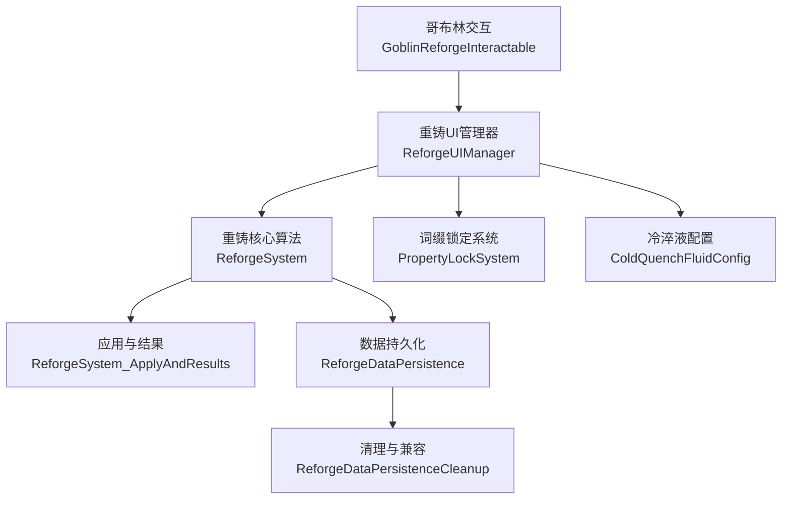
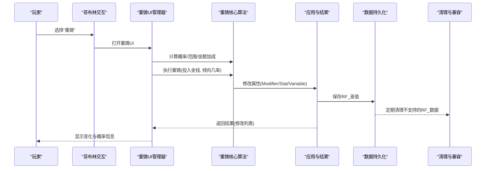
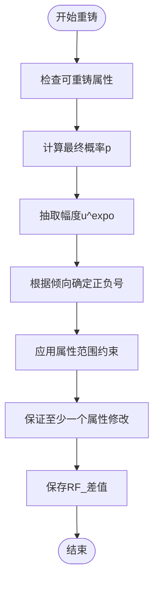
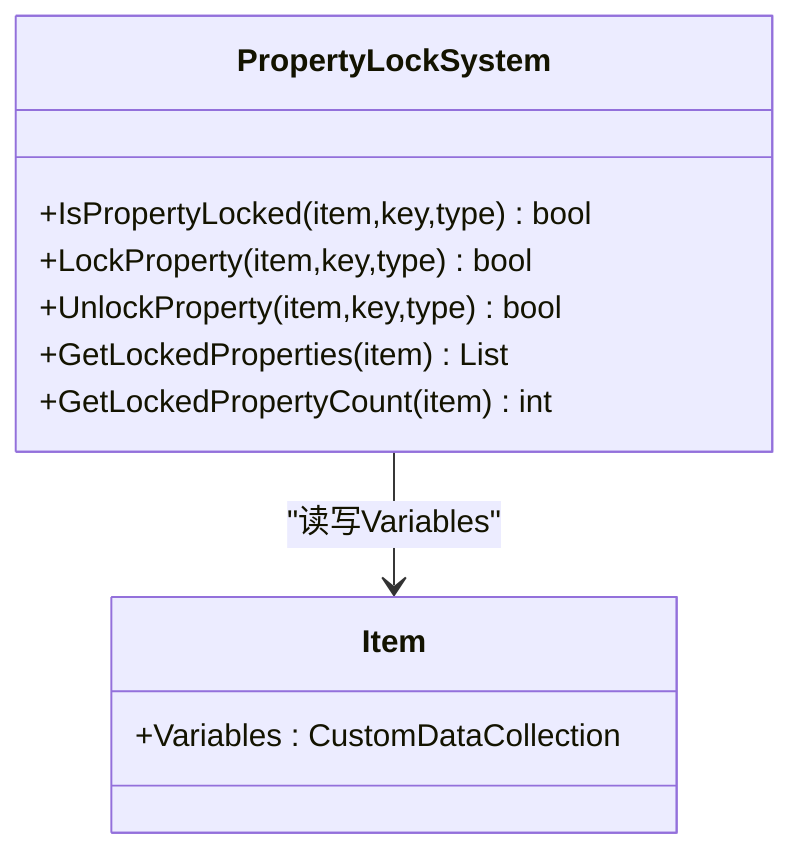
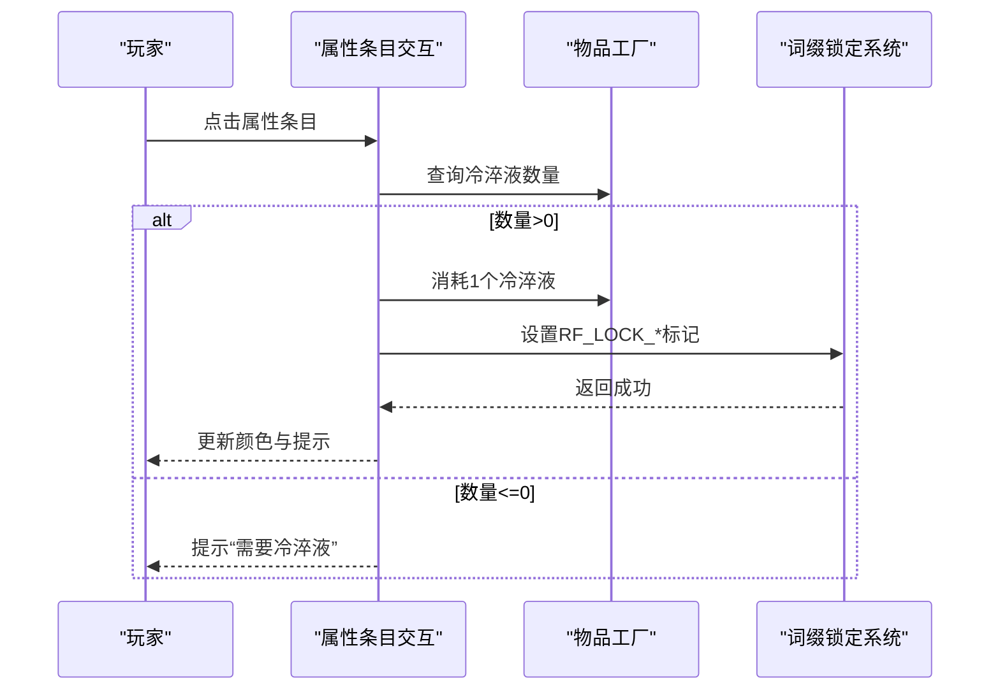
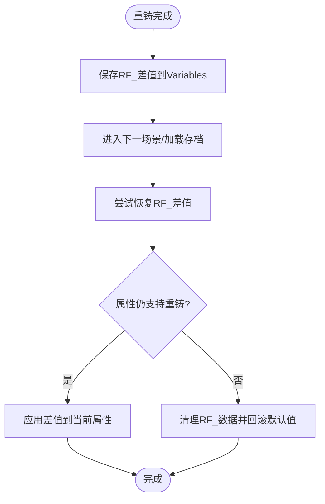
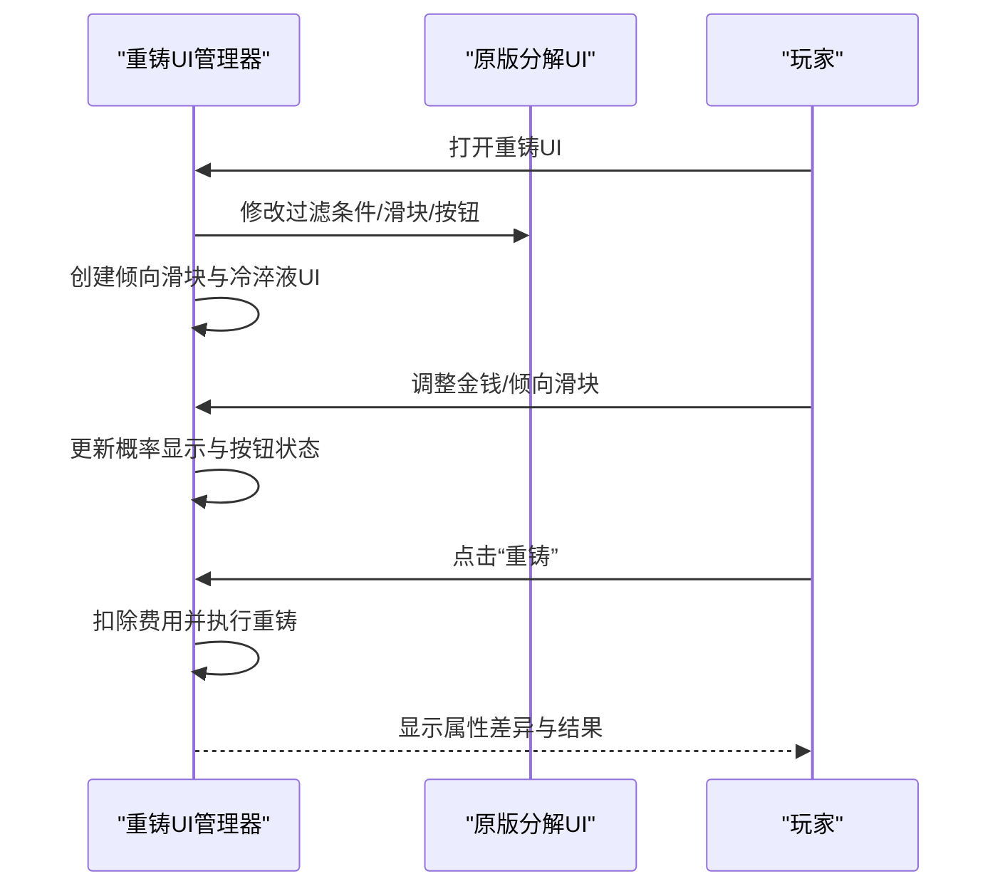
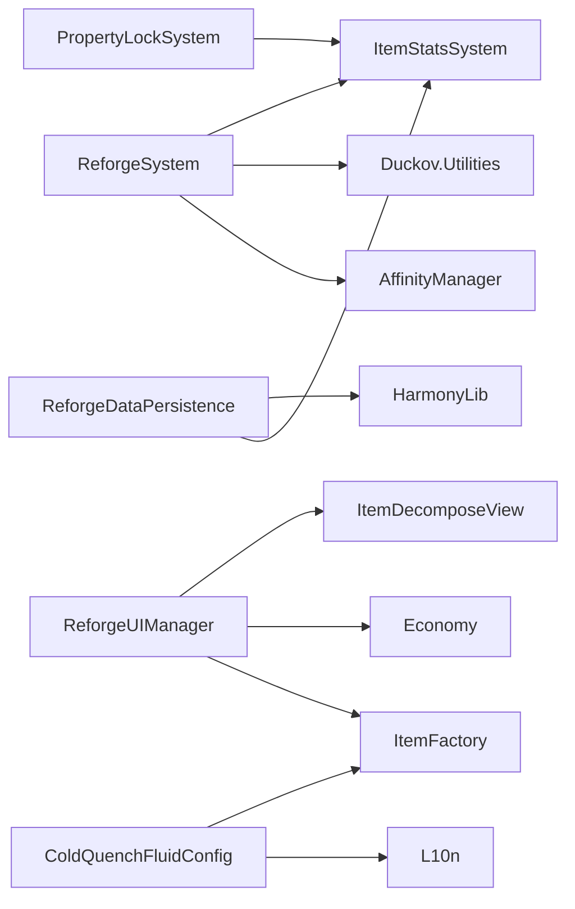

# 重铸系统

<cite>
**本文引用的文件**
- [ReforgeSystem.cs](file://Integration/Reforge/ReforgeSystem.cs)
- [ReforgeSystem_ApplyAndResults.cs](file://Integration/Reforge/ReforgeSystem_ApplyAndResults.cs)
- [PropertyLockSystem.cs](file://Integration/Reforge/PropertyLockSystem.cs)
- [ReforgeDataPersistence.cs](file://Integration/Reforge/ReforgeDataPersistence.cs)
- [ReforgeDataPersistenceCleanup.cs](file://Integration/Reforge/ReforgeDataPersistenceCleanup.cs)
- [GoblinReforgeInteractable.cs](file://Integration/Reforge/GoblinReforgeInteractable.cs)
- [ReforgeUIManager.cs](file://Integration/Reforge/ReforgeUIManager.cs)
- [ReforgeUIManager_ComparisonAndState.cs](file://Integration/Reforge/ReforgeUIManager_ComparisonAndState.cs)
- [ReforgeUIManager_RuntimeAndCleanup.cs](file://Integration/Reforge/ReforgeUIManager_RuntimeAndCleanup.cs)
- [ColdQuenchFluidConfig.cs](file://Integration/Reforge/ColdQuenchFluidConfig.cs)
</cite>

## 目录
1. [简介](#简介)
2. [项目结构](#项目结构)
3. [核心组件](#核心组件)
4. [架构总览](#架构总览)
5. [详细组件分析](#详细组件分析)
6. [依赖关系分析](#依赖关系分析)
7. [性能考量](#性能考量)
8. [故障排除指南](#故障排除指南)
9. [结论](#结论)
10. [附录：API 接口文档](#附录api-接口文档)

## 简介
本技术文档围绕“重铸系统”展开，覆盖以下关键主题：
- 装备属性重铸算法：随机数生成、概率与幅度计算、范围约束与结果验证。
- 词缀锁定系统：锁定状态管理、持久化存储（物品 Variables）与界面交互逻辑。
- 材料消耗机制：冷淬液配置、资源检查与 UI 展示。
- 重铸数据持久化：数据存储格式、版本兼容性与清理策略。
- API 接口：重铸调用、状态查询与事件处理。
- 故障排除：常见失败原因与定位方法。

## 项目结构
重铸系统位于 Integration/Reforge 目录下，按职责拆分为多个文件：
- 核心算法与公共常量：ReforgeSystem.cs、ReforgeSystem_ApplyAndResults.cs
- 词缀锁定：PropertyLockSystem.cs
- 数据持久化与恢复：ReforgeDataPersistence.cs、ReforgeDataPersistenceCleanup.cs
- 交互入口：GoblinReforgeInteractable.cs
- 界面与交互：ReforgeUIManager.cs、ReforgeUIManager_ComparisonAndState.cs、ReforgeUIManager_RuntimeAndCleanup.cs
- 材料配置：ColdQuenchFluidConfig.cs

图表来源
- [GoblinReforgeInteractable.cs:56-79](file://Integration/Reforge/GoblinReforgeInteractable.cs#L56-L79)
- [ReforgeUIManager.cs:397-421](file://Integration/Reforge/ReforgeUIManager.cs#L397-L421)
- [ReforgeSystem.cs:799-800](file://Integration/Reforge/ReforgeSystem.cs#L799-L800)
- [ReforgeSystem_ApplyAndResults.cs:147-179](file://Integration/Reforge/ReforgeSystem_ApplyAndResults.cs#L147-L179)
- [ReforgeDataPersistence.cs:115-137](file://Integration/Reforge/ReforgeDataPersistence.cs#L115-L137)
- [ReforgeDataPersistenceCleanup.cs:45-97](file://Integration/Reforge/ReforgeDataPersistenceCleanup.cs#L45-L97)
- [PropertyLockSystem.cs:61-177](file://Integration/Reforge/PropertyLockSystem.cs#L61-L177)
- [ColdQuenchFluidConfig.cs:248-281](file://Integration/Reforge/ColdQuenchFluidConfig.cs#L248-L281)

章节来源
- [GoblinReforgeInteractable.cs:56-79](file://Integration/Reforge/GoblinReforgeInteractable.cs#L56-L79)
- [ReforgeUIManager.cs:397-421](file://Integration/Reforge/ReforgeUIManager.cs#L397-L421)

## 核心组件
- 重铸核心算法（ReforgeSystem）：提供概率计算、范围约束、可重铸属性判定、最终重铸流程等。
- 应用与结果（ReforgeSystem_ApplyAndResults）：负责实际修改 Modifier/Stat/Variable 并保存差值到 Variables。
- 词缀锁定（PropertyLockSystem）：通过 Variables 前缀标记锁定状态，支持锁定/解锁与查询。
- 数据持久化（ReforgeDataPersistence）：以 RF_ 前缀保存差值，并在重新应用修改器时恢复。
- 清理与兼容（ReforgeDataPersistenceCleanup）：清理不再支持的 RF_ 数据并回滚至预制体默认值。
- UI 管理器（ReforgeUIManager 系列）：复用原版分解 UI，注入重铸滑块、概率显示、倾向滑块、冷淬液 UI、属性差异高亮与锁定交互。
- 哥布林交互（GoblinReforgeInteractable）：为 NPC 添加“重铸”子选项，打开重铸 UI。
- 冷淬液配置（ColdQuenchFluidConfig）：定义冷淬液物品 ID、图标、本地化与标签。

章节来源
- [ReforgeSystem.cs:191-275](file://Integration/Reforge/ReforgeSystem.cs#L191-L275)
- [ReforgeSystem_ApplyAndResults.cs:147-179](file://Integration/Reforge/ReforgeSystem_ApplyAndResults.cs#L147-L179)
- [PropertyLockSystem.cs:23-177](file://Integration/Reforge/PropertyLockSystem.cs#L23-L177)
- [ReforgeDataPersistence.cs:32-137](file://Integration/Reforge/ReforgeDataPersistence.cs#L32-L137)
- [ReforgeDataPersistenceCleanup.cs:45-97](file://Integration/Reforge/ReforgeDataPersistenceCleanup.cs#L45-L97)
- [ReforgeUIManager.cs:133-159](file://Integration/Reforge/ReforgeUIManager.cs#L133-L159)
- [GoblinReforgeInteractable.cs:16-79](file://Integration/Reforge/GoblinReforgeInteractable.cs#L16-L79)
- [ColdQuenchFluidConfig.cs:19-105](file://Integration/Reforge/ColdQuenchFluidConfig.cs#L19-L105)

## 架构总览
重铸系统由“交互入口 → UI 管理器 → 核心算法 → 应用与持久化 → 清理与恢复”的链路组成。UI 层负责玩家输入与反馈；核心算法负责概率与数值计算；持久化层确保跨场景/存档的数据一致性；清理层保障兼容性。

图表来源
- [GoblinReforgeInteractable.cs:56-79](file://Integration/Reforge/GoblinReforgeInteractable.cs#L56-L79)
- [ReforgeUIManager.cs:415-520](file://Integration/Reforge/ReforgeUIManager.cs#L415-L520)
- [ReforgeSystem.cs:799-800](file://Integration/Reforge/ReforgeSystem.cs#L799-L800)
- [ReforgeSystem_ApplyAndResults.cs:147-179](file://Integration/Reforge/ReforgeSystem_ApplyAndResults.cs#L147-L179)
- [ReforgeDataPersistence.cs:115-137](file://Integration/Reforge/ReforgeDataPersistence.cs#L115-L137)
- [ReforgeDataPersistenceCleanup.cs:45-97](file://Integration/Reforge/ReforgeDataPersistenceCleanup.cs#L45-L97)

## 详细组件分析

### 重铸算法与概率模型
- 概率构成：基础概率受稀有度与物品价值影响；额外金钱投入提供非线性加成；最终概率 p = clamp(0,1, p_item + MoneyBonus)。
- 幅度抽取：使用 u^expo 分布，p 越大 expo 越小，幅度越偏向大值。
- 正负号控制：通过倾向滑块决定绝对正负概率（tendencyChance）。
- 属性范围：小数值属性使用 0~1 或固定绝对范围；非零属性在 30%~200% 范围内偏移；整数属性保持整数。
- 保底机制：保证至少一个属性被修改。

图表来源
- [ReforgeSystem.cs:298-526](file://Integration/Reforge/ReforgeSystem.cs#L298-L526)
- [ReforgeSystem_ApplyAndResults.cs:147-179](file://Integration/Reforge/ReforgeSystem_ApplyAndResults.cs#L147-L179)

章节来源
- [ReforgeSystem.cs:298-526](file://Integration/Reforge/ReforgeSystem.cs#L298-L526)
- [ReforgeSystem_ApplyAndResults.cs:147-179](file://Integration/Reforge/ReforgeSystem_ApplyAndResults.cs#L147-L179)

### 词缀锁定系统
- 锁定状态：通过 Variables 中特定前缀键（RF_LOCK_MOD_/RF_LOCK_STAT_/RF_LOCK_VAR_）记录锁定状态。
- 持久化：锁定标记写入 Variables 并隐藏显示，避免干扰物品详情。
- 界面交互：点击属性条目消耗冷淬液进行锁定，颜色从白色→蓝色悬停→金色已固定。
- 查询与计数：提供 IsPropertyLocked、GetLockedProperties、GetLockedPropertyCount 等方法。

图表来源
- [PropertyLockSystem.cs:61-177](file://Integration/Reforge/PropertyLockSystem.cs#L61-L177)
- [ReforgeUIManager.cs:34-66](file://Integration/Reforge/ReforgeUIManager.cs#L34-L66)

章节来源
- [PropertyLockSystem.cs:61-177](file://Integration/Reforge/PropertyLockSystem.cs#L61-L177)
- [ReforgeUIManager.cs:34-66](file://Integration/Reforge/ReforgeUIManager.cs#L34-L66)

### 材料消耗机制（冷淬液）
- 配置：冷淬液拥有独立 TypeID、图标、本地化键与标签。
- 资源检查：点击锁定时检查库存数量，不足则阻止操作。
- 消耗动画/UI：创建冷淬液数量显示容器，动态更新数量与颜色；点击锁定后即时扣减并刷新 UI。
- 提示文本：提供多语言提示（需要冷淬液、已固定、固定成功等）。

图表来源
- [ReforgeUIManager.cs:34-66](file://Integration/Reforge/ReforgeUIManager.cs#L34-L66)
- [ReforgeUIManager_RuntimeAndCleanup.cs:535-660](file://Integration/Reforge/ReforgeUIManager_RuntimeAndCleanup.cs#L535-L660)
- [ColdQuenchFluidConfig.cs:248-281](file://Integration/Reforge/ColdQuenchFluidConfig.cs#L248-L281)

章节来源
- [ReforgeUIManager.cs:34-66](file://Integration/Reforge/ReforgeUIManager.cs#L34-L66)
- [ReforgeUIManager_RuntimeAndCleanup.cs:535-660](file://Integration/Reforge/ReforgeUIManager_RuntimeAndCleanup.cs#L535-L660)
- [ColdQuenchFluidConfig.cs:248-281](file://Integration/Reforge/ColdQuenchFluidConfig.cs#L248-L281)

### 重铸数据持久化
- 存储格式：以 RF_MOD_/RF_STAT_/RF_VAR_ 前缀保存差值（newValue - prefabValue），写入物品 Variables。
- 恢复机制：在重新应用修改器前自动恢复 RF_ 差值，确保跨场景/存档不丢失。
- 版本兼容：仅恢复预制体中原生存在的属性；对不再支持的属性执行清理并回滚到默认值。
- 清理策略：扫描 Variables，移除不再允许参与重铸的 RF_ 数据，并将对应属性重置为预制体值。

图表来源
- [ReforgeDataPersistence.cs:115-137](file://Integration/Reforge/ReforgeDataPersistence.cs#L115-L137)
- [ReforgeDataPersistence.cs:302-377](file://Integration/Reforge/ReforgeDataPersistence.cs#L302-L377)
- [ReforgeDataPersistenceCleanup.cs:45-97](file://Integration/Reforge/ReforgeDataPersistenceCleanup.cs#L45-L97)

章节来源
- [ReforgeDataPersistence.cs:115-137](file://Integration/Reforge/ReforgeDataPersistence.cs#L115-L137)
- [ReforgeDataPersistence.cs:302-377](file://Integration/Reforge/ReforgeDataPersistence.cs#L302-L377)
- [ReforgeDataPersistenceCleanup.cs:45-97](file://Integration/Reforge/ReforgeDataPersistenceCleanup.cs#L45-L97)

### 界面交互与对比显示
- 复用原版分解 UI：通过反射获取并修改内部字段，将“分解”按钮改为“重铸”，滑块改为金钱滑块。
- 概率与公式显示：实时展示品质系数、价值系数、金钱加成、极性费用、正向/负向概率与最终概率。
- 属性差异高亮：对比玩家物品与预制体属性，用颜色标注差异（绿涨红跌）。
- 倾向滑块：控制正负号概率，影响最终结果方向。
- 冷却与防抖：合并协程减少重复调度，延迟构建 UI 元素避免与原版冲突。

图表来源
- [ReforgeUIManager.cs:576-626](file://Integration/Reforge/ReforgeUIManager.cs#L576-L626)
- [ReforgeUIManager_ComparisonAndState.cs:305-410](file://Integration/Reforge/ReforgeUIManager_ComparisonAndState.cs#L305-L410)
- [ReforgeUIManager_RuntimeAndCleanup.cs:383-402](file://Integration/Reforge/ReforgeUIManager_RuntimeAndCleanup.cs#L383-L402)

章节来源
- [ReforgeUIManager.cs:576-626](file://Integration/Reforge/ReforgeUIManager.cs#L576-L626)
- [ReforgeUIManager_ComparisonAndState.cs:305-410](file://Integration/Reforge/ReforgeUIManager_ComparisonAndState.cs#L305-L410)
- [ReforgeUIManager_RuntimeAndCleanup.cs:383-402](file://Integration/Reforge/ReforgeUIManager_RuntimeAndCleanup.cs#L383-L402)

## 依赖关系分析
- ReforgeSystem 依赖：ItemStatsSystem（Modifier/Stat）、Duckov.Utilities（CustomData）、AffinityManager（折扣）。
- ReforgeUIManager 依赖：原版分解 UI（ItemDecomposeView）、Economy（支付）、ItemFactory（物品与图标）。
- ReforgeDataPersistence 依赖：HarmonyLib（Patch）、ItemStatsSystem（Items/Stats）。
- PropertyLockSystem 依赖：ItemStatsSystem（Item/CustomData）。
- ColdQuenchFluidConfig 依赖：ItemFactory、L10n、Tag 系统。

图表来源
- [ReforgeSystem.cs:18-25](file://Integration/Reforge/ReforgeSystem.cs#L18-L25)
- [ReforgeUIManager.cs:1-13](file://Integration/Reforge/ReforgeUIManager.cs#L1-L13)
- [ReforgeDataPersistence.cs:19-28](file://Integration/Reforge/ReforgeDataPersistence.cs#L19-L28)
- [PropertyLockSystem.cs:16-19](file://Integration/Reforge/PropertyLockSystem.cs#L16-L19)
- [ColdQuenchFluidConfig.cs:12-15](file://Integration/Reforge/ColdQuenchFluidConfig.cs#L12-L15)

章节来源
- [ReforgeSystem.cs:18-25](file://Integration/Reforge/ReforgeSystem.cs#L18-L25)
- [ReforgeUIManager.cs:1-13](file://Integration/Reforge/ReforgeUIManager.cs#L1-L13)
- [ReforgeDataPersistence.cs:19-28](file://Integration/Reforge/ReforgeDataPersistence.cs#L19-L28)
- [PropertyLockSystem.cs:16-19](file://Integration/Reforge/PropertyLockSystem.cs#L16-L19)
- [ColdQuenchFluidConfig.cs:12-15](file://Integration/Reforge/ColdQuenchFluidConfig.cs#L12-L15)

## 性能考量
- 委托缓存：对 ModifierDescription.value 与 Stat.baseValue 的 setter 使用表达式树编译的委托，显著降低反射开销。
- 反射缓存：UI 层缓存常用 FieldInfo/PropertyInfo，避免重复查找。
- 预制体缓存：UI 层缓存实例化的预制体，限制最大缓存大小并定期清理。
- 协程合并：差异显示与 UI 刷新合并为单次延迟协程，减少调度成本。
- 快速路径：持久化恢复时先检查是否已恢复、是否存在 RF_ 数据，避免不必要遍历。

章节来源
- [ReforgeSystem.cs:35-98](file://Integration/Reforge/ReforgeSystem.cs#L35-L98)
- [ReforgeUIManager.cs:152-206](file://Integration/Reforge/ReforgeUIManager.cs#L152-L206)
- [ReforgeUIManager.cs:239-325](file://Integration/Reforge/ReforgeUIManager.cs#L239-L325)
- [ReforgeUIManager_RuntimeAndCleanup.cs:383-402](file://Integration/Reforge/ReforgeUIManager_RuntimeAndCleanup.cs#L383-L402)
- [ReforgeDataPersistence.cs:302-377](file://Integration/Reforge/ReforgeDataPersistence.cs#L302-L377)

## 故障排除指南
- 重铸失败（无属性修改）：
  - 检查是否无可重铸属性（Display=true 且支持）。
  - 确认倾向滑块未完全偏向无效方向。
  - 查看日志中的概率与金额加成是否正确。
- 数据丢失（跨场景属性归零）：
  - 确认 RF_ 差值已保存；若不存在，检查重铸流程是否完整。
  - 若属性不再支持重铸，会被清理并回滚到默认值。
- UI 异常（按钮不可用/概率不显示）：
  - 检查是否处于重铸模式；确认原版分解 UI 已正确初始化。
  - 查看反射缓存是否成功初始化；必要时重置静态缓存。
- 冷淬液无法锁定：
  - 检查库存数量；确认 UI 已创建并更新数量。
  - 确认属性条目为数字类型且未被系统变量屏蔽。

章节来源
- [ReforgeSystem.cs:611-711](file://Integration/Reforge/ReforgeSystem.cs#L611-L711)
- [ReforgeDataPersistence.cs:302-377](file://Integration/Reforge/ReforgeDataPersistence.cs#L302-L377)
- [ReforgeDataPersistenceCleanup.cs:45-97](file://Integration/Reforge/ReforgeDataPersistenceCleanup.cs#L45-L97)
- [ReforgeUIManager.cs:576-626](file://Integration/Reforge/ReforgeUIManager.cs#L576-L626)
- [ReforgeUIManager_RuntimeAndCleanup.cs:535-660](file://Integration/Reforge/ReforgeUIManager_RuntimeAndCleanup.cs#L535-L660)

## 结论
重铸系统通过严谨的概率模型、严格的范围约束与稳健的持久化机制，实现了稳定且可控的属性重铸体验。UI 层深度集成原版分解界面，提供直观的概率展示与属性差异高亮；词缀锁定与冷淬液机制增强了策略性。清理与兼容层确保系统在版本演进中保持稳定。整体架构清晰、模块化良好，便于扩展与维护。

## 附录：API 接口文档
- 重铸调用
  - ReforgeSystem.Reforge(item, moneyInvested, userId, tendencyChance): 执行重铸，返回结果包含成功率、修改属性列表与总费用。
  - ReforgeSystem.FinalProbability(rarity, itemValue, moneyInvested): 计算最终概率。
  - ReforgeSystem.RollMagnitude(p, random): 抽取幅度。
  - ReforgeSystem.RollSign(tendencyChance): 决定正负号。
- 状态查询
  - ReforgeSystem.CanReforge(item): 判断物品是否可重铸。
  - ReforgeSystem.GetReforgeablePropertyCount(item): 获取可重铸属性数量。
  - ReforgeSystem.GetItemValue(item): 获取物品价值。
  - PropertyLockSystem.IsPropertyLocked(item, key, type): 查询锁定状态。
  - PropertyLockSystem.GetLockedProperties(item): 获取所有锁定属性。
- 事件处理
  - ReforgeUIManager.OnMoneySliderChanged(value): 金钱滑块变更。
  - ReforgeUIManager.OnReforgeButtonClick(): 重铸按钮点击。
  - ReforgeUIManager.NotifyPropertyLocked(): 属性锁定后通知 UI 刷新。
  - ReforgeDataPersistence.TryRestoreReforgeData(item): 尝试恢复重铸数据。

章节来源
- [ReforgeSystem.cs:799-800](file://Integration/Reforge/ReforgeSystem.cs#L799-L800)
- [ReforgeSystem.cs:411-420](file://Integration/Reforge/ReforgeSystem.cs#L411-L420)
- [ReforgeSystem.cs:500-526](file://Integration/Reforge/ReforgeSystem.cs#L500-L526)
- [ReforgeSystem.cs:611-711](file://Integration/Reforge/ReforgeSystem.cs#L611-L711)
- [PropertyLockSystem.cs:61-177](file://Integration/Reforge/PropertyLockSystem.cs#L61-L177)
- [ReforgeUIManager.cs:305-410](file://Integration/Reforge/ReforgeUIManager.cs#L305-L410)
- [ReforgeUIManager_ComparisonAndState.cs:415-520](file://Integration/Reforge/ReforgeUIManager_ComparisonAndState.cs#L415-L520)
- [ReforgeDataPersistence.cs:302-377](file://Integration/Reforge/ReforgeDataPersistence.cs#L302-L377)