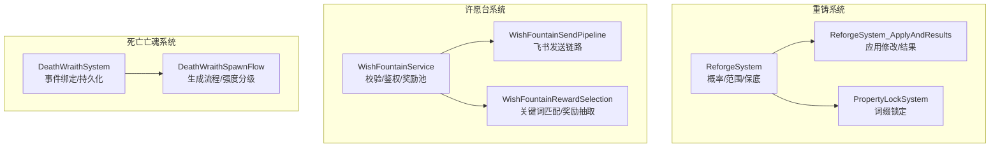
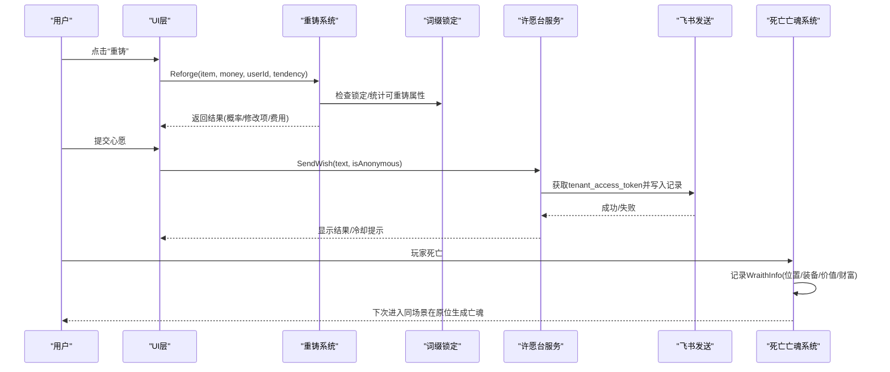
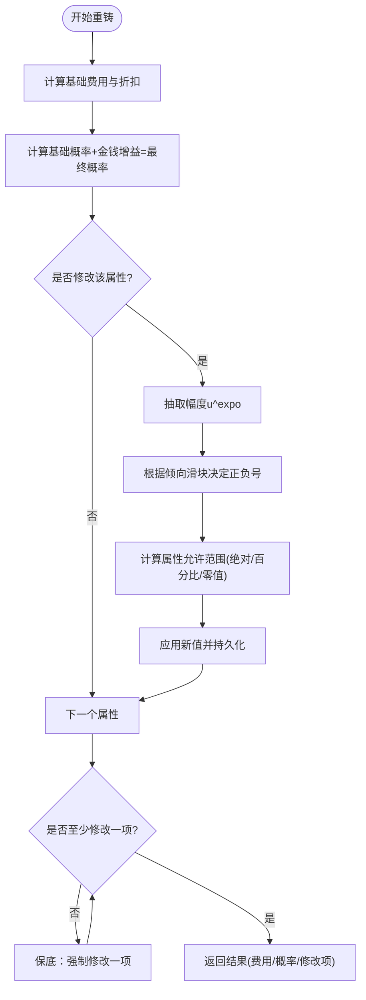
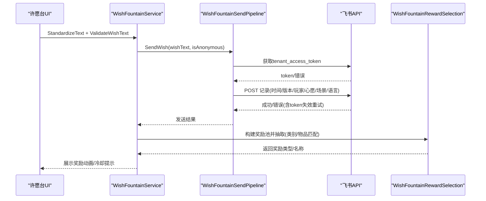
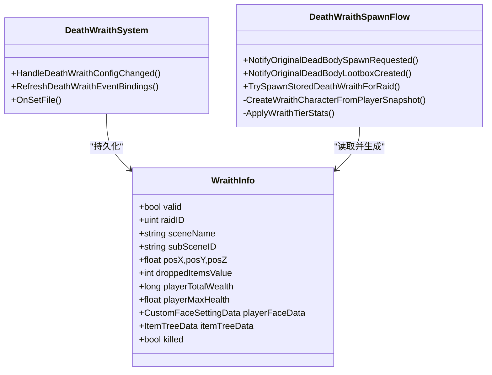
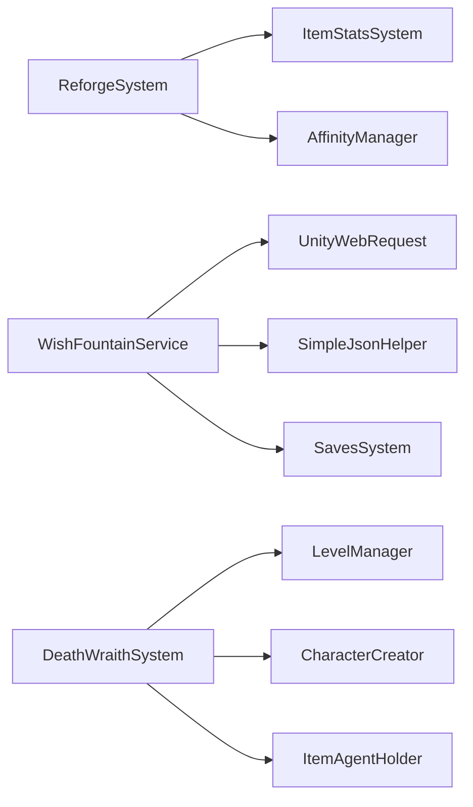

# 高级功能

<cite>
**本文引用的文件**
- [ReforgeSystem.cs](file://Integration/Reforge/ReforgeSystem.cs)
- [ReforgeSystem_ApplyAndResults.cs](file://Integration/Reforge/ReforgeSystem_ApplyAndResults.cs)
- [PropertyLockSystem.cs](file://Integration/Reforge/PropertyLockSystem.cs)
- [WishFountainService.cs](file://Integration/WishFountain/WishFountainService.cs)
- [WishFountainSendPipeline.cs](file://Integration/WishFountain/WishFountainSendPipeline.cs)
- [WishFountainRewardSelection.cs](file://Integration/WishFountain/WishFountainRewardSelection.cs)
- [DeathWraithSystem.cs](file://Integration/DeathWraith/DeathWraithSystem.cs)
- [DeathWraithSpawnFlow.cs](file://Integration/DeathWraith/DeathWraithSpawnFlow.cs)
</cite>

## 目录
1. [简介](#简介)
2. [项目结构](#项目结构)
3. [核心组件](#核心组件)
4. [架构总览](#架构总览)
5. [详细组件分析](#详细组件分析)
6. [依赖关系分析](#依赖关系分析)
7. [性能考量](#性能考量)
8. [故障排除指南](#故障排除指南)
9. [结论](#结论)
10. [附录：配置与扩展接口](#附录：配置与扩展接口)

## 简介
本章节面向 BossRushMod 的高级玩法系统，聚焦三大模块：重铸系统、许愿台系统与死亡亡魂系统。文档将深入解析其核心机制、数据流、在线集成、奖励流程、强度分级、配置选项、使用方法与故障排除，并提供扩展接口与自定义开发指导，帮助开发者理解并二次开发这些特性。

## 项目结构
BossRushMod 将高级功能按子系统拆分到 Integration 目录下：
- 重铸系统：Integration/Reforge
- 许愿台系统：Integration/WishFountain
- 死亡亡魂系统：Integration/DeathWraith

**图表来源**
- [ReforgeSystem.cs:1-120](file://Integration/Reforge/ReforgeSystem.cs#L1-L120)
- [ReforgeSystem_ApplyAndResults.cs:1-120](file://Integration/Reforge/ReforgeSystem_ApplyAndResults.cs#L1-L120)
- [PropertyLockSystem.cs:1-120](file://Integration/Reforge/PropertyLockSystem.cs#L1-L120)
- [WishFountainService.cs:1-120](file://Integration/WishFountain/WishFountainService.cs#L1-L120)
- [WishFountainSendPipeline.cs:1-120](file://Integration/WishFountain/WishFountainSendPipeline.cs#L1-L120)
- [WishFountainRewardSelection.cs:1-120](file://Integration/WishFountain/WishFountainRewardSelection.cs#L1-L120)
- [DeathWraithSystem.cs:1-120](file://Integration/DeathWraith/DeathWraithSystem.cs#L1-L120)
- [DeathWraithSpawnFlow.cs:1-120](file://Integration/DeathWraith/DeathWraithSpawnFlow.cs#L1-L120)

**章节来源**
- [ReforgeSystem.cs:1-120](file://Integration/Reforge/ReforgeSystem.cs#L1-L120)
- [WishFountainService.cs:1-120](file://Integration/WishFountain/WishFountainService.cs#L1-L120)
- [DeathWraithSystem.cs:1-120](file://Integration/DeathWraith/DeathWraithSystem.cs#L1-L120)

## 核心组件
- 重铸系统：负责属性重铸算法（概率、幅度、范围）、保底机制、费用计算、属性锁定与持久化。
- 许愿台系统：负责文本标准化与内容校验、飞书鉴权与记录写入、愿望奖励池构建与抽取、冷却与缓存。
- 死亡亡魂系统：负责玩家死亡处理、亡魂数据快照与持久化、场景内生成流程、强度分级与外观/装备还原。

**章节来源**
- [ReforgeSystem.cs:190-420](file://Integration/Reforge/ReforgeSystem.cs#L190-L420)
- [WishFountainService.cs:116-156](file://Integration/WishFountain/WishFountainService.cs#L116-L156)
- [DeathWraithSystem.cs:34-120](file://Integration/DeathWraith/DeathWraithSystem.cs#L34-L120)

## 架构总览
三个子系统通过 ModBehaviour 生命周期与游戏事件进行解耦协作：
- 重铸系统通过 UI 触发，调用 ReforgeSystem.Reforge 执行概率判定与属性修改，并通过 PropertyLockSystem 管理锁定状态。
- 许愿台系统通过 UI 触发 WishFountainService.SendWish，完成文本校验、鉴权、写入多维表格，并基于 WishFountainRewardSelection 选择奖励与播放动画。
- 死亡亡魂系统订阅 Health 事件，在玩家死亡时记录快照，并在下次进入同一子场景时于原位置生成亡魂，依据掉落价值与玩家财富比例决定强度等级。

**图表来源**
- [ReforgeSystem.cs:788-800](file://Integration/Reforge/ReforgeSystem.cs#L788-L800)
- [PropertyLockSystem.cs:60-140](file://Integration/Reforge/PropertyLockSystem.cs#L60-L140)
- [WishFountainSendPipeline.cs:191-367](file://Integration/WishFountain/WishFountainSendPipeline.cs#L191-L367)
- [DeathWraithSystem.cs:202-240](file://Integration/DeathWraith/DeathWraithSystem.cs#L202-L240)
- [DeathWraithSpawnFlow.cs:133-247](file://Integration/DeathWraith/DeathWraithSpawnFlow.cs#L133-L247)

## 详细组件分析

### 重铸系统
- 概率与金额增益：基础概率由稀有度与物品价值决定；投入金钱按物品价值的倍数分段提供额外概率加成，最终概率被钳制在[0,1]。
- 幅度与范围：使用指数分布 u^expo 抽取幅度，p越大幅度越大；属性范围根据预制体值大小采用绝对或百分比范围，零值有固定范围避免不变。
- 保底机制：连续失败后提升成功率，保证每次重铸至少一个属性被修改。
- 费用计算：基础费用为物品价值的1/100，最低100；支持哥布林好感度折扣。
- 属性锁定：通过变量前缀 RF_LOCK_MOD_/RF_LOCK_STAT_/RF_LOCK_VAR_ 标记锁定，UI与重铸逻辑共用边界计算。
- 持久化：修改后的属性值保存到 Variables，确保跨场景恢复。

**图表来源**
- [ReforgeSystem.cs:301-420](file://Integration/Reforge/ReforgeSystem.cs#L301-L420)
- [ReforgeSystem_ApplyAndResults.cs:147-179](file://Integration/Reforge/ReforgeSystem_ApplyAndResults.cs#L147-L179)
- [PropertyLockSystem.cs:60-140](file://Integration/Reforge/PropertyLockSystem.cs#L60-L140)

**章节来源**
- [ReforgeSystem.cs:190-420](file://Integration/Reforge/ReforgeSystem.cs#L190-L420)
- [ReforgeSystem_ApplyAndResults.cs:147-179](file://Integration/Reforge/ReforgeSystem_ApplyAndResults.cs#L147-L179)
- [PropertyLockSystem.cs:60-140](file://Integration/Reforge/PropertyLockSystem.cs#L60-L140)

### 许愿台系统
- 文本标准化与校验：全角转半角、空白折叠、换行统一；长度限制、有效字符、重复、链接、敏感词过滤。
- 在线 API 集成：AES-256-CBC 加密配置文件读取；飞书应用鉴权获取 tenant_access_token，写入多维表格记录；token 失效自动重试一次。
- 冷却与缓存：全局30秒冷却；缓存 token 与弹幕读取结果，降低频繁鉴权开销。
- 奖励池构建与抽取：基于关键词匹配类别与具体物品，按质量权重与类别/物品偏置加权随机抽取；支持历史兼容模式。
- 奖励发放动画：根据选中类型与索引构建动画序列，避免重复与偏好差异。

**图表来源**
- [WishFountainService.cs:116-156](file://Integration/WishFountain/WishFountainService.cs#L116-L156)
- [WishFountainSendPipeline.cs:191-367](file://Integration/WishFountain/WishFountainSendPipeline.cs#L191-L367)
- [WishFountainRewardSelection.cs:23-124](file://Integration/WishFountain/WishFountainRewardSelection.cs#L23-L124)

**章节来源**
- [WishFountainService.cs:116-156](file://Integration/WishFountain/WishFountainService.cs#L116-L156)
- [WishFountainSendPipeline.cs:191-367](file://Integration/WishFountain/WishFountainSendPipeline.cs#L191-L367)
- [WishFountainRewardSelection.cs:23-124](file://Integration/WishFountain/WishFountainRewardSelection.cs#L23-L124)

### 死亡亡魂系统
- 玩家死亡处理：订阅 Health.OnDead，记录 WraithInfo（位置、装备树、掉落价值、玩家总财富、最大生命等）。
- 亡魂生成机制：当原版遗失物箱创建时，匹配对应 raidID 与子场景，异步创建角色宿主并还原外观/装备/捏脸数据。
- 强度分级系统：根据掉落价值与玩家总财富比例分为弱、均衡、强三档，分别调整移速与攻击倍率；命名体现强度。
- 持久化与清理：内存列表缓存 + 去抖落盘；切换存档槽清理缓存；再次死亡覆盖更新。

**图表来源**
- [DeathWraithSystem.cs:34-120](file://Integration/DeathWraith/DeathWraithSystem.cs#L34-L120)
- [DeathWraithSpawnFlow.cs:133-247](file://Integration/DeathWraith/DeathWraithSpawnFlow.cs#L133-L247)

**章节来源**
- [DeathWraithSystem.cs:202-240](file://Integration/DeathWraith/DeathWraithSystem.cs#L202-L240)
- [DeathWraithSpawnFlow.cs:133-247](file://Integration/DeathWraith/DeathWraithSpawnFlow.cs#L133-L247)

## 依赖关系分析
- 重铸系统依赖 ItemStatsSystem 的 Modifier/Stat/Variable 模型，通过反射与委托缓存优化性能；与 AffinityManager 交互以应用好感度折扣。
- 许愿台系统依赖 UnityWebRequest 与 SimpleJsonHelper 进行网络请求与 JSON 处理；依赖 SavesSystem 监听存档事件；依赖 L10n 进行多语言文案。
- 死亡亡魂系统依赖 LevelManager、CharacterCreator、ItemAgentHolder 等运行时对象，通过反射访问私有字段以适配引擎内部结构。

**图表来源**
- [ReforgeSystem.cs:1-120](file://Integration/Reforge/ReforgeSystem.cs#L1-L120)
- [WishFountainService.cs:1-120](file://Integration/WishFountain/WishFountainService.cs#L1-L120)
- [DeathWraithSystem.cs:120-180](file://Integration/DeathWraith/DeathWraithSystem.cs#L120-L180)

**章节来源**
- [ReforgeSystem.cs:1-120](file://Integration/Reforge/ReforgeSystem.cs#L1-L120)
- [WishFountainService.cs:1-120](file://Integration/WishFountain/WishFountainService.cs#L1-L120)
- [DeathWraithSystem.cs:120-180](file://Integration/DeathWraith/DeathWraithSystem.cs#L120-L180)

## 性能考量
- 重铸系统使用委托缓存替代反射调用，显著提升 Modifier/Stat 值设置性能；属性范围计算与边界判断复用，减少重复计算。
- 许愿台系统缓存 tenant_access_token 与弹幕读取结果，降低网络开销；发送前限流避免频繁请求。
- 死亡亡魂系统采用内存列表缓存与去抖落盘，避免死亡帧同步序列化导致卡顿；异步创建角色宿主，减少主线程阻塞。

[本节为通用性能讨论，不直接分析具体文件]

## 故障排除指南
- 重铸系统：
  - 若属性未变化，检查是否已锁定或处于边界；查看日志中“应用属性修改失败”信息。
  - 费用异常：确认物品价值读取路径（实例值→原始值→预制体值）是否回退正确。
- 许愿台系统：
  - 发送失败：检查飞书配置是否有效；关注 token 失效重试逻辑；查看网络错误与 API 返回码。
  - 奖励未生效：确认关键词匹配与奖励池初始化；查看日志中的 poolMode 与 fallbackReason。
- 死亡亡魂系统：
  - 未生成亡魂：检查原版遗失物箱是否创建；确认 raidID 与子场景匹配；查看角色创建异常日志。
  - 强度不符：核对掉落价值与玩家总财富比例；确认强度分级逻辑是否正确应用。

**章节来源**
- [ReforgeSystem_ApplyAndResults.cs:147-179](file://Integration/Reforge/ReforgeSystem_ApplyAndResults.cs#L147-L179)
- [WishFountainSendPipeline.cs:291-367](file://Integration/WishFountain/WishFountainSendPipeline.cs#L291-L367)
- [DeathWraithSpawnFlow.cs:133-247](file://Integration/DeathWraith/DeathWraithSpawnFlow.cs#L133-L247)

## 结论
BossRushMod 的高级功能通过模块化设计实现了高内聚、低耦合的系统架构。重铸系统提供精细的概率控制与属性锁定；许愿台系统实现稳定的在线集成与智能奖励抽取；死亡亡魂系统增强挑战性与沉浸感。各系统均具备完善的错误处理与性能优化，适合进一步扩展与定制。

[本节为总结性内容，不直接分析具体文件]

## 附录：配置与扩展接口
- 重铸系统：
  - 配置项：最小费用、基础概率、金钱增益阈值、属性范围阈值、不支持键列表。
  - 扩展点：新增可重铸 Tag、添加新 Stat/Variable 支持、调整保底策略。
- 许愿台系统：
  - 配置项：文本长度限制、冷却时间、敏感词黑名单、类别别名与偏置、硬编码物品列表。
  - 扩展点：新增类别/物品映射、调整质量权重与偏置、接入其他在线服务。
- 死亡亡魂系统：
  - 配置项：系统开关、保存键名、AI预设名称、待处理超时与帧差。
  - 扩展点：新增强度等级、自定义外观/装备还原逻辑、调整生成时机与清理策略。

**章节来源**
- [ReforgeSystem.cs:190-276](file://Integration/Reforge/ReforgeSystem.cs#L190-L276)
- [WishFountainService.cs:116-156](file://Integration/WishFountain/WishFountainService.cs#L116-L156)
- [DeathWraithSystem.cs:127-180](file://Integration/DeathWraith/DeathWraithSystem.cs#L127-L180)