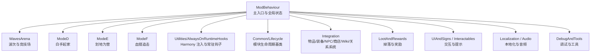
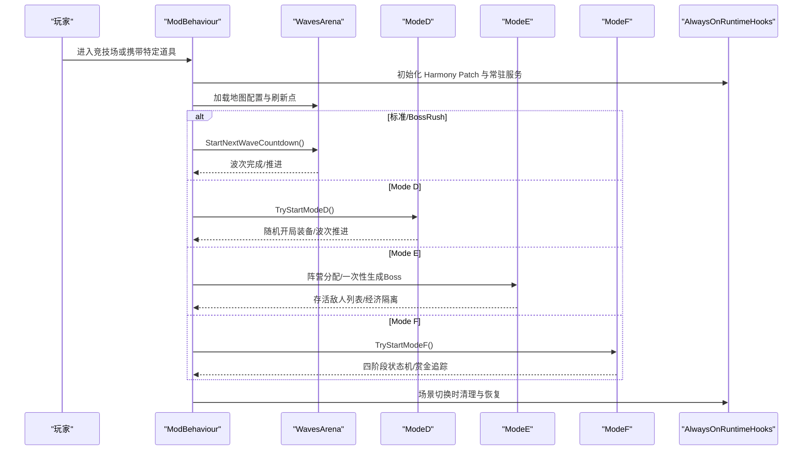
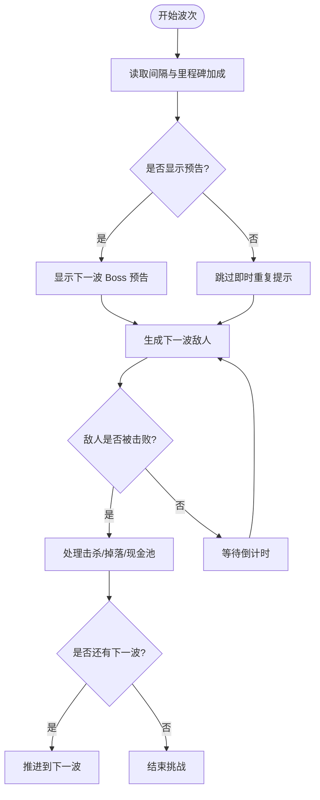
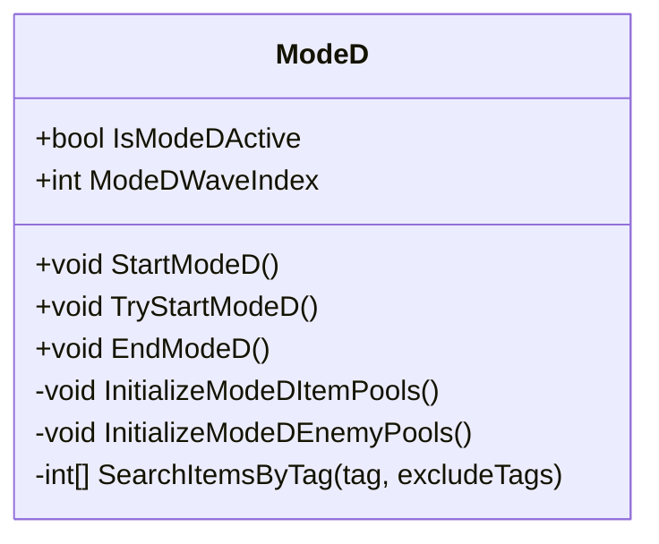
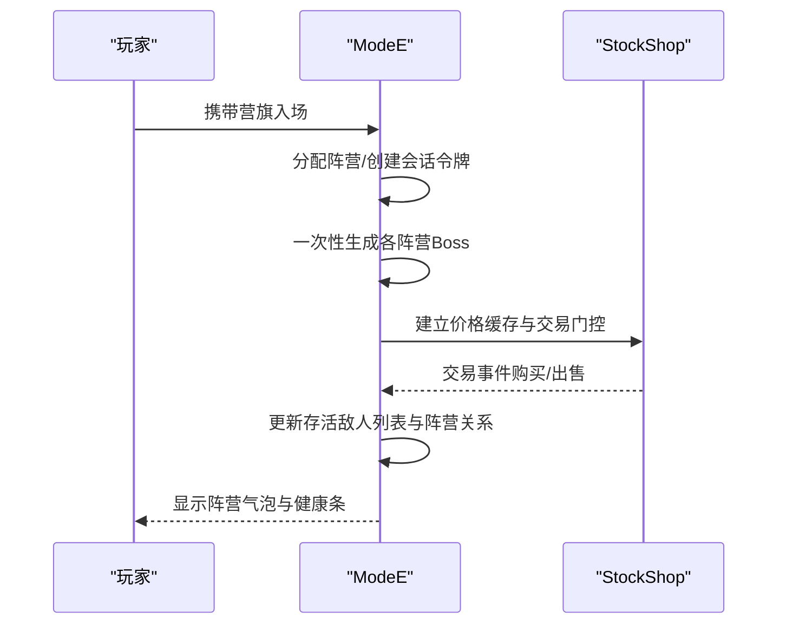
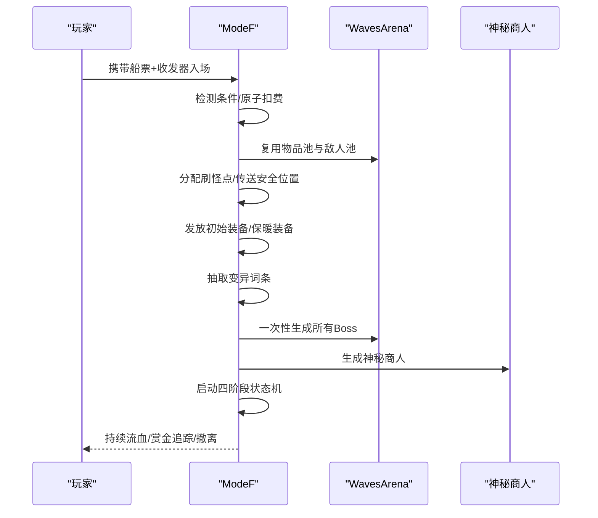
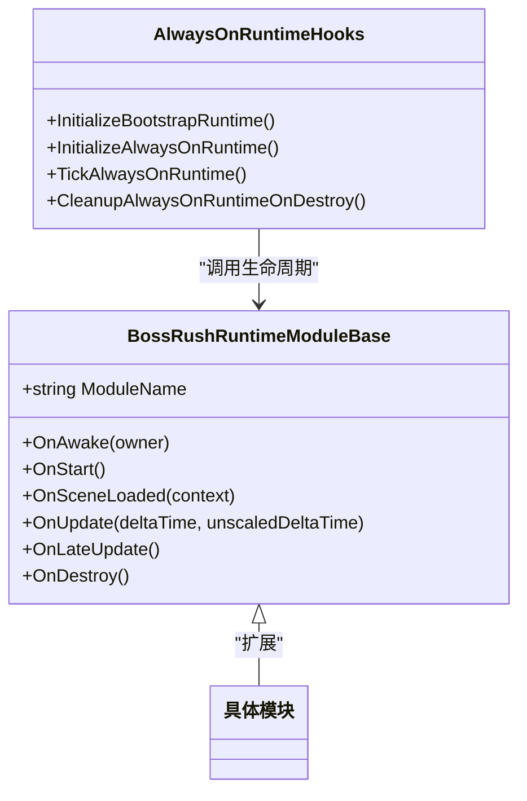
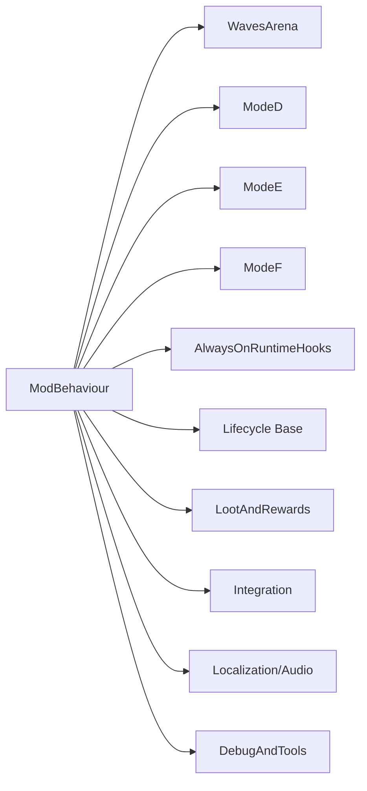

# 项目介绍

<cite>
**本文引用的文件**
- [README.md](file://README.md)
- [ModBehaviour.cs](file://ModBehaviour.cs)
- [WavesArena/WavesArena.cs](file://WavesArena/WavesArena.cs)
- [ModeD/ModeD.cs](file://ModeD/ModeD.cs)
- [ModeE/ModeE.cs](file://ModeE/ModeE.cs)
- [ModeF/ModeFEntry.cs](file://ModeF/ModeFEntry.cs)
- [Utilities/AlwaysOnRuntimeHooks.cs](file://Utilities/AlwaysOnRuntimeHooks.cs)
- [Common/Lifecycle/BossRushRuntimeModuleBase.cs](file://Common/Lifecycle/BossRushRuntimeModuleBase.cs)
- [wiki-site/docs/en/game-modes/index.md](file://wiki-site/docs/en/game-modes/index.md)
- [wiki-site/docs/en/getting-started/first-steps.md](file://wiki-site/docs/en/getting-started/first-steps.md)
- [wiki-site/docs/en/systems/affinity-marriage.md](file://wiki-site/docs/en/systems/affinity-marriage.md)
</cite>

## 目录
1. [简介](#简介)
2. [项目结构](#项目结构)
3. [核心组件](#核心组件)
4. [架构总览](#架构总览)
5. [详细组件分析](#详细组件分析)
6. [依赖关系分析](#依赖关系分析)
7. [性能与稳定性](#性能与稳定性)
8. [故障排查指南](#故障排查指南)
9. [结论](#结论)
10. [附录：新手体验与技术选型](#附录：新手体验与技术选型)

## 简介
BossRushMod 是《Escape from Duckov》的综合型大型 Mod，以 BossRush 竞技场玩法为核心，扩展出多模式玩法、自定义 Boss、装备能力系统、NPC 关系线、成就、重铸、许愿台、死亡亡魂、游戏内 Wiki、在线站点、本地化与运行时修复等完整内容包。它既为新手提供“从一张票开始”的清晰上手路径，也为硬核玩家提供无限波次、阵营混战与大逃杀式的高压挑战。

- 六大主要玩法模式：标准 BossRush（含三档难度）、Mode D 白手起家、Mode E 划地为营、Mode F 血猎追击、无间炼狱、以及独立的僵尸生存模式入口。
- 九张支持地图：DEMO 终极挑战、零度挑战、零号区、仓库区、农场镇、J-Lab 实验室、口口场地、37 号实验区、迷宫。
- 两个核心自定义 Boss：龙裔遗族、焚天龙皇（Skyburner Dragon Lord）。
- 三位常驻 NPC：阿稳（快递员）、叮当（哥布林）、羽织（护士），并配套好感度与婚姻线。
- 装备能力系统：龙套装、龙王套装、飞行图腾、逆鳞、霜之哀伤及 NewWeapons 扩展包等。
- 技术特色：Unity 模组开发、Harmony 代码注入、多模式架构设计、模块化生命周期管理、运行时缓存与性能优化。

**章节来源**
- [README.md:15-28](file://README.md#L15-L28)
- [README.md:29-54](file://README.md#L29-L54)
- [README.md:56-121](file://README.md#L56-L121)
- [wiki-site/docs/en/game-modes/index.md:1-33](file://wiki-site/docs/en/game-modes/index.md#L1-L33)

## 项目结构
项目采用按功能域分层的目录组织方式，核心模块职责清晰：
- 主入口与全局状态：ModBehaviour.cs
- 波次与竞技场：WavesArena/
- 各模式实现：ModeD/、ModeE/、ModeF/
- 运行时钩子与注入：Utilities/AlwaysOnRuntimeHooks.cs
- 生命周期与模块基类：Common/Lifecycle/
- 地图配置与刷新点：Assets/SpawnPoints/ 与 Common/MapConfig/
- 集成子系统：Integration/（物品、装备、NPC、商店、Wiki、关系系统等）
- 掉落与奖励：LootAndRewards/
- UI 与路牌：UIAndSigns/、Interactables/
- 调试工具：DebugAndTools/
- 本地化与音频：Localization/、Audio/
- 测试与守卫：tests/（Python 静态断言与 C# 单元测试）

**图表来源**
- [ModBehaviour.cs:598-620](file://ModBehaviour.cs#L598-L620)
- [WavesArena/WavesArena.cs:1-14](file://WavesArena/WavesArena.cs#L1-L14)
- [Utilities/AlwaysOnRuntimeHooks.cs:7-60](file://Utilities/AlwaysOnRuntimeHooks.cs#L7-L60)
- [Common/Lifecycle/BossRushRuntimeModuleBase.cs:1-15](file://Common/Lifecycle/BossRushRuntimeModuleBase.cs#L1-L15)

**章节来源**
- [README.md:194-224](file://README.md#L194-L224)

## 核心组件
- 主入口与全局状态：负责初始化运行时模块、场景切换处理、模式激活与清理、地图配置查询、默认传送位置计算等。
- 波次与竞技场：管理 BossRush 的波次流程、倒计时、敌人生成、击杀判定、下一波推进、无间炼狱现金池与权重选择。
- 模式 D（白手起家）：裸装入场、随机开局装备、独立敌人与掉落成长曲线、每波敌人数量可配置。
- 模式 E（划地为营）：多阵营沙盒混战、阵营分配、一次性生成 Boss、按个人基线层数动态缩放、商人经济隔离。
- 模式 F（血猎追击）：四阶段大逃杀（准备→赏金→猎杀风暴→撤离）、持续失血、击杀回血、赏金标记追踪、工事系统与撤离。
- 运行时注入：通过 Harmony 扫描并应用 Patch，注册分组，确保关键补丁就绪；同时维护常驻服务（如愿望台、Wiki、关系系统）。
- 生命周期模块：基于统一基类的 Awake/Start/Update/LateUpdate/Destroy 生命周期，便于扩展与维护。

**章节来源**
- [ModBehaviour.cs:329-356](file://ModBehaviour.cs#L329-L356)
- [WavesArena/WavesArena.cs:108-207](file://WavesArena/WavesArena.cs#L108-L207)
- [ModeD/ModeD.cs:128-195](file://ModeD/ModeD.cs#L128-L195)
- [ModeE/ModeE.cs:65-107](file://ModeE/ModeE.cs#L65-L107)
- [ModeF/ModeFEntry.cs:65-164](file://ModeF/ModeFEntry.cs#L65-L164)
- [Utilities/AlwaysOnRuntimeHooks.cs:7-60](file://Utilities/AlwaysOnRuntimeHooks.cs#L7-L60)
- [Common/Lifecycle/BossRushRuntimeModuleBase.cs:1-15](file://Common/Lifecycle/BossRushRuntimeModuleBase.cs#L1-L15)

## 架构总览
BossRushMod 采用“主入口 + 多模式 + 通用基础设施”的分层架构：
- 主入口（ModBehaviour）作为单例，协调各模式的启动、运行与销毁，统一管理场景生命周期与资源清理。
- 模式层（ModeD/E/F）各自封装入场条件检测、状态机、刷怪与掉落逻辑，互不干扰且可复用公共能力。
- 通用层（WavesArena、LootAndRewards、Integration、Localization、Audio、DebugAndTools）提供跨模式共享能力。
- 注入层（Harmony）在运行时对游戏原生系统进行非侵入式增强，保证兼容性并降低耦合。

**图表来源**
- [ModBehaviour.cs:598-620](file://ModBehaviour.cs#L598-L620)
- [WavesArena/WavesArena.cs:108-207](file://WavesArena/WavesArena.cs#L108-L207)
- [ModeD/ModeD.cs:128-195](file://ModeD/ModeD.cs#L128-L195)
- [ModeE/ModeE.cs:65-107](file://ModeE/ModeE.cs#L65-L107)
- [ModeF/ModeFEntry.cs:65-164](file://ModeF/ModeFEntry.cs#L65-L164)
- [Utilities/AlwaysOnRuntimeHooks.cs:7-60](file://Utilities/AlwaysOnRuntimeHooks.cs#L7-L60)

## 详细组件分析

### 波次与竞技场（WavesArena）
- 功能要点：
  - 波次倒计时与预告：根据配置设置间隔，并在前 20 波排除强力 Boss，保障新手体验。
  - 击杀判定与推进：区分单 Boss 与多 Boss 模式，完成后通知快递员并推进下一波。
  - 无间炼狱：按血量范围与波次线性放大权重选择 Boss，累计现金池与里程碑奖励。
- 复杂度与优化：
  - 使用过滤后的 Boss 列表避免重复扫描。
  - 缓存角色列表与销毁列表减少 GC 压力。
  - 竞技场半径限制用于禁用 spawner 与清理敌人，提升性能。

**图表来源**
- [WavesArena/WavesArena.cs:108-207](file://WavesArena/WavesArena.cs#L108-L207)
- [WavesArena/WavesArena.cs:348-506](file://WavesArena/WavesArena.cs#L348-L506)

**章节来源**
- [WavesArena/WavesArena.cs:42-106](file://WavesArena/WavesArena.cs#L42-L106)
- [WavesArena/WavesArena.cs:551-641](file://WavesArena/WavesArena.cs#L551-L641)
- [WavesArena/WavesArena.cs:643-742](file://WavesArena/WavesArena.cs#L643-L742)

### 模式 D：白手起家（ModeD）
- 功能要点：
  - 裸装入场检测：仅允许携带船票，清空背包后进入。
  - 随机开局装备：按 Tag 筛选武器、护甲、头盔、弹药、医疗品、近战、图腾、面具、背包等池。
  - 独立敌人与掉落：小怪池与 Boss 池分离，每波敌人数可配置，掉落与成长曲线独立。
- 复杂度与优化：
  - 预建质量桶（Quality Buckets）加速品质分布抽取。
  - 缓存 CharacterRandomPreset 字典，避免重复扫描。
  - 黑名单过滤与标签排除，确保掉落与生成安全。

**图表来源**
- [ModeD/ModeD.cs:26-124](file://ModeD/ModeD.cs#L26-L124)
- [ModeD/ModeD.cs:128-195](file://ModeD/ModeD.cs#L128-L195)
- [ModeD/ModeD.cs:267-421](file://ModeD/ModeD.cs#L267-L421)
- [ModeD/ModeD.cs:521-556](file://ModeD/ModeD.cs#L521-L556)
- [ModeD/ModeD.cs:577-800](file://ModeD/ModeD.cs#L577-L800)

**章节来源**
- [ModeD/ModeD.cs:128-195](file://ModeD/ModeD.cs#L128-L195)
- [ModeD/ModeD.cs:267-421](file://ModeD/ModeD.cs#L267-L421)
- [ModeD/ModeD.cs:577-800](file://ModeD/ModeD.cs#L577-L800)

### 模式 E：划地为营（ModeE）
- 功能要点：
  - 多阵营沙盒混战：玩家携带营旗入场，系统分配阵营，地图刷怪点平均分配给参战阵营。
  - 一次性生成 Boss：同阵营实体互不伤害，不同阵营自动敌对交战。
  - 动态缩放：按“出生时死亡基线”计算个人层数，每层生命/伤害 +5%。
  - 商人经济隔离：会话令牌、交易 ID、价格缓存隔离，防止异步对象污染。
- 复杂度与优化：
  - 按阵营维护存活敌人列表，避免全量遍历。
  - 会话令牌与生成代号的单调递增，确保旧异步回调不会误用新身份。
  - 健康条名称与 UI 文本版本控制，避免语言切换导致的显示错乱。

**图表来源**
- [ModeE/ModeE.cs:65-107](file://ModeE/ModeE.cs#L65-L107)
- [ModeE/ModeE.cs:219-244](file://ModeE/ModeE.cs#L219-L244)
- [ModeE/ModeE.cs:285-307](file://ModeE/ModeE.cs#L285-L307)

**章节来源**
- [ModeE/ModeE.cs:65-107](file://ModeE/ModeE.cs#L65-L107)
- [ModeE/ModeE.cs:219-244](file://ModeE/ModeE.cs#L219-L244)
- [ModeE/ModeE.cs:285-307](file://ModeE/ModeE.cs#L285-L307)

### 模式 F：血猎追击（ModeF）
- 功能要点：
  - 四阶段大逃杀：准备（180s，1%/秒流血）→赏金（180s，1.5%/秒）→猎杀风暴（180s，2%/秒）→撤离（无限，3%/秒）。
  - 持续失血：基于初始最大生命值计算的真实伤害，护甲无效。
  - 赏金系统：所有存活 Boss 被标记，击杀获得标记，Boss 互相击杀继承标记并获数值增益。
  - 赏金雷达：目标离屏时在屏幕边缘固定标记，显示距离与方向。
  - 工事系统：折叠掩体包等战场道具辅助生存。
- 复杂度与优化：
  - 原子性扣费：任一失败则退还已消耗道具，保证一致性。
  - 复用 Mode D 的物品池与敌人池，减少重复初始化成本。
  - 快照初始最大生命值，用于流血速率基准。

**图表来源**
- [ModeF/ModeFEntry.cs:65-164](file://ModeF/ModeFEntry.cs#L65-L164)
- [ModeF/ModeFEntry.cs:262-396](file://ModeF/ModeFEntry.cs#L262-L396)

**章节来源**
- [ModeF/ModeFEntry.cs:65-164](file://ModeF/ModeFEntry.cs#L65-L164)
- [ModeF/ModeFEntry.cs:262-396](file://ModeF/ModeFEntry.cs#L262-L396)

### 运行时注入与生命周期（Harmony 与模块基类）
- Harmony 注入：
  - 启动时创建 Harmony 实例并扫描全部 Patch，注册分组（基础枢纽、战斗、死亡等）。
  - 验证关键动态物品补丁是否就绪，否则执行全量同步注册。
  - 常驻服务初始化（愿望台、Wiki、关系系统）与卸载清理。
- 生命周期基类：
  - 统一抽象 OnAwake/OnStart/OnSceneLoaded/OnUpdate/OnLateUpdate/OnDestroy，便于扩展与维护。
  - 主入口在 Awake/Start/LateUpdate 中分发调用，确保顺序一致。

**图表来源**
- [Common/Lifecycle/BossRushRuntimeModuleBase.cs:1-15](file://Common/Lifecycle/BossRushRuntimeModuleBase.cs#L1-L15)
- [Utilities/AlwaysOnRuntimeHooks.cs:7-60](file://Utilities/AlwaysOnRuntimeHooks.cs#L7-L60)
- [Utilities/AlwaysOnRuntimeHooks.cs:107-186](file://Utilities/AlwaysOnRuntimeHooks.cs#L107-L186)

**章节来源**
- [Utilities/AlwaysOnRuntimeHooks.cs:7-60](file://Utilities/AlwaysOnRuntimeHooks.cs#L7-L60)
- [Utilities/AlwaysOnRuntimeHooks.cs:107-186](file://Utilities/AlwaysOnRuntimeHooks.cs#L107-L186)
- [Common/Lifecycle/BossRushRuntimeModuleBase.cs:1-15](file://Common/Lifecycle/BossRushRuntimeModuleBase.cs#L1-L15)

## 依赖关系分析
- 主入口依赖：
  - 地图配置注册表（JSON 数据源）用于场景名与刷新点映射。
  - 模式层（ModeD/E/F）通过主入口的状态机进行启动与清理。
  - 波次与竞技场提供统一的波次推进与掉落处理。
- 注入层依赖：
  - Harmony 用于 Patch 扫描与分组注册，确保关键补丁就绪。
  - 常驻服务（愿望台、Wiki、关系系统）在初始化时加载，在销毁时清理。
- 模式间复用：
  - Mode F 复用 Mode D 的物品池与敌人池，减少重复初始化成本。
  - 多模式共享掉落与奖励系统，保证一致性。

**图表来源**
- [ModBehaviour.cs:598-620](file://ModBehaviour.cs#L598-L620)
- [Utilities/AlwaysOnRuntimeHooks.cs:7-60](file://Utilities/AlwaysOnRuntimeHooks.cs#L7-L60)
- [Common/Lifecycle/BossRushRuntimeModuleBase.cs:1-15](file://Common/Lifecycle/BossRushRuntimeModuleBase.cs#L1-L15)

**章节来源**
- [README.md:194-224](file://README.md#L194-L224)

## 性能与稳定性
- 性能优化：
  - 角色缓存与销毁列表复用，避免每帧分配与频繁 FindObjectsOfType。
  - 竞技场半径限制用于禁用 spawner 与清理敌人，减少无关对象影响。
  - 预建质量桶与缓存字典，加速物品池与敌人池初始化。
  - 按阵营维护存活敌人列表，避免全量遍历。
- 稳定性保障：
  - 原子性扣费与退款机制，确保模式启动失败时道具状态一致。
  - 会话令牌与生成代号单调递增，防止异步对象污染。
  - 关键补丁验证与全量同步注册，降低官方更新带来的兼容风险。
  - 场景切换时清理与恢复，避免内存泄漏与状态残留。

[本节为通用性能讨论，无需具体文件分析]

## 故障排查指南
- 常见问题定位：
  - 模式启动失败：检查入场条件（裸装、道具、营旗）与原子扣费流程。
  - 波次推进异常：查看波次倒计时与击杀判定日志，确认过滤后的 Boss 列表。
  - 掉落与奖励异常：检查掉落黑名单与全局掉落池初始化。
  - 注入失败：确认 Harmony Patch 扫描结果与关键补丁就绪状态。
- 调试工具：
  - F3 调试作弊面板：传送、属性调参、物品、加钱、清冷却等。
  - F9 发放 BossRush 船票并打开地图选择。
  - Ctrl+F10 打开 BossFilter，编辑无间炼狱权重。
  - L 键打开成就面板，查看进度与奖励。

**章节来源**
- [README.md:226-244](file://README.md#L226-L244)

## 结论
BossRushMod 通过多模式架构与模块化设计，将 BossRush 玩法扩展为一个内容丰富、技术稳健的综合型 Mod。它为新手提供了清晰的入门路径，为硬核玩家提供了高难度的挑战与深度策略空间。借助 Harmony 注入与生命周期管理，项目在保持兼容性的同时实现了强大的扩展能力。未来可继续围绕 NPC 关系线、装备能力系统与在线 Wiki 站点，丰富内容与用户体验。

[本节为总结性内容，无需具体文件分析]

## 附录：新手体验与技术选型

### 新手体验概述
- 第一步：在基地商人处购买 BossRush 船票，并领取冒险家日志（游戏内 Wiki）与成就勋章。
- 第二步：选择地图，推荐从 DEMO 终极挑战开始，布局简单适合初次体验。
- 第三步：与竞技场路牌交互选择难度：
  - 弹指可灭：每波 1 个 Boss，适合学习规则。
  - 有点意思：每波 3 个 Boss，标准多目标战斗。
  - 无间炼狱：无限波次，Boss 数可配置，带现金池与自动吸附。
- 第四步：战斗与掉落：每波结束后有补给与整理时间，路牌旁有子弹商店、维修站与垃圾桶。
- 进阶模式：
  - 白手起家：裸装 + 船票，随机起装，从零成长。
  - 划地为营：裸装 + 营旗，多阵营沙盒混战。
  - 血猎追击：裸装 + 船票 + 收发器，四阶段大逃杀，持续失血，击杀回血。

**章节来源**
- [wiki-site/docs/en/getting-started/first-steps.md:1-50](file://wiki-site/docs/en/getting-started/first-steps.md#L1-L50)
- [wiki-site/docs/en/game-modes/index.md:1-33](file://wiki-site/docs/en/game-modes/index.md#L1-L33)

### 技术选型说明
- Unity 模组开发：基于游戏内嵌 Mono 的 C# 7.3，构建脚本直接调用 Roslyn csc.dll，输出 BossRush.dll。
- Harmony 代码注入：通过 Workshop 路径下的 0Harmony.dll 引用，全项目 31 个 [HarmonyPatch]，注册于 Utilities/AlwaysOnRuntimeHooks.cs。
- 多模式架构设计：主入口协调各模式，模式层独立封装入场条件、状态机、刷怪与掉落，通用层提供共享能力。
- 运行时稳定性：关键补丁验证与全量同步注册，场景切换清理与恢复，会话令牌与生成代号单调递增。
- 验证方式：Windows 编译、Python 静态断言守卫、游戏内 smoke 测试，确保结构与行为一致性。

**章节来源**
- [README.md:150-168](file://README.md#L150-L168)
- [Utilities/AlwaysOnRuntimeHooks.cs:7-60](file://Utilities/AlwaysOnRuntimeHooks.cs#L7-L60)