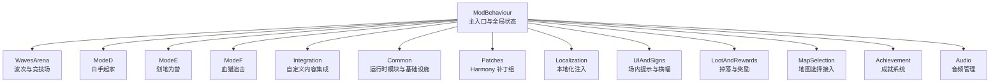
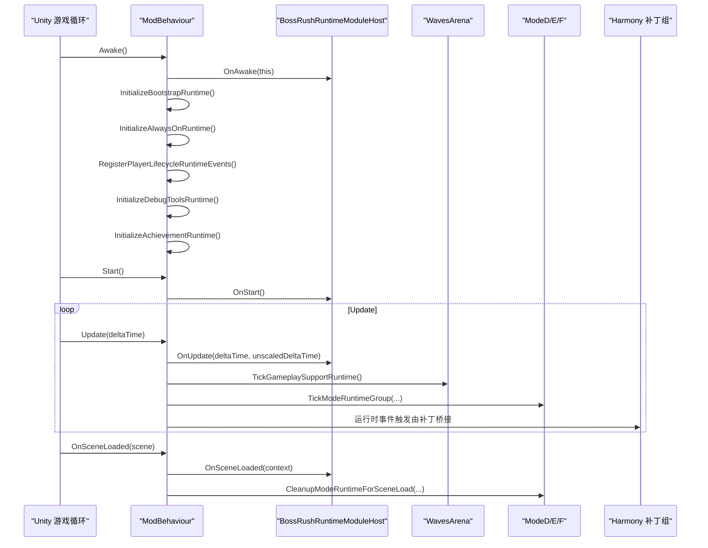
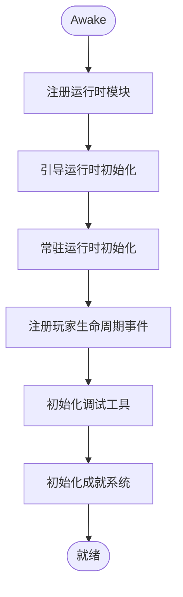
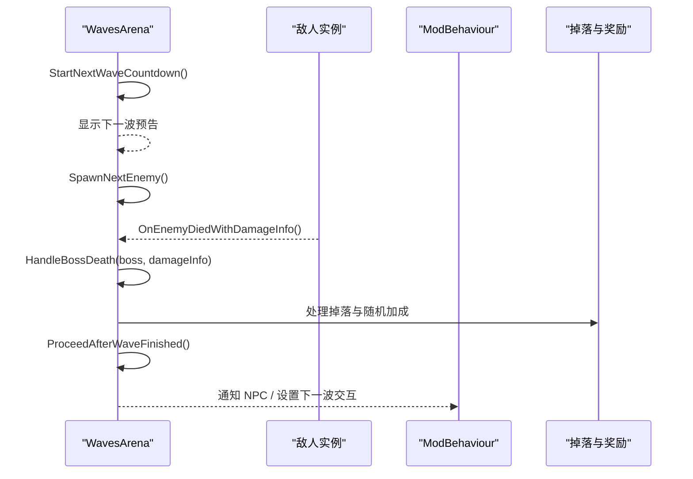
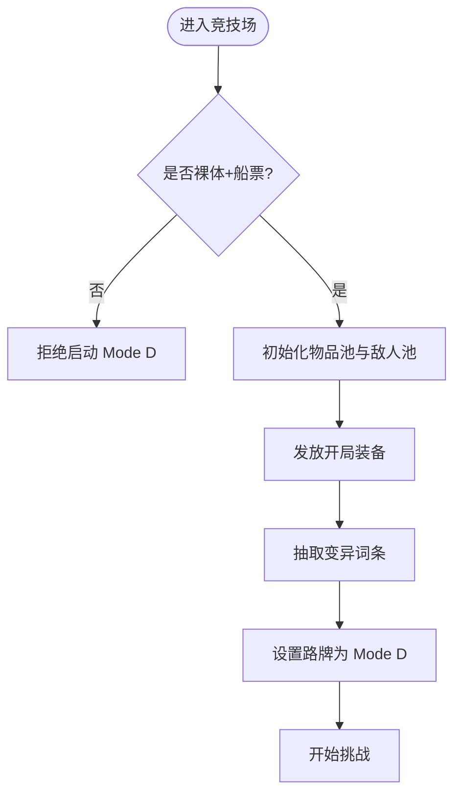
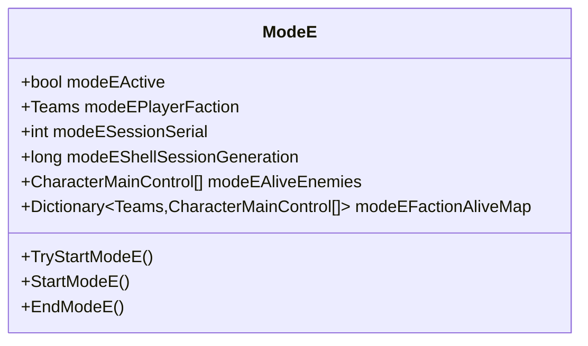
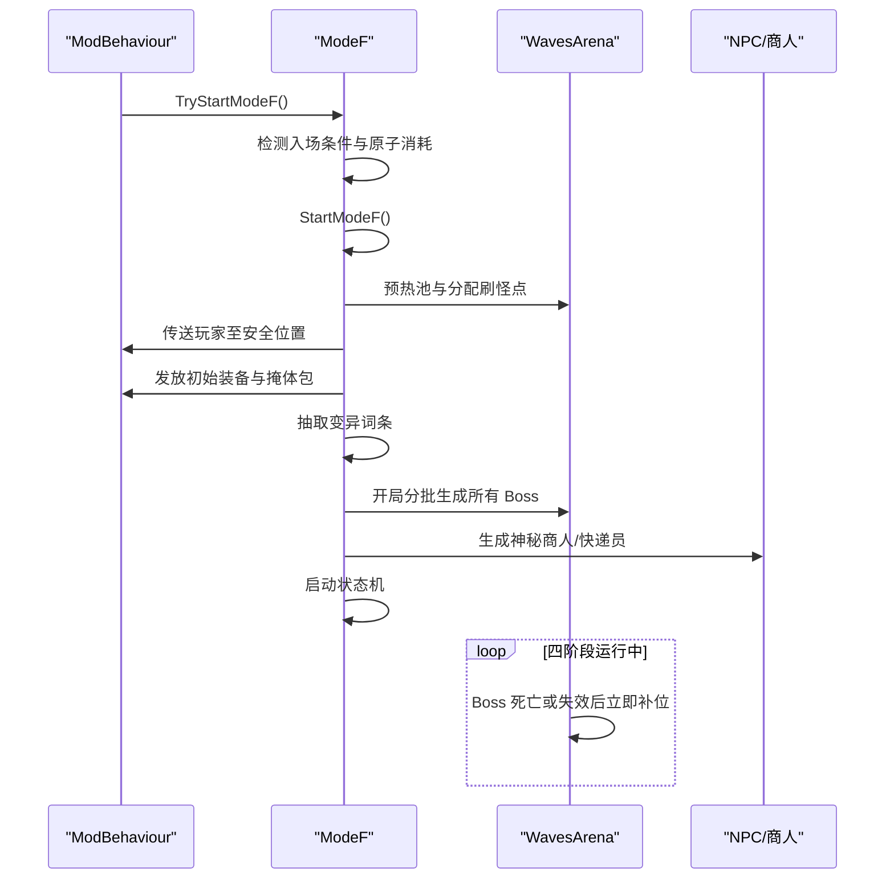
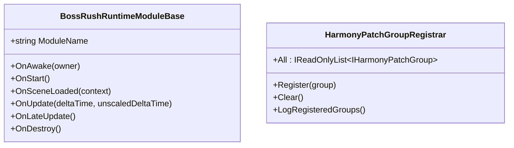
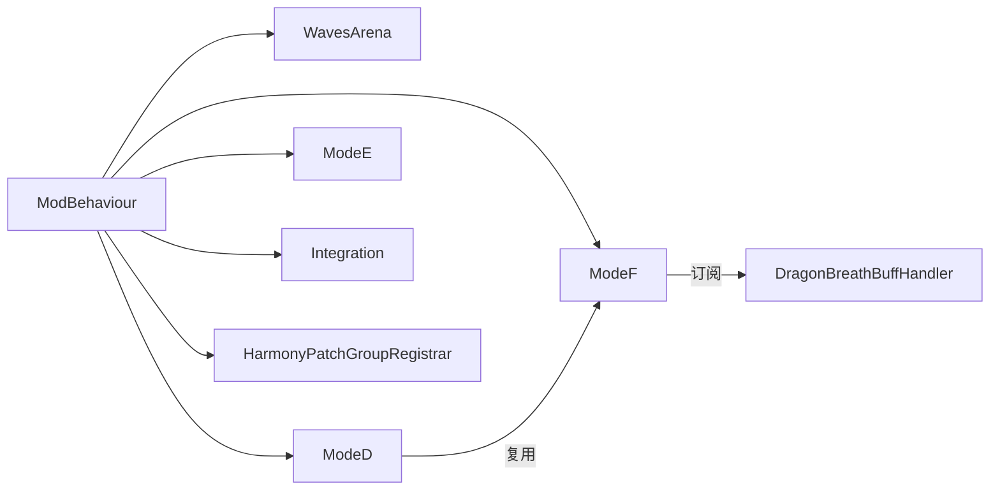

# 项目概览

<cite>
**本文引用的文件**
- [README.md](file://README.md)
- [ModBehaviour.cs](file://ModBehaviour.cs)
- [WavesArena/WavesArena.cs](file://WavesArena/WavesArena.cs)
- [ModeD/ModeD.cs](file://ModeD/ModeD.cs)
- [ModeE/ModeE.cs](file://ModeE/ModeE.cs)
- [ModeF/ModeFEntry.cs](file://ModeF/ModeFEntry.cs)
- [Common/Lifecycle/BossRushRuntimeModuleBase.cs](file://Common/Lifecycle/BossRushRuntimeModuleBase.cs)
- [Common/Infrastructure/HarmonyPatchGroupRegistrar.cs](file://Common/Infrastructure/HarmonyPatchGroupRegistrar.cs)
- [Injection/Injection.cs](file://Injection/Injection.cs)
</cite>

## 目录
1. [简介](#简介)
2. [项目结构](#项目结构)
3. [核心组件](#核心组件)
4. [架构总览](#架构总览)
5. [详细组件分析](#详细组件分析)
6. [依赖关系分析](#依赖关系分析)
7. [性能与稳定性要点](#性能与稳定性要点)
8. [故障排查指南](#故障排查指南)
9. [结论](#结论)
10. [附录：构建与验证](#附录构建与验证)

## 简介
BossRushMod 是《Escape from Duckov》的综合型大型 Mod，以 BossRush 竞技场玩法为核心，扩展出多模式玩法、自定义 Boss、装备能力系统、NPC 关系线、成就、重铸、许愿台、死亡亡魂、游戏内 Wiki、在线站点、本地化与音频等完整内容包。它作为 Unity 模组运行在游戏的 Mono 运行时中，使用 C# 7.3 编写，通过 HarmonyLib 对游戏原生逻辑进行补丁注入，实现波次管理、掉落奖励、地图接入、UI 与交互增强等功能。

本概览面向两类读者：
- 初学者：了解项目背景、目标、主要玩法与功能点。
- 有经验的开发者：理解整体架构、模块划分、运行时生命周期、关键数据流与扩展点。

**章节来源**
- [README.md:15-121](file://README.md#L15-L121)
- [README.md:150-168](file://README.md#L150-L168)

## 项目结构
仓库采用“按功能域分目录”的组织方式，根目录包含主入口与全局配置；各子目录对应不同系统或玩法模式：
- 根级：主入口与全局行为（如 ModBehaviour）、配置 API、注入占位文件
- 通用层：运行时模块基类、Harmony 分组注册、事件总线、对象缓存、反射缓存等基础设施
- 玩法模式：WavesArena（标准/BossRush/无间炼狱）、ModeD（白手起家）、ModeE（划地为营）、ModeF（血猎追击）
- 集成内容：自定义 Boss、装备能力、物品、NPC、商店、Wiki、成就、音频、地图选择、交互物、本地化等
- 工具与测试：调试工具、静态守卫脚本、导出脚本等

**图表来源**
- [ModBehaviour.cs:598-653](file://ModBehaviour.cs#L598-L653)
- [WavesArena/WavesArena.cs:1-14](file://WavesArena/WavesArena.cs#L1-L14)
- [ModeD/ModeD.cs:1-14](file://ModeD/ModeD.cs#L1-L14)
- [ModeE/ModeE.cs:1-16](file://ModeE/ModeE.cs#L1-L16)
- [ModeF/ModeFEntry.cs:1-10](file://ModeF/ModeFEntry.cs#L1-L10)

**章节来源**
- [README.md:194-224](file://README.md#L194-L224)

## 核心组件
- 主入口与全局状态：ModBehaviour 负责单例初始化、场景生命周期钩子、模式切换、波次控制、运行时模块宿主调度、成就与调试工具初始化等。
- 波次与竞技场：WavesArena 管理 BossRush 的波次倒计时、敌人生成、击杀处理、进度推进与结算。
- 模式子系统：ModeD/ModeE/ModeF 分别实现独立规则、入场条件、资源分配、阶段状态机与 UI。
- 运行时模块体系：基于 BossRushRuntimeModuleBase 的模块化生命周期，统一 OnAwake/OnStart/OnUpdate/OnLateUpdate/OnDestroy。
- Harmony 补丁组：通过 HarmonyPatchGroupRegistrar 集中管理与输出 Patch 分组信息，配合 AlwaysOnRuntimeHooks 完成全量注册。
- 集成内容：自定义 Boss、装备能力、物品、NPC、商店、Wiki、成就、音频、地图选择、交互物、本地化等。

**章节来源**
- [ModBehaviour.cs:598-653](file://ModBehaviour.cs#L598-L653)
- [WavesArena/WavesArena.cs:1-14](file://WavesArena/WavesArena.cs#L1-L14)
- [Common/Lifecycle/BossRushRuntimeModuleBase.cs:1-15](file://Common/Lifecycle/BossRushRuntimeModuleBase.cs#L1-L15)
- [Common/Infrastructure/HarmonyPatchGroupRegistrar.cs:1-64](file://Common/Infrastructure/HarmonyPatchGroupRegistrar.cs#L1-L64)

## 架构总览
BossRushMod 以 ModBehaviour 为中枢，协调各模式与子系统。运行时通过 Unity 生命周期（Awake/Start/Update/LateUpdate/OnSceneLoaded/OnDestroy）驱动，结合运行时模块宿主（BossRushRuntimeModuleHost）将各模块的生命周期方法分发到对应模块。Harmony 补丁用于拦截并增强游戏原生流程（如战斗、死亡、经济、UI），确保模式与内容无缝集成。

**图表来源**
- [ModBehaviour.cs:598-653](file://ModBehaviour.cs#L598-L653)
- [WavesArena/WavesArena.cs:108-184](file://WavesArena/WavesArena.cs#L108-L184)

## 详细组件分析

### 主入口与全局状态（ModBehaviour）
- 职责：单例管理、场景门控、运行时模块调度、模式激活/清理、波次配置、掉落黑名单、调试工具与成就初始化。
- 关键点：
  - Awake/Start/Update/LateUpdate 中调用宿主方法，保证模块按生命周期执行。
  - 提供 ConfigureBossRushMode 设置每波 Boss 数量与无间炼狱标记。
  - 维护当前场景默认传送位置与刷新点池，支持地图配置动态查询。
  - 清理与恢复：模式结束清理变异词条、现金磁铁状态、成就追踪等。

**图表来源**
- [ModBehaviour.cs:598-653](file://ModBehaviour.cs#L598-L653)

**章节来源**
- [ModBehaviour.cs:252-306](file://ModBehaviour.cs#L252-L306)
- [ModBehaviour.cs:329-372](file://ModBehaviour.cs#L329-L372)
- [ModBehaviour.cs:507-553](file://ModBehaviour.cs#L507-L553)
- [ModBehaviour.cs:598-653](file://ModBehaviour.cs#L598-L653)

### 波次与竞技场（WavesArena）
- 职责：波次倒计时、下一波预告、敌人生成与死亡处理、进度推进、结算与奖励。
- 关键点：
  - StartNextWaveCountdown 计算间隔与里程碑奖励，显示下一波 Boss 预告。
  - OnEnemyDiedWithDamageInfo 区分单 Boss 与多 Boss 模式，记录击败数并推进。
  - HandleBossDeath 处理掉落随机化、无间炼狱现金池累加、波次剩余计数。
  - ProceedAfterWaveFinished 通知 NPC、设置下一波交互或自动开始。

**图表来源**
- [WavesArena/WavesArena.cs:108-184](file://WavesArena/WavesArena.cs#L108-L184)
- [WavesArena/WavesArena.cs:209-346](file://WavesArena/WavesArena.cs#L209-L346)
- [WavesArena/WavesArena.cs:348-506](file://WavesArena/WavesArena.cs#L348-L506)

**章节来源**
- [WavesArena/WavesArena.cs:108-184](file://WavesArena/WavesArena.cs#L108-L184)
- [WavesArena/WavesArena.cs:209-346](file://WavesArena/WavesArena.cs#L209-L346)
- [WavesArena/WavesArena.cs:348-506](file://WavesArena/WavesArena.cs#L348-L506)

### 模式 D：白手起家（ModeD）
- 职责：检测裸体入场、初始化物品池与敌人池、发放开局装备、抽取变异词条、管理波次与结束。
- 关键点：
  - IsPlayerNaked 检查允许携带的道具（仅船票）。
  - StartModeD 清理残留状态、初始化池、预构建掉落池、发放 Starter Kit、设置路牌模式。
  - InitializeModeDItemPools 按 Tag 筛选武器、护甲、头盔、弹药、医疗品、近战、图腾、面具、背包等，并按品质建桶。
  - InitializeModeDEnemyPools 扫描 CharacterRandomPreset，过滤非敌对阵营与特殊类型，建立小怪池与复用 Boss 池。

**图表来源**
- [ModeD/ModeD.cs:128-195](file://ModeD/ModeD.cs#L128-L195)
- [ModeD/ModeD.cs:267-421](file://ModeD/ModeD.cs#L267-L421)
- [ModeD/ModeD.cs:577-800](file://ModeD/ModeD.cs#L577-L800)

**章节来源**
- [ModeD/ModeD.cs:128-195](file://ModeD/ModeD.cs#L128-L195)
- [ModeD/ModeD.cs:267-421](file://ModeD/ModeD.cs#L267-L421)
- [ModeD/ModeD.cs:577-800](file://ModeD/ModeD.cs#L577-L800)

### 模式 E：划地为营（ModeE）
- 职责：多阵营沙盒混战，入场检测（营旗+裸装）、阵营分配、一次性生成 Boss、按个人基线层数缩放、贝壳经济与交易门控。
- 关键点：
  - 可用阵营池与营旗映射，支持随机/指定/“爷的营旗”。
  - 会话令牌与生成器编号防止异步污染，交易门控保障购买/出售原子性。
  - 存活敌人集合与阵营映射优化缩放与清理路径。

**图表来源**
- [ModeE/ModeE.cs:65-323](file://ModeE/ModeE.cs#L65-L323)

**章节来源**
- [ModeE/ModeE.cs:65-323](file://ModeE/ModeE.cs#L65-L323)

### 模式 F：血猎追击（ModeF）
- 职责：四阶段大逃杀（准备→赏金→猎杀风暴→撤离），持续失血、击杀回血与成长，赏金标记追踪，工事系统。
- 关键点：
  - TryStartModeF 检测入场条件（裸装+船票+血猎收发器），原子消耗与失败返还。
  - StartModeF 清理残留状态、预热池、订阅龙息 Buff、分配刷怪点、传送安全位置、发放初始装备与额外掩体包、快照生命上限、清除原始撤离点、抽取变异词条、开局分批生成 Boss、生成商人/快递员、启动状态机；Boss 死亡或失效后从准备阶段起持续逐只补位。
  - 会话令牌与场景索引校验避免跨局污染。

**图表来源**
- [ModeF/ModeFEntry.cs:65-164](file://ModeF/ModeFEntry.cs#L65-L164)
- [ModeF/ModeFEntry.cs:262-396](file://ModeF/ModeFEntry.cs#L262-L396)

**章节来源**
- [ModeF/ModeFEntry.cs:65-164](file://ModeF/ModeFEntry.cs#L65-L164)
- [ModeF/ModeFEntry.cs:262-396](file://ModeF/ModeFEntry.cs#L262-L396)

### 运行时模块与基础设施
- 运行时模块基类：BossRishRuntimeModuleBase 定义统一生命周期接口，便于各子系统按阶段挂载。
- Harmony 补丁组：HarmonyPatchGroupRegistrar 维护分组列表与日志输出，配合 AlwaysOnRuntimeHooks 完成全量注册。
- 注入占位：Injection.cs 保留目录结构，实际注入逻辑已整合到 ModBehaviour。

**图表来源**
- [Common/Lifecycle/BossRushRuntimeModuleBase.cs:1-15](file://Common/Lifecycle/BossRushRuntimeModuleBase.cs#L1-L15)
- [Common/Infrastructure/HarmonyPatchGroupRegistrar.cs:1-64](file://Common/Infrastructure/HarmonyPatchGroupRegistrar.cs#L1-L64)
- [Injection/Injection.cs:1-23](file://Injection/Injection.cs#L1-L23)

**章节来源**
- [Common/Lifecycle/BossRushRuntimeModuleBase.cs:1-15](file://Common/Lifecycle/BossRushRuntimeModuleBase.cs#L1-L15)
- [Common/Infrastructure/HarmonyPatchGroupRegistrar.cs:1-64](file://Common/Infrastructure/HarmonyPatchGroupRegistrar.cs#L1-L64)
- [Injection/Injection.cs:1-23](file://Injection/Injection.cs#L1-L23)

## 依赖关系分析
- 主入口依赖：
  - 运行时模块宿主：BossRushRuntimeModuleHost（未在本节列出具体文件，但由 ModBehaviour 调度）
  - 波次系统：WavesArena
  - 模式子系统：ModeD/ModeE/ModeF
  - 集成内容：自定义 Boss、装备、物品、NPC、商店、Wiki、成就、音频、地图选择、交互物、本地化
  - 补丁组：HarmonyPatchGroupRegistrar 与 AlwaysOnRuntimeHooks
- 模式间耦合：
  - 共享池与工具：ModeD 的物品池与敌人池被 ModeF 复用。
  - 共享运行时：龙息 Buff 处理器在各模式中按需订阅。
  - 会话隔离：ModeE/ModeF 使用会话令牌与生成器编号避免异步污染。

**图表来源**
- [ModBehaviour.cs:598-653](file://ModBehaviour.cs#L598-L653)
- [ModeF/ModeFEntry.cs:298-306](file://ModeF/ModeFEntry.cs#L298-L306)

**章节来源**
- [ModBehaviour.cs:598-653](file://ModBehaviour.cs#L598-L653)
- [ModeF/ModeFEntry.cs:298-306](file://ModeF/ModeFEntry.cs#L298-L306)

## 性能与稳定性要点
- 波次完整性自检与缓存：避免每帧重复扫描角色与预设，降低 GC 压力。
- 竞技场范围限制：以路牌为中心设定半径，减少无关对象影响。
- 列表复用与临时缓冲：如 _singleBossRegenList、_reusableDestroyList，减少分配。
- 会话令牌与生成器编号：ModeE/ModeF 防止异步对象晚到导致的状态污染。
- 运行时门控：仅在相关模式激活时执行重工作，避免无效开销。

[本节为通用指导，不直接分析具体文件]

## 故障排查指南
- 常见问题定位：
  - 波次卡住：检查 StartNextWaveCountdown 与 ProceedAfterWaveFinished 的日志与状态。
  - 模式无法启动：核对入场条件（裸装、道具、营旗）与原子消耗/返还逻辑。
  - 掉落异常：确认掉落黑名单与随机加成开关。
  - 运行时错误：查看 AlwaysOnRuntimeHooks 与 Harmony 补丁组的注册与启用状态。
- 调试工具：
  - F3 打开统一调试作弊面板（传送、属性调参、物品、加钱、清冷却等）。
  - F11 打开 InventoryInspector 检查背包状态。
  - Ctrl+F10 打开 BossFilter 调整 Boss 池与权重。
  - L 打开成就面板。

**章节来源**
- [README.md:226-244](file://README.md#L226-L244)
- [Common/Infrastructure/HarmonyPatchGroupRegistrar.cs:47-58](file://Common/Infrastructure/HarmonyPatchGroupRegistrar.cs#L47-L58)

## 结论
BossRushMod 以 ModBehaviour 为核心，通过模块化运行时与 Harmony 补丁，将多模式玩法、自定义 Boss、装备能力、NPC 关系线等内容深度集成到《Escape from Duckov》中。其架构清晰、职责分离明确，具备良好的可扩展性与可维护性。对于新手，可从标准 BossRush 与 Mode D 入手体验；对于开发者，建议从 WavesArena 与 Mode 子系统入手理解波次与状态机，再逐步深入 Integration 与 Common 层的扩展点。

[本节为总结性内容，不直接分析具体文件]

## 附录：构建与验证
- 语言与运行时：C# 7.3，Unity（Mono）。
- 构建方式：compile_official.bat 调用 Roslyn csc.dll 编译，无 .csproj；输出 Build/BossRush.dll。
- 验证方式：
  - Windows 编译：静态类型/语法/引用检查。
  - 架构守卫脚本：tests/*.py 静态断言不变式。
  - 游戏内 smoke 测试：手工验证波次、武器/套装、售货机 UI、过图性能等。
- 注意事项：
  - 新增 .cs 文件需同步修改 compile_official.bat。
  - 构建脚本含硬编码路径，换机器或盘符需调整。
  - 主入口为 ModBehaviour，大量逻辑分散在 partial class 文件中。

**章节来源**
- [README.md:150-168](file://README.md#L150-L168)
- [README.md:170-192](file://README.md#L170-L192)
