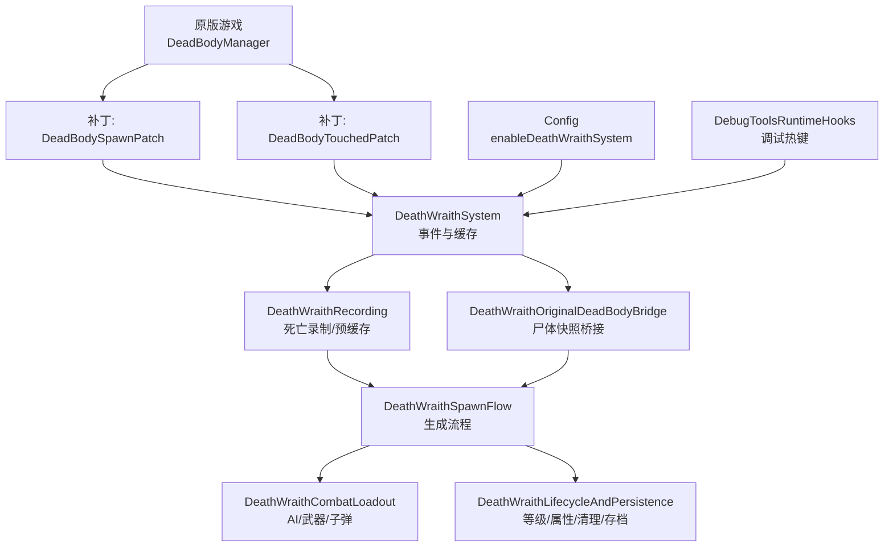
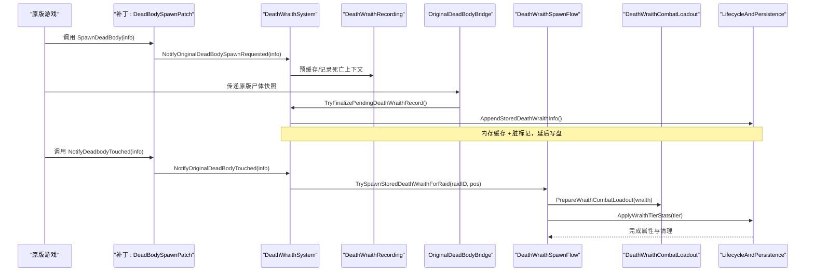
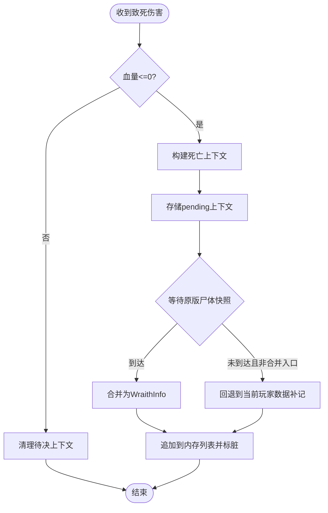
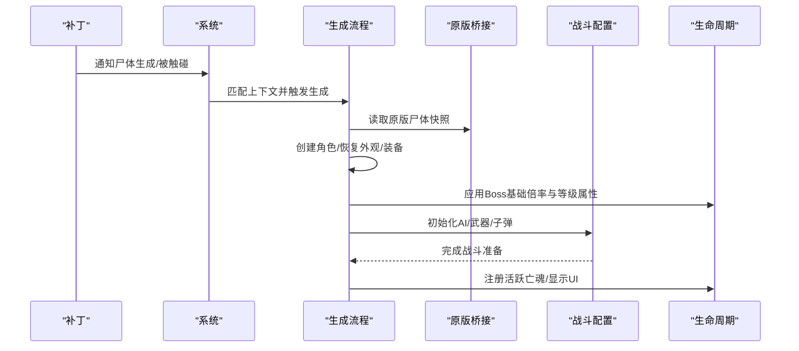
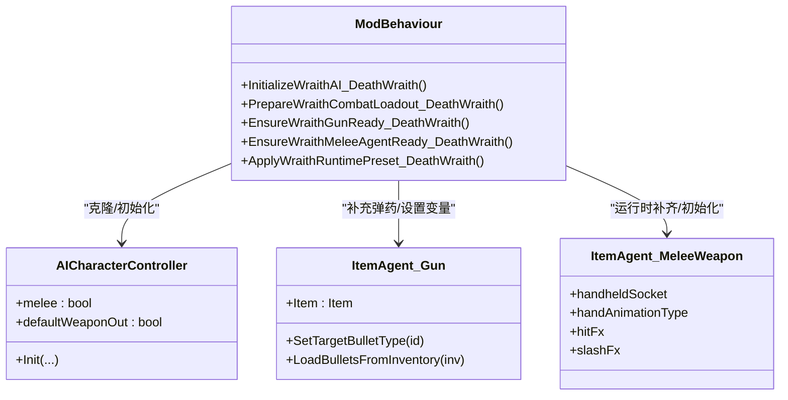
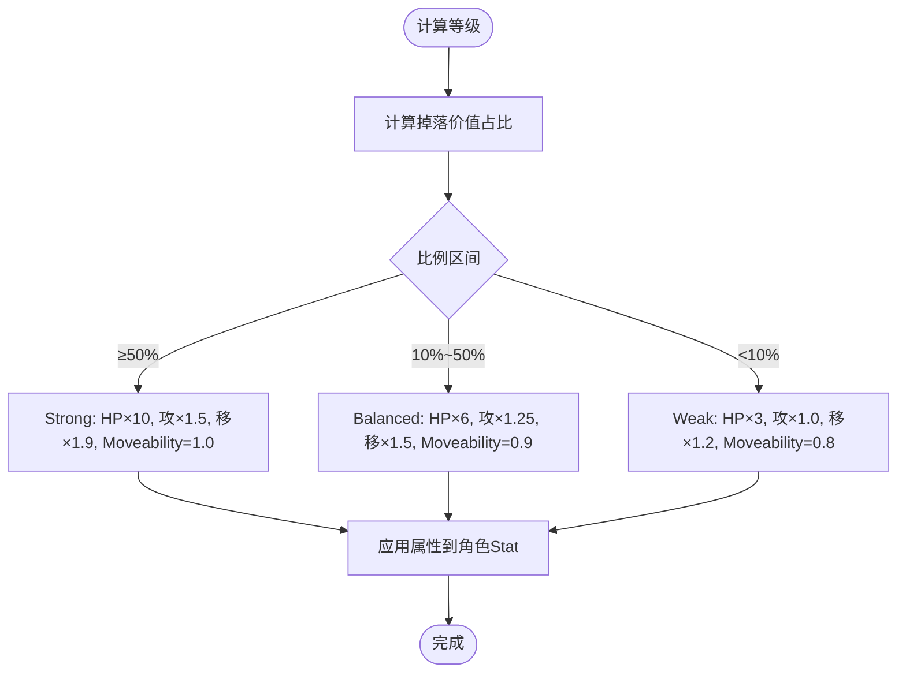
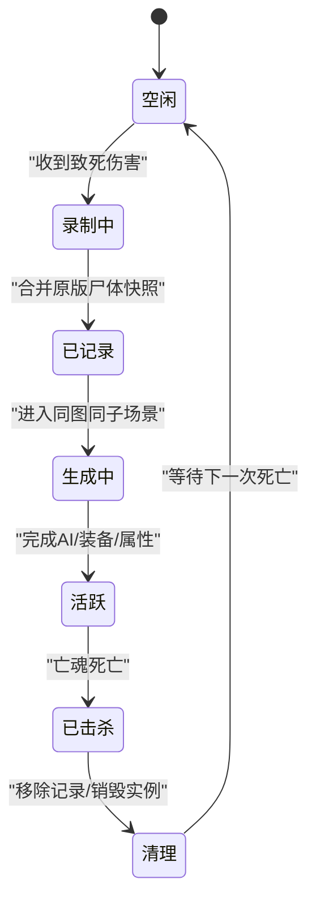
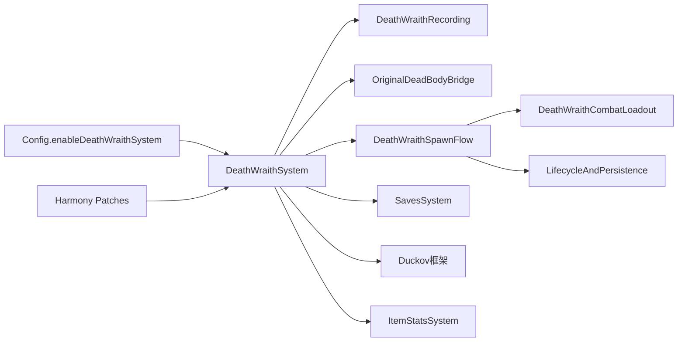

# 死亡亡魂系统

<cite>
**本文引用的文件**
- [DeathWraithSystem.cs](file://Integration/DeathWraith/DeathWraithSystem.cs)
- [DeathWraithRecording.cs](file://Integration/DeathWraith/DeathWraithRecording.cs)
- [DeathWraithSpawnFlow.cs](file://Integration/DeathWraith/DeathWraithSpawnFlow.cs)
- [DeathWraithCombatLoadout.cs](file://Integration/DeathWraith/DeathWraithCombatLoadout.cs)
- [DeathWraithLifecycleAndPersistence.cs](file://Integration/DeathWraith/DeathWraithLifecycleAndPersistence.cs)
- [DeathWraithOriginalDeadBodyBridge.cs](file://Integration/DeathWraith/DeathWraithOriginalDeadBodyBridge.cs)
- [DeadBodySpawnPatch.cs](file://Patches/Death/DeadBodySpawnPatch.cs)
- [DeadBodyTouchedPatch.cs](file://Patches/Death/DeadBodyTouchedPatch.cs)
- [Config.cs](file://Config/Config.cs)
- [DebugToolsRuntimeHooks.cs](file://DebugAndTools/DebugToolsRuntimeHooks.cs)
</cite>

## 目录
1. [简介](#简介)
2. [项目结构](#项目结构)
3. [核心组件](#核心组件)
4. [架构总览](#架构总览)
5. [详细组件分析](#详细组件分析)
6. [依赖关系分析](#依赖关系分析)
7. [性能考虑](#性能考虑)
8. [故障排查指南](#故障排查指南)
9. [结论](#结论)
10. [附录：自定义与调参示例](#附录自定义与调参示例)

## 简介
死亡亡魂系统会在玩家于正常游戏场景中死亡时，记录其位置、外观、装备、语音与脚步声材质等关键信息；当玩家再次进入同一地图与子场景时，在死亡位置生成一个复制了玩家外观和装备的 Boss 级敌怪“亡魂”。亡魂强度根据死亡时携带物品价值占玩家总财富的比例分为三档：强壮、均衡、弱小。亡魂击杀后不会掉落任何物品，且会清除对应记录，避免重复刷新。

该系统的目标是提供“死亡重战”体验，同时通过严格的场景匹配、状态持久化与内存缓存策略，确保性能稳定与数据一致。

## 项目结构
死亡亡魂系统由多个 partial class 组成，职责清晰拆分：
- 系统与常量、事件绑定、内存缓存：DeathWraithSystem.cs
- 死亡录制与预缓存：DeathWraithRecording.cs
- 原版尸体桥接与合并：DeathWraithOriginalDeadBodyBridge.cs
- 生成流程与复活点匹配：DeathWraithSpawnFlow.cs
- 战斗配置与 AI 初始化：DeathWraithCombatLoadout.cs
- 生命周期管理、等级分类与属性应用、清理与持久化：DeathWraithLifecycleAndPersistence.cs
- 与原版 DeadBodyManager 的 Patch 钩子：DeadBodySpawnPatch.cs、DeadBodyTouchedPatch.cs
- 配置开关：Config.cs
- 调试工具入口：DebugToolsRuntimeHooks.cs

图表来源
- [DeadBodySpawnPatch.cs:12-25](file://Patches/Death/DeadBodySpawnPatch.cs#L12-L25)
- [DeadBodyTouchedPatch.cs:12-25](file://Patches/Death/DeadBodyTouchedPatch.cs#L12-L25)
- [DeathWraithSystem.cs:125-240](file://Integration/DeathWraith/DeathWraithSystem.cs#L125-L240)
- [DeathWraithRecording.cs:66-112](file://Integration/DeathWraith/DeathWraithRecording.cs#L66-L112)
- [DeathWraithOriginalDeadBodyBridge.cs:10-45](file://Integration/DeathWraith/DeathWraithOriginalDeadBodyBridge.cs#L10-L45)
- [DeathWraithSpawnFlow.cs:27-78](file://Integration/DeathWraith/DeathWraithSpawnFlow.cs#L27-L78)
- [DeathWraithCombatLoadout.cs:27-109](file://Integration/DeathWraith/DeathWraithCombatLoadout.cs#L27-L109)
- [DeathWraithLifecycleAndPersistence.cs:68-87](file://Integration/DeathWraith/DeathWraithLifecycleAndPersistence.cs#L68-L87)
- [Config.cs:70-75](file://Config/Config.cs#L70-L75)
- [DebugToolsRuntimeHooks.cs:10-31](file://DebugAndTools/DebugToolsRuntimeHooks.cs#L10-L31)

章节来源
- [DeathWraithSystem.cs:125-240](file://Integration/DeathWraith/DeathWraithSystem.cs#L125-L240)
- [Config.cs:70-75](file://Config/Config.cs#L70-L75)

## 核心组件
- 亡魂数据模型与系统常量：定义 WraithInfo、WraithBoundMeleeSnapshot、WraithTier 等，以及保存键、AI 预设名、去抖延迟等。
- 事件绑定与内存缓存：订阅 Health.OnHurt/OnDead、SavesSystem.OnCollectSaveData；维护内存中的亡魂列表缓存与脏标记，延后到官方存档点序列化。
- 死亡录制：在致死前预缓存上下文，避免主角死亡流程清空背包导致数据丢失；合并原版尸体快照以获取完整装备树。
- 生成流程：匹配原版尸体生成与拾取事件，定位死亡位置并异步创建角色、恢复外观与装备、应用等级属性、初始化 AI 与战斗配置。
- 战斗配置：选择主武器（枪械优先），克隆或注入 AI 控制器，补充弹药，同步近战/枪战模式。
- 生命周期与持久化：场景切换清理、击杀处理、等级分类与属性应用、预设缓存、销毁运行时副本、ES3 延迟写入与去抖兜底。
- 原版桥接：捕获原版 DeadBodyManager 的死亡信息，合并为最终 WraithInfo。
- 配置开关：enableDeathWraithSystem 控制系统启停与状态清理。
- 调试工具：提供通用调试热键与日志输出，辅助定位问题。

章节来源
- [DeathWraithSystem.cs:34-185](file://Integration/DeathWraith/DeathWraithSystem.cs#L34-L185)
- [DeathWraithRecording.cs:66-112](file://Integration/DeathWraith/DeathWraithRecording.cs#L66-L112)
- [DeathWraithSpawnFlow.cs:133-247](file://Integration/DeathWraith/DeathWraithSpawnFlow.cs#L133-L247)
- [DeathWraithCombatLoadout.cs:184-233](file://Integration/DeathWraith/DeathWraithCombatLoadout.cs#L184-L233)
- [DeathWraithLifecycleAndPersistence.cs:91-294](file://Integration/DeathWraith/DeathWraithLifecycleAndPersistence.cs#L91-L294)
- [DeathWraithOriginalDeadBodyBridge.cs:99-165](file://Integration/DeathWraith/DeathWraithOriginalDeadBodyBridge.cs#L99-L165)
- [Config.cs:70-75](file://Config/Config.cs#L70-L75)
- [DebugToolsRuntimeHooks.cs:10-31](file://DebugAndTools/DebugToolsRuntimeHooks.cs#L10-L31)

## 架构总览
死亡亡魂系统采用“事件驱动 + 异步生成 + 延迟持久化”的架构：
- 事件层：通过 Harmony 补丁监听原版尸体生成与触碰事件，通知系统。
- 录制层：在致死前预缓存上下文，并在原版尸体快照到达时合并为最终记录。
- 生成层：按地图与子场景匹配死亡位置，异步创建角色、恢复外观与装备、应用等级属性、初始化 AI 与战斗配置。
- 持久化层：使用内存权威副本 + 脏标记，在官方存档点或超时兜底时写入 ES3，避免死亡帧卡顿。
- 清理层：场景切换、击杀、配置关闭时清理内存与实例，防止资源泄漏。

图表来源
- [DeadBodySpawnPatch.cs:12-25](file://Patches/Death/DeadBodySpawnPatch.cs#L12-L25)
- [DeadBodyTouchedPatch.cs:12-25](file://Patches/Death/DeadBodyTouchedPatch.cs#L12-L25)
- [DeathWraithRecording.cs:66-112](file://Integration/DeathWraith/DeathWraithRecording.cs#L66-L112)
- [DeathWraithOriginalDeadBodyBridge.cs:99-165](file://Integration/DeathWraith/DeathWraithOriginalDeadBodyBridge.cs#L99-L165)
- [DeathWraithSpawnFlow.cs:133-247](file://Integration/DeathWraith/DeathWraithSpawnFlow.cs#L133-L247)
- [DeathWraithCombatLoadout.cs:184-233](file://Integration/DeathWraith/DeathWraithCombatLoadout.cs#L184-L233)
- [DeathWraithLifecycleAndPersistence.cs:91-294](file://Integration/DeathWraith/DeathWraithLifecycleAndPersistence.cs#L91-L294)

## 详细组件分析

### 死亡录制与预缓存
- 在致死伤害前触发 Health.OnHurt，若当前血量已非正数则跳过；否则构建 PendingDeathWraithContext 并存储，设置帧计数与时间戳用于新鲜度校验。
- 在 Health.OnDead 中记录死亡上下文，若未命中原版尸体快照路径，则回退到当前玩家数据补记，确保不丢记录。
- 原版尸体快照通过 DeadBodyManager 的 DeathInfo 传入，包含 itemTreeData、worldPosition、subSceneID、raidID；系统将其与 pending context 合并为最终 WraithInfo。
- 支持绑定近战武器快照持久化，跨局加载时回填，保证近战能力可用。

图表来源
- [DeathWraithRecording.cs:66-112](file://Integration/DeathWraith/DeathWraithRecording.cs#L66-L112)
- [DeathWraithRecording.cs:164-203](file://Integration/DeathWraith/DeathWraithRecording.cs#L164-L203)
- [DeathWraithOriginalDeadBodyBridge.cs:99-165](file://Integration/DeathWraith/DeathWraithOriginalDeadBodyBridge.cs#L99-L165)

章节来源
- [DeathWraithRecording.cs:66-112](file://Integration/DeathWraith/DeathWraithRecording.cs#L66-L112)
- [DeathWraithRecording.cs:164-203](file://Integration/DeathWraith/DeathWraithRecording.cs#L164-L203)
- [DeathWraithOriginalDeadBodyBridge.cs:99-165](file://Integration/DeathWraith/DeathWraithOriginalDeadBodyBridge.cs#L99-L165)

### 生成流程与原版桥接
- 通过 DeadBodySpawnPatch 与 DeadBodyTouchedPatch 将原版尸体事件转发给系统。
- 系统维护 pendingDeadBodySpawnContexts，在原版遗失物箱生成时尝试匹配 subSceneID 与 worldPosition，消费上下文并触发生成。
- 生成流程包括：创建宿主角色、恢复脸模与绑定近战、应用基础伤害倍率、恢复最大生命值快照、应用 Boss 级属性倍率、设置队伍与禁用掉落、初始化 AI、应用等级属性、显示血条与名称、注册活跃亡魂。
- 原版桥接确保 itemTreeData 来自原版尸体快照，提高装备还原准确性。

图表来源
- [DeadBodySpawnPatch.cs:12-25](file://Patches/Death/DeadBodySpawnPatch.cs#L12-L25)
- [DeadBodyTouchedPatch.cs:12-25](file://Patches/Death/DeadBodyTouchedPatch.cs#L12-L25)
- [DeathWraithSpawnFlow.cs:27-78](file://Integration/DeathWraith/DeathWraithSpawnFlow.cs#L27-L78)
- [DeathWraithSpawnFlow.cs:133-247](file://Integration/DeathWraith/DeathWraithSpawnFlow.cs#L133-L247)
- [DeathWraithOriginalDeadBodyBridge.cs:99-165](file://Integration/DeathWraith/DeathWraithOriginalDeadBodyBridge.cs#L99-L165)
- [DeathWraithCombatLoadout.cs:184-233](file://Integration/DeathWraith/DeathWraithCombatLoadout.cs#L184-L233)
- [DeathWraithLifecycleAndPersistence.cs:91-294](file://Integration/DeathWraith/DeathWraithLifecycleAndPersistence.cs#L91-L294)

章节来源
- [DeathWraithSpawnFlow.cs:27-78](file://Integration/DeathWraith/DeathWraithSpawnFlow.cs#L27-L78)
- [DeathWraithSpawnFlow.cs:133-247](file://Integration/DeathWraith/DeathWraithSpawnFlow.cs#L133-L247)
- [DeathWraithOriginalDeadBodyBridge.cs:99-165](file://Integration/DeathWraith/DeathWraithOriginalDeadBodyBridge.cs#L99-L165)

### 战斗负载配置与 Boss 级能力复制
- AI 控制器选择：根据首选武器类型（枪械/近战）决定使用固定 AI 宿主预设（枪械模板或狼式近战模板）。
- 武器选择优先级：主手枪械 > 副手枪械 > 近战 > 主手/副手其他物品。
- 枪械准备：解析目标子弹类型，补充库存子弹至合理数量，设置弹匣变量并加载子弹。
- 近战准备：若缺少近战代理，则在运行时添加 ItemAgent_MeleeWeapon，拷贝默认参数并初始化，绑定持有者与 Socket。
- 战斗模式同步：根据武器类型切换 AI 的 melee 标志与默认出武器行为。
- Boss 级能力复制：通过 CharacterRandomPreset 克隆并设置 aiCombatFactor、showName、showHealthBar、dropBoxOnDead、team、hasSoul 等，使亡魂具备 Boss 级表现与行为。

图表来源
- [DeathWraithCombatLoadout.cs:27-109](file://Integration/DeathWraith/DeathWraithCombatLoadout.cs#L27-L109)
- [DeathWraithCombatLoadout.cs:184-233](file://Integration/DeathWraith/DeathWraithCombatLoadout.cs#L184-L233)
- [DeathWraithCombatLoadout.cs:602-660](file://Integration/DeathWraith/DeathWraithCombatLoadout.cs#L602-L660)
- [DeathWraithCombatLoadout.cs:764-800](file://Integration/DeathWraith/DeathWraithCombatLoadout.cs#L764-L800)

章节来源
- [DeathWraithCombatLoadout.cs:27-109](file://Integration/DeathWraith/DeathWraithCombatLoadout.cs#L27-L109)
- [DeathWraithCombatLoadout.cs:184-233](file://Integration/DeathWraith/DeathWraithCombatLoadout.cs#L184-L233)
- [DeathWraithCombatLoadout.cs:602-660](file://Integration/DeathWraith/DeathWraithCombatLoadout.cs#L602-L660)
- [DeathWraithCombatLoadout.cs:764-800](file://Integration/DeathWraith/DeathWraithCombatLoadout.cs#L764-L800)

### 等级分类算法与属性应用
- 等级分类：基于 droppedItemsValue / playerTotalWealth 比例，≥50% 为 Strong，10%~50% 为 Balanced，<10% 为 Weak。
- 属性应用：
  - 生命：Strong≈10x，Balanced≈6x，Weak≈3x。
  - 移速：WalkSpeed/RunSpeed/MoveSpeed 分别乘以 1.2~1.9。
  - 攻击：GunDamageMultiplier/MeleeDamageMultiplier 分别乘以 1.0~1.5。
  - 移动性：Moveability 设置为 0.8~1.0。
- 最大生命值回填：根据死亡时记录的 MaxHealth 对当前角色的 MaxHealth Stat 进行缩放回填，确保数值一致性。

图表来源
- [DeathWraithLifecycleAndPersistence.cs:91-103](file://Integration/DeathWraith/DeathWraithLifecycleAndPersistence.cs#L91-L103)
- [DeathWraithLifecycleAndPersistence.cs:175-294](file://Integration/DeathWraith/DeathWraithLifecycleAndPersistence.cs#L175-L294)
- [DeathWraithLifecycleAndPersistence.cs:296-346](file://Integration/DeathWraith/DeathWraithLifecycleAndPersistence.cs#L296-L346)

章节来源
- [DeathWraithLifecycleAndPersistence.cs:91-103](file://Integration/DeathWraith/DeathWraithLifecycleAndPersistence.cs#L91-L103)
- [DeathWraithLifecycleAndPersistence.cs:175-294](file://Integration/DeathWraith/DeathWraithLifecycleAndPersistence.cs#L175-L294)
- [DeathWraithLifecycleAndPersistence.cs:296-346](file://Integration/DeathWraith/DeathWraithLifecycleAndPersistence.cs#L296-L346)

### 状态保存恢复与生命周期管理
- 内存缓存：首次访问从 ES3 反序列化亡魂列表，后续直接读内存副本；修改仅标脏，避免死亡帧同步序列化。
- 延迟写入：在 SavesSystem.OnCollectSaveData 时刷写列表；若长时间未触发官方存档点，则超时兜底写盘。
- 场景清理：切换场景时清空 pending 上下文、活跃亡魂映射，并销毁所有活跃亡魂实例。
- 击杀处理：亡魂死亡时移除活跃映射，销毁运行时预设副本，释放资源。
- 预设缓存：扫描全局 CharacterRandomPreset，建立 nameKey 与 runtimeName 索引，加速 AI 宿主查找。
- 名称本地化：为每个亡魂注入唯一 nameKey，便于 UI 显示与识别。

图表来源
- [DeathWraithSystem.cs:166-185](file://Integration/DeathWraith/DeathWraithSystem.cs#L166-L185)
- [DeathWraithLifecycleAndPersistence.cs:68-87](file://Integration/DeathWraith/DeathWraithLifecycleAndPersistence.cs#L68-L87)
- [DeathWraithLifecycleAndPersistence.cs:407-490](file://Integration/DeathWraith/DeathWraithLifecycleAndPersistence.cs#L407-L490)
- [DeathWraithLifecycleAndPersistence.cs:504-580](file://Integration/DeathWraith/DeathWraithLifecycleAndPersistence.cs#L504-L580)
- [DeathWraithLifecycleAndPersistence.cs:678-797](file://Integration/DeathWraith/DeathWraithLifecycleAndPersistence.cs#L678-L797)

章节来源
- [DeathWraithSystem.cs:166-185](file://Integration/DeathWraith/DeathWraithSystem.cs#L166-L185)
- [DeathWraithLifecycleAndPersistence.cs:68-87](file://Integration/DeathWraith/DeathWraithLifecycleAndPersistence.cs#L68-L87)
- [DeathWraithLifecycleAndPersistence.cs:407-490](file://Integration/DeathWraith/DeathWraithLifecycleAndPersistence.cs#L407-L490)
- [DeathWraithLifecycleAndPersistence.cs:504-580](file://Integration/DeathWraith/DeathWraithLifecycleAndPersistence.cs#L504-L580)
- [DeathWraithLifecycleAndPersistence.cs:678-797](file://Integration/DeathWraith/DeathWraithLifecycleAndPersistence.cs#L678-L797)

### 掉落物继承机制
- 亡魂不掉落任何物品：wraith.dropBoxOnDead = false。
- 装备继承：通过 ItemTreeData.InstantiateAsync 重建角色物品容器，并递归恢复运行时状态；绑定近战武器单独快照与回填。
- 子弹继承：枪械目标子弹类型解析后补充库存，确保亡魂具备持续作战能力。
- 原掉落箱：仅在原版遗失物箱生成时作为触发条件，亡魂自身不产生掉落箱。

章节来源
- [DeathWraithSpawnFlow.cs:133-247](file://Integration/DeathWraith/DeathWraithSpawnFlow.cs#L133-L247)
- [DeathWraithCombatLoadout.cs:602-660](file://Integration/DeathWraith/DeathWraithCombatLoadout.cs#L602-L660)
- [DeathWraithRecording.cs:500-591](file://Integration/DeathWraith/DeathWraithRecording.cs#L500-L591)

### 与原版游戏系统的桥接实现
- 通过 Harmony 补丁拦截 DeadBodyManager.SpawnDeadBody 与 NotifyDeadbodyTouched，将原版尸体事件转发给系统。
- 合并原版尸体快照（itemTreeData、worldPosition、subSceneID、raidID）与死亡上下文，确保装备与位置准确。
- 利用 LevelManager.CharacterCreator 创建角色，沿用原版主角创建链路，保证模型与槽位兼容。
- 使用 MultiSceneCore.ActiveSubSceneID 与 RaidUtilities.CurrentRaid.ID 进行场景与局次匹配。

章节来源
- [DeadBodySpawnPatch.cs:12-25](file://Patches/Death/DeadBodySpawnPatch.cs#L12-L25)
- [DeadBodyTouchedPatch.cs:12-25](file://Patches/Death/DeadBodyTouchedPatch.cs#L12-L25)
- [DeathWraithOriginalDeadBodyBridge.cs:99-165](file://Integration/DeathWraith/DeathWraithOriginalDeadBodyBridge.cs#L99-L165)
- [DeathWraithSpawnFlow.cs:253-332](file://Integration/DeathWraith/DeathWraithSpawnFlow.cs#L253-L332)
- [DeathWraithLifecycleAndPersistence.cs:370-405](file://Integration/DeathWraith/DeathWraithLifecycleAndPersistence.cs#L370-L405)

### 场景清理与内存管理
- 场景切换：清空 pending 上下文、活跃映射，销毁所有活跃亡魂实例，重置预设缓存。
- 配置关闭：清理当前与已存亡魂状态，无效化存储记录。
- 内存缓存：亡魂列表仅首次从 ES3 加载，后续读写内存；标脏后延迟写盘，避免死亡帧卡顿。
- 预设副本销毁：运行时创建的 CharacterRandomPreset 副本在亡魂死亡或生成失败时销毁，防止内存泄漏。

章节来源
- [DeathWraithLifecycleAndPersistence.cs:68-87](file://Integration/DeathWraith/DeathWraithLifecycleAndPersistence.cs#L68-L87)
- [DeathWraithSystem.cs:187-240](file://Integration/DeathWraith/DeathWraithSystem.cs#L187-L240)
- [DeathWraithLifecycleAndPersistence.cs:407-490](file://Integration/DeathWraith/DeathWraithLifecycleAndPersistence.cs#L407-L490)
- [DeathWraithLifecycleAndPersistence.cs:778-797](file://Integration/DeathWraith/DeathWraithLifecycleAndPersistence.cs#L778-L797)

## 依赖关系分析
- 外部依赖：
  - Duckov 框架：LevelManager、CharacterMainControl、MultiSceneCore、RaidUtilities、EconomyManager。
  - ItemStatsSystem：Item、ItemTreeData、Slot、Stat、Inventory。
  - SavesSystem：ES3 持久化。
  - HarmonyLib：补丁注入。
- 内部依赖：
  - 配置模块：enableDeathWraithSystem 控制开关。
  - 调试模块：通用调试热键与日志输出。
  - 原版桥接：DeadBodyManager 事件。

图表来源
- [Config.cs:70-75](file://Config/Config.cs#L70-L75)
- [DeadBodySpawnPatch.cs:12-25](file://Patches/Death/DeadBodySpawnPatch.cs#L12-L25)
- [DeadBodyTouchedPatch.cs:12-25](file://Patches/Death/DeadBodyTouchedPatch.cs#L12-L25)
- [DeathWraithSystem.cs:125-240](file://Integration/DeathWraith/DeathWraithSystem.cs#L125-L240)
- [DeathWraithRecording.cs:66-112](file://Integration/DeathWraith/DeathWraithRecording.cs#L66-L112)
- [DeathWraithOriginalDeadBodyBridge.cs:99-165](file://Integration/DeathWraith/DeathWraithOriginalDeadBodyBridge.cs#L99-L165)
- [DeathWraithSpawnFlow.cs:133-247](file://Integration/DeathWraith/DeathWraithSpawnFlow.cs#L133-L247)
- [DeathWraithCombatLoadout.cs:184-233](file://Integration/DeathWraith/DeathWraithCombatLoadout.cs#L184-L233)
- [DeathWraithLifecycleAndPersistence.cs:407-490](file://Integration/DeathWraith/DeathWraithLifecycleAndPersistence.cs#L407-L490)

章节来源
- [Config.cs:70-75](file://Config/Config.cs#L70-L75)
- [DeathWraithSystem.cs:125-240](file://Integration/DeathWraith/DeathWraithSystem.cs#L125-L240)

## 性能考虑
- 延迟持久化：亡魂列表内存权威副本 + 脏标记，在官方存档点或超时兜底时写盘，避免死亡帧同步序列化整表。
- 去抖策略：DEATH_WRAITH_SAVE_DELAY 设为较长延迟，防止在抬回去动画期间刷盘造成卡顿。
- 预设缓存：一次性扫描并索引 CharacterRandomPreset，减少运行时查找开销。
- 异步生成：使用 UniTask.Yield 与异步方法，避免阻塞主线程。
- 资源清理：运行时创建的预设副本与活跃映射在合适时机销毁，防止内存泄漏。
- 统计日志：关键路径输出 DevLog，便于定位性能瓶颈与异常。

[本节为通用性能指导，无需特定文件引用]

## 故障排查指南
- 常见问题：
  - 亡魂未生成：检查 enableDeathWraithSystem 是否开启；确认原版尸体事件是否被 Patch 捕获；验证 subSceneID 与 worldPosition 匹配。
  - 亡魂无武器：检查首选武器是否为枪械；确认子弹原型解析与库存补充逻辑；查看 AI 控制器是否成功克隆与初始化。
  - 亡魂属性异常：检查等级分类比例与 Stat 修改路径；确认最大生命值回填逻辑。
  - 存档丢失：检查 OnCollectSaveData 是否触发；确认脏标记与超时兜底是否生效。
- 调试工具：
  - 使用 DebugToolsRuntimeHooks 提供的热键输出场景对象、交互点、FPS 等信息，辅助定位问题。
  - 关注 DevLog 中的 [DeathWraith] 标签日志，追踪录制、合并、生成、属性应用与清理流程。

章节来源
- [DebugToolsRuntimeHooks.cs:10-31](file://DebugAndTools/DebugToolsRuntimeHooks.cs#L10-L31)
- [DeathWraithSystem.cs:202-229](file://Integration/DeathWraith/DeathWraithSystem.cs#L202-L229)
- [DeathWraithRecording.cs:66-112](file://Integration/DeathWraith/DeathWraithRecording.cs#L66-L112)
- [DeathWraithSpawnFlow.cs:133-247](file://Integration/DeathWraith/DeathWraithSpawnFlow.cs#L133-L247)
- [DeathWraithCombatLoadout.cs:184-233](file://Integration/DeathWraith/DeathWraithCombatLoadout.cs#L184-L233)
- [DeathWraithLifecycleAndPersistence.cs:407-490](file://Integration/DeathWraith/DeathWraithLifecycleAndPersistence.cs#L407-L490)

## 结论
死亡亡魂系统通过事件驱动、异步生成与延迟持久化的设计，实现了稳定的“死亡重战”体验。系统在原版游戏桥接、场景匹配、状态保存恢复、生命周期管理与内存优化方面均有完善实现。通过等级分类算法与 Boss 级能力复制，亡魂具备与玩家死亡时装备相匹配的战斗风格与强度。配置开关与调试工具提供了灵活的调节与排障手段。

[本节为总结，无需特定文件引用]

## 附录：自定义与调参示例
- 调整亡魂强度曲线：
  - 修改等级分类阈值与属性倍率，参考 ApplyWraithTierStats 中的 hpMult、speedMult、dmgMult 与 Moveability 设置。
  - 示例路径：[DeathWraithLifecycleAndPersistence.cs:175-294](file://Integration/DeathWraith/DeathWraithLifecycleAndPersistence.cs#L175-L294)
- 自定义亡魂行为：
  - 替换 AI 宿主预设名称，参考 ResolveWraithHostPresetNameForWeapon 与 GetWraithHostAIPrefab。
  - 示例路径：[DeathWraithCombatLoadout.cs:111-165](file://Integration/DeathWraith/DeathWraithCombatLoadout.cs#L111-L165)
- 调整掉落继承：
  - 修改 EnsureWraithGunReady 中的子弹补充逻辑，或 EnsureWraithMeleeAgentReady 中的近战代理初始化。
  - 示例路径：[DeathWraithCombatLoadout.cs:602-660](file://Integration/DeathWraith/DeathWraithCombatLoadout.cs#L602-L660)
  - 示例路径：[DeathWraithCombatLoadout.cs:235-361](file://Integration/DeathWraith/DeathWraithCombatLoadout.cs#L235-L361)
- 启用/禁用系统：
  - 修改 Config.cs 中的 enableDeathWraithSystem，系统将自动清理状态与记录。
  - 示例路径：[Config.cs:70-75](file://Config/Config.cs#L70-L75)
- 调试与日志：
  - 使用 DebugToolsRuntimeHooks 的热键输出场景信息与 FPS，结合 DevLog 定位问题。
  - 示例路径：[DebugToolsRuntimeHooks.cs:10-31](file://DebugAndTools/DebugToolsRuntimeHooks.cs#L10-L31)

[本节为操作指引，无需额外图表来源]