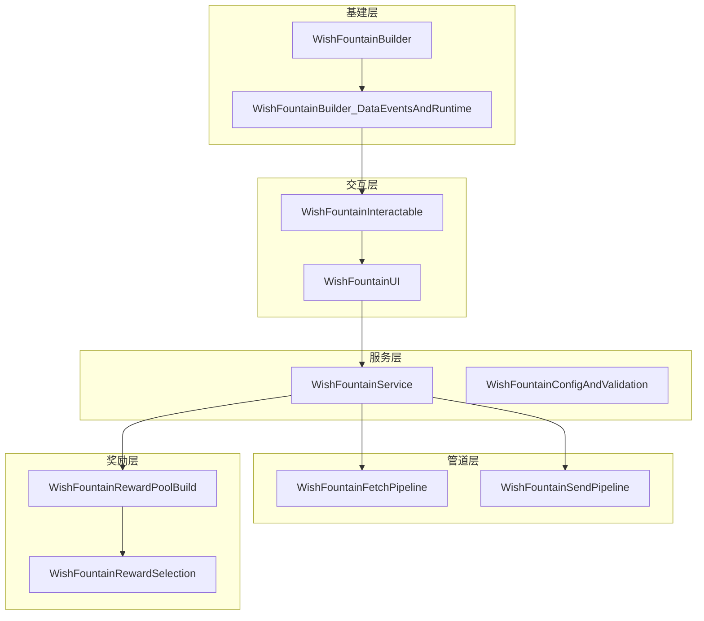
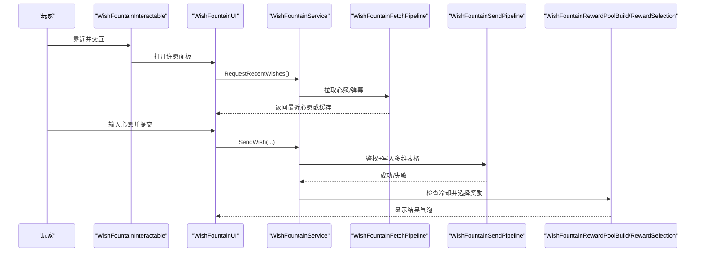
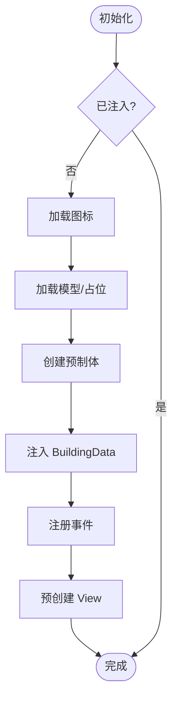
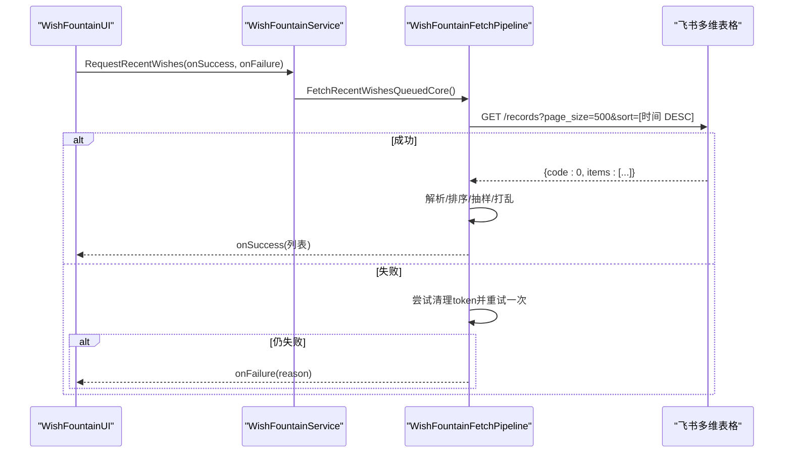
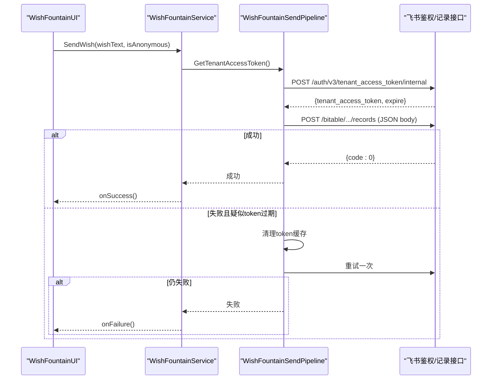
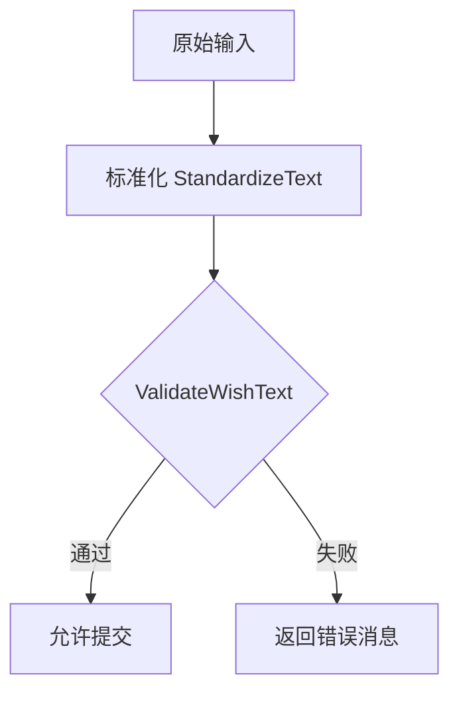
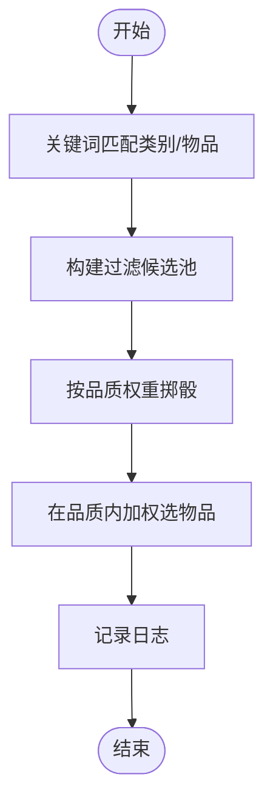
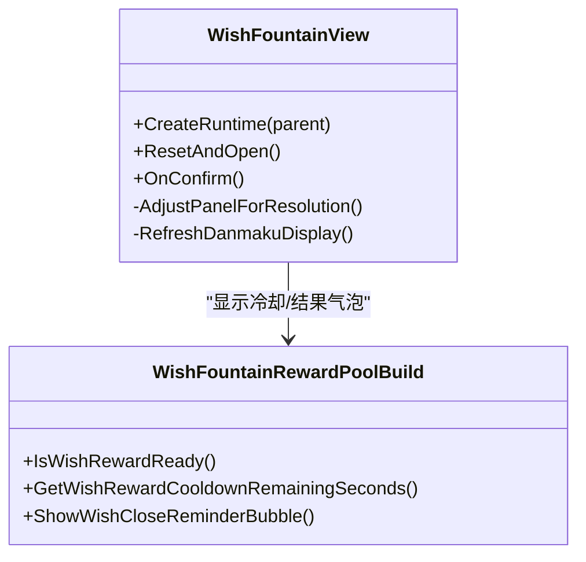
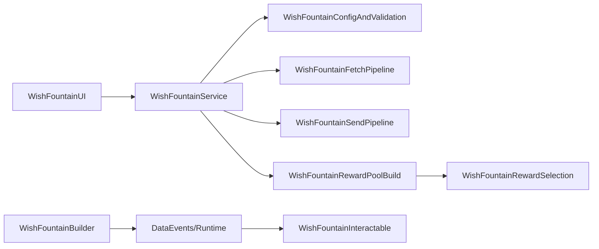

# 许愿台系统

<cite>
**本文引用的文件**
- [WishFountainBuilder.cs](file://Integration/WishFountain/WishFountainBuilder.cs)
- [WishFountainBuilder_DataEventsAndRuntime.cs](file://Integration/WishFountain/WishFountainBuilder_DataEventsAndRuntime.cs)
- [WishFountainInteractable.cs](file://Integration/WishFountain/WishFountainInteractable.cs)
- [WishFountainService.cs](file://Integration/WishFountain/WishFountainService.cs)
- [WishFountainConfigAndValidation.cs](file://Integration/WishFountain/WishFountainConfigAndValidation.cs)
- [WishFountainFetchPipeline.cs](file://Integration/WishFountain/WishFountainFetchPipeline.cs)
- [WishFountainSendPipeline.cs](file://Integration/WishFountain/WishFountainSendPipeline.cs)
- [WishFountainRewardPoolBuild.cs](file://Integration/WishFountain/WishFountainRewardPoolBuild.cs)
- [WishFountainRewardSelection.cs](file://Integration/WishFountain/WishFountainRewardSelection.cs)
- [WishFountainUI.cs](file://Integration/WishFountain/WishFountainUI.cs)
</cite>

## 目录
1. [简介](#简介)
2. [项目结构](#项目结构)
3. [核心组件](#核心组件)
4. [架构总览](#架构总览)
5. [详细组件分析](#详细组件分析)
6. [依赖关系分析](#依赖关系分析)
7. [性能考量](#性能考量)
8. [故障排查指南](#故障排查指南)
9. [结论](#结论)
10. [附录：API 调用示例与数据格式](#附录api-调用示例与数据格式)

## 简介
本文件为“许愿台系统”的综合技术文档，覆盖在线 API 集成机制、愿望记录存储、奖励发放流程；解释许愿台的构建器模式、获取管道和处理管道的实现原理；包含飞书 API 调用、JSON 数据处理、网络请求重试机制；详细说明奖励池构建、奖励选择算法、动画效果播放；并提供配置验证、错误处理、性能监控的实现方案与实际 API 调用示例、数据格式定义、异常处理最佳实践。

## 项目结构
许愿台系统位于 Integration/WishFountain 目录下，按职责拆分为多个部分类/模块：
- 建筑注入与运行时装配：WishFountainBuilder、WishFountainBuilder_DataEventsAndRuntime、WishFountainInteractable
- 服务与校验：WishFountainService（聚合）、WishFountainConfigAndValidation（配置与文本校验）
- 获取管道：WishFountainFetchPipeline（读取弹幕/心愿列表）
- 发送管道：WishFountainSendPipeline（写入心愿到飞书多维表格）
- 奖励系统：WishFountainRewardPoolBuild（冷却与池构建）、WishFountainRewardSelection（匹配与选择算法）
- UI：WishFountainUI（运行时面板、弹幕展示、交互控制）

图表来源
- [WishFountainInteractable.cs:20-110](file://Integration/WishFountain/WishFountainInteractable.cs#L20-L110)
- [WishFountainUI.cs:25-129](file://Integration/WishFountain/WishFountainUI.cs#L25-L129)
- [WishFountainService.cs:34-164](file://Integration/WishFountain/WishFountainService.cs#L34-L164)
- [WishFountainConfigAndValidation.cs:23-82](file://Integration/WishFountain/WishFountainConfigAndValidation.cs#L23-L82)
- [WishFountainFetchPipeline.cs:29-85](file://Integration/WishFountain/WishFountainFetchPipeline.cs#L29-L85)
- [WishFountainSendPipeline.cs:191-364](file://Integration/WishFountain/WishFountainSendPipeline.cs#L191-L364)
- [WishFountainRewardPoolBuild.cs:23-106](file://Integration/WishFountain/WishFountainRewardPoolBuild.cs#L23-L106)
- [WishFountainRewardSelection.cs:23-124](file://Integration/WishFountain/WishFountainRewardSelection.cs#L23-L124)
- [WishFountainBuilder.cs:107-155](file://Integration/WishFountain/WishFountainBuilder.cs#L107-L155)
- [WishFountainBuilder_DataEventsAndRuntime.cs:58-180](file://Integration/WishFountain/WishFountainBuilder_DataEventsAndRuntime.cs#L58-L180)

章节来源
- [WishFountainBuilder.cs:107-155](file://Integration/WishFountain/WishFountainBuilder.cs#L107-L155)
- [WishFountainBuilder_DataEventsAndRuntime.cs:58-180](file://Integration/WishFountain/WishFountainBuilder_DataEventsAndRuntime.cs#L58-L180)
- [WishFountainInteractable.cs:20-110](file://Integration/WishFountain/WishFountainInteractable.cs#L20-L110)
- [WishFountainUI.cs:25-129](file://Integration/WishFountain/WishFountainUI.cs#L25-L129)
- [WishFountainService.cs:34-164](file://Integration/WishFountain/WishFountainService.cs#L34-L164)
- [WishFountainConfigAndValidation.cs:23-82](file://Integration/WishFountain/WishFountainConfigAndValidation.cs#L23-L82)
- [WishFountainFetchPipeline.cs:29-85](file://Integration/WishFountain/WishFountainFetchPipeline.cs#L29-L85)
- [WishFountainSendPipeline.cs:191-364](file://Integration/WishFountain/WishFountainSendPipeline.cs#L191-L364)
- [WishFountainRewardPoolBuild.cs:23-106](file://Integration/WishFountain/WishFountainRewardPoolBuild.cs#L23-L106)
- [WishFountainRewardSelection.cs:23-124](file://Integration/WishFountain/WishFountainRewardSelection.cs#L23-L124)

## 核心组件
- 建筑注入器：通过反射将许愿台建筑注入游戏原版建筑系统，动态创建预制体、粒子特效，并监听放置/拆除事件以管理交互点。
- 交互组件：继承 InteractableBase，提供“许愿”交互入口，在发送中禁用重复交互。
- 服务与校验：统一封装飞书鉴权、配置加载与解密、文本标准化与内容校验、全局发送冷却。
- 获取管道：拉取飞书心愿记录，支持本地缓存回退、TTL 短缓存、失败原因上报。
- 发送管道：构造 JSON 记录并写入飞书多维表格，具备 token 失效自动重试、超时保护。
- 奖励系统：基于标签/别名匹配构建候选池，按品质权重与类别偏置进行加权随机选择，支持冷却与气泡提示。
- UI：运行时创建面板，支持多行输入、滚动条、字数统计、匿名开关、弹幕展示与状态提示。

章节来源
- [WishFountainBuilder.cs:107-155](file://Integration/WishFountain/WishFountainBuilder.cs#L107-L155)
- [WishFountainInteractable.cs:77-108](file://Integration/WishFountain/WishFountainInteractable.cs#L77-L108)
- [WishFountainConfigAndValidation.cs:420-570](file://Integration/WishFountain/WishFountainConfigAndValidation.cs#L420-L570)
- [WishFountainFetchPipeline.cs:87-207](file://Integration/WishFountain/WishFountainFetchPipeline.cs#L87-L207)
- [WishFountainSendPipeline.cs:191-364](file://Integration/WishFountain/WishFountainSendPipeline.cs#L191-L364)
- [WishFountainRewardPoolBuild.cs:345-377](file://Integration/WishFountain/WishFountainRewardPoolBuild.cs#L345-L377)
- [WishFountainRewardSelection.cs:723-748](file://Integration/WishFountain/WishFountainRewardSelection.cs#L723-L748)
- [WishFountainUI.cs:80-129](file://Integration/WishFountain/WishFountainUI.cs#L80-L129)

## 架构总览
许愿台系统采用分层与管道化设计：
- 交互层：建筑与 UI 负责用户触发与展示。
- 服务层：统一处理配置、校验、网络、奖励等跨域逻辑。
- 管道层：获取与发送分别封装了鉴权、重试、缓存与解析。
- 奖励层：池构建与选择算法解耦，支持预热与增量构建。
- 基建层：反射注入与事件绑定，确保与原版系统兼容。

图表来源
- [WishFountainInteractable.cs:77-108](file://Integration/WishFountain/WishFountainInteractable.cs#L77-L108)
- [WishFountainUI.cs:209-333](file://Integration/WishFountain/WishFountainUI.cs#L209-L333)
- [WishFountainFetchPipeline.cs:29-85](file://Integration/WishFountain/WishFountainFetchPipeline.cs#L29-L85)
- [WishFountainSendPipeline.cs:191-364](file://Integration/WishFountain/WishFountainSendPipeline.cs#L191-L364)
- [WishFountainRewardPoolBuild.cs:68-106](file://Integration/WishFountain/WishFountainRewardPoolBuild.cs#L68-L106)
- [WishFountainRewardSelection.cs:723-748](file://Integration/WishFountain/WishFountainRewardSelection.cs#L723-L748)

## 详细组件分析

### 构建器模式与建筑注入
- 使用反射向 BuildingDataCollection 注入 BuildingInfo 与 prefab，设置尺寸、费用、图标等。
- 动态创建 GameObject 作为预制体，包含模型容器、功能容器、交互点与粒子系统。
- 监听 OnBuildingBuilt/OnBuildingDestroyed 事件，恢复场景中的交互点与碰撞体。
- 早期初始化避免存档加载时缺 prefab 报错。

图表来源
- [WishFountainBuilder.cs:107-155](file://Integration/WishFountain/WishFountainBuilder.cs#L107-L155)
- [WishFountainBuilder_DataEventsAndRuntime.cs:58-180](file://Integration/WishFountain/WishFountainBuilder_DataEventsAndRuntime.cs#L58-L180)
- [WishFountainBuilder_DataEventsAndRuntime.cs:214-265](file://Integration/WishFountain/WishFountainBuilder_DataEventsAndRuntime.cs#L214-L265)
- [WishFountainBuilder_DataEventsAndRuntime.cs:442-508](file://Integration/WishFountain/WishFountainBuilder_DataEventsAndRuntime.cs#L442-L508)

章节来源
- [WishFountainBuilder.cs:107-155](file://Integration/WishFountain/WishFountainBuilder.cs#L107-L155)
- [WishFountainBuilder_DataEventsAndRuntime.cs:58-180](file://Integration/WishFountain/WishFountainBuilder_DataEventsAndRuntime.cs#L58-L180)
- [WishFountainBuilder_DataEventsAndRuntime.cs:214-265](file://Integration/WishFountain/WishFountainBuilder_DataEventsAndRuntime.cs#L214-L265)
- [WishFountainBuilder_DataEventsAndRuntime.cs:442-508](file://Integration/WishFountain/WishFountainBuilder_DataEventsAndRuntime.cs#L442-L508)

### 获取管道：弹幕/心愿读取
- 优先返回 TTL 内的缓存快照，避免频繁鉴权。
- 若配置无效或网络失败，回退到本地缓存文件。
- 支持两次尝试：首次失败且疑似 token 过期则清理缓存并重试一次。
- 解析飞书响应中的 items 数组，提取“心愿内容”和“时间”，排序后选取最新与随机组合，打乱输出。

图表来源
- [WishFountainFetchPipeline.cs:87-207](file://Integration/WishFountain/WishFountainFetchPipeline.cs#L87-L207)
- [WishFountainFetchPipeline.cs:231-249](file://Integration/WishFountain/WishFountainFetchPipeline.cs#L231-L249)
- [WishFountainFetchPipeline.cs:452-569](file://Integration/WishFountain/WishFountainFetchPipeline.cs#L452-L569)
- [WishFountainFetchPipeline.cs:626-690](file://Integration/WishFountain/WishFountainFetchPipeline.cs#L626-L690)

章节来源
- [WishFountainFetchPipeline.cs:87-207](file://Integration/WishFountain/WishFountainFetchPipeline.cs#L87-L207)
- [WishFountainFetchPipeline.cs:231-249](file://Integration/WishFountain/WishFountainFetchPipeline.cs#L231-L249)
- [WishFountainFetchPipeline.cs:452-569](file://Integration/WishFountain/WishFountainFetchPipeline.cs#L452-L569)
- [WishFountainFetchPipeline.cs:626-690](file://Integration/WishFountain/WishFountainFetchPipeline.cs#L626-L690)

### 发送管道：心愿写入与重试
- 构建 JSON 记录字段：时间、版本、玩家名、心愿内容、场景、语言。
- 获取 tenant_access_token，缓存并在到期前预留刷新窗口。
- 发送失败或返回 401/403 或包含 token 相关错误时，清理缓存并重试一次。
- 成功后更新全局发送冷却时间，防止短时间重复提交。

图表来源
- [WishFountainSendPipeline.cs:38-118](file://Integration/WishFountain/WishFountainSendPipeline.cs#L38-L118)
- [WishFountainSendPipeline.cs:120-155](file://Integration/WishFountain/WishFountainSendPipeline.cs#L120-L155)
- [WishFountainSendPipeline.cs:191-364](file://Integration/WishFountain/WishFountainSendPipeline.cs#L191-L364)

章节来源
- [WishFountainSendPipeline.cs:38-118](file://Integration/WishFountain/WishFountainSendPipeline.cs#L38-L118)
- [WishFountainSendPipeline.cs:120-155](file://Integration/WishFountain/WishFountainSendPipeline.cs#L120-L155)
- [WishFountainSendPipeline.cs:191-364](file://Integration/WishFountain/WishFountainSendPipeline.cs#L191-L364)

### 配置验证与文本校验
- 配置加密：PBKDF2 派生密钥 + AES-256-CBC，配置文件头标识与占位标记。
- 文本标准化：全角转半角（保留中文标点）、换行统一、空白折叠、空行折叠、首尾修剪。
- 内容校验：长度下限、有效字符数、同字符占比、重复行检测、链接/联系方式/引流检测、敏感词黑名单。

图表来源
- [WishFountainConfigAndValidation.cs:23-82](file://Integration/WishFountain/WishFountainConfigAndValidation.cs#L23-L82)
- [WishFountainConfigAndValidation.cs:263-334](file://Integration/WishFountain/WishFountainConfigAndValidation.cs#L263-L334)
- [WishFountainConfigAndValidation.cs:420-570](file://Integration/WishFountain/WishFountainConfigAndValidation.cs#L420-L570)
- [WishFountainConfigAndValidation.cs:572-741](file://Integration/WishFountain/WishFountainConfigAndValidation.cs#L572-L741)

章节来源
- [WishFountainConfigAndValidation.cs:23-82](file://Integration/WishFountain/WishFountainConfigAndValidation.cs#L23-L82)
- [WishFountainConfigAndValidation.cs:263-334](file://Integration/WishFountain/WishFountainConfigAndValidation.cs#L263-L334)
- [WishFountainConfigAndValidation.cs:420-570](file://Integration/WishFountain/WishFountainConfigAndValidation.cs#L420-L570)
- [WishFountainConfigAndValidation.cs:572-741](file://Integration/WishFountain/WishFountainConfigAndValidation.cs#L572-L741)

### 奖励池构建与选择算法
- 池构建：枚举基础候选项，按标签/别名映射到类别，加入自定义项覆盖，建立质量桶与类别成员关系。
- 选择流程：根据心愿关键词匹配类别与具体物品，构建过滤后的候选池；按品质权重与类别偏置加权随机选择品质，再在该品质内加权选择物品。
- 冷却与提示：每 4 小时可领取一次，冷却剩余时间通过气泡提示；成功获得奖励后显示名称气泡。

图表来源
- [WishFountainRewardPoolBuild.cs:345-377](file://Integration/WishFountain/WishFountainRewardPoolBuild.cs#L345-L377)
- [WishFountainRewardPoolBuild.cs:572-618](file://Integration/WishFountain/WishFountainRewardPoolBuild.cs#L572-L618)
- [WishFountainRewardSelection.cs:23-124](file://Integration/WishFountain/WishFountainRewardSelection.cs#L23-L124)
- [WishFountainRewardSelection.cs:535-604](file://Integration/WishFountain/WishFountainRewardSelection.cs#L535-L604)
- [WishFountainRewardSelection.cs:647-721](file://Integration/WishFountain/WishFountainRewardSelection.cs#L647-L721)
- [WishFountainRewardSelection.cs:723-748](file://Integration/WishFountain/WishFountainRewardSelection.cs#L723-L748)

章节来源
- [WishFountainRewardPoolBuild.cs:345-377](file://Integration/WishFountain/WishFountainRewardPoolBuild.cs#L345-L377)
- [WishFountainRewardPoolBuild.cs:572-618](file://Integration/WishFountain/WishFountainRewardPoolBuild.cs#L572-L618)
- [WishFountainRewardSelection.cs:23-124](file://Integration/WishFountain/WishFountainRewardSelection.cs#L23-L124)
- [WishFountainRewardSelection.cs:535-604](file://Integration/WishFountain/WishFountainRewardSelection.cs#L535-L604)
- [WishFountainRewardSelection.cs:647-721](file://Integration/WishFountain/WishFountainRewardSelection.cs#L647-L721)
- [WishFountainRewardSelection.cs:723-748](file://Integration/WishFountain/WishFountainRewardSelection.cs#L723-L748)

### 动画效果与 UI 反馈
- 建筑粒子：星尘上升与星光闪烁，使用共享材质与纹理，支持 Shader 回退。
- 奖励气泡：通过 DialogueBubblesManager 显示冷却与结果提示。
- UI 面板：固定高度多行输入框、滚动条、字数统计、匿名开关、弹幕展示与状态提示。

图表来源
- [WishFountainUI.cs:80-129](file://Integration/WishFountain/WishFountainUI.cs#L80-L129)
- [WishFountainUI.cs:374-637](file://Integration/WishFountain/WishFountainUI.cs#L374-L637)
- [WishFountainRewardPoolBuild.cs:127-196](file://Integration/WishFountain/WishFountainRewardPoolBuild.cs#L127-L196)

章节来源
- [WishFountainUI.cs:80-129](file://Integration/WishFountain/WishFountainUI.cs#L80-L129)
- [WishFountainUI.cs:374-637](file://Integration/WishFountain/WishFountainUI.cs#L374-L637)
- [WishFountainRewardPoolBuild.cs:127-196](file://Integration/WishFountain/WishFountainRewardPoolBuild.cs#L127-L196)

## 依赖关系分析
- 外部依赖：UnityWebRequest、SavesSystem、ItemAssetsCollection、GameplayDataSettings.Tags、DialogueBubblesManager。
- 内部耦合：
  - UI 依赖 Service 的冷却与弹幕接口。
  - Service 聚合 Config、Fetch、Send、Reward 子模块。
  - Builder 与 DataEvents 通过反射与事件与原版系统耦合。
- 潜在循环：无直接循环依赖，各模块通过静态服务与协程通信。

图表来源
- [WishFountainUI.cs:25-129](file://Integration/WishFountain/WishFountainUI.cs#L25-L129)
- [WishFountainService.cs:34-164](file://Integration/WishFountain/WishFountainService.cs#L34-L164)
- [WishFountainConfigAndValidation.cs:23-82](file://Integration/WishFountain/WishFountainConfigAndValidation.cs#L23-L82)
- [WishFountainFetchPipeline.cs:29-85](file://Integration/WishFountain/WishFountainFetchPipeline.cs#L29-L85)
- [WishFountainSendPipeline.cs:191-364](file://Integration/WishFountain/WishFountainSendPipeline.cs#L191-L364)
- [WishFountainRewardPoolBuild.cs:23-106](file://Integration/WishFountain/WishFountainRewardPoolBuild.cs#L23-L106)
- [WishFountainRewardSelection.cs:23-124](file://Integration/WishFountain/WishFountainRewardSelection.cs#L23-L124)
- [WishFountainBuilder.cs:107-155](file://Integration/WishFountain/WishFountainBuilder.cs#L107-L155)
- [WishFountainBuilder_DataEventsAndRuntime.cs:58-180](file://Integration/WishFountain/WishFountainBuilder_DataEventsAndRuntime.cs#L58-L180)
- [WishFountainInteractable.cs:20-110](file://Integration/WishFountain/WishFountainInteractable.cs#L20-L110)

章节来源
- [WishFountainUI.cs:25-129](file://Integration/WishFountain/WishFountainUI.cs#L25-L129)
- [WishFountainService.cs:34-164](file://Integration/WishFountain/WishFountainService.cs#L34-L164)
- [WishFountainConfigAndValidation.cs:23-82](file://Integration/WishFountain/WishFountainConfigAndValidation.cs#L23-L82)
- [WishFountainFetchPipeline.cs:29-85](file://Integration/WishFountain/WishFountainFetchPipeline.cs#L29-L85)
- [WishFountainSendPipeline.cs:191-364](file://Integration/WishFountain/WishFountainSendPipeline.cs#L191-L364)
- [WishFountainRewardPoolBuild.cs:23-106](file://Integration/WishFountain/WishFountainRewardPoolBuild.cs#L23-L106)
- [WishFountainRewardSelection.cs:23-124](file://Integration/WishFountain/WishFountainRewardSelection.cs#L23-L124)
- [WishFountainBuilder.cs:107-155](file://Integration/WishFountain/WishFountainBuilder.cs#L107-L155)
- [WishFountainBuilder_DataEventsAndRuntime.cs:58-180](file://Integration/WishFountain/WishFountainBuilder_DataEventsAndRuntime.cs#L58-L180)
- [WishFountainInteractable.cs:20-110](file://Integration/WishFountain/WishFountainInteractable.cs#L20-L110)

## 性能考量
- 网络：
  - 请求超时 15 秒，避免阻塞主线程。
  - tenant_access_token 缓存并预留 60 秒刷新缓冲，减少鉴权频率。
  - 获取弹幕使用 TTL 45 秒短缓存，降低重复请求。
- 构建：
  - 奖励池构建支持同步与增量（yield）两种模式，间隔 24 步 yield，避免卡顿。
  - 反射查找 TagsData 成员使用缓存字典，减少重复反射开销。
- UI：
  - 面板尺寸自适应分辨率，避免过度重排。
  - 弹幕展示仅在缓存存在时显示，减少网络压力。

[本节为通用性能建议，不直接分析具体文件]

## 故障排查指南
- 配置问题：
  - 配置文件不存在或格式无效：检查 Assets/config/wish_config.dat 是否存在且头部正确。
  - 解密失败：确认 PBKDF2 参数与盐值一致，重新生成加密配置。
- 网络问题：
  - 鉴权失败：检查 appId/appSecret 是否正确，关注返回码与错误消息。
  - 写入失败：查看 response code 与 msg/message 字段，必要时清理 token 缓存重试。
- 奖励问题：
  - 池构建失败：检查 TagsData 是否可用，排除标签缺失导致候选为空。
  - 冷却未生效：确认 SavesSystem 键值读写正常，开发模式可使用清除冷却接口。
- UI 问题：
  - 面板无法打开：检查 ModBehaviour 实例与 View 宿主 Canvas 是否正常。
  - 弹幕不显示：确认缓存文件可读，或网络回退路径是否启用。

章节来源
- [WishFountainConfigAndValidation.cs:23-82](file://Integration/WishFountain/WishFountainConfigAndValidation.cs#L23-L82)
- [WishFountainSendPipeline.cs:140-184](file://Integration/WishFountain/WishFountainSendPipeline.cs#L140-L184)
- [WishFountainRewardPoolBuild.cs:345-377](file://Integration/WishFountain/WishFountainRewardPoolBuild.cs#L345-L377)
- [WishFountainUI.cs:209-333](file://Integration/WishFountain/WishFountainUI.cs#L209-L333)

## 结论
许愿台系统通过构建器模式与管道化设计，实现了与原版系统的低侵入集成，结合飞书 API 完成心愿记录与弹幕展示，并通过严谨的文本校验与奖励选择算法保障体验与公平性。系统在配置安全、网络健壮性、性能优化方面均有完善实现，适合在生产环境稳定运行。

[本节为总结性内容，不直接分析具体文件]

## 附录：API 调用示例与数据格式
- 鉴权接口
  - URL: https://open.feishu.cn/open-apis/auth/v3/tenant_access_token/internal
  - 方法: POST
  - 请求体: {"app_id": "...", "app_secret": "..."}
  - 响应: {"code": 0, "tenant_access_token": "...", "expire": 7200}
- 写入记录接口
  - URL: https://open.feishu.cn/open-apis/bitable/v1/apps/{appToken}/tables/{tableId}/records
  - 方法: POST
  - 请求头: Authorization: Bearer {tenant_access_token}, Content-Type: application/json
  - 请求体: {"fields":{"时间":"yyyy-MM-dd HH:mm:ss","版本":"vX.Y.Z","玩家名":"...","心愿内容":"...","场景":"...","语言":"zh-CN"}}
  - 响应: {"code": 0, "msg":"..."}
- 读取记录接口
  - URL: https://open.feishu.cn/open-apis/bitable/v1/apps/{appToken}/tables/{tableId}/records?page_size=500&sort=["时间 DESC"]
  - 方法: GET
  - 请求头: Authorization: Bearer {tenant_access_token}
  - 响应: {"code": 0, "items":[{"心愿内容":"...","时间":"..."}, ...]}

章节来源
- [WishFountainSendPipeline.cs:38-118](file://Integration/WishFountain/WishFountainSendPipeline.cs#L38-L118)
- [WishFountainSendPipeline.cs:120-155](file://Integration/WishFountain/WishFountainSendPipeline.cs#L120-L155)
- [WishFountainFetchPipeline.cs:231-249](file://Integration/WishFountain/WishFountainFetchPipeline.cs#L231-L249)
- [WishFountainFetchPipeline.cs:452-569](file://Integration/WishFountain/WishFountainFetchPipeline.cs#L452-L569)