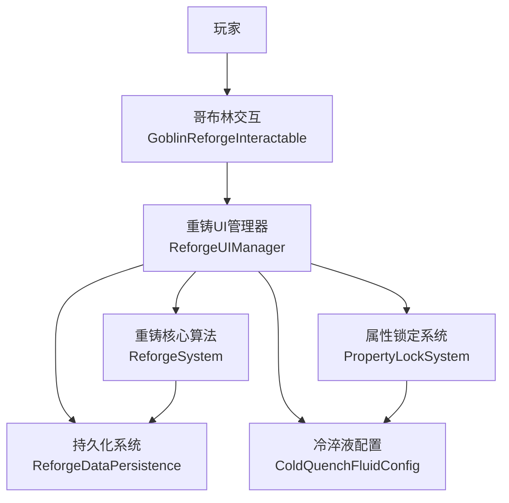
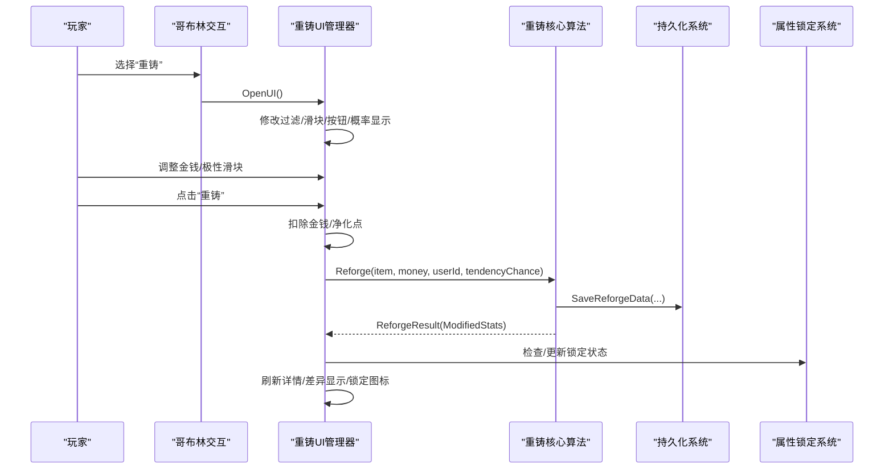
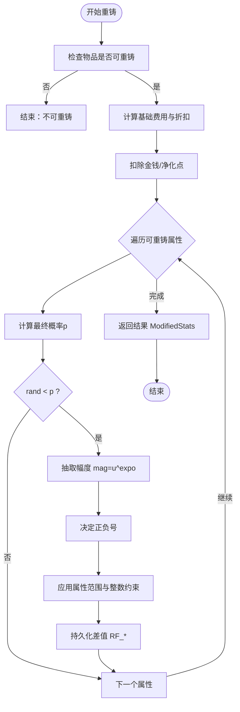
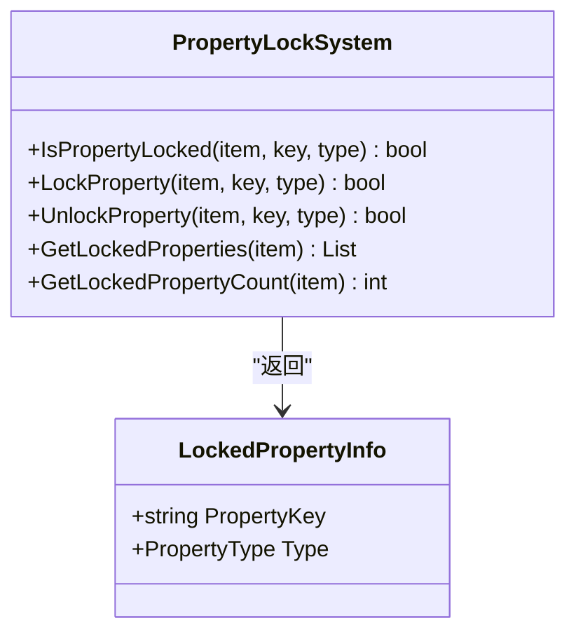
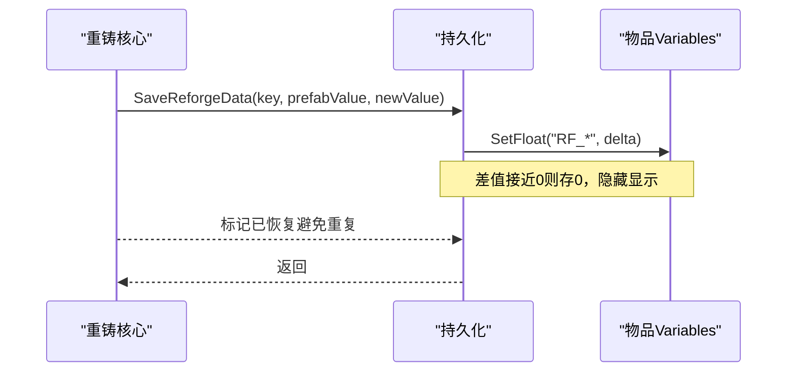
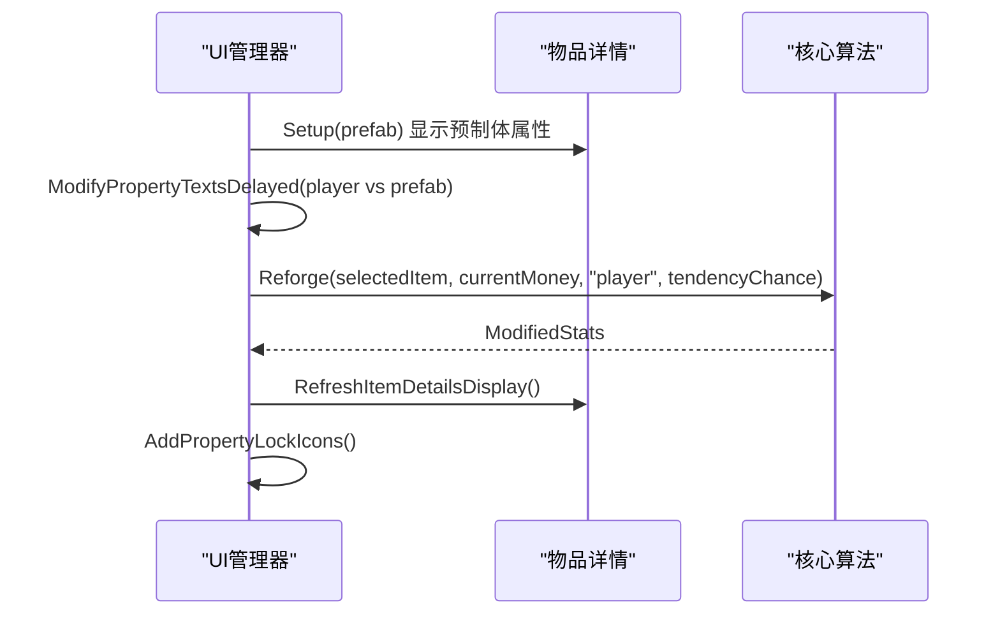
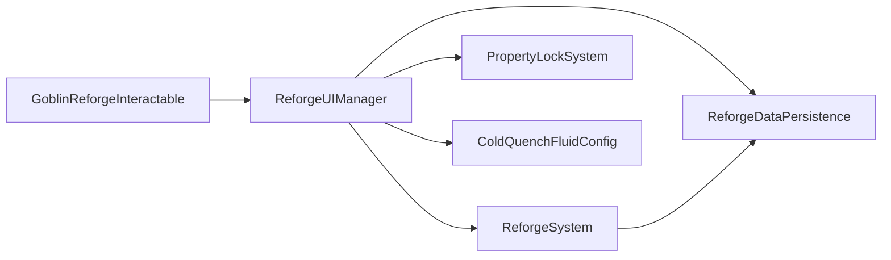

# 重铸系统

<cite>
**本文引用的文件**
- [ReforgeSystem.cs](file://Integration/Reforge/ReforgeSystem.cs)
- [ReforgeSystem_ApplyAndResults.cs](file://Integration/Reforge/ReforgeSystem_ApplyAndResults.cs)
- [PropertyLockSystem.cs](file://Integration/Reforge/PropertyLockSystem.cs)
- [ReforgeDataPersistence.cs](file://Integration/Reforge/ReforgeDataPersistence.cs)
- [GoblinReforgeInteractable.cs](file://Integration/Reforge/GoblinReforgeInteractable.cs)
- [ReforgeUIManager.cs](file://Integration/Reforge/ReforgeUIManager.cs)
- [ReforgeUIManager_ComparisonAndState.cs](file://Integration/Reforge/ReforgeUIManager_ComparisonAndState.cs)
- [ReforgeUIManager_RuntimeAndCleanup.cs](file://Integration/Reforge/ReforgeUIManager_RuntimeAndCleanup.cs)
- [ColdQuenchFluidConfig.cs](file://Integration/Reforge/ColdQuenchFluidConfig.cs)
</cite>

## 目录
1. [简介](#简介)
2. [项目结构](#项目结构)
3. [核心组件](#核心组件)
4. [架构总览](#架构总览)
5. [详细组件分析](#详细组件分析)
6. [依赖关系分析](#依赖关系分析)
7. [性能考量](#性能考量)
8. [故障排查指南](#故障排查指南)
9. [结论](#结论)
10. [附录：扩展与配置](#附录：扩展与配置)

## 简介
本模块为“重铸系统”，提供装备属性重铸、词缀锁定、材料消耗（冷淬液）与冷却液配置、概率与随机控制、品质分布、与叮当（哥布林工匠）NPC交互、UI界面管理、数据持久化等完整能力。系统通过哥布林NPC的“重铸”子选项打开UI，玩家可选择可重铸物品、投入金钱、调节极性倾向滑块，执行重铸并查看结果；支持对任意显示属性进行固定，使用冷淬液作为材料；重铸差值以RF_前缀持久化到物品Variables中，并在场景切换或重新应用修饰器时自动恢复。

## 项目结构
重铸系统由以下关键部分组成：
- 核心算法层：概率计算、范围控制、随机幅度抽取、属性筛选与判定
- UI层：复用原版分解界面，注入金钱滑块、概率显示、极性滑块、冷淬液数量显示与属性锁定交互
- NPC交互层：哥布林主交互与“重铸”子选项，触发UI打开与对话流程
- 持久化层：保存/恢复Modifier/Stat/Variable的重铸差值，兼容自定义武器运行时状态
- 材料层：冷淬液物品配置与UI展示、消耗逻辑

图表来源
- [GoblinReforgeInteractable.cs:20-85](file://Integration/Reforge/GoblinReforgeInteractable.cs#L20-L85)
- [ReforgeUIManager.cs:397-421](file://Integration/Reforge/ReforgeUIManager.cs#L397-L421)
- [ReforgeSystem.cs:301-420](file://Integration/Reforge/ReforgeSystem.cs#L301-L420)
- [PropertyLockSystem.cs:61-140](file://Integration/Reforge/PropertyLockSystem.cs#L61-L140)
- [ReforgeDataPersistence.cs:115-137](file://Integration/Reforge/ReforgeDataPersistence.cs#L115-L137)
- [ColdQuenchFluidConfig.cs:248-282](file://Integration/Reforge/ColdQuenchFluidConfig.cs#L248-L282)

章节来源
- [GoblinReforgeInteractable.cs:20-85](file://Integration/Reforge/GoblinReforgeInteractable.cs#L20-L85)
- [ReforgeUIManager.cs:397-421](file://Integration/Reforge/ReforgeUIManager.cs#L397-L421)
- [ReforgeSystem.cs:301-420](file://Integration/Reforge/ReforgeSystem.cs#L301-L420)
- [PropertyLockSystem.cs:61-140](file://Integration/Reforge/PropertyLockSystem.cs#L61-L140)
- [ReforgeDataPersistence.cs:115-137](file://Integration/Reforge/ReforgeDataPersistence.cs#L115-L137)
- [ColdQuenchFluidConfig.cs:248-282](file://Integration/Reforge/ColdQuenchFluidConfig.cs#L248-L282)

## 核心组件
- 重铸核心算法（ReforgeSystem）
  - 概率公式：基础概率受稀有度与物品价值影响，叠加金钱增益；最终概率用于判定是否修改与幅度抽取
  - 属性范围：根据预制体值决定绝对范围或百分比范围；整数属性保持整数；护甲等强制绝对范围
  - 随机幅度：u^expo，指数随概率变化；正负号由倾向滑块控制
  - 费用计算：基础费用为物品价值的1/100，最低100；支持哥布林好感度折扣
- 属性锁定系统（PropertyLockSystem）
  - 使用Variables存储锁定标记，键名前缀区分类型；支持固定/解锁与查询
- 持久化系统（ReforgeDataPersistence）
  - 将重铸差值以RF_前缀写入Variables；在重新应用修饰器时按覆盖模式恢复
  - 支持自定义武器运行时补配与恢复
- UI管理器（ReforgeUIManager）
  - 复用分解UI，注入金钱滑块、概率显示、极性滑块、冷淬液数量显示
  - 属性条目点击实现锁定，颜色反馈（白/蓝/金）
  - 对比显示预制体与当前值的差异
- 哥布林交互（GoblinReforgeInteractable）
  - 添加“重铸”子选项，播放音效、进入对话、打开UI
- 冷淬液配置（ColdQuenchFluidConfig）
  - 定义物品TypeID、图标、本地化、标签、UI提示文本；注册到ItemFactory

章节来源
- [ReforgeSystem.cs:191-420](file://Integration/Reforge/ReforgeSystem.cs#L191-L420)
- [PropertyLockSystem.cs:33-140](file://Integration/Reforge/PropertyLockSystem.cs#L33-L140)
- [ReforgeDataPersistence.cs:32-137](file://Integration/Reforge/ReforgeDataPersistence.cs#L32-L137)
- [ReforgeUIManager.cs:16-117](file://Integration/Reforge/ReforgeUIManager.cs#L16-L117)
- [GoblinReforgeInteractable.cs:20-85](file://Integration/Reforge/GoblinReforgeInteractable.cs#L20-L85)
- [ColdQuenchFluidConfig.cs:248-282](file://Integration/Reforge/ColdQuenchFluidConfig.cs#L248-L282)

## 架构总览
重铸系统的整体调用链如下：
- 玩家与哥布林交互，选择“重铸”
- UI管理器打开并改造分解界面，设置过滤条件、滑块、按钮、概率显示、极性滑块、冷淬液UI
- 玩家调整参数后点击重铸，UI扣费并调用核心算法
- 核心算法计算概率、范围、随机幅度，应用属性修改并持久化差值
- UI刷新显示差异与锁定状态

图表来源
- [GoblinReforgeInteractable.cs:56-79](file://Integration/Reforge/GoblinReforgeInteractable.cs#L56-L79)
- [ReforgeUIManager.cs:397-421](file://Integration/Reforge/ReforgeUIManager.cs#L397-L421)
- [ReforgeUIManager_ComparisonAndState.cs:415-520](file://Integration/Reforge/ReforgeUIManager_ComparisonAndState.cs#L415-L520)
- [ReforgeSystem.cs:789-800](file://Integration/Reforge/ReforgeSystem.cs#L789-L800)
- [ReforgeDataPersistence.cs:115-137](file://Integration/Reforge/ReforgeDataPersistence.cs#L115-L137)
- [PropertyLockSystem.cs:61-140](file://Integration/Reforge/PropertyLockSystem.cs#L61-L140)

## 详细组件分析

### 重铸核心算法（ReforgeSystem）
- 概率与费用
  - 基础概率：BASE_PROBABILITY × RarityFactor(rarity) × ValueFactor(itemValue)
  - 金钱增益：基于物品价值的分段阈值（10x/100x/1000倍），log分段提升加成
  - 最终概率：clamp(p_item + MoneyBonus, 0, 1)
  - 基础费用：itemValue / 100，最低MIN_REFORGE_COST；支持好感度折扣
- 属性范围与类型
  - 小数值属性（≤1）使用绝对范围；非强制情况下正负方向限制在0~200%原值
  - 强制绝对范围：HeadArmor、BodyArmor
  - 整数属性：保持整数
  - 不支持重铸的Stat键：DealDamageTime、ShotCount、ShotAngle
- 随机与幅度
  - 幅度抽取：mag = u^expo，expo随p线性变化（p=0→3.5，p=1→0.6）
  - 正负号：RollSign(tendencyChance)，tendencyChance∈[0,1]
- 公共接口
  - CanReforge：仅Display=true的属性参与
  - GetReforgeablePropertyCount：统计可重铸属性数
  - FinalProbability/MoneyBonus/RarityFactor/ValueFactor：概率相关API
  - RollMagnitude/RollSign：随机相关API
  - GetPropertyValueBounds：计算允许范围

图表来源
- [ReforgeSystem.cs:301-420](file://Integration/Reforge/ReforgeSystem.cs#L301-L420)
- [ReforgeSystem.cs:500-526](file://Integration/Reforge/ReforgeSystem.cs#L500-L526)
- [ReforgeSystem.cs:543-625](file://Integration/Reforge/ReforgeSystem.cs#L543-L625)
- [ReforgeSystem_ApplyAndResults.cs:147-179](file://Integration/Reforge/ReforgeSystem_ApplyAndResults.cs#L147-L179)

章节来源
- [ReforgeSystem.cs:191-420](file://Integration/Reforge/ReforgeSystem.cs#L191-L420)
- [ReforgeSystem.cs:500-526](file://Integration/Reforge/ReforgeSystem.cs#L500-L526)
- [ReforgeSystem.cs:543-625](file://Integration/Reforge/ReforgeSystem.cs#L543-L625)
- [ReforgeSystem_ApplyAndResults.cs:147-179](file://Integration/Reforge/ReforgeSystem_ApplyAndResults.cs#L147-L179)

### 属性锁定系统（PropertyLockSystem）
- 持久化键名：RF_LOCK_MOD_xxx、RF_LOCK_STAT_xxx、RF_LOCK_VAR_xxx
- 功能：
  - IsPropertyLocked：检查是否已固定
  - LockProperty：固定属性（写Variables并隐藏显示）
  - UnlockProperty：解锁属性
  - GetLockedProperties：获取所有已固定属性列表
- 与UI联动：点击属性条目消耗冷淬液并固定，颜色变为金色

图表来源
- [PropertyLockSystem.cs:61-140](file://Integration/Reforge/PropertyLockSystem.cs#L61-L140)
- [PropertyLockSystem.cs:179-251](file://Integration/Reforge/PropertyLockSystem.cs#L179-L251)

章节来源
- [PropertyLockSystem.cs:61-140](file://Integration/Reforge/PropertyLockSystem.cs#L61-L140)
- [PropertyLockSystem.cs:179-251](file://Integration/Reforge/PropertyLockSystem.cs#L179-L251)

### 持久化系统（ReforgeDataPersistence）
- 前缀规范：RF_MOD_xxx、RF_STAT_xxx、RF_VAR_xxx
- 保存：SaveReforgeData/SaveReforgeDataStat/SaveReforgeDataVariable
- 恢复：TryRestoreReforgeData，按覆盖模式恢复（prefabValue + delta）
- 同步：SyncCurrentReforgeState，确保序列化时只同步已追踪的RF_字段
- 自定义武器：CustomItemRuntimeStateHelper负责运行时补配与恢复

图表来源
- [ReforgeDataPersistence.cs:115-137](file://Integration/Reforge/ReforgeDataPersistence.cs#L115-L137)
- [ReforgeDataPersistence.cs:264-300](file://Integration/Reforge/ReforgeDataPersistence.cs#L264-L300)
- [ReforgeDataPersistence.cs:302-377](file://Integration/Reforge/ReforgeDataPersistence.cs#L302-L377)

章节来源
- [ReforgeDataPersistence.cs:115-137](file://Integration/Reforge/ReforgeDataPersistence.cs#L115-L137)
- [ReforgeDataPersistence.cs:264-300](file://Integration/Reforge/ReforgeDataPersistence.cs#L264-L300)
- [ReforgeDataPersistence.cs:302-377](file://Integration/Reforge/ReforgeDataPersistence.cs#L302-L377)

### UI管理器（ReforgeUIManager）
- 打开与初始化：OpenUI，延迟修改分解UI，创建倾向滑块、冷淬液UI、概率显示
- 过滤与滑块：ModifyInventoryFilter、ModifySlider，将分解改为重铸
- 概率显示：UpdateProbabilityDisplay，展示品质、价值、投入、极性费用、正向/负向概率、总额
- 重铸按钮：OnReforgeButtonClick，扣费、调用核心算法、显示差异、刷新UI
- 详情对比：SetupDetailsWithPrefabComparison，缓存预制体属性，延迟修改文本显示差异
- 锁定交互：AddPropertyLockIcons，为属性条目添加点击固定功能，颜色反馈

图表来源
- [ReforgeUIManager.cs:397-421](file://Integration/Reforge/ReforgeUIManager.cs#L397-L421)
- [ReforgeUIManager_ComparisonAndState.cs:305-410](file://Integration/Reforge/ReforgeUIManager_ComparisonAndState.cs#L305-L410)
- [ReforgeUIManager_ComparisonAndState.cs:415-520](file://Integration/Reforge/ReforgeUIManager_ComparisonAndState.cs#L415-L520)
- [ReforgeUIManager_RuntimeAndCleanup.cs:21-174](file://Integration/Reforge/ReforgeUIManager_RuntimeAndCleanup.cs#L21-L174)
- [ReforgeUIManager_RuntimeAndCleanup.cs:383-402](file://Integration/Reforge/ReforgeUIManager_RuntimeAndCleanup.cs#L383-L402)

章节来源
- [ReforgeUIManager.cs:397-421](file://Integration/Reforge/ReforgeUIManager.cs#L397-L421)
- [ReforgeUIManager_ComparisonAndState.cs:305-410](file://Integration/Reforge/ReforgeUIManager_ComparisonAndState.cs#L305-L410)
- [ReforgeUIManager_ComparisonAndState.cs:415-520](file://Integration/Reforge/ReforgeUIManager_ComparisonAndState.cs#L415-L520)
- [ReforgeUIManager_RuntimeAndCleanup.cs:21-174](file://Integration/Reforge/ReforgeUIManager_RuntimeAndCleanup.cs#L21-L174)
- [ReforgeUIManager_RuntimeAndCleanup.cs:383-402](file://Integration/Reforge/ReforgeUIManager_RuntimeAndCleanup.cs#L383-L402)

### 哥布林交互（GoblinReforgeInteractable）
- 子选项“重铸”：播放音效、进入对话、打开UI
- 主交互“对话”：聊天、剧情触发、婚后每日赠送冷淬液

章节来源
- [GoblinReforgeInteractable.cs:20-85](file://Integration/Reforge/GoblinReforgeInteractable.cs#L20-L85)
- [GoblinReforgeInteractable.cs:312-451](file://Integration/Reforge/GoblinReforgeInteractable.cs#L312-L451)

### 冷淬液配置（ColdQuenchFluidConfig）
- 物品TypeID、Bundle名称、图标名称、本地化键
- 标签：用于UI显示“冷淬”
- UI提示：固定提示、数量不足提示、成功提示
- 注册：RegisterConfigurator将配置器注册到ItemFactory

章节来源
- [ColdQuenchFluidConfig.cs:248-282](file://Integration/Reforge/ColdQuenchFluidConfig.cs#L248-L282)
- [ColdQuenchFluidConfig.cs:106-149](file://Integration/Reforge/ColdQuenchFluidConfig.cs#L106-L149)

## 依赖关系分析
- 组件耦合
  - UI管理器依赖核心算法、持久化、锁定系统与冷淬液配置
  - 核心算法依赖持久化与物品系统（Item、Modifier、Stat、Variable）
  - 哥布林交互依赖UI管理器与音频管理器
- 外部依赖
  - ItemDecomposeView（原版分解UI）
  - EconomyManager（支付金钱/净化点）
  - Harmony（持久化Patch）
  - CustomItemRuntimeStateHelper（自定义武器运行时补配）

图表来源
- [ReforgeUIManager.cs:397-421](file://Integration/Reforge/ReforgeUIManager.cs#L397-L421)
- [ReforgeSystem.cs:789-800](file://Integration/Reforge/ReforgeSystem.cs#L789-L800)
- [ReforgeDataPersistence.cs:115-137](file://Integration/Reforge/ReforgeDataPersistence.cs#L115-L137)
- [PropertyLockSystem.cs:61-140](file://Integration/Reforge/PropertyLockSystem.cs#L61-L140)
- [GoblinReforgeInteractable.cs:56-79](file://Integration/Reforge/GoblinReforgeInteractable.cs#L56-L79)

章节来源
- [ReforgeUIManager.cs:397-421](file://Integration/Reforge/ReforgeUIManager.cs#L397-L421)
- [ReforgeSystem.cs:789-800](file://Integration/Reforge/ReforgeSystem.cs#L789-L800)
- [ReforgeDataPersistence.cs:115-137](file://Integration/Reforge/ReforgeDataPersistence.cs#L115-L137)
- [PropertyLockSystem.cs:61-140](file://Integration/Reforge/PropertyLockSystem.cs#L61-L140)
- [GoblinReforgeInteractable.cs:56-79](file://Integration/Reforge/GoblinReforgeInteractable.cs#L56-L79)

## 性能考量
- 委托缓存：对ModifierDescription.value与Stat.baseValue的setter使用表达式树编译的委托，比反射快约10倍
- 反射缓存：UI层缓存ItemModifierEntry/ItemVariableEntry/ItemStatEntry的目标字段与属性，避免重复反射
- 预制体缓存：UI层缓存实例化的预制体，减少重复InstantiateSync开销
- 协程合并：重铸后延迟刷新UI合并为单一协程，减少调度开销
- 快速路径：持久化层使用HasReforgeData快速跳过无RF_数据的物品；恢复时按前缀快速判断类型
- 内存管理：关闭UI时清理缓存、停止协程、释放引用

章节来源
- [ReforgeSystem.cs:35-98](file://Integration/Reforge/ReforgeSystem.cs#L35-L98)
- [ReforgeUIManager.cs:152-206](file://Integration/Reforge/ReforgeUIManager.cs#L152-L206)
- [ReforgeUIManager.cs:208-325](file://Integration/Reforge/ReforgeUIManager.cs#L208-L325)
- [ReforgeUIManager_RuntimeAndCleanup.cs:383-402](file://Integration/Reforge/ReforgeUIManager_RuntimeAndCleanup.cs#L383-L402)
- [ReforgeDataPersistence.cs:90-113](file://Integration/Reforge/ReforgeDataPersistence.cs#L90-L113)

## 故障排查指南
- 无法重铸
  - 检查物品是否有Display=true的可重铸属性（Modifiers/Stats/Variables）
  - 确认物品Tag属于可重铸集合（Armor/Helmet/Weapon等）
- 概率显示异常
  - 检查金钱滑块范围是否正确设置（基础费用与达到100%所需金额）
  - 确认极性滑块与费用计算一致
- 属性未持久化
  - 检查RF_前缀变量是否存在；确认差值不为0
  - 确认场景切换后TryRestoreReforgeData被调用
- 锁定失败
  - 检查背包冷淬液数量；确认属性未被其他Mod动态追加导致非原生
  - 查看日志中的固定失败原因
- 自定义武器属性丢失
  - 确认CustomItemRuntimeStateHelper.EnsureCustomItemConfigured已执行
  - 检查CriticalGunStatKeys是否齐全

章节来源
- [ReforgeSystem.cs:611-625](file://Integration/Reforge/ReforgeSystem.cs#L611-L625)
- [ReforgeUIManager_ComparisonAndState.cs:305-410](file://Integration/Reforge/ReforgeUIManager_ComparisonAndState.cs#L305-L410)
- [ReforgeDataPersistence.cs:302-377](file://Integration/Reforge/ReforgeDataPersistence.cs#L302-L377)
- [ReforgeUIManager.cs:34-66](file://Integration/Reforge/ReforgeUIManager.cs#L34-L66)
- [ReforgeDataPersistence.cs:500-681](file://Integration/Reforge/ReforgeDataPersistence.cs#L500-L681)

## 结论
重铸系统通过严谨的概率模型、灵活的属性范围控制、稳定的随机机制与完善的持久化方案，实现了可预期的装备强化体验。UI层深度集成原版分解界面，提供直观的金钱投入、极性倾向与差异对比；NPC交互自然流畅，材料消耗与冷却液配置清晰可见。系统在性能与兼容性方面做了充分优化，支持自定义武器与多Mod环境下的稳定运行。

## 附录：扩展与配置
- 扩展新的重铸规则
  - 新增不支持的Stat键：在UNSUPPORTED_REFORGE_STAT_KEYS中添加键名
  - 新增强制绝对范围属性：在FORCE_ABSOLUTE_RANGE_KEYS中添加键名
  - 新增Variable排除：在UNSUPPORTED_REFORGE_VARIABLE_KEYS中添加键名
  - 修改概率曲线：调整MONEY_BONUS_TIER*_MULTIPLIER与MoneyBonus分段逻辑
- 添加新的材料类型
  - 参考ColdQuenchFluidConfig，定义新物品的TypeID、Bundle、图标、本地化与标签
  - 在UI层添加材料数量显示与消耗逻辑（类似冷淬液）
  - 在属性锁定系统中扩展锁定键名前缀与UI提示
- 配置选项说明
  - 基础费用：物品价值的1/100，最低100
  - 金钱增益：基于物品价值的10x/100x/1000倍分段，log提升
  - 极性滑块：0=必定负，1=必定正，0.5=各50%
  - 属性范围：小数值≤1用绝对范围；非强制情况下±100%原值；整数属性保持整数
- 实际代码示例路径
  - 概率与费用：[ReforgeSystem.cs:301-420](file://Integration/Reforge/ReforgeSystem.cs#L301-L420)
  - 随机幅度与符号：[ReforgeSystem.cs:500-526](file://Integration/Reforge/ReforgeSystem.cs#L500-L526)
  - 属性范围控制：[ReforgeSystem.cs:431-478](file://Integration/Reforge/ReforgeSystem.cs#L431-L478)
  - 持久化保存/恢复：[ReforgeDataPersistence.cs:115-137](file://Integration/Reforge/ReforgeDataPersistence.cs#L115-L137), [ReforgeDataPersistence.cs:302-377](file://Integration/Reforge/ReforgeDataPersistence.cs#L302-L377)
  - UI材料与锁定：[ReforgeUIManager.cs:34-66](file://Integration/Reforge/ReforgeUIManager.cs#L34-L66), [ReforgeUIManager_RuntimeAndCleanup.cs:531-660](file://Integration/Reforge/ReforgeUIManager_RuntimeAndCleanup.cs#L531-L660)
  - 哥布林交互：[GoblinReforgeInteractable.cs:56-79](file://Integration/Reforge/GoblinReforgeInteractable.cs#L56-L79)