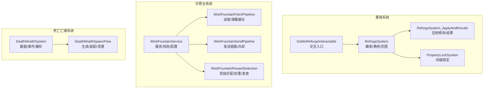
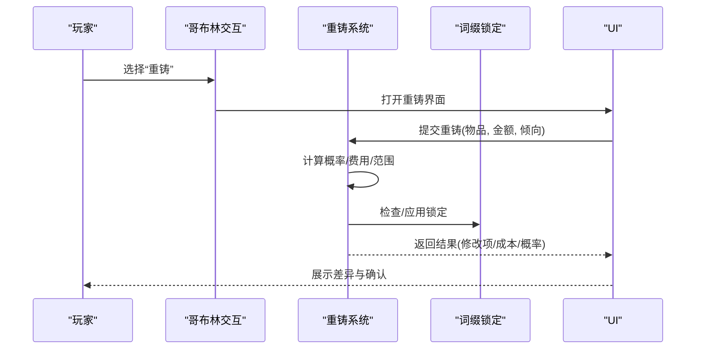
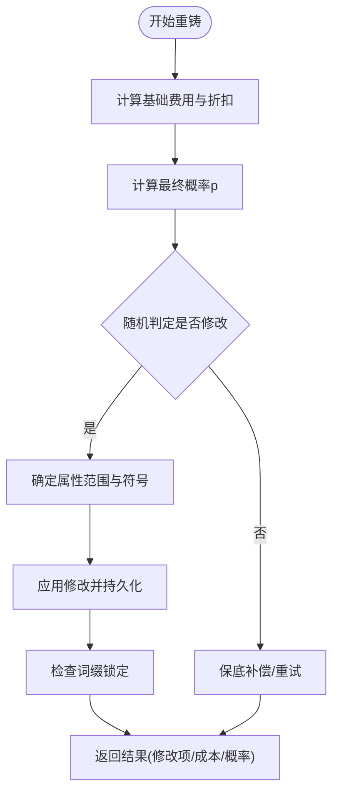
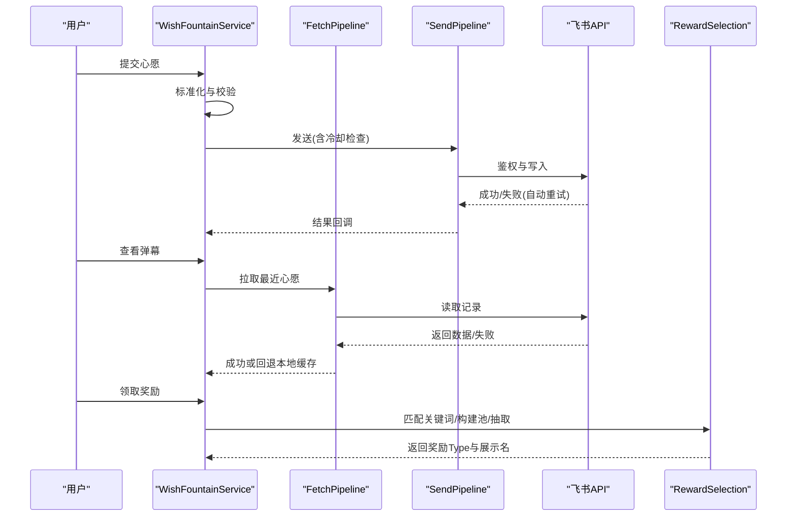
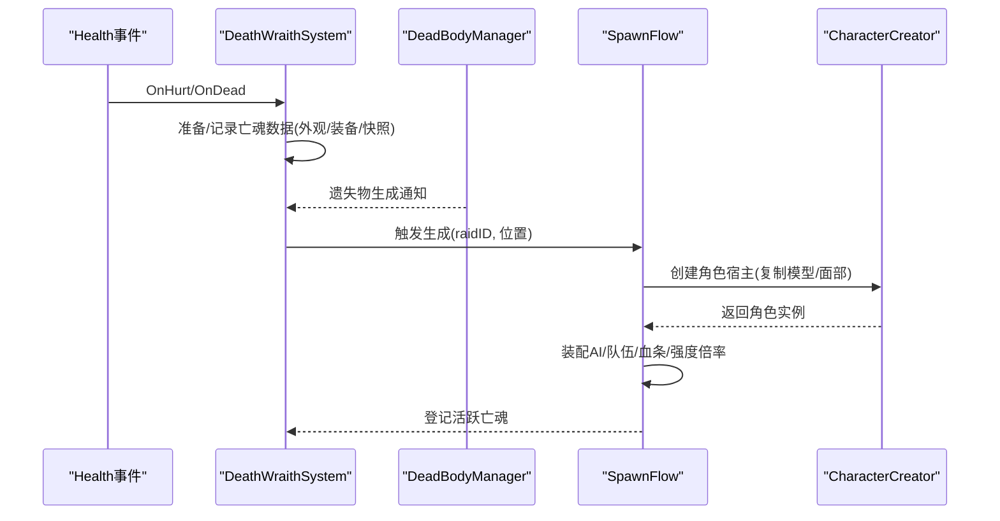
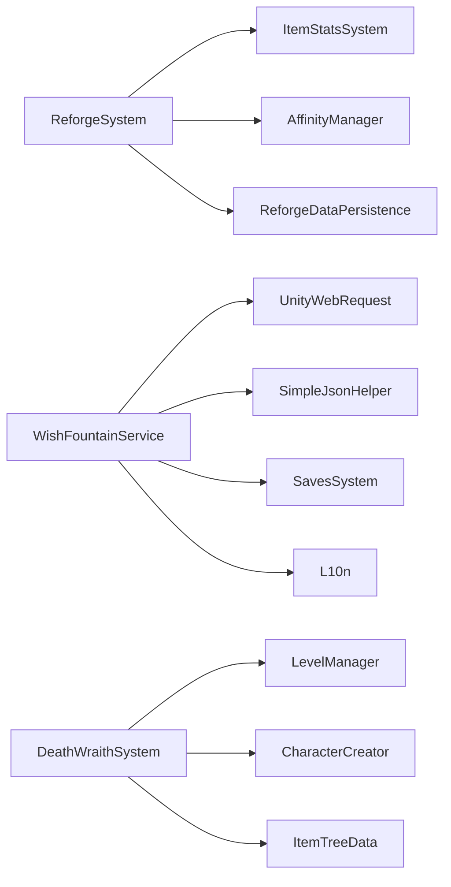

# 高级功能

<cite>
**本文引用的文件**
- [ReforgeSystem.cs](file://Integration/Reforge/ReforgeSystem.cs)
- [ReforgeSystem_ApplyAndResults.cs](file://Integration/Reforge/ReforgeSystem_ApplyAndResults.cs)
- [PropertyLockSystem.cs](file://Integration/Reforge/PropertyLockSystem.cs)
- [GoblinReforgeInteractable.cs](file://Integration/Reforge/GoblinReforgeInteractable.cs)
- [WishFountainService.cs](file://Integration/WishFountain/WishFountainService.cs)
- [WishFountainFetchPipeline.cs](file://Integration/WishFountain/WishFountainFetchPipeline.cs)
- [WishFountainSendPipeline.cs](file://Integration/WishFountain/WishFountainSendPipeline.cs)
- [WishFountainRewardSelection.cs](file://Integration/WishFountain/WishFountainRewardSelection.cs)
- [DeathWraithSystem.cs](file://Integration/DeathWraith/DeathWraithSystem.cs)
- [DeathWraithSpawnFlow.cs](file://Integration/DeathWraith/DeathWraithSpawnFlow.cs)
</cite>

## 目录
1. [简介](#简介)
2. [项目结构](#项目结构)
3. [核心组件](#核心组件)
4. [架构总览](#架构总览)
5. [详细组件分析](#详细组件分析)
6. [依赖关系分析](#依赖关系分析)
7. [性能考量](#性能考量)
8. [故障排查指南](#故障排查指南)
9. [结论](#结论)
10. [附录](#附录)

## 简介
本文件面向 BossRushMod 的高级玩法系统，系统性说明以下模块的技术实现、配置要点、与游戏内其他系统的集成方式，以及性能优化、错误处理与扩展开发建议：
- 重铸系统：属性重铸算法、词缀锁定、材料消耗与保底机制。
- 许愿台系统：在线 API 集成（飞书鉴权与写入）、愿望记录、奖励池构建与发放。
- 死亡亡魂系统：玩家死亡处理、亡魂生成流程、强度分级与持久化。
- 遗种巢系统：基地侧养成与收集（掉落双轨、孵化 roll、单席随从进局、天灾远征、博物馆图鉴）。详见 [遗种巢系统](遗种巢系统.md)。
- 鸭皇图鉴系统：全模式击杀采集、槽位级存档、Boss 立绘收集与里程碑成就。详见 [鸭皇图鉴系统](鸭皇图鉴系统.md)。
- 局内随机事件系统「鸭生无常」：边缘轮询调度、8 个限时事件、波次隔离与模式门控。详见 [局内随机事件系统](局内随机事件系统.md)。
- 词缀锻造系统：12 条行为型词缀、物品 KV 承载、手持/穿戴门控与重铸互斥。详见 [词缀锻造系统](词缀锻造系统.md)。

## 项目结构
围绕三个高级系统，代码按“子系统 + 职责拆分”组织：
- 重铸系统：核心算法、应用与结果、属性固定、交互入口。
- 许愿台系统：服务与校验、读取与缓存、发送链路、奖励选择与动画。
- 死亡亡魂系统：数据模型与事件绑定、生成流程与运行时装配。
- 遗种巢系统：`PetNest/` 下按数据层 / 持久化层 / 领域服务层 / 运行时层 / 呈现层五段分层。
- 鸭皇图鉴系统：`Integration/Codex/` 下按常量 / DTO / 编解码 / 持久化 / 目录 / 采集 / 呈现分层，数据源是官方 Health 静态事件。
- 局内随机事件系统：`RandomEvents/` 下按 Tuning / 模型 / 门控 / 调度器 / 事件目录 / 宿主桥 / HUD 分层。
- 词缀锻造系统：`Integration/AffixForge/` 下按定义表 / KV schema / 锻造逻辑 / 运行时服务 / Buff 工厂 / 交互入口分层。

图表来源
- [ReforgeSystem.cs:1-120](file://Integration/Reforge/ReforgeSystem.cs#L1-L120)
- [ReforgeSystem_ApplyAndResults.cs:14-179](file://Integration/Reforge/ReforgeSystem_ApplyAndResults.cs#L14-L179)
- [PropertyLockSystem.cs:23-140](file://Integration/Reforge/PropertyLockSystem.cs#L23-L140)
- [GoblinReforgeInteractable.cs:20-85](file://Integration/Reforge/GoblinReforgeInteractable.cs#L20-L85)
- [WishFountainService.cs:34-160](file://Integration/WishFountain/WishFountainService.cs#L34-L160)
- [WishFountainFetchPipeline.cs:29-207](file://Integration/WishFountain/WishFountainFetchPipeline.cs#L29-L207)
- [WishFountainSendPipeline.cs:191-364](file://Integration/WishFountain/WishFountainSendPipeline.cs#L191-L364)
- [WishFountainRewardSelection.cs:23-124](file://Integration/WishFountain/WishFountainRewardSelection.cs#L23-L124)
- [DeathWraithSystem.cs:34-246](file://Integration/DeathWraith/DeathWraithSystem.cs#L34-L246)
- [DeathWraithSpawnFlow.cs:27-247](file://Integration/DeathWraith/DeathWraithSpawnFlow.cs#L27-L247)

章节来源
- [ReforgeSystem.cs:1-120](file://Integration/Reforge/ReforgeSystem.cs#L1-L120)
- [WishFountainService.cs:34-160](file://Integration/WishFountain/WishFountainService.cs#L34-L160)
- [DeathWraithSystem.cs:34-246](file://Integration/DeathWraith/DeathWraithSystem.cs#L34-L246)

## 核心组件
- 重铸系统
- 鸭皇图鉴系统
- 局内随机事件系统
- 词缀锻造系统
  - 概率与费用：基于稀有度、物品价值与投入金钱计算最终概率；基础费用为物品价值的百分之一并设下限。
  - 属性范围：小数值属性使用绝对范围或百分比范围；整数属性保持整数；支持强制绝对范围键。
  - 保底机制：通过重铸计数与失败累积提升成功率。
  - 词缀锁定：以 Variables 前缀标记已锁定属性，避免被重铸覆盖。
  - 交互入口：哥布林 NPC 提供“重铸”子选项，打开 UI 并播放音效。
- 许愿台系统
  - 文本标准化与内容校验：长度、字符集、重复、链接、敏感词过滤。
  - 在线 API：飞书应用鉴权（tenant_access_token），多维表格写入心愿记录；自动重试与失效刷新。
  - 弹幕读取与缓存：拉取最近心愿，本地 Base64 缓存，TTL 复用。
  - 奖励选择：关键词匹配类别与具体物品，质量权重与物品权重叠加，发放时带动画候选池。
- 死亡亡魂系统
  - 死亡事件绑定：受伤/死亡回调中准备与记录亡魂数据。
  - 生成流程：在原版遗失物出现时于同一子场景位置生成亡魂，复制外观与装备，设置 AI 与团队。
  - 强度分级：根据掉落物品价值与玩家总财产比例分为弱/均衡/强三档，调整移速与攻击等。
  - 持久化：内存列表+存档点去抖落盘，跨槽位切换清理缓存。

章节来源
- [ReforgeSystem.cs:191-800](file://Integration/Reforge/ReforgeSystem.cs#L191-L800)
- [ReforgeSystem_ApplyAndResults.cs:14-320](file://Integration/Reforge/ReforgeSystem_ApplyAndResults.cs#L14-L320)
- [PropertyLockSystem.cs:23-285](file://Integration/Reforge/PropertyLockSystem.cs#L23-L285)
- [GoblinReforgeInteractable.cs:20-455](file://Integration/Reforge/GoblinReforgeInteractable.cs#L20-L455)
- [WishFountainService.cs:34-646](file://Integration/WishFountain/WishFountainService.cs#L34-L646)
- [WishFountainFetchPipeline.cs:29-709](file://Integration/WishFountain/WishFountainFetchPipeline.cs#L29-L709)
- [WishFountainSendPipeline.cs:191-364](file://Integration/WishFountain/WishFountainSendPipeline.cs#L191-L364)
- [WishFountainRewardSelection.cs:23-800](file://Integration/WishFountain/WishFountainRewardSelection.cs#L23-L800)
- [DeathWraithSystem.cs:34-246](file://Integration/DeathWraith/DeathWraithSystem.cs#L34-L246)
- [DeathWraithSpawnFlow.cs:27-464](file://Integration/DeathWraith/DeathWraithSpawnFlow.cs#L27-L464)

## 架构总览
三个子系统既相对独立又通过 ModBehaviour 与游戏事件进行耦合：
- 重铸系统通过哥布林交互触发，UI 层调用 ReforgeSystem 执行概率与修改，PropertyLockSystem 维护锁定状态。
- 许愿台系统由 Service 统一封装网络与校验，Fetch/Send Pipeline 负责读写，Reward Selection 负责奖励池与发放。
- 死亡亡魂系统订阅 Health 事件与 DeadBodyManager 生命周期，在合适时机异步生成并装配亡魂。

图表来源
- [GoblinReforgeInteractable.cs:56-79](file://Integration/Reforge/GoblinReforgeInteractable.cs#L56-L79)
- [ReforgeSystem.cs:301-420](file://Integration/Reforge/ReforgeSystem.cs#L301-L420)
- [PropertyLockSystem.cs:61-140](file://Integration/Reforge/PropertyLockSystem.cs#L61-L140)
- [ReforgeSystem_ApplyAndResults.cs:147-179](file://Integration/Reforge/ReforgeSystem_ApplyAndResults.cs#L147-L179)

## 详细组件分析

### 重铸系统（属性重铸、词缀锁定、材料消耗）
- 概率与费用
  - 基础概率受稀有度与物品价值影响；金钱投入按分段对数曲线提供加成；最终概率 clamp 到 [0,1]。
  - 基础费用为物品价值的百分之一，最低保底值；支持好感度折扣。
- 属性范围与类型
  - 小数值属性：≤阈值时使用绝对范围，否则使用百分比范围；支持强制绝对范围键（如护甲）。
  - 整数属性：保持整数；统计字段排除特定内部时序键。
- 保底机制
  - 通过变量 ReforgeCount 追踪次数，结合失败累积提升成功率。
- 词缀锁定
  - 使用 Variables 前缀标记 Modifier/Stat/Variable 三类属性的锁定状态；可查询与解锁。
- 应用与结果
  - 委托缓存优化反射写入；持久化保存重铸前后值，确保跨场景恢复。
  - 结果对象包含成功标志、错误信息、总成本、最终概率与修改项详情。

图表来源
- [ReforgeSystem.cs:301-420](file://Integration/Reforge/ReforgeSystem.cs#L301-L420)
- [ReforgeSystem_ApplyAndResults.cs:147-179](file://Integration/Reforge/ReforgeSystem_ApplyAndResults.cs#L147-L179)
- [PropertyLockSystem.cs:61-140](file://Integration/Reforge/PropertyLockSystem.cs#L61-L140)

章节来源
- [ReforgeSystem.cs:191-800](file://Integration/Reforge/ReforgeSystem.cs#L191-L800)
- [ReforgeSystem_ApplyAndResults.cs:14-320](file://Integration/Reforge/ReforgeSystem_ApplyAndResults.cs#L14-L320)
- [PropertyLockSystem.cs:23-285](file://Integration/Reforge/PropertyLockSystem.cs#L23-L285)

### 许愿台系统（在线 API 集成、愿望记录、奖励发放）
- 文本标准化与校验
  - 全角转半角、空白折叠、换行统一；长度限制与敏感词黑名单；联系方式与广告引流检测。
- 在线 API
  - 飞书应用鉴权：获取 tenant_access_token，缓存并在过期前刷新；请求失败时自动重试一次。
  - 写入心愿记录：构造 JSON 字段（时间、版本、玩家名、心愿内容、场景、语言），POST 至多维表格。
  - 全局冷却：防止频繁提交，显示剩余秒数。
- 弹幕读取与缓存
  - 拉取最近心愿，Base64 编码本地缓存；TTL 内直接返回快照；失败回退到本地缓存。
- 奖励选择与发放
  - 关键词匹配：中文/英文别名匹配类别与具体物品；构建过滤后的候选池。
  - 质量权重：基础权重 + 类别偏好 + 精确物品命中修正；按权重抽取品质。
  - 物品权重：类别与自定义物品权重叠加，上限封顶；从对应品质桶中抽取 TypeID。
  - 动画候选池：主/次/三级候选池，避免连续重复，优先不同上次物品。

图表来源
- [WishFountainService.cs:34-160](file://Integration/WishFountain/WishFountainService.cs#L34-L160)
- [WishFountainFetchPipeline.cs:29-207](file://Integration/WishFountain/WishFountainFetchPipeline.cs#L29-L207)
- [WishFountainSendPipeline.cs:191-364](file://Integration/WishFountain/WishFountainSendPipeline.cs#L191-L364)
- [WishFountainRewardSelection.cs:23-800](file://Integration/WishFountain/WishFountainRewardSelection.cs#L23-L800)

章节来源
- [WishFountainService.cs:34-646](file://Integration/WishFountain/WishFountainService.cs#L34-L646)
- [WishFountainFetchPipeline.cs:29-709](file://Integration/WishFountain/WishFountainFetchPipeline.cs#L29-L709)
- [WishFountainSendPipeline.cs:191-364](file://Integration/WishFountain/WishFountainSendPipeline.cs#L191-L364)
- [WishFountainRewardSelection.cs:23-800](file://Integration/WishFountain/WishFountainRewardSelection.cs#L23-L800)

### 死亡亡魂系统（玩家死亡处理、亡魂生成、强度分级）
- 事件绑定与数据准备
  - 订阅 Health.OnHurt/OnDead，记录玩家外观、语音、步态、最大生命、绑定近战武器快照与装备树。
  - 内存列表缓存亡魂记录，借官方存档点去抖落盘，避免死亡帧卡顿。
- 生成流程
  - 监听原版遗失物生成事件，在同一子场景与相近位置消费上下文，异步创建亡魂宿主。
  - 复制角色模型与面部数据，回填绑定近战武器，设置 AI 预设与队伍，开启血条。
- 强度分级
  - 根据掉落物品价值与玩家总财产比例划分弱/均衡/强三档，调整移速与攻击倍率。
- 清理与注册
  - 登记活跃亡魂映射，异常中断时销毁实例并清理集合；拾取遗失物后移除对应记录。

图表来源
- [DeathWraithSystem.cs:187-246](file://Integration/DeathWraith/DeathWraithSystem.cs#L187-L246)
- [DeathWraithSpawnFlow.cs:27-247](file://Integration/DeathWraith/DeathWraithSpawnFlow.cs#L27-L247)

章节来源
- [DeathWraithSystem.cs:34-246](file://Integration/DeathWraith/DeathWraithSystem.cs#L34-L246)
- [DeathWraithSpawnFlow.cs:27-464](file://Integration/DeathWraith/DeathWraithSpawnFlow.cs#L27-L464)

## 依赖关系分析
- 重铸系统
  - 依赖 ItemStatsSystem 的 Modifier/Stat/CustomData 进行属性读写。
  - 依赖 AffinityManager 获取哥布林好感度折扣。
  - 依赖 ReforgeDataPersistence 持久化重铸前后值。
- 许愿台系统
  - 依赖 UnityWebRequest 与 SimpleJsonHelper 进行网络与 JSON 解析。
  - 依赖 SavesSystem 事件用于奖励冷却落盘。
  - 依赖 L10n 进行多语言提示。
- 死亡亡魂系统
  - 依赖 LevelManager/CharacterCreator 创建角色。
  - 依赖 ItemTreeData 实例化装备树。
  - 依赖 Team/AI 预设与 CharacterMainControl 控制行为。

图表来源
- [ReforgeSystem.cs:18-27](file://Integration/Reforge/ReforgeSystem.cs#L18-L27)
- [WishFountainService.cs:18-31](file://Integration/WishFountain/WishFountainService.cs#L18-L31)
- [DeathWraithSystem.cs:16-31](file://Integration/DeathWraith/DeathWraithSystem.cs#L16-L31)

章节来源
- [ReforgeSystem.cs:18-27](file://Integration/Reforge/ReforgeSystem.cs#L18-L27)
- [WishFountainService.cs:18-31](file://Integration/WishFountain/WishFountainService.cs#L18-L31)
- [DeathWraithSystem.cs:16-31](file://Integration/DeathWraith/DeathWraithSystem.cs#L16-L31)

## 性能考量
- 重铸系统
  - 委托缓存替代反射：ModifierDescription.value 与 Stat.baseValue 写入使用表达式编译的委托，显著降低热路径开销。
  - 属性范围计算集中化：GetPropertyValueBounds 保证 UI 与实际重铸一致，减少重复计算。
  - 保底与失败累积：通过变量计数与失败补偿，避免极端低概率导致的体验问题。
- 许愿台系统
  - 弹幕读取 TTL：短时间内的重复请求直接返回缓存快照，降低网络压力。
  - 本地缓存：Base64 编码的心愿列表持久化，离线可用。
  - 鉴权令牌缓存：提前刷新预留时间，减少鉴权失败重试。
  - 奖励池预热：分桶与索引结构加速匹配与抽取。
- 死亡亡魂系统
  - 内存列表+去抖落盘：避免死亡帧同步序列化导致的主线程卡顿。
  - 异步生成：使用协程/异步任务分离耗时操作，保障流畅性。
  - 预取与缓存：角色模型与 AI 预设缓存，减少查找开销。

[本节为通用性能指导，不直接分析具体文件]

## 故障排查指南
- 重铸系统
  - 若属性未生效：检查 IsModifierEligibleForReforge/IsStatEligibleForReforge/IsVariableEligibleForReforge 的筛选条件，确认 Display 与 Key 白名单。
  - 若词缀锁定无效：确认 Variables 前缀是否正确写入且值为≥1；检查 GetLockedProperties 扫描逻辑。
  - 若费用异常：核对 GetItemValue 的回退链（item.Value → GetTotalRawValue → prefab 值）。
- 许愿台系统
  - 若无法发送：检查 IsInCooldown 与 IsSending 状态；确认飞书配置有效与 token 缓存是否失效。
  - 若弹幕为空：查看 TryLoadDanmakuCacheSnapshot 与本地缓存文件是否存在；确认网络失败时的回退逻辑。
  - 若奖励不符：检查 MatchWishRewardKeywords 的别名匹配与 poolMode；查看日志中的 matchedCategories/matchedItems。
- 死亡亡魂系统
  - 若未生成：确认 NotifyOriginalDeadBodySpawnRequested/NotifyOriginalDeadBodyLootboxCreated 事件是否触发；检查子场景与位置匹配。
  - 若外观丢失：检查 ApplyStoredWraithFaceData 与 EnsureStoredBoundMeleeEquipped 的执行结果。
  - 若强度异常：核对 ClassifyWraithTier 的比例阈值与 ApplyWraithTierStats 的倍率应用。

章节来源
- [ReforgeSystem.cs:543-625](file://Integration/Reforge/ReforgeSystem.cs#L543-L625)
- [PropertyLockSystem.cs:61-140](file://Integration/Reforge/PropertyLockSystem.cs#L61-L140)
- [WishFountainSendPipeline.cs:191-364](file://Integration/WishFountain/WishFountainSendPipeline.cs#L191-L364)
- [WishFountainFetchPipeline.cs:239-337](file://Integration/WishFountain/WishFountainFetchPipeline.cs#L239-L337)
- [WishFountainRewardSelection.cs:321-366](file://Integration/WishFountain/WishFountainRewardSelection.cs#L321-L366)
- [DeathWraithSpawnFlow.cs:27-119](file://Integration/DeathWraith/DeathWraithSpawnFlow.cs#L27-L119)

## 结论
三大高级系统在架构上职责清晰、模块化良好：
- 重铸系统通过概率与范围控制、词缀锁定与保底机制，提供可控且有趣的属性成长体验。
- 许愿台系统以稳健的网络层与本地缓存保障可用性，并通过关键词匹配与权重体系实现个性化奖励。
- 死亡亡魂系统借助事件驱动与异步生成，将玩家死亡转化为具有挑战性的战斗体验，同时兼顾性能与稳定性。

建议在后续扩展中：
- 为重铸系统增加更多可配置的概率曲线与属性白名单。
- 为许愿台系统开放更多类别与别名配置，便于运营活动定制。
- 为死亡亡魂系统增加难度缩放与掉落策略，增强重玩价值。

[本节为总结性内容，不直接分析具体文件]

## 附录
- 关键常量参考
  - 重铸：最小费用、基础概率、金钱增益阈值、属性范围阈值、强制绝对范围键。
  - 许愿台：最小/最大字符数、冷却时间、弹幕显示数量、TTL。
  - 亡魂：保存键、AI 预设名称、待处理超时与帧差、去抖延迟。
- 扩展点
  - 重铸：新增不支持的 Stat/Variable 键、新增强制绝对范围键。
  - 许愿台：新增类别与别名、自定义物品定义、奖励池模式。
  - 亡魂：新增强度等级、新增外观/语音/步态配置。

[本节为补充信息，不直接分析具体文件]