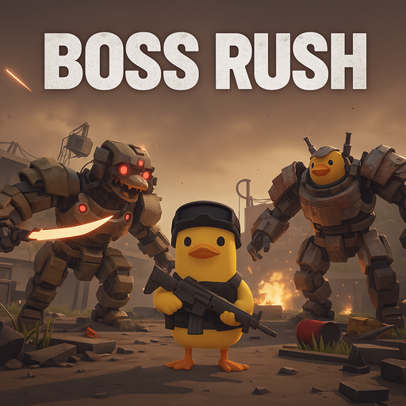

# Boss Rush Mod for 鸭科夫 (Escape from Duckov)

**[English](README_EN.md)** | **中文**

<p align="center">
  
</p>

[](https://steamcommunity.com/sharedfiles/filedetails/?id=3612465423)
[](https://store.steampowered.com/app/3167020)
[](LICENSE)

## 📖 简介

Boss Rush Mod 为鸭科夫添加了多种挑战模式，让你在专属竞技场中与一波又一波的 Boss 战斗！

## ✨ 功能特性

### 🎮 游戏模式

| 模式 | 描述 |
|------|------|
| **弹指可灭** | 每波 1 个 Boss，适合新手入门 |
| **有点意思** | 每波 3 个 Boss，标准挑战难度 |
| **无间炼狱** | 无限波次，Boss 数量可配置，挑战你的极限！ |
| **白手起家** | 无限波次，Boss 数量可配置，裸体入场，随机装备 |

### ⚙️ 可配置选项

通过 [ModConfig](https://steamcommunity.com/sharedfiles/filedetails/?id=XXXXXXX) 或本地配置文件调整：

- 波次间休息时间 (2-60秒)
- Boss 掉落随机化
- 无间炼狱每波 Boss 数量 (1-10)
- Boss 全局数值倍率 (0.1-10x)
- 白手起家每波敌人数 (1-10)
- 掉落箱是否作为掩体

## 🛠️ 从源码构建

### 环境要求

- Windows 系统
- .NET Framework 4.7.2 或 .NET Standard 2.1
- 鸭科夫游戏本体（用于引用程序集）

### 依赖程序集

从游戏目录 `Duckov_Data\Managed\` 获取：

```
Assembly-CSharp.dll
TeamSoda.Duckov.Core.dll
UnityEngine.dll
UnityEngine.CoreModule.dll
UnityEngine.UI.dll
Unity.TextMeshPro.dll
UniTask.dll
```

## 📁 项目结构

```
BossRushMod/
├── Assets/              # 资源文件（图标、纹理）
├── Build/               # 编译输出
├── Config/              # 配置系统
├── DebugAndTools/       # 调试工具
├── Injection/           # 游戏系统注入
├── Integration/         # 游戏集成逻辑
├── Interactables/       # 交互对象
├── LootAndRewards/      # 掉落与奖励系统
├── ModeD/               # 白手起家模式
├── UIAndSigns/          # UI 与路牌
├── Utilities/           # 工具函数
├── WavesArena/          # 波次与竞技场管理
├── ModBehaviour.cs      # 主入口（partial class）
├── info.ini             # Mod 元数据
└── compile_official.bat # 编译脚本
```

## 🔧 配置文件

配置文件位置：`StreamingAssets/BossRushModConfig.txt`

```json
{
  "waveIntervalSeconds": 15,
  "enableRandomBossLoot": true,
  "useInteractBetweenWaves": false,
  "lootBoxBlocksBullets": false,
  "infiniteHellBossesPerWave": 3,
  "bossStatMultiplier": 1.0,
  "modeDEnemiesPerWave": 3
}
```

## 📄 许可证

本项目采用 MIT 许可证 - 详见 [LICENSE](LICENSE) 文件

---

<p align="center">
  Made with ❤️ for 鸭科夫 community
</p>
