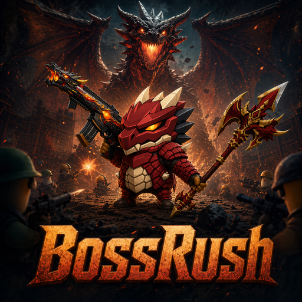

# BossRushMod for Escape from Duckov

**English** | **[中文](README.md)**

<p align="center">
  
</p>

[](https://steamcommunity.com/sharedfiles/filedetails/?id=3612465423)
[](https://store.steampowered.com/app/3167020)
[](LICENSE)

## Overview

BossRushMod is a large-scale integrated mod for Escape from Duckov. It started from the BossRush arena loop, but the current source baseline now includes multiple gameplay modes, custom bosses, custom gear and items, persistent NPC storylines, achievements, reforging, an in-game wiki, localization, audio work, and runtime stability systems.

This README reflects the current source baseline in the repository. For the full developer-facing overview, see [docs/项目全景文档.md](docs/项目全景文档.md).

## At a Glance

- 5 major gameplay modes: 3 standard BossRush variants, Mode D, and Mode E
- 9 maps integrated into the BossRush flow
- 2 major custom bosses: Dragon Descendant and the Dragon King
- 3 persistent NPCs: Awen, Dingdang, and Yu Zhi
- Multiple long-running systems: gear abilities, items, reforge, affinity, marriage, achievements, and the in-game wiki

## Game Modes

| Mode | Entry Requirement | Core Rules |
|------|-------------------|------------|
| **Easy** | Enter with a BossRush Ticket | 1 boss per wave, best first-run option |
| **Hard** | Enter with a BossRush Ticket | 3 bosses per wave, standard multi-target pressure |
| **Infinite Hell** | Enter with a BossRush Ticket | Endless waves, configurable bosses per wave, includes cash pool and auto-collection |
| **Mode D: Rags to Riches** | Enter naked with a BossRush Ticket | Random starting loadout, separate enemy pool, separate drop and growth curve |
| **Mode E: Faction War** | Enter naked with a faction flag | Multi-faction sandbox battle with random flag, fixed faction flags, and the solo `Player Flag` route |

## Supported Maps

The current codebase registers 9 maps for BossRush:

- DEMO Ultimate Challenge
- Zero Challenge
- Ground Zero
- Hidden Warehouse
- Farm Town
- J-Lab Laboratory
- Underground Arena
- Zone 37 Experimental Area
- Maze

Map selection is integrated into the original game UI flow, and that integration is shared across standard BossRush, Mode D, and Mode E.

## Custom Content

### Bosses

- **Dragon Descendant**
- **Dragon King**, also surfaced in English as **Skyburner Dragon Lord**

### NPCs

- **Awen**: courier, shop/storage integration, early guidance, and wiki-related flow
- **Dingdang**: goblin NPC tied to gifts, discounts, story progression, and the reforge system
- **Yu Zhi**: nurse NPC handling healing, relationship progression, and marriage content

### Gear and Abilities

- Dragon Set
- Dragon King Set
- Flight Totem
- Reverse Scale
- Dragon King signature weapons

### Key Items

- BossRush Ticket
- Birthday Cake
- Adventurer's Journal / Wiki Book
- Diamond, Diamond Ring, Brickstone, Calming Drops, Peace Charm, Dingdang Graffiti, Wild Horn
- Mode E faction flags
- Mode E battlefield items: Taunt Smoke, Chaos Detonator, Bosscall Whistle, Bloodhunt Beacon
- Achievement Medal

### Major Systems

- NPC affinity, dialogue, gifts, gift container flow, shops, marriage
- Equipment reforge
- Achievement system with Steam-style popups
- In-game wiki
- BossFilter for boss pool control and Infinite Hell weight editing
- Wave rewards, loot crates, and arena interactables
- Runtime recovery and stability systems such as cash magnet and enemy recovery monitoring

## Configuration

BossRush currently supports two configuration entry points:

1. `ModConfig`
2. Local file: `StreamingAssets/BossRushModConfig.txt`

Key config fields:

| Key | Default | Description |
|-----|---------|-------------|
| `waveIntervalSeconds` | `15` | Rest time between waves |
| `enableRandomBossLoot` | `true` | Enables randomized boss loot bonus |
| `useInteractBetweenWaves` | `false` | Requires manual interaction to start the next wave |
| `lootBoxBlocksBullets` | `false` | Makes loot crates act as bullet-blocking cover |
| `infiniteHellBossesPerWave` | `3` | Boss count per Infinite Hell wave |
| `bossStatMultiplier` | `1.0` | Global boss stat multiplier |
| `modeDEnemiesPerWave` | `3` | Enemy count per Mode D wave |
| `disabledBosses` | `[]` | Disabled boss list |
| `bossInfiniteHellFactors` | `{}` | Infinite Hell boss weight multipliers |
| `enableDragonDash` | `true` | Enables Dragon Dash related abilities |
| `achievementHotkey` | `L` | Achievement panel hotkey, stored internally as an integer `KeyCode` |
| `useWolfModelForWildHorn` | `true` | Uses the wolf model for Wild Horn |

## Tech Stack and Runtime

| Item | Details |
|------|---------|
| Language | C# 7.3 |
| Runtime | Unity with the game's embedded Mono runtime |
| Build Method | `compile_official.bat` directly invokes Roslyn `csc.dll` from an installed .NET SDK; there is no `.csproj` |
| Output | `Build/BossRush.dll` |
| Harmony | Referenced through `0Harmony.dll` from the Workshop path, mainly for Mode E runtime patches |

## Building from Source

This repository is not a standard `.csproj` solution. It is a script-driven C# source tree.

### Build Scripts

- `compile_official.bat`: compiles the source list and attempts to deploy `Build/BossRush.dll`
- `test_bossrush_official.bat`: compiles and copies the result into the local game directory for testing
- `cleanup_old_files.bat`: removes stale generated files

### Environment Requirements

- Windows
- Installed `dotnet` SDK
- Local Escape from Duckov installation
- Local Workshop content directory and `HarmonyLoadMod`
- Game assemblies available under `Duckov_Data\\Managed\\`

### Maintenance Notes

- Every new `.cs` file must also be added to `compile_official.bat`, or it will not be compiled.
- The build scripts contain hard-coded paths and must be adjusted when moving machines or drives.
- `ModBehaviour` is the central entry point, but a large amount of logic is split across many `partial class` files.

## Project Structure

```text
BossRushMod/
├── ModBehaviour.cs                  # Main entry point and global state
├── ModConfigApi.cs                  # ModConfig wrapper
├── Achievement/                     # Achievements, medal item, Steam-style popups
├── Audio/                           # Audio management
├── BossFilter/                      # Boss pool filtering and Infinite Hell factors
├── Config/                          # Runtime config and data
├── DebugAndTools/                   # ItemSpawner, InventoryInspector, NPC teleport UI
├── Integration/                     # Dynamic items, equipment, NPCs, shops, wiki, affinity systems
├── Interactables/                   # Signposts, supplies, repair, cleanup, teleport
├── Localization/                    # Localization injection and text management
├── LootAndRewards/                  # Loot, rewards, reward crates
├── MapSelection/                    # BossRush map selection integration
├── ModeD/                           # Rags to Riches
├── ModeE/                           # Faction War, flags, merchant, battlefield items
├── UIAndSigns/                      # Arena prompts, banners, sign UI
├── Utilities/                       # Spawn logic, caches, enemy recovery monitoring
├── WavesArena/                      # Standard BossRush and Infinite Hell core logic
├── WikiContent/                     # In-game wiki content
└── docs/                            # Design and project documentation
```

## Debug and Developer Hotkeys

The project includes an extensive built-in debug layer. Common hotkeys:

| Hotkey | Action |
|--------|--------|
| `F2` | Toggle `ItemSpawner` |
| `F3` | Toggle the marriage test panel |
| `F4` | Clear achievement data |
| `F5` | Dump nearby building/object info |
| `F6` | Toggle placement mode |
| `F7` | Dump nearest interact point info |
| `F8` | Dump nearby character info |
| `F9` | Grant a BossRush Ticket and open map selection |
| `F10` | Force-clear the arena and trigger the victory flow |
| `F11` | Open `InventoryInspector` |
| `F12` | Toggle the NPC teleport UI |
| `Ctrl+F10` | Toggle BossFilter |
| `L` | Default achievement panel hotkey |

## Documentation

- Project overview: [docs/项目全景文档.md](docs/项目全景文档.md)
- Design docs: [docs/](docs/)
- In-game wiki content: [WikiContent/](WikiContent/)

## License

This project is licensed under the [MIT License](LICENSE).
