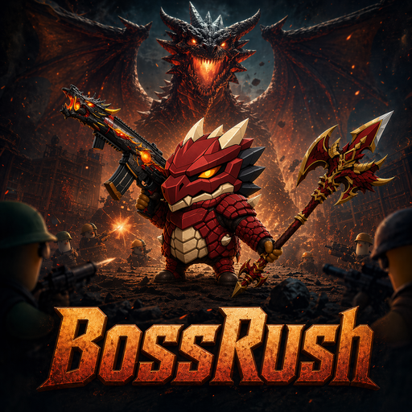

# BossRushMod for Escape from Duckov

**English** | **[中文](README.md)**

<p align="center">
  
</p>

[](https://steamcommunity.com/sharedfiles/filedetails/?id=3612465423)
[](https://store.steampowered.com/app/3167020)
[](LICENSE)

A large gameplay mod for Escape from Duckov. It started as a BossRush arena and now includes eight game modes, a standalone raid map, original bosses and gear, NPC relationship lines, a story campaign, base buildings, and a long list of runtime stability fixes.

- **Player docs**: [online wiki](https://gasen1216.github.io/BossRushMod/) (same text as the in-game wiki, Chinese and English)
- **Subscribe**: [Steam Workshop](https://steamcommunity.com/sharedfiles/filedetails/?id=3612465423)
- **Contributing / AI collaboration**: read [AGENTS.md](AGENTS.md) first (written in Chinese)

## What's Inside

### Game Modes

| Mode | How to enter | What it is |
| --- | --- | --- |
| Standard BossRush | Carry a BossRush Ticket | 1 or 3 bosses per wave |
| Infinite Hell | Carry a BossRush Ticket | Endless waves, configurable bosses per wave, cash pool and auto-collection |
| From Scratch (Mode D) | Enter naked with a Ticket | Random starting loadout, separate enemy pool, drops and growth curve |
| Faction War (Mode E) | Enter naked with a faction flag | Multi-faction sandbox battle |
| Blood Hunt (Mode F) | Enter naked with a Ticket and a Bloodhunt Transponder | Four-phase battle royale: constant bleed, kill-to-heal, bounty tracking, fortifications, extraction |
| Fate Echo (Mode G) | Carry a Ticket and a Fate Echo Relic | Fixed nine waves in three acts, with a nemesis and contracts that counter you |
| Black Market Duck Cup (Mode H) | The boat at the base dock, one Ticket | You manage instead of fight: sign fighters, read the odds, six matches per season |
| Zombie Mode | Buy a Zombie Tide Invitation from the base merchant | Standalone survival mode: purification-point economy, a pick after every wave, extraction payout |

### Maps

- **9 BossRush arena maps**, selected through the original map UI.
- **Sky Islands · Qinglan**: a standalone raid map reached from the base boat; no ticket needed. Twelve islands with a main story of repairing wind vanes and star lamps, scavenging and gathering, recipes, resident requests, and the boss the Windeater.

### Bosses, NPCs and Gear

- **Original bosses**: Dragon Descendant, Skyburner Dragon Lord, Phantom Witch.
- **NPCs**: Awen (courier), Dingdang (goblin smith, reforging), Yuori (nurse), plus permanent NPCs made with the duck-face NPC tool; affinity, gifts and marriage.
- **Gear**: Dragon Set, Dragon King Set, Frost Set, Thunder Set, Cloud Rider Totem, Reverse Scale, Skyburner Halberd, Dragon Breath, Dragon Cannon, Soulreaper's Requiem, Frostmourne, Viper Dagger, Summoning Staff, Energy Shield, Frost Spear, Thunder Ring.

### Systems

Duck King Campaign (six-chapter story), Arena Backyard (garden, trophy registry, jukebox), PetNest (raise boss hatchlings), The Duckov Daily, Duck King Codex, random events, affix forging, reforging, StarWish Fountain, death wraiths, mutators, achievements, boss filter, in-game wiki.

Rules, numbers and how to get each item are on the online wiki.

## Configuration

Two entry points: `ModConfig`, and `StreamingAssets/BossRushModConfig.txt` (JSON) in the game folder. Gameplay systems are on by default. Duckov Chance can be disabled; other content systems expose tuning options. Common keys:

| Key | Default | Description |
| --- | --- | --- |
| `waveIntervalSeconds` | `15` | Rest time between waves (seconds) |
| `milestoneRestBonusSeconds` | `30` | Extra rest every 5 waves (seconds), 0 = none |
| `useInteractBetweenWaves` | `false` | Start the next wave manually by interacting |
| `infiniteHellBossesPerWave` | `3` | Bosses per Infinite Hell wave |
| `bossStatMultiplier` | `1.0` | Global boss stat multiplier |
| `modeDEnemiesPerWave` | `3` | Enemies per From Scratch wave |
| `enableRandomBossLoot` | `true` | Randomized boss loot bonus |
| `useLegacyBossLootProbabilities` | `true` | Vanilla quality odds for standard boss loot boxes, plus one Q6+ guarantee when none rolled |
| `lootBoxBlocksBullets` | `false` | Loot boxes act as bullet-blocking cover |
| `disabledBosses` | `[]` | Disabled boss list |
| `bossInfiniteHellFactors` | `{}` | Infinite Hell boss spawn weights |
| `enableDragonDash` | `true` | Dragon Dash abilities |
| `enableDeathWraithSystem` | `true` | Death wraith system |
| `useWolfModelForWildHorn` | `true` | Wolf model for the Wild Horn |
| `achievementHotkey` | `L` | Achievement panel hotkey (stored as a `KeyCode` integer) |

The full list is on the wiki's Configuration page.

## Building from Source

This is not a `.csproj` project. `compile_official.bat` lists every source file and calls the Roslyn `csc.dll` that ships with the .NET SDK (C# 7.3), producing `Build/BossRush.dll` and deploying it to the game's Mods folder.

Requirements: Windows, the .NET SDK, a local install of Escape from Duckov, and HarmonyLoadMod from the Workshop. The script detects the game and Workshop paths; set `GAME_PATH` / `WORKSHOP_PATH` if detection fails.

```text
compile_official.bat                     release build and deploy
compile_dev.bat                          dev build: debug logging, debug hotkeys, F3 gameplay validation
python tools/run_guards.py               structural guards (CI runs them on push and PRs)
python tools/run_runtime_regressions.py  isolated execution regressions
npm --prefix wiki-site run dev           preview the online wiki locally
```

A green build and green guards do not prove runtime correctness: Harmony patches and reflection bindings can only be confirmed in-game. Every new `.cs` file must be added to `compile_official.bat`; TypeID, localization and save-compatibility rules are in [AGENTS.md](AGENTS.md).

## Project Layout

```text
BossRushMod/
├── ModBehaviour.cs, ModConfigApi.cs   entry point, global state, config API
├── WavesArena/                        standard BossRush, Infinite Hell
├── ModeD/ ModeE/ ModeF/ ModeG/ ModeH/ game modes (ModeH = Black Market Duck Cup)
├── ZombieMode/                        Zombie Mode
├── Campaign/                          Duck King Campaign
├── PetNest/  RandomEvents/            PetNest, random events
├── Integration/                       items, gear, NPCs, shops, affinity, marriage, reforge, codex, daily, backyard…
├── DebugAndTools/                     debug tools and F3 validation; SkyIsland/ is the Sky Islands runtime
├── Common/  Utilities/  Patches/      shared libraries, cross-module infrastructure, Harmony patches
├── Config/  Localization/  LootAndRewards/  Achievement/  Audio/
├── BossFilter/  Interactables/  MapSelection/  UIAndSigns/
├── Assets/Data/  Assets/SpawnPoints/  JSON data tracked in git (other Assets are local-only)
├── ArtSource/SkyIsland/  tools/       Sky Islands generated data, generators and checkers
├── tests/                             structural guards, property tests, regression fixtures
├── WikiContent/  wiki-site/           in-game wiki text, online wiki site
└── docs/                              local design notes and tutorials (not tracked by default)
```

## Debug Hotkeys

These exist only in dev builds (`compile_dev.bat`):

| Hotkey | Action |
| --- | --- |
| `F2` | Item spawner |
| `F3` | Debug/cheat control panel (teleport, stats, items, money, cooldowns) and full gameplay validation |
| `F4` | Clear achievement data |
| `F5` / `F7` / `F8` | Dump nearby buildings and objects / nearest interact point / nearby characters |
| `F6` | Placement mode |
| `F9` | Grant a BossRush Ticket and open map selection |
| `F10` | Force-clear the arena and trigger the victory flow |
| `F11` | Inventory inspector |
| `F12` | NPC teleport UI |

Also available in release builds: `Ctrl+F10` opens the boss filter, `L` (configurable) opens the achievement panel.

## License

This project is licensed under the [MIT License](LICENSE).
