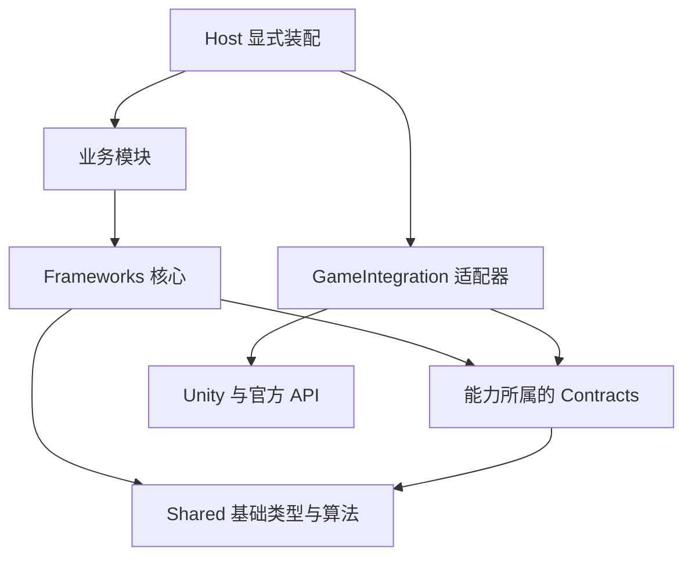

# BossRushMod 模块解耦、复用体系与上下文治理计划

日期：2026-09-22。状态：经全量迁移可执行性复审的实施计划，待实施；本轮只修订执行文件，尚未实施代码提取、目录迁移或构建改造。文档为 `SAFE`，执行文件纳管为 `OPERATIONAL`；后续代码迁移按批标注 `COMPAT` / `OPERATIONAL`。

## 0. 新窗口从这里开始

owner 本次要求是一次授权后持续完成全仓迁移。实施范围覆盖第 8 节全部源码域，以及对应测试、工具、规则与导航；内部按第 9 节检查点连续执行，0、1A、1B 只是前置验证，不是本次交付终点。第 1 节数字是历史快照，第 7 节是本次复审，第 8–11 节给出完整终态、执行顺序、验收和启动提示词。有关历史研究的“第一轮试点”描述不再决定本次范围。

可行性结论：保留单仓库、单 `BossRush.dll`、C# 7.3 和现有外部契约，在此基础上完成模块所有权提取与目录归位，技术上可行。原稿不足以直接执行全量迁移，已补入全源码覆盖、精确迁移台账、宿主成员终态、顺序对照、旧路径发现防漏、CI 环境、工作区快照和续接协议。任何文档都不能预先证明大规模运行时重构“绝无问题”；迁移完成必须分别给出离线结果和 owner 实机结果。

本窗口交付的是审核与执行计划。新窗口收到第 11 节提示词后执行迁移：允许保持行为的全仓状态所有权提取、源码目录搬迁、对应清单/测试/工具调整，不再逐批申请同一授权；保留原玩法状态机语义。实机启动、玩家存档访问、发布、提交/推送等边界在提示词中单列。默认先做隔离构建，迁移代码不以等待实机为由停在试点。

完整离线交付表示第 10 节静态、回归、两种构建和文档条件全部满足；L3 未做时明确写“离线迁移完成，实机待验收”。测试失败、模块遗漏、残留业务宿主状态或未解决的边界债务不能用“已完成，后续再优化”带过。遇到确实无法兼容的外部契约，保留可工作的适配并继续独立批次，记录受影响项，不能把它算作完成。

建议采用单仓库、单 DLL 内的模块化架构：先明确每个模块的职责、状态所有者、对外接口和局部开发入口，再将重复的算法与流程收敛到可复用体系，逐批提取实现并整理目录。目标同时包括：减少需要分别维护的重复实现、降低局部开发的阅读量，以及让后续功能主要通过配置、策略和明确扩展点接入；保持现有玩法、存档、资源与官方 API 契约。

本轮复审纳入 owner 的新增要求：多次使用的代码应尽量复用，未来可能多次使用的体系也应提前考虑扩展。计划允许在第二个调用者出现前设计可复用结构；将预期场景和变化维度写清，再决定实现到什么程度。下文的 `Frameworks` 层、复用候选、实施批次和验收标准共同落实这一目标。

GitHub 对照研究进一步落实了显式装配、接口与适配器分离、作用域所有权、定义与实例分离、通信时序和架构测试。项目来源、固定提交链接、采用条件及深审结论见 [GitHub 架构对照与深审记录](2026-09-22_BossRushMod_GitHub架构对照与深审记录.md)。主计划保存执行决策，研究记录保存证据；后续局部开发按模块入口读取相关内容。

本计划基于实际目录盘点、正式编译源码清单、核心调用点与相关守卫；没有逐行审查全部源码，也没有运行游戏。结构与依赖结论为 L1。单独执行的两个结构守卫通过，仅证明对应约束，不能代表全仓库回归通过。

## 1. 当前结构与主要成本

初稿以 `tests/OfficialCompileListFileExistenceGuard.py` 的源码提取口径统计，正式清单包含 960 个 C# 文件、389,997 行，行数含注释、空行和条件编译代码。以下保留 2026-09-22 初稿盘点快照；续审期间有并行工作区改动，实施前须重采，数字不作为长期预算。

| 现有目录 | C# 文件 | 行数 | 结构判断 |
| --- | ---: | ---: | --- |
| `Integration/` | 385 | 158,771 | 内容工厂、NPC、装备、Boss、经济、基地与成长混在一个大入口下 |
| `DebugAndTools/` | 155 | 54,221 | 含正式天空岛、场景原型、调试入口与 F3 验收 |
| `ModeH/` | 70 | 33,832 | 大体已有模块状态所有权，内部平铺文件较多 |
| `ZombieMode/` | 42 | 24,120 | 独立玩法语义明确，但大量实现仍是宿主 partial |
| `PetNest/` | 37 | 14,858 | 无宿主 partial，是现有模块化参考之一 |
| `ModeE/` | 18 | 13,857 | 与 F 共享生成、阵营、商人等实现 |
| `ModeG/` | 27 | 12,060 | 已有 RuntimeModule，入口实例与注册实例需单独梳理 |
| `ModeF/` | 20 | 10,304 | 直接调用 D 的物品池、E 的生成与商人逻辑 |
| `Common/` | 37 | 9,516 | 底座较齐，但仍包含内容装配及对丧尸模块的反向依赖 |
| `Utilities/` | 31 | 7,152 | 共享刷怪、门控、恢复与具体模块接线并存 |
| `LootAndRewards/` | 10 | 6,384 | 共享奖励与模式专属处理仍有混合 |
| `RandomEvents/` | 13 | 6,111 | 调度 owner 已独立，效果桥仍借宿主执行 |
| `Campaign/` | 20 | 5,834 | 自有运行时与持久化，跨模式查询仍读宿主内部状态 |
| `ModeD/` | 9 | 5,424 | RuntimeModule 很薄，状态和业务主要在宿主 |
| `Achievement/`、`Localization/` | 26 | 9,461 | 成就、语言机制已有入口；各模块数据可单独归属 |
| `WavesArena/` | 9 | 3,770 | 标准波次与全模式入场协调混放 |
| `Config/` | 15 | 3,151 | 统一配置兼容入口与玩法设置混放 |
| `Interactables/`、`UIAndSigns/`、`MapSelection/` | 8 | 4,668 | 共享交互基础与玩法入口需要区分 |
| `Patches/`、`Audio/`、`BossFilter/` | 25 | 4,203 | 官方适配、共享音频与竞技场配置职责各异 |
| 根目录两个 C# 文件、`Injection/` | 3 | 2,300 | 宿主、ModConfig 适配器及历史空占位 |

天空岛在 `DebugAndTools/SkyIsland/` 内占 96 个 C# 文件、31,067 行；另有 `Integration/SkyIsland/` 的物品代码，以及目录外的装备配置、F3、数据、生成器与资源接线。迁移清单必须覆盖这些关联文件。

`ModBehaviourPartialBudgetGuard` 实测 203 个宿主 partial 文件、104,485 行。这里统计包含宿主 partial 声明的整个文件，不能解释为宿主类体的精确行数。现有目录拆分已改善导航，但这些文件仍合成同一个类型，可以跨目录访问私有状态。

全仓库其余部分也应有明确定位：

| 目录或文件组 | 定位及处理方式 |
| --- | --- |
| `Assets/Data/`、`Assets/SpawnPoints/` | 受版本管理的数据；通过模块索引登记归属，保持现有加载路径 |
| `Assets/` 其余资源 | bundle、图片、音效等本地交付资产；按实际共享关系登记借用与卸载责任 |
| `ArtSource/SkyIsland/`、作者 Unity 工程 | 资源生产链；作者工程是另一仓库，路径经 `tools/unity_project_path.py` 解析 |
| `tests/` | 守卫、属性测试与 `fixtures/` 执行回归；保留根目录守卫发现规则 |
| `tools/`、构建与测试 `.bat`、`.github/` | 工程工具与验证入口；逐步接模块归属和受影响范围 |
| `WikiContent/`、`wiki-site/` | 玩家正文与站点；正文仍以 `WikiContent/` 为源，站点生成文件不作为第二份正文 |
| 根 `AGENTS.md`、子目录 `AGENTS.md` | 强制规则与按范围适用的规则；压缩重复说明，保留必要契约 |
| `.qoder/repowiki/`、`docs/` | 开发知识与设计资料；按模块导航、按需读专题，区分当前说明与历史快照 |
| `CODE_REVIEW.md`、`CODE_REVIEW_FINDINGS.md`、`FIX_TRACKER.md` | 审查方法与台账；按当前模块、问题编号定向检索 |
| `Build/`、`tmp/`、`output/`、`outputs/`、日志 | 制品和过程输出，不进入日常源码检索范围 |
| `鸭科夫源码/` | 官方行为的只读参考；查询官方类型时定向进入 |
| `.git/`、各工具隐藏目录、`skills/`、`codex-skills/` | 仓库或工具元数据、旧技能快照；不作为新模块实现目录 |

最值得先处理的耦合点，均可在当前代码核对：

| 证据位置 | 当前事实 | 解耦动作 |
| --- | --- | --- |
| `Common/Lifecycle/IBossRushRuntimeModule.cs:9` | 生命周期接收完整 `ModBehaviour` | 保留现有生命周期兼容入口，新提取业务只获得实际需要的能力 |
| `Common/Lifecycle/BossRushRuntimeModuleRegistration.cs:5` | 共享层直接装配所有玩法 | 将该职责归宿主装配层 |
| `ModeD/ModeDRuntimeModule.cs:3` | 模块主要保存 owner 并转发 Tick | 将状态、业务、异步任务和清理一起交给模块 |
| `ModeF/ModeFEntry.cs:314` | F 调用 D/E 的准备、生成与商人能力 | 先提取真实共享部分，再收拢 D/E/F 私有实现 |
| `Utilities/ModeRuntimeHooks.cs:7` | 集中驱动多个模式，包含影响顺序的提前返回 | 逐个交接驱动责任，保持顺序、早返与时间源 |
| `WavesArena/BossRushEntryFlow.cs:10` | 标准波次目录承担全部模式入场选择 | 模式选择归宿主协调，玩法执行归模式 |
| `Campaign/CampaignModeBridge.cs:107` | 战役读取其他模式的私有运行状态 | 引入只读模式视图，沿用现有终局通知 |
| `Common/UI/BossRushUI.cs:625` | 共享 UI 调用 `ZombieModeUIHelper` | 将确实共享的字体、缩放、输入租约等能力收归共享 UI |
| `Common/Stats/RuntimeStatModifierTracker.cs:39` | 共享追踪器使用丧尸命名的记录类型 | 明确公共记录所有权并保留兼容面 |
| `DebugAndTools/SkyIsland/SkyIslandSession.cs:138`、`DebugAndTools/F3GameplayValidationRunner.cs:125` | 正式地图的模式冲突判定定义在 F3 文件里 | 将判定归生产入口契约，F3 使用同一份判据 |
| `Integration/EquipmentFactory.cs:707` | 工厂知道大量具体装备配置器 | 内容模块提供注册入口，工厂掌管通用生产过程 |
| `Integration/Affinity/Systems/NPCShopSystem.cs:711` | 通用商店直接读取丧尸模式的净化点逻辑 | 由临时商店的创建者提供交易策略 |
| `Integration/NPCs/Common/NPCModuleRegistry.cs:346` | NPC 发现只扫描宿主所在程序集 | 多 DLL 阶段需要显式调整发现范围 |
| `Utilities/AlwaysOnRuntimeHooks.cs:85` | Harmony 安装也扫描宿主程序集 | 多 DLL 阶段需验证所有补丁均被发现并安装 |

## 2. 目标模块

下面是本次全量迁移的目标结构，仍属于待建目录。第 8 节规定完整归属和例外，第 9 节规定连续执行顺序。先在当前路径确立模块归属，再随本次各检查点迁入目标目录；没有实际能力的目录不建空壳。

```text
BossRushMod/
  Host/                         宿主、模块装配、模式入口协调、旧入口转发
  Shared/                       基础类型、数据解析、算法与无玩法归属的小能力
  GameIntegration/              官方 API、反射、共享 Harmony 与接口实现
  Frameworks/                   可复用的流程与系统，逐项从现有实现收敛
    Lifecycle/ Persistence/     运行时调度、作用域清理、存档流程
    Content/ Buildings/         内容生产管线、建筑注册与恢复
    NpcServices/ Equipment/     NPC 服务、装备能力与临时属性管理
    UI/ Spawning/               共享表现、已共用的生成与后处理流程
    （每项按需区分 Core、Contracts 与 Unity 适配，先不建空目录）
  Modules/
    Modes/
      Arena/ ModeD/ ModeE/ ModeF/ ModeG/ ModeH/ Zombie/
    Maps/
      SkyIsland/
    Characters/
      Npcs/ Relationships/ Dialogue/ Wedding/
    CombatContent/
      Bosses/ Weapons/ Sets/ Mutators/ DeathWraith/
    Crafting/
      Reforge/ AffixForge/
    Campaign/ PetNest/ RandomEvents/
    BackMountain/ WishFountain/ Codex/ DailyReport/ Achievements/
    Handbook/                    游戏内 Wiki 书的展示与解析入口
  DevTools/                      调试、F3 与未交付场景原型
  Config/ Localization/          本次保留稳定入口与存储格式
  Assets/ ArtSource/             保留交付与作者资源边界
  tests/ tools/ WikiContent/ wiki-site/
```

`Characters`、`CombatContent` 等是导航分组，职责完整的叶子模块是解耦单元。纯规则库、内容定义也可以成为模块；只有持有状态、事件订阅或异步任务的模块需要明确生命周期 owner，不为每个目录都创建 RuntimeModule。比如龙皇及其专属武器可以先作为一个内容模块。

具体归属规则：

- `Host` 知道需要装配哪些模块、启动顺序和关闭顺序。它只协调共享生命周期与保留旧入口，各模块拥有自身状态。
- `Shared` 放稳定的基础类型、算法与数据处理能力；按第 3 节同时接纳已经复用和具有明确预期消费者的能力，避免另建含大量业务分支的杂物目录。
- `Frameworks` 承载可复用的完整流程。优先归纳现有 RuntimeModule、存档引擎、UI 库、建筑、NPC 与装备体系；已有成熟基类可以继续使用，需要独立变化的部分采用策略或组件组合。每项能力独立声明消费者、契约、状态寿命和验证入口，业务模块只依赖所需能力，不获得整个框架目录的任意访问权。已有业务差异在业务模块内表达，避免把宿主中的全部分支转移成一个框架单体。
- `GameIntegration` 封装共同的官方接点；特定 Boss、武器、模式的补丁仍在所属模块。共享接点通过明确定义的回调/契约接收消费者，具体业务接线归 Host。同步伤害/掉落抑制保留返回值与执行顺序，普通通知可以复用现有事件机制。
- 原提案的 `ContentPipeline` 收入 `Frameworks/Content`，保留现有工厂、动态注册与恢复协议。每个模块贡献配置、本地化、资源和获取途径的接线；声明加工阶段、阶段内稳定顺序、重复键处理、幂等要求和失败策略，避免工厂继续枚举具体武器。
- `LootAndRewards` 按消费者划分：公共奖池算法归共享能力，模式专属奖励归模式，专属内容掉落归内容模块。`BossFilter` 归竞技场设置；共享音频协调归公共表现，各模块保留自己的曲目规则。
- `MapSelection`、路牌、交互点里的玩法菜单归入口协调或对应模式；可复用交互基类归共享层。
- `Config` 保留旧文件格式、键名与 ModConfig 兼容入口，各模块读取自己的设置视图。`Localization` 保留键名和注入阶段，本次按模块注册贡献内容；模块索引指出对应文本文件，物理兼容入口按第 8 节保留。
- 天空岛代码、专属物品/装备配置属于同一逻辑模块，通用 NPC/关系服务是它的依赖。资源和数据可继续位于统一发布目录，不必为了目录整齐改加载地址。

目标采用接口与适配器分离的依赖关系。框架核心依赖自己需要的能力接口，`GameIntegration` 实现这些接口；Host 同时认识核心与适配器并把两者装配起来。模块之间的对外能力由提供方持有契约，消费方不取得其可写状态容器。框架要求业务提供的策略接口由框架持有，业务模块实现。各能力和模块的静态依赖保持无环，已有反向引用登记为迁移债务。



图中箭头表示静态引用，运行时核心可以通过注入接口调用适配器。`Contracts` 按能力邻近存放，避免建立全仓库都依赖的巨大接口程序集。纯规则与可隔离流程不引用具体游戏实现；UI、粒子、Unity 行为等本身依赖引擎的适配代码允许直接使用 Unity，按文件分类登记。只在需要隔离或替换的边界定义接口，避免为每个 `GetComponent` 包一层转发。

装配沿用 `BossRushRuntimeModuleHost` 与现有注册点，显式构造实例并传入必要能力；构造完成、回调已调用和异步资源已就绪分别记录。注册顺序只能保证发起顺序，需要资源/场景/存档准备的依赖继续通过既有就绪状态等待。不因为引用了某个服务就自动创建或初始化整套系统；可选能力失败与核心前置失败采用各自现有处理协议，并记录该失败是否允许重试。

`IBossRushRuntimeModule.OnAwake(ModBehaviour)`、现有宿主生命周期入口及依赖 `ModBehaviour` 的日志转发先归 Host 兼容层。新提取的框架核心接收小范围能力/数据，不直接实现这类宿主接口；由薄适配器接收旧回调并转交核心。这样保留旧接线，也能对新核心执行依赖规则。现有基类和 Unity 组件按消费者逐项迁移，不批量改签名。

依赖图、通知流、初始化/退出顺序分别登记：A 使用 B 的接口，不代表 A/B 的场景回调可以随意重排。特别保留 Campaign 先于 BackMountain 初始化、RuntimeModuleHost 逆注册顺序销毁，以及宿主在模块销毁前后的全局清理顺序；交接前后用调用轨迹对照。某个模块的相邻内容可以保留紧密协作，其内部仍需明确哪个对象负责状态。

每份有状态能力注明寿命：全 Mod、存档槽、一次模式/地图会话、场景绑定、一次装备激活。场景绑定与模式会话可能交叠，不强套一棵固定父子树。登记“谁创建、谁借用、谁释放”，宿主提供的对象与 AssetBundle 借用不转移销毁权。退出先按既有顺序撤销该 owner 的继续执行资格，再取消其任务、退订并收尾；存档欠账等需要延续的责任显式交还仍存活的槽位/恢复 owner。每项清理独立隔离异常，避免前一项失败使后续资源泄漏。

保留现有命名空间与类型身份，包括已有的 `BossRush.Common.Equipment` 等子命名空间。单 DLL 下 `internal` 仍是程序集可见，不能据此声称实现已隔离；需要按文件归属和符号引用约束模块内部访问。新接口按变化维度提取，避免建一个装下所有服务的巨大 Context，也不强制每个类都有接口。C# 7.3 下给既有公开接口增加必实现成员会影响实现者，优先使用可选扩展接口、重载或适配器，保留当前公开入口。

## 3. 去重与可复用体系

复用同时覆盖三个层次：公共算法收敛为函数/小组件；重复步骤收敛为可配置流程；完整领域能力收敛为框架，例如建筑注册与恢复、装备能力激活、NPC 服务与内容生产。最终让新增功能由“已有流程 + 内容定义 + 差异策略 + 必要的官方适配”组成。复用代码由一处维护，运行状态仍按模块、场景、局、角色或装备实例隔离。

抽象机会分三类处理：

| 依据 | 本轮规划口径 | 实施完成证据 |
| --- | --- | --- |
| 已有多个调用者或重复流程 | 识别共同不变式和真实差异，提取共享实现；旧调用者实际切换到它 | 至少两个真实消费者运行同一实现，目标范围内旧算法/流程副本消除，允许薄兼容转发 |
| 目前一个调用者，未来复用可预见 | 写明下一类用途、共同步骤及变化维度，提前设计小而完整的复用能力或扩展口 | 当前生产调用者接通；用具名扩展场景验证新增配置/策略即可接入，无需制造第二项生产内容 |
| 未来用途尚不清楚 | 保持职责集中和可替换入口，将想法记录为候选；需要跨边界时再决定提升范围 | 有明确责任归属和提取入口，不承担无人使用的调度、扫描、缓存与注册成本 |

“未来可预见”包括继续增加基地建筑、NPC 服务、武器能力、地图居民和局内效果等现有内容线。判断依据是可以说明下一类内容如何接入，不要求先复制第二份代码。未来场景的设计假设与已确认代码事实分开记录；本次授权覆盖合理的前瞻设计，不据此扩展为新的玩法、存档改造或通用插件平台。

当前可复用底座及新增候选如下。表中“已有”表示查到实际消费者；“候选”表示值得提取的共同部分，尚未证明完整流程行为等价。

| 能力 | 当前依据与状态 | 复用核心与保留差异 | 顺序 |
| --- | --- | --- | --- |
| 分槽存档与落盘协调 | 已有：`Campaign/CampaignSaveCoordinator.cs:32`、`Integration/DailyReport/DailyReportSaveCoordinator.cs:33` 使用共享引擎；图鉴、遗种巢、天空岛也已接入协调引擎 | 延续 `BossRushSaveCoordinatorEngine`、`BossRushSlotJsonStore`；Codec、键、快照义务、可落盘时机由业务提供。Mode G/H 的特殊协议单列，先保持其实现 | 直接复用 |
| 建筑交互、注册与恢复 | 交互基类和反射 helper 已共享；`Integration/DailyReport/DailyReportMailboxRuntime.cs:294` 与 `PetNest/PetNestBuilder_DataEventsAndRuntime.cs:310` 恢复循环高度相似，许愿台也有相邻流程 | 复用等待、合并请求、活动场景缓存刷新、遍历与幂等装配；建筑身份、解锁条件、功能点检查/修复交给定义和策略。请求身份与取消契约见 1B，不把场景代次拒绝误写成既有行为；拆除、借用模型与资源释放规则逐个核对 | 第一批流程试点 |
| 运行时属性修改 | 已有 `RuntimeStatModifierTracker` 被多个模式使用；`Integration/AffixForge/AffixRuntimeService_Effects.cs:40` 仍有独立挂载器 | 统一挂载、记录、移除机械过程，显式保留 `ModifierType`；词缀数值、触发、归因和叠加规则留在业务，记录容器由调用者持有 | 第一批小范围去重 |
| 物品/装备生产 | 已有 `ItemFactory.RegisterConfigurator` 和动态注册管线；`Integration/EquipmentFactory.cs:675`、`:707` 仍接具体装备 | 将加载、通用加工、配置、校验、发布的既有阶段显式化；定义引用现有 TypeID/资源/本地化事实源，策略处理特殊配置；克隆兜底、恢复重入和发布顺序保留 | 公共边界阶段 |
| NPC 与服务 | 已有 `INPCModule`、好感/礼物/商店配置接口；护士、哥布林及霜之哀伤随从使用 `NPCFollowMovementBase`；通用商店仍含丧尸净化点分支 | 复用发现/生命周期、跟随、交互和服务展示；身份、关系与服务条件留给模块。普通现金和净化点由各自支付适配提供，保持官方商店交付/回滚时机 | 内容分域阶段 |
| 装备能力 | `Integration/FlightTotem/FlightAbilityManager.cs:21`、`Integration/Frostmourne/FrostmourneAbilityManager.cs:19` 等已继承 `EquipmentAbilityManager` | 继续使用配置、Action 和 Manager 分工；抽取重复的装备变化门控、输入接入与清理时先找现有 owner。伤害、冷却、投射物与表现按能力组合，保留特定武器差异 | 内容分域阶段 |
| UI 与交互表现 | 已有 `BossRushUI`、`BossRushBuildingInteractableBase`；日报、公告板、展示柜和许愿台已复用交互骨架 | 字体、缩放、皮肤、模态输入、HUD 可见性及相同列表流程统一；页面内容和交互动作作为扩展点，继续优先复用官方 prefab | 公共边界阶段 |
| 奖池候选与物资生产 | `Integration/DailyReport/DailyReportRewards.cs:180`、`ModeH/ModeHRewardItemPool.cs:40` 已共用 `BossRushQualityItemPool` | 候选筛选、品质契约和缓存共用；随机流、抽取规则、实物投递、欠账与持久化按玩法保留。先采用已有共享池，其他奖池逐条比较筛选语义 | 直接复用，后续扩展 |
| 局内清理与生成 | E/F、丧尸、随机事件已有共享生成入口；`ModeF/ModeFPhases.cs:669`、`ZombieMode/ZombieModeInventoryTransfer.cs:101` 使用 `RunScopedRegistry`；`RandomEvents/RandomEventDirector.cs:479` 已创建 `RuntimeScope` | 优先复用现有 scope、取消信息与后处理；阵营、配装、预算、时序与失败后果按消费者定义；保留 Mode H 独立生成协议 | 老模式阶段 |

两个优先候选的复核结论：

- 属性挂载器的参数检查、零值判定、取 Stat、添加 Modifier 和记录步骤已高度一致。共享追踪器的 `Common/Stats/RuntimeStatModifierTracker.cs:46` 已有显式类型重载，词缀文件中“公共实现只支持 PercentageAdd”的说明已过时。两份错误日志仍不同，迁移时需检查诊断消费和相关夹具；这支持去重候选结论，不代表本轮已修复或已验证战斗行为。
- 日报与遗种巢恢复循环都等待两帧、检查场景缓存/待恢复建筑、遍历官方建筑对象、检查身份与功能点、装配后登记，并在 `finally` 释放协程句柄。共享框架可以承接这一流程，模块提供身份与装配策略；独立实例保留各自缓存和协程句柄。现有 `ContentBuildingOwnership` 夹具使用建筑模块替身，不能把它通过当作完整恢复流程已验证，提取时需补真正执行生产恢复逻辑的回归。

框架设计统一回答五个问题：稳定流程由谁执行；变化数据来自哪份现有定义；差异规则通过哪些参数/策略传入；官方对象由谁适配；状态、事件、协程和资源由谁持有并释放。优先扩展已有接口、基类或组合组件，避免为同一职责再加一套工厂、事件总线、缓存或调度器。仅当行为语义一致时合并，参数越加越多且出现大量模块名称分支时，重新检查边界。

未来新增建筑应能提供建筑定义、可用条件、功能点装配与交互动作，复用注册和恢复流程；新增装备能力应能提供配置、动作和表现，复用激活与清理；新增 NPC 服务应能提供条件、报价/支付及执行策略，复用展示和生命周期。以上场景是扩展性验收题，不在本次计划中额外创建玩家可见内容。

去重实施以一个候选簇为单位：先登记所有调用者和异常/取消/空值/顺序差异，再把兼容行为和差异固定为契约；提取共享核心并切换本批调用者；证明旧入口仍可到达生产逻辑；最后移除本批冗余实现或保留仅转发的兼容入口。文本/语法相似性工具只用于发现线索，不能据相似率直接改写。日志、存档字段、资源名和数值即使看起来只是字符串差异，也要逐项判断含义。

静态共享实现不等于共享可变状态：框架实例按 owner 创建，A 模块停用不得取消 B 的协程、退掉 B 的订阅或清空 B 的数据。确需共用的资源缓存沿用现有借用/释放契约，区分模块结束与宿主销毁。沿用主线程执行、时间源、幂等和异常隔离；共享能力不因注册就扫描全地图或预热全部装备，框架也不在每帧创建策略对象、反射查找或闭包分配。

`Utilities/RuntimeScope.cs` 已管理清理动作、协程与 GameObject；`RunScopedRegistry` 则只提供反向遍历，二者职责不同。先评估复用或扩展现有 RuntimeScope，避免再造同义 scope。当前随机事件先执行事件 `OnCleanup` 再调用 `Scope.Clear`，后者按“清理动作 → 停协程 → 销毁对象”分阶段执行；不能按外部框架的统一 LIFO 规则重排。关闭态/代次目前属于外层事件上下文，迁移时保留单一权威归属。

共享定义与运行实例分别管理：内容表、能力参数、建筑规则可以复用同一份只读定义，计时器、当前目标、订阅与恢复进度进入本次实例。继续使用现有 JSON/Config 与 AssetBundle 管线；更换为 ScriptableObject 不是复用的前提。共享缓存返回的集合也注明只读借用，消费方需要修改时在自己的作用域内创建副本，避免一次排序或筛选污染其他消费者。

运行实例的复用范围也需显式声明：同一 owner/会话内可按定义缓存实例，不同 owner/会话分别创建；并非每次调用都重新构造。定义身份、缓存键与缓存释放点一起登记，避免将共享定义的全局缓存误用为运行状态缓存。

模块通信按语义选择入口：

| 通信 | 契约 | BossRush 对应场景 |
| --- | --- | --- |
| 查询 | 同步、只读、返回明确状态；权威数据未就绪时沿用失败关闭判据 | Campaign 读取模式状态，后山读取解锁条件 |
| 执行动作 | 显式结果和失败原因；耗时动作指定 owner、取消方式、实际完成点 | 注册装备、恢复建筑、执行 NPC 服务、刷怪 |
| 事实通知 | 明确同步或排队派发、异常处理、订阅顺序、重复处理与订阅寿命 | 成就解锁、已接受的进度变化、界面刷新 |
| 拦截判据 | 保持同步返回值、执行顺序和原有副作用限制 | Harmony 伤害抑制、掉落 defer、入场资格判断 |

继续使用已有通知机制；目前 `BossRushEventBus.Publish` 同步逐个调用并隔离处理器异常，不能在模块化中静默改成下一帧通知。内存状态已接受与物理落盘成功是不同事实，发奖、扣款、跨 key 幂等和补偿继续由原事务 owner 决定。尤其 NPC 净化点购买接在官方购买回调之后，支付策略提取要保留交付/回滚时机，不套统一“先扣款再发物”模板。

异步复用同时约束三件事：入口到子步骤传递本次 owner 的取消/有效性信息；不可取消的官方操作返回后重新核对槽位、会话或装备激活代次；错误和取消回到明确的结果出口。优先复用现有代次、取消谓词和协程句柄，只有确有缺口才增加令牌。常驻 ModBehaviour 的销毁不能代表每次离手、切图或结束模式。取消请求不代表底层操作已经停止，旧任务的收尾也不得清掉新任务的句柄。

保留现有 coroutine/UniTask 的帧时序：两次 `yield return null` 不能未经验证改为两次可能同帧恢复的 `UniTask.Yield`，已有 PlayerLoop 注入由其当前 owner 统一管理。合并多次初始化请求时区分“复用结果”和“复用可等待完成源”；不缓存一个裸 UniTask 让多个调用者重复 await。具体 API 以本机引用版本为准，上游最新文档只提供设计依据。

## 4. 如何直接降低开发上下文

第一批就交付可用的导航能力，无需等全部代码迁完。

1. 拟建根级 `MODULES.md`，从模块索引生成导航，回答“这个需求归谁、入口在哪、相关契约在哪”。维护规则仍来自 `AGENTS.md`，避免多份规则副本。
2. 拟建版本管理下的 `architecture/modules.json`，作为模块归属/导航关系唯一的人工维护机器清单，登记模块 ID、源码归属、入口、对外契约、允许依赖、复用能力提供者与消费者、数据/资源及验证入口。实际类型和成员依赖由分析器生成，与允许依赖对照，不再手工维护第二份调用图。编译清单、运行时注册、TypeID 和内容表继续是各自事实源，索引引用并校验它们，不复制另一套运行时注册或内容定义。仓库内必需文件校验存在；local-only 资源与外部 Unity 工程登记资源标识、路径解析器、适用环境和发布验证阶段，缺失时明确标记，不让导航检查要求 fresh clone 拥有全部制品，也不把缺制品算作发布验证通过。
3. 每个模块增加短 `README.md`，主要解释入口链路、所有权、扩展方法和设计理由；清单字段从索引生成或链接，避免 JSON、总索引和 README 三份手工维护相同事实。有独有约束时才增加子 `AGENTS.md`。专题理由链接现有 repowiki，每项共享能力提供最小接入示例、已用场景及不适用情形。
4. 根规则只保留全局契约和导航，重复的专题说明经确认后归到适用模块规则。所有原有强制约束必须仍有明确落点，任务进入子目录时照常读适用规则。
5. 拟建 `tools/task_context.py`，按模块输出最小阅读顺序、公开接口、关联文件和验证入口。输出首先给路径与必要摘要，遇到跨模块改动再扩展依赖。默认搜索正式源码清单，排除制品、旧快照和官方反编译全文。
6. `CODE_REVIEW_FINDINGS.md` 与 `FIX_TRACKER.md` 按模块名/问题 ID 检索；repowiki 的重复旧目录只留导航和状态说明，首期不删除或整体重生成。

例如修改日报版面，初始阅读包应是全局规则、日报适用规则、日报 README、版面/内容生产文件、对应数据及校验入口。只有修改统计口径、签到或奖励时，才进一步进入统计采集、持久化与支付链。新增一把装备则需要内容模块、工厂注册契约、获取途径及资源规范，但无需展开全部 NPC 和模式实现。

上下文收益用固定任务对比：日报版面、天空岛居民服务、NPC 商店交易、武器配置、Mode F 奖励各选一个代表需求，记录查阅文件数、读入文本字符数、跨模块内部实现数、准备阶段调用次数；能取得同工具同模型的实际 token 用量时再补 token。总行数与字符数只作为代理指标，不直接换算成 token 节省百分比。

试点验收目标：常规局部需求能从一个模块入口开始；跨模块扩展有明确原因；模块外实现读取数较基线下降；准备阶段不用全仓搜索；依赖或规则遗漏为零。具体下降比例由试点实测后设定。

## 5. 单次迁移中的内部批次

| 批次 | 工作范围 | 交付与验收条件 | 分类与规模 |
| --- | --- | --- | --- |
| 0：基线与导航 | 全部正式源码归属和目标路径、宿主成员台账、生命周期顺序、模块/能力索引、最小可执行成员边界检查、重复候选、阅读包和测试映射 | 全量归属无遗漏；先覆盖试点的语义规则和负例，逐批扩大到全仓；边界守卫 always-run；明确缺引用时的降级状态；记录上下文/维护成本基线 | 文档 `SAFE`，工具接入 `OPERATIONAL`；拆为索引、检查器两步 |
| 1A：小范围复用验证 | 比较词缀属性挂载器与共享追踪器；切换词缀消费者，保留显式 ModifierType、诊断与兼容入口 | 本批挂载流程只有一份；默认和显式类型路径、失败和移除语义对齐；已有共享消费者无回归 | `COMPAT`；小 |
| 1B：模块与流程双试点 | 以日报收窄宿主访问；从日报/遗种巢提取恢复核心、业务策略和官方建筑适配，只改相关切面 | 两类真实建筑使用同一恢复实现；生命周期/两帧等待/请求合并对齐；一个 owner 取消或迟到完成不影响另一个；源码边界与入口回归通过 | `COMPAT`；中，分小批交付 |
| 2：公共边界与框架 | 装配归 Host；共享 UI/属性记录归位；模式查询收窄；内容贡献按阶段接工厂；复用已存在的存档与能力底座 | 框架无具体玩法反向引用；各已提取能力有真实消费者和明确扩展口；注册顺序、失败策略与默认行为可回归 | `COMPAT`；分多个中等批次 |
| 3：天空岛归位 | 先明确正式运行时、地图数据、内容配置与 F3 适配边界，再迁至 Maps/SkyIsland | 编译、守卫、夹具、工具、专题链接全部跟随；正式/Dev 都构建；入口、租约、剧情与退出回归保持 | `COMPAT` + `OPERATIONAL`；中至大 |
| 4：Integration 分域 | 逐域处理图鉴/后山、NPC/关系/交易、锻造、装备/Boss/套装；把已验证的重复片段接入对应框架 | 每批完成注册、获取、状态归属和清理；目标重复实现收敛；新增同类内容可通过定义或策略接入 | `COMPAT`；多个中等批次 |
| 5：老模式实质解耦 | 提取共用的物品池、生成准备与作用域清理，再迁 D、E/F、标准波次；丧尸分步处理 | 每份状态有唯一 owner；本批复用能力真正被调用；入场优先级、失败退款、终局通知及专属玩法语义保持 | `COMPAT`；大，拆为多批 |
| 6：其余模块与收口 | 完成第 8 节剩余所有域，包括 G/H、Campaign、PetNest、RandomEvents、成就、音频与百科；移除已切换副本、降低预算，验证扩展口 | 第 10 节终态全部满足；所有批次可追溯，最终允许依赖图无环、越界债务清零，宿主只有获准职责 | `COMPAT` / `SAFE`；多个检查点 |

依赖顺序为 0 → 1A → 1B → 2；之后天空岛归位与 Integration 各独立内容域可并行准备。共享宿主、编译清单和统一注册点由一个整合任务负责，避免多个任务同时改同一装配文件。旧模式重构放在共享能力与试点范式稳定之后。

日报作为模块样板，是因为它已有运行时、Service、Codec、保存协调器、建筑入口与明确验证面；规模适中，能检验一条完整开发链。引入遗种巢的建筑恢复切面用于证明流程复用，不要求同时重构整个 PetNest。Mode H 和 PetNest 可借鉴单实例与清理 owner，仍需核对其现有宿主访问。前置 1A 用更小的属性挂载候选验证“比对差异、复用已有能力、切换消费者、覆盖回归”的实施方法。

天空岛归位先解决生产入口对 F3 文件的依赖：`ValidationHasActiveMode` 属于生产模式冲突判据，迁入生产门控服务后由地图和 F3 共用；验收运行中、专用测试档航线旁路等状态通过明确的 Dev 适配口提供。逐文件检查条件编译与生产观测接口，再分离目录，保持正式构建的入口可用性。

D/E/F 阶段有三点必须单独处理：D 的物品池实际被其他模式借用；E/F 的阵营生成与商人准备共享；名为 ModeEF 的后处理队列还服务标准模式随机事件。只把 E/F 专属部分留给该共享能力，广泛使用的生成/后处理按真实消费者归位。Mode H 已有独立生成契约，丧尸奖励也有独立语义，继续保留这些差异。

Mode G 当前存在宿主注册空壳与入口创建 run 两处 RuntimeModule 来源，并有帧去重逻辑。没有据此认定现有运行故障；全量复审已核实 run 的初始化/销毁不支持同实例重用，因此采用第 9.4 节的全 Mod 适配器加每局核心，并先列出每个实例收到的回调、状态与退出责任。

每次批次分开处理“行为提取”和“纯路径迁移”。先在原路径提取可验证边界，下一步再按已确认清单归位；这样回归容易定位，也便于逐批回退。检查点通过后直接继续下一项，试点结果用于修正后续实现方法，不用于缩减已授权的完整范围；不预先承诺一个窗口或固定工时一定容纳全部工作。

1A 的执行回归先修正测试依赖：`tests/fixtures/AffixCombat/run.py:55` 当前链接词缀实现，`tests/fixtures/AffixCombat/Stubs.cs:291` 则用只实现 `RemoveAll` 的同名替身代替共享追踪器。切换词缀消费者时，将真实 `Common/Stats/RuntimeStatModifierTracker.cs` 链入并移除该同名替身，补足底层 Stat 替身；或提供等效的生产代码夹具，同时更新原夹具使其能够编译。验证默认 PercentageAdd 及显式 Add、PercentageAdd、PercentageMultiply 的传递、零值/缺 Stat/失败路径、实际 RemoveAll，以及两个 owner 的记录隔离。仅扩充替身的 TryAdd 不能作为本批复用通过的证据。

1B 的可审查交付切面：共享恢复核心负责既有请求合并、等待、遍历和实例缓存；日报/遗种巢策略分别提供目标建筑判定、功能点检查与装配；官方适配复用 `BuildingInjectionHelper` 和 `ObjectCache`；Host 薄桥承接现有协程驱动与入口。提取阶段保持现有两帧等待和过滤/修复顺序，新的修复行为单列需求。原专属 TypeID、建筑 ID、解锁、支付与存档语义留在业务侧。

1B 明确采用以下兼容与验收判据：

- 场景选择保持当前语义：两帧等待结束后读取当时活动场景，按其 `Scene.handle` 刷新缓存。现有两份实现没有捕获请求发起场景，也没有等待后的请求代次核验；本批不增加“请求场景与当前场景不同就放弃恢复”的条件。以后若采用该策略，单列 `COMPAT` 行为修复，并补上目标场景的恢复触发与回归，避免跨图后漏装功能点。
- 请求身份属于每个恢复 owner：可以复用其已有代次或以每次请求的独立身份实现；只有仍为当前请求的收尾才能清当前句柄。已有取消路径先撤销该请求继续装配的资格，再停止任务并释放调度状态；旧请求的 `finally` 不得清掉新请求。新增的保护明确记录为共享实现的取消契约，不声称旧代码已具备它。
- Unity 对象语义留在适配层：保留 `Common/Infrastructure/ObjectCache.cs:92` 的已销毁对象假 null 检查、按场景句柄刷新、`GetInstanceID()` 去重，以及 `ReferenceEquals` 排除自身常驻 prefab。共享核心不另建一份普通 object 场景缓存。夹具遵循 `tests/AGENTS.md`，实际模拟销毁后 `== null` 与 GameObject 连带销毁组件。
- 生命周期表分别登记两个调用链：`ModBehaviour.cs:795` 的 Integration 清理先到 `Integration/BossRushIntegration_StartAndScene.cs:186` 停止遗种巢建筑；日报建筑在随后模块销毁阶段由 `Integration/DailyReport/DailyReportRuntimeModule.cs:179` 停止。首批沿用这些入口和次序，每个恢复实例只有一个取消 owner；后续迁移清理入口时用调用轨迹逐项交接，不能因两者共用核心就合成一个全局清理点。
- 对照回归执行生产恢复核心，覆盖两方共同运行、重复请求、等待期间换活动场景、恢复中取消、取消后再请求及旧请求迟到收尾、对象销毁、prefab 排除、单个装配失败与重复清理。现有 `ContentBuildingOwnership` 继续验证桥接，新增恢复回归补齐其替身未覆盖的流程。

## 6. 验证、路径与兼容边界

现有构建由 `compile_official.bat` 显式列源码、生成响应文件并编译部署。每次新增/移动源码同步清单；`.bat` 保持 CRLF。`tests/fixtures/` 的工程还直接引用生产文件路径；改目录必须一起更新这些引用。`tools/run_guards.py` 当前仅枚举 `tests/` 根目录，`--changed-only` 按脚本文本中的路径/文件名粗筛，因此首期保留测试位置。

批次 0 同时把源码归属、模块边界、索引漂移检查加入 always-run 集合，或接入能保证等效覆盖的显式依赖触发规则。当前 `--changed-only` 在已有其他守卫命中时不会回退全量，动态读取模块索引的守卫可能被漏选；不能等后续再修选路。索引稳定后再增加完整反向依赖选路：公共 UI 改动覆盖 UI 消费者，数据/资源覆盖内容模块，不确定时回退全量。模块筛选能力需新增实现，原命令继续可用。

已迁模块增加边界守卫：源码归属无遗漏，框架/公共层无具体玩法反向引用，模块内部类型未被外部直接访问，所属生命周期内实例与清理 owner 唯一，正式代码无 Dev 实现依赖。不能只检查 `using`；按符号与归属分析引用；宿主 partial 过渡阶段还需按字段/方法归属检查，整个合并类型的统计会掩盖跨模块访问。字符串反射和注册清单另列契约。旧耦合登记有理由的迁移基线，只允许减少。

迁移基线按具体依赖边登记源模块/成员、目标模块/成员、引用种类、适用构建配置、理由和消除批次。删除一个旧越界引用不能抵消新增的另一个越界引用；不使用全目录豁免或只比较违规总数。纯路径迁移通过本批显式映射保留同一条债务身份，消失的条目及时移除。源码归属冲突、无法解析的引用与未知归属分别报告，不能自动放进允许依赖。

检查器分两层落地。源码层基于 Roslyn 的声明位置和符号绑定，把 partial 中的字段、方法、属性、事件归到模块，再检查引用边界；从正式编译响应文件/源码表取得完整输入、引用和条件编译符号，分别分析正式与 Dev。可复用 `tools/verify_syntax.py` 的 SDK 定位思路，但它当前不提供这项语义分析，需新增开发期分析器。缺游戏 DLL、引用不完整或符号无法解析时，相关结果标记 PARTIAL/未验证，发布验收要求完整语义检查，不能按空依赖图判绿。

分析器的 C# 工程拟放在 `tests/fixtures/ArchitectureBoundary/`，`tools/` 仅放调用入口，`tests/` 根目录的 Python 守卫负责接入聚合检查；这是拟建路径。当前 `tests/OfficialCompileListFileExistenceGuard.py` 排除了 `tests/`，却会将 `tools/` 下新增的 C# 文件视作生产源码，因此不能直接在那里放分析器源码。开发期工程独立引用固定版本的 Roslyn，不登记进 Mod 编译清单；其自身测试通过 `tools/run_runtime_regressions.py` 注册运行，并注明使用生产分析逻辑与被分析样例的边界。

完整编译输入与检查范围分别记录：分析器可以加载正式清单来解析试点引用，但批次 0 先验收 1A/1B 的所有权和越界规则，不要求先完成全仓解耦。响应文件须与当前源码清单、引用位置、C# 版本及正式/Dev 符号核对，不能直接信任旧 `Build/BossRush.rsp`。清单解析须覆盖现有 `echo(` 与 `^` 续行混用的写法，与双向编译清单守卫的源码集合对照；只取完整单行 `echo(...cs` 会漏掉当前四个天空岛文件。声明映射覆盖字段、方法、属性和事件，并归并访问器、分部声明及其调用；反射字符串、运行时发现与无法静态判定的行为保留在独立契约和回归中。

新增检查器的结果协议与聚合器同批接入：现有 runner 只在 `--source-only` 且指定外部制品名单内把退出码 2 识别为 PARTIAL，语义分析器不能仅返回 2 就假定已被正确归类。为缺引用场景定义明确的开发期降级报告，正式验收保持非通过；不能混入已知红项基线或伪装为缺 AssetBundle 检查。

第二层可借鉴 ArchUnitNET 的类型/成员依赖规则，对已独立的类型检查越层引用和循环。IL 规则本身有成员检查能力，但不自动知道一个合并后的 `ModBehaviour` 成员原属哪个业务文件，也不能证明字符串反射目标与运行时协议；需与源码归属、显式契约和运行回归配合。首批检查器先覆盖 1A/1B 必需规则并注入可检测的越界负例，再逐批扩展覆盖，开发期工具不随 Mod DLL 发布。

IL 检查同样验证输入完整性。ArchUnitNET 固定快照的依赖加载分支会捕获 `AssemblyResolutionException` 后跳过该程序集，不能将其返回依赖图视为完整。采用时只读与本次源码和正式/Dev 配置对应的编译产物，记录产物指纹；解析器覆盖当前编译输入引用的游戏 Managed、Harmony、输出目录等位置。预检纳入分析的程序集引用闭包，报告实际加载与未解析清单，并用故意缺少引用的负例检验包装器。缺少产物、引用或无法证明产物对应本次输入时，开发期标 PARTIAL、发布验收非通过；不能因规则未发现违规而判绿。

每批验收沿用现有顺序：

1. 读取玩家入口到生产逻辑，检查注册、可达性、状态所有者和收尾。
2. 运行 `python tools/run_guards.py --changed-only`；结构搬迁或公共边界大改跑全量。修改过的守卫在隔离副本里做反向验证并按字节恢复。
3. Windows 真编译；沿用根规则的正式构建入口。只做编译核验时采用根规则允许的隔离构建方案；交付部署另核对哈希。
4. 用 `python tools/run_runtime_regressions.py --list` 确定相关夹具，再通过聚合入口运行。共享实现变化覆盖所有已登记消费者；无法隔离的链路明确列入 L3。重点覆盖取消、重复场景回调、失败退款、终局通知、清理次序与存档拒写等边界。
5. 正式/Dev 边界变化时同时构建两种配置，交付恢复正式版并检查 Dev 标识；Wiki 内容变更按其专项规则构建。
6. 同步对应 repowiki、模块说明、路径引用及实施记录；对照原基线复测局部任务的阅读范围、目标副本数量与新增同类内容的修改范围。

复用验收包含行为和维护成本，不能只统计删了多少行：

- 已存在重复的提取：检查至少两个真实调用者都经过共享实现；相同输入的结果、异常策略和调用次序与旧逻辑对齐；本批旧副本被移除或降为转发。已有重复跨多批处理时列出剩余位置，不把未切换的消费者记为完成。
- 未来可预见的抽象：现有调用者工作正常，另一个具名场景能通过定义/策略/适配接入；可用局部契约示例或必要的隔离回归证明，不添加占位生产内容。仍只有一个真实消费者时明确标注“前瞻扩展点”，不报告成已复用。
- 状态隔离：两个消费者同时使用时，终止/卸载其中一个不会清掉另一个的缓存、修饰器、订阅或异步任务；场景代次与取消后迟到回调不得写回新会话。
- 扩展成本：新增同类建筑、NPC 服务或装备能力应主要修改所属模块的定义/策略与必要接线；记录需要触碰的公共实现文件数、复制的流程数、必须理解的公共契约数。合法的新行为可以扩展框架，不把“公共代码永远不改”当硬指标。
- 执行成本：记录代表场景的扫描次数、任务数、反射解析次数、缓存生命周期与分配点；有真实采样再报告帧耗时和 GC。静态无新增热路径操作只属于静态证据，不声称已验证性能无回归。

基线表按能力记录“现有完整副本 → 已切换真实消费者 → 剩余副本 → 保留差异及理由”。已成熟的共享引擎以接入覆盖和回归为指标，纯前瞻设计以契约清晰度和扩展验证为指标。相似代码百分比只是线索，必要的兼容转发、显式数据定义和专属事务不为减少行数而强行合并。

实施后的 L3 清单按修改的模块给 owner：基地入口能打开；进入模式/地图后 HUD 和交互正确；按原规则获得奖励并正常退出；重复进入无重复订阅、残留 UI 或失效协程；涉及语言时切换中英；涉及装备时核对获取、装备、卸下与切图。涉及 F3 时给出本批具体步骤 ID、截图文件和不合格判据，不要求 owner 笼统“试一下”。本次规划无需启动游戏。

沿用现有 TypeID、存档/配置/本地化键、bundle 与 prefab 名称及官方绑定目标。新增及语义匹配的持久化复用共享引擎，各模块保留自己的权威状态。`ModeG/ModeGPersistenceFlushCoordinator.cs` 的战斗帧/多 key 处理与 `ModeH/ModeHSaveFlushCoordinator.cs` 的押品、跨 key 幂等流程保持业务侧实现；只在证明公共子步骤等价后复用，不能以全量迁移为由改写这些协议。目录搬迁、状态提取、构建清单与验证工具适配由第 11 节启动授权明确覆盖；构建机制继续使用现有显式清单，不扩展为构建系统替换。其他根 `AGENTS.md` §10 事项沿用原边界。

程序集拆分留到独立构建/发布成为明确需求时评估。当前 `ModBehaviour` partial 无法跨程序集组成同一类型，NPC/Harmony 扫描仅看宿主程序集，很多接口是 internal，Unity/AssetBundle 还可能携带类型与程序集身份。届时先选无宿主状态的纯规则/基础模块做验证，并覆盖加载顺序、类型可见性、补丁发现、资源脚本绑定与部署。现阶段的上下文收益主要由局部入口和依赖边界取得。

初稿盘点时实际执行了 `python tools/run_guards.py --filter OfficialCompileList` 与 `python tools/run_guards.py --filter ModBehaviourPartialBudget`，两项通过。此前架构终审核查了文档、相关生产代码、夹具依赖、守卫选路及固定提交的上游实现，并补齐 1A 的真实追踪器回归、1B 的场景/取消/Unity 对象/清理契约和 IL 缺引用协议。其文档引用与结构校验另见研究记录；当时未重复运行与文档改动无关的构建或游戏测试。本次全量执行复审另见第 7–12 节。统计表保留初稿的带日期快照，实施前重采；目标目录与新增工具属于待实施内容，不能当作已经实现。

复用需求审核已加入流程层、前瞻扩展、真实消费者验收、生命周期/加工顺序、导航单点维护及特殊存档边界。GitHub 对照深审进一步修正了核心与适配器的依赖方向、宿主兼容壳归属、异步就绪与取消语义、定义和运行实例的分离，并把成员级检查器和 always-run 选路提前到批次 0。外部方案的设计理由与不采用的部分保留在独立研究记录中。

本次执行从 0、1A、1B 开始，按第 9 节持续推进到全仓终态；第 8 节任何源码域都不能因未出现在试点中而被遗漏。试点发现抽象不合适时调整接口或保持有理由的专属实现，再继续完成其所有权、依赖和路径迁移。

## 7. 全量迁移复审：已补齐的执行缺口

以下编号用于本计划的缺口追踪，不认定为玩家运行故障。严重性指直接照旧稿执行的风险；修订是文档完成，代码处置仍待实施。除特别注明外，证据为当前源码 L1。

| 编号 / 等级 | 核实的缺口与证据 | 执行版处置 |
| --- | --- | --- |
| MIG-01 / P1 | 旧结尾只推荐 0/1A/1B，目录是示意，其他域没有逐项终点 | 全仓范围见第 8 节，连续检查点见第 9 节，试点完成后继续 |
| MIG-02 / P1 | 工作区含未提交源码/夹具；原计划被 `.gitignore` 的 `/docs/*` 忽略 | 保存字节基线、在隔离工作区叠加当前修改；本轮精确放行两份执行/研究文档，仍不自动提交 |
| MIG-03 / P1 | `ModBehaviour.Update` 与 `Utilities/ModeRuntimeHooks.cs` 有多阶段驱动及 Arena 提前返回 | 固定阶段、门控、时间源及退出轨迹；Host 保留显式调度，不直接改成统一模式 Tick |
| MIG-04 / P1 | `ModeGRuntimeModule_PublicApiAndShutdown.cs` 说明 Host 空壳与每局 run 分离；Initialize/Dispose 不支持同对象重复开局 | 全 Mod 生命周期适配器持有每局独立核心；连续两局和原 Tick 阶段是必验项 |
| MIG-05 / P1 | `CampaignModeBridge.HasCampaignBountyMark` 消费 `ModeFBounty.ConsumeModeFPlayerBountyKillLatch`，读取会清零 | 纯模式查询与同步消费死亡事实拆开，保留只消费一次和事件顺序 |
| MIG-06 / P1 | 官方任务共用核心、内容 bootstrap、库存保存、自有反射绑定跨多个原目录 | 登记完整注册/阶段/反射表，覆盖 `Utilities/OfficialQuests/` 与全部内容登记链 |
| MIG-07 / P1 | `ModeEFNoLowSpecScalingGuard` 遇不存在的扫描根会 continue；`gameplay_coverage.py` 按旧顶层判域 | 迁前后比扫描集合，空扫描失败，覆盖按叶子模块归属；审核中内存替换成不存在路径确实仍 PASS，属局部 L2 反例 |
| MIG-08 / P2 | 编译双向守卫与预算/coverage/语法工具使用不同解析；后几者漏掉续行文件 | 统一生产清单解析入口，集合与顺序核对，重复源路径拒绝；不能只修新分析器 |
| MIG-09 / P1 | `if defined BOSSRUSH_DEV_BUILD`、共享 DLL/rsp 输出及 CI 缺显式 .NET 初始化 | 正式构建移除变量；两配置串行归档，补 CI 启动和 PARTIAL 协议，最终完整验证逐项对账 |
| MIG-10 / P1 | “宿主依赖变少”没有可判定的全量终态；日志、资源路径、UI 租约仍可形成反向边 | 对每个宿主成员定职责与去向；模块业务不持完整宿主；公共日志保持 Conditional 消除语义，UI 租约只保留一个 owner |

本次重采快照的 HEAD 为 `f38bcf9580488a920c18f59e98beffeb88555f91`，正式清单为 974 个 C# 文件、391,766 行。它是该 HEAD 加当时工作区修改的结果，不能拿该 SHA 单独复现；第 1 节仍保留早先快照供历史比较。实施前按 M00 再采集。

## 8. 全仓终态与完整覆盖

### 8.1 源码与非源码归属

下表覆盖本次盘点的全部生产源码根目录。目标是逻辑能力和最终路径，不能直接把目录整体替换后算完成。混合文件先按类型/成员提取，再生成逐文件映射；消费者、注册、数据、文档和测试随映射处理。

| 当前源码域 | 本次最终去向 | 必须完成的边界 |
| --- | --- | --- |
| 根 `ModBehaviour.cs`、`ModConfigApi.cs` | `Host/`，官方配置接点可归 `GameIntegration/ModConfig/` | 保留类身份及公开入口；模式状态/专属算法交模块，配置键与热更新白名单不改语义 |
| `Common/Lifecycle/` | 旧 Host 接口/调度/注册归 `Host/`；共享保存/作用域能力归 `Frameworks/Lifecycle/`、`Frameworks/Persistence/` | 不把接收整个宿主的旧接口变成框架核心依赖 |
| `Common/Data/`、`Common/Utils/` 等纯工具 | `Shared/` 对应能力 | 逐类型确认纯算法；带官方对象或具体内容的实现单独归位 |
| `Common/UI/`、`Common/Equipment/`、`Common/Stats/`、`Common/Buildings/` | `Frameworks/UI/`、`Equipment/`、`Buildings/` 等 | 去掉具体玩法反向引用；Unity 表现允许依赖引擎，纯核心不能混进具体游戏适配 |
| `Common/Effects/`、`Infrastructure/`、`Loot/`、`MapConfig/`、`Events/` | 对应 `Shared/`、`Frameworks/` 或 `GameIntegration/` 叶子能力 | 缓存/事件/音效定义实际 owner；不造一个包办全部的 Common 继任目录 |
| `Utilities/` | 宿主 hooks 归 `Host/`；官方接点归 `GameIntegration/`；生成/资源/作用域/算法归所属能力 | `EnemySpawnCore` 的 Boss 分发和 E 状态读取须通过内容/模式策略解除；专属辅助归消费者模块 |
| `Utilities/OfficialQuests/` | 任务定义契约归能力 Contracts，官方投影/补丁归 `GameIntegration/OfficialQuests/`，生命周期桥归 `Host/` | 唯一核心、四补丁、客户端先退核心后退、原 ID 和快照过滤全部保留 |
| `Patches/` | 共享官方补丁归 `GameIntegration/`，内容专属补丁归相应模块 | 保留安装范围、Harmony ID/目标/优先级、字符串反射及同步拦截顺序 |
| `WavesArena/`、`BossFilter/` | `Modules/Modes/Arena/`；全模式入口协调归 `Host/` | 标准/无间炼狱同域，里程碑投递、奖励欠账、模式组 early-return 分别移交 |
| `ModeD/` | `Modules/Modes/ModeD/` | 被其他模式使用的物品池/配装先交共享能力；D 自有状态与入口一起提取 |
| `ModeE/`、`ModeF/` | `Modules/Modes/ModeE/`、`ModeF/`；共同流程交 `Frameworks/Spawning/` 等 | 活敌、阵营、死亡/掉落订阅、恢复锚点、虚拟 spawner、修饰器、商人、后处理、代次全部列 owner |
| `ModeG/`、`ModeH/` | `Modules/Modes/ModeG/`、`ModeH/` | G 采用每局核心；H 保持已有单实例与生成/押品协议；二者均收窄宿主依赖，不重写存档协议 |
| `ZombieMode/` | `Modules/Modes/Zombie/` | 奖励、净化点、临时 NPC、run-only 对象、启动债务保持专属语义；共享 UI 先完整移出 |
| `DebugAndTools/SkyIsland/` | `Modules/Maps/SkyIsland/` | 生产入口判据与观测归生产；Dev 演练/autotest 适配归 DevTools，不丢正式入口 |
| `DebugAndTools/` 其余 | `DevTools/` 的调试/F3/场景原型叶子域；夹杂生产能力按实际消费者归位 | 按条件编译和实际调用判定，不能凭原目录名将可达的生产代码放进 DEV 条件 |
| `Campaign/` | `Modules/Campaign/` | 只读视图、死亡事实消费、终局通知、官方任务客户端、基地目标与权威进度均有契约 |
| `PetNest/` | `Modules/PetNest/` | 除建筑试点外，养崽、掉落、支付、UI、存档和战斗接线全部完成 |
| `RandomEvents/` | `Modules/RandomEvents/` | 效果桥不再借宿主私有业务；保留同步通知、OnCleanup 后 Scope.Clear 和随机流 |
| `Achievement/` | `Modules/Achievements/` | 采集、UI、发奖日志/欠账和 Steam 接点分别归 owner；业务不越域读私有模式状态 |
| `Audio/` | `Frameworks/Audio/` 与各模块曲目/触发策略 | 保留音量、暂停、场景切换、播放和释放规则 |
| `LootAndRewards/` | 共享候选算法归能力；标准/无间/其他专属发奖归各模式 | 随机流、数量、品质、交付时机、欠账归属不因去重变化 |
| `Interactables/`、`MapSelection/`、`UIAndSigns/` | 共享基类归 Frameworks；模式/地图入口归模块；全模式菜单协调归 Host | 玩家入口到注册和执行全部可达，旧场景绑定/反射目标保留 |
| `Integration/` | 按 8.2 的内容域拆分，工厂核心归 `Frameworks/Content/`，装配归 Host | 不保留有业务的总 Integration partial 或包含全部服务的 Context |
| `Config/`、`Localization/` | 本次允许保留两个稳定根目录及加载入口；语义归所属模块/公共能力 | 键、格式、默认值、取用时语言解析保持；同一配置/翻译只维护一份，业务读取窄视图 |
| `Injection/` | 历史空占位归 `Host/Compatibility/` 或仅在证明确无类型/编译契约后移除受 git 管理的空实现 | 不能因文件夹看似废弃而删除 local-only 文件 |

`Assets/`、`ArtSource/`、`WikiContent/`、`wiki-site/`、`tests/`、`tools/`、构建 `.bat` 与 `.github/` 保留既有物理边界。数据/资源原加载路径不改，但每项必须有 owner 或明确共享借用关系。保持作者工程和运行时资源契约，本次无需因源码路径变化重打 bundle。需要改作者工程时属于具体后续内容需求，不能混入纯目录搬迁。

### 8.2 Integration 的域划分

| 当前目录/内容 | 目标逻辑模块或能力 | 特别检查 |
| --- | --- | --- |
| `NPCs/`、`Affinity/`、`Dialogue/`、`Wedding/` | `Modules/Characters/Npcs/`、`Relationships/`、`Dialogue/`、`Wedding/`；通用服务骨架归 `Frameworks/NpcServices/` | 注册发现、好感/礼物/跟随/婚姻搬迁、商店交付回滚；快递的寄存事务/落盘不因服务抽象改变 |
| `DragonKing/`、`DragonDescendant/`、`PhantomWitch/`、`DeathWraith/` | `Modules/CombatContent/` 下具名 Boss 或 DeathWraith 叶子模块 | Boss 专属武器可同域；生成分发、Mode G 适配与清理必须随迁 |
| `NewWeapons/`、`FlightTotem/`、`Frostmourne/`、`ReverseScale/`、`Bonus/`、`Mutators/` | `Modules/CombatContent/Weapons/`、`Sets/`、`Mutators/` 等叶子模块 | 装备 gate、激活代次、伤害归因、投射物和特效释放；不把共享定义变成共享计时器 |
| `AffixForge/`、`Reforge/` | `Modules/Crafting/AffixForge/`、`Reforge/` | 支付、材料、确认/取消、临时 Modifier 撤销与存档原子性 |
| `BackMountain/`、`WishFountain/`、`Codex/`、`DailyReport/` | `Modules/BackMountain/`、`WishFountain/`、`Codex/`、`DailyReport/` | Campaign 解锁依赖、建筑 stock owner、图鉴镜像、签到发奖与欠账 |
| `SkyIsland/` 和散落的天空岛装备配置 | `Modules/Maps/SkyIsland/Content/` | 所有配置器、本地化、获取途径、资源标识同时归属，不只搬天空岛主目录 |
| `Items/`、`Config/`、`Constants/` | 按实际内容提供者逐文件进入模式、地图、NPC、婚姻、PetNest、武器或公共内容能力 | 必须逐件查 TypeID、配置器、注册、用途与获取；不整包塞进通用 Items 模块 |
| 根目录工厂、Registry、bootstrap 与 `Utils/` | 通用生产流程归 Frameworks，官方注册接点归 GameIntegration，各内容贡献归模块，总装配归 Host | 见下文完整接线链；原通用 helper 也要按消费者核实 |
| `WikiUIManager.cs`、百科解析与展示、`UI/` | `Modules/Handbook/`；确实共享的查看器/控件归 `Frameworks/UI/` | Wiki 书的物品、入口、语言、资源与输入租约随迁；其他模块 UI 不按名称误归百科 |

内容迁移逐件核对：`ItemContentRegistry`、`EquipmentContentRegistry`、`BossRushDynamicItemRegistry`、`RegisterCustomWeaponRuntimeConfigs`、本地化注入、商店库存/保存、获取途径和资源加载。`IntegrationDeferredBootstrap` 的物品初始化 → EssentialContentReady → 配偶/基地恢复 → 装备加载 → 占位符和早晚能力阶段保持原先顺序。编译清单有文件不等于内容已登记。

类型契约台账同时包含自有反射：例如 `Common/Equipment/EquipmentEffectManager.cs` 查找 `RebindToCharacter`、`RegisterAbility`、`UnregisterAbility`。保持官方、公开外部契约及资源绑定所需的类型全名、程序集、方法/字段签名、嵌套类型身份和 AssetBundle 脚本身份；仅改 C# 调用点不足以证明反射还通。不做统一命名空间清洗。

仓库内部反射与外部冻结契约分开核实。`MapSelection/BossRushMapSelectionHelper.cs` 目前反射读 `bossRushTicketTypeId`、写 `bossRushArenaPlanned`；确认只在仓内使用后，可与消费者同批改成窄能力并做回归，不要求这些私有业务字段永久留在 Host。无法确认调用方范围的绑定先保留兼容处理，不能凭“私有”推断没有运行时反射用户。

### 8.3 可判定的宿主终态

最终 `ModBehaviour` 只允许：官方宿主生命周期、显式装配、原阶段调度、跨模式入场协调、所持模块引用，以及逐项登记的旧公开入口/类型兼容声明。私有业务字段、计时器、协程状态、专属算法、支付和持久化状态全部归相应模块或能力。旧方法尽量只转发；兼容壳不再保留第二份可写业务状态。

不能以 `internal`、改文件夹、把字段包装进仍由 Host 支配的巨大 Context、增加服务定位器或把全部私有字段变 public 来通过。模块取得窄能力；生命周期桥即使接收完整宿主，也只能在 Host 装配层持有它。旧 API 的返回类型若暴露模块实现，保留精确兼容入口供既有调用方使用，同时把仓库内业务消费者迁到声明的契约。

迁前按成员签名盘点 public/internal/反射访问、嵌套类型与字段。如果保留二进制身份需要保留声明，单列 `compatibility-contract` 角色，记录调用方和原因；它不等于保留旧业务实现。依赖分析区分“兼容类型的声明容器”与“业务调用宿主状态”：只豁免精确元数据包含关系，不豁免整个 `ModBehaviour`。公开可写字段如无法兼容转移，必须保留原语义并明确未完成项，不能擅自改成属性或静默破坏外部程序集。

已确认的例子是 `Integration/DragonDescendant/DragonDescendantBoss.cs` 中公开嵌套 DTO `ModBehaviour.OriginalWeaponData`，也是 `DragonDescendantAbilities.Initialize` 的公开参数类型。保留该 DTO 全名与字段，契约归龙裔提供方；DTO 实例和缓存归模块。只排除该精确类型的声明容器元数据边，允许正常契约引用，不另造相同 DTO。同文件独立组件/DTO 的字段不属于宿主实例，M01 以语义声明归属判定，不能只按文件存在 partial 宣言就全算宿主状态。

共享日志和资源路径先从宿主依赖中解出。`DevLog` 继续用 `[Conditional("BOSSRUSH_DEV")]` 或等效编译消除，正式版不新增字符串计算；保存引擎、属性追踪器和 UI skin loader 均换到相应能力。公共 UI 的字体、缩放、模态租约计数和 LateUpdate 暂停维持属于同一 owner，旧丧尸帮助类仅转发，不能留下第二套计数。

### 8.4 机器台账及最小工具接口

以下是实施批次 M00/M01 必须创建的文件与接口，不是当前已有工具。新增文件须遵守纳管及编译边界。

- `architecture/modules.json`：唯一人工维护的模块归属、入口/契约、允许依赖、数据/资源/验证关系。叶子模块有稳定 ID；混合 partial 的成员映射覆盖文件默认归属。README 和 MODULES 从这里生成清单部分。
- `architecture/migration-map.json`：本次逐文件执行账，字段至少有原路径/哈希、目标路径、模块 ID、操作（保留/移动/提取/合并）、提取的成员/类型、替代去向、引用消费者、检查点及完成证据。它引用 modules 的 ID，不维护第二套允许依赖；结束后冻结为历史证据。Windows 不区分大小写的目标碰撞必须拒绝。
- `architecture/legacy-boundaries.json`：只登记迁前实际存在的精确越界成员边及消除检查点，正式/Dev 分开。每批减少，终态剩余违规边为零；合法兼容契约进入正常的精确规则，不伪装成未清债务。
- `architecture/MIGRATION_STATUS.md`：当前检查点、输入指纹、隔离目录的本地记录 ID、已合入/未合入相对路径、下一具体动作、失败项、授权范围、证据索引。每个可恢复检查点更新；绝对路径、机器结果与日志放 `Build/migration/<run-id>/`，不提交 DLL 和机器绝对路径。
- `tools/compile_sources.py`：按原顺序解析显式清单，支持 `echo(`、续行、CRLF，拒绝重复/非法路径。双向清单守卫、partial 预算、coverage、语法探针与语义分析器共用，编译仍由原 `.bat` 执行。用已有清单和专门的解析边界样例验证，不能依靠集合去重掩盖重复源码。
- `tools/task_context.py --module <id> --task <任务说明>`：输出当前适用 AGENTS、模块入口、相关契约/文件/测试，未知模块非零退出；`--check` 检查索引、README 生成区和 `MODULES.md` 漂移，不自动覆盖手写说明。五个代表需求按同样范围比对前后阅读包。
- `tools/check_architecture.py --configuration release|dev --require-complete`：读取当前输入及精确规则，完整语义验证不能缺 DLL、缺符号或缺源码。`--source-only` 仅用于源码 CI，输出可核实的归属/语法结果及 PARTIAL 的语义范围；与 runner 的识别协议同批实现。分析器源码放 `tests/fixtures/ArchitectureBoundary/`，自身回归注册进聚合器。

引用来源必须区分生产路径、测试路径、历史记录、发布资源路径及外部作者工程路径。历史证据保留当时路径并链接迁移表；有效入口/工具/规则改为新路径；资源加载字符串保持原契约。禁止对全仓文本执行无差别路径替换。

## 9. 连续执行、基线与恢复

### 9.1 M00：启动准备

先在用户指定的原仓库读本文件、根/相关子目录 AGENTS、contracts 和当前状态。执行 `git status --short`、`git diff --stat`、`git rev-parse HEAD`、`python tools/run_runtime_regressions.py --list`；生产集用正式清单双向核对，不能从旧统计表或单纯 `git ls-files` 推导。比较 HEAD 与工作区时包含新增源码和夹具。

把本次计划、原 HEAD、tracked 文件修改前字节、当前 dirty/untracked 源码与测试、必要 local-only 文档列入明确白名单快照；保存 SHA-256、原路径、文件状态和删除事实。备份保留 CRLF/编码，不通过文本读写重建二进制或补丁。local-only 资源只登记所需文件与哈希，按验证需要复制；不抓取整个用户目录、不拷含密钥文档、不读玩家存档。

存在其他会话修改时，默认在隔离工作树/副本实施。仅 `git worktree add <目录> HEAD` 不足够：必须按白名单叠加当前修改与新增文件、复现当前已删除文件状态，并复制本计划/规则所需的本地资料。只对新建隔离副本按清单恢复，不清理原工作区。随后对所有输入复核哈希，确认快照到复制完成期间没有漂移；漂移的文件重新读取并补入快照。不要把旧代码另存为正式扫描范围里的 `_backup.cs`。

集成回原工作区前做三方比较：快照基线 → 迁移结果，以及快照基线 → 原工作区最新内容。仅应用本任务的差异；其他会话在原路径继续改的内容合并到新路径，不能直接覆盖或凭原路径消失删除它。重叠修改无法可靠合并时保留双方文件和冲突记录，继续不受影响的检查点。迁移验证针对最终合并结果重跑，不把隔离副本的绿当作原工作区的绿。

基线至少实跑一次全量守卫、全部登记执行回归、Windows 正式与 Dev 隔离构建。记录名称/输入/失败原因；已有失败单列，不自动加入 `known_red_guards.txt`。目标验证链本身坏了就先修或明确无法验证，不能以旧红为由略过迁移影响面。与本次无关的基线缺陷不扩成全仓 bug 修复；但最终报告必须列明，不能宣称全绿。

### 9.2 构建环境与制品

从实际安装定位游戏 Managed 和 Harmony；显式设置 `GAME_PATH`、`BOSSRUSH_GAME_MANAGED`、`BOSSRUSH_HARMONY_DLL`，构建还要设置 `WORKSHOP_PATH`。不要抄某个夹具默认的 `D:\software`，本次仓库实际位于 `D:\sofrware`。独立校验文件存在并记录引用哈希，路径不进入公开配置。

先在原仓库通过 `tools/unity_project_path.py` 解析作者工程；需要只读资源检查时，把解析结果以 `BOSSRUSH_UNITY_PROJECT` 显式传给隔离环境。默认的相邻目录探测会因 worktree 位置变化失效，不能因此少跑检查。`UnityTextureImportPolicyGuard` 等检查可能打印 SKIP 却以 0 退出，必须保留原始输出与实际覆盖范围；SKIP 单列，不被 runner 的 PASS 汇总覆盖。本任务不由此启动 Unity 或改写作者工程。

隔离编译时把 Managed 真文件复制到专用临时游戏根目录，设置 `GAME_PATH` 指向那里。编译脚本会自动部署到这个隔离根的 `Duckov_Data/Mods/BossRush/`；确认变量有效再执行，因为脚本会忽略无效路径并重新探测真实安装。禁止用 junction/symlink 代替 Managed 拷贝。先通过编译所需文件检查，后调用完整路径 `.bat`，不需要改部署流水线。

正式与 Dev 共享 `Build/BossRush.dll` 和 rsp，必须串行；设置 `BOSSRUSH_NO_PAUSE=1`。`BOSSRUSH_DEV_BUILD=0` 仍会开启 Dev，正式构建要移除这个环境变量。下列命令在已准备好环境的隔离仓库根执行，逐条检查结果，不将命令列表当作忽略失败的脚本：

```powershell
$env:BOSSRUSH_NO_PAUSE = '1'
$env:BOSSRUSH_DEV_BUILD = '1'
& "$PWD\compile_official.bat"
python tools/check_dll_identifiers.py --dll Build/BossRush.dll --expect present
# 立即归档本次 DLL、实际生成的 rsp、构建完整日志和 SHA-256，再做下一配置。
Remove-Item Env:BOSSRUSH_DEV_BUILD -ErrorAction SilentlyContinue
& "$PWD\compile_official.bat"
python tools/check_dll_identifiers.py --dll Build/BossRush.dll --expect absent
# 再归档正式制品；交付物以此配置为准。
```

编译成功标志、退出码、输出存在性和指纹共同检查；copy 成功不替代源码正确，单独的 `Build succeeded!` 也不能吞掉后续部署失败。两份 rsp 用于各自配置的语义分析，分析前再比源码/引用哈希。回归入口会覆盖 `Build/runtime-regressions/results.json`，每个检查点立即归档。

### 9.3 检查点顺序

每项都经历“当前链路/差异契约 → 行为提取 → 相关验证 → 路径迁移 → 发现范围/引用/规则验证 → 写台账”。同一检查点内可以细分可恢复步骤；检查通过即继续，不等待逐批批准。跨域需要相互依赖时先把契约和适配拆出，按允许依赖图拓扑推进，不通过循环接口绕过边界。

| 检查点 | 必须交付 | 前置与结束判据 |
| --- | --- | --- |
| M00 | 全仓字节快照、隔离副本、环境、逐文件/成员/非源码归属草表、完整基线 | 输入可复现；后续所有生产路径有去向，混合文件逐成员列处置 |
| M01 | 8.4 的索引/上下文工具、统一清单解析、Roslyn 初版、扫描覆盖/规则映射、CI 启动 | 所有权全覆盖；首批语义边界/缺引用/越界负例真红；无需先重构全仓才让工具可用 |
| M02（1A） | 词缀挂载切到真实公共追踪器，夹具链接真实实现 | 第 5 节 1A 全部判据通过，无只扩充替身的假复用 |
| M03（1B） | 日报完整边界及日报/遗种巢恢复核心、策略、适配 | 第 5 节 1B 全部判据通过，取消一个 owner 不影响另一个 |
| M04 | Host 装配/阶段调度、公共日志/路径、UI/属性类型与生命周期边界 | 保留 9.4 的轨迹；框架不依赖 ModBehaviour 实现或丧尸私有类型 |
| M05 | 官方任务能力、模式只读视图与同步事实接口、Campaign/BackMountain 的跨域契约 | 任务核心先于两个客户端；消费型死亡事实独立且只消费一次 |
| M06 | 工厂/资源/建筑/NPC 服务的公共生产能力及分阶段内容贡献契约 | 接通已有消费者，保留缺资源 fallback、按需注册、重入和库存保存 owner |
| M07 | 完整 SkyIsland、相关内容、观测、F3/DevTools 边界及路径 | 生产门控可达，Dev 写入口和只读隔离保持；相关全部夹具/工具覆盖新路径 |
| M08 | 完整 Campaign、BackMountain、Codex、DailyReport、WishFountain、Handbook、Achievements | 每域都有入口、状态、存档/支付、清理、README 和真实依赖；不遗漏目录外物品/奖励 |
| M09 | Characters 下所有 NPC/关系/对话/婚姻，含 Courier 的完整事务线 | 提供方契约与服务策略解除循环；普通现金和净化点的消费方适配各有原时序 |
| M10 | Boss、武器、套装、变异、DeathWraith、AffixForge、Reforge 全部内容域 | 全部注册与可获得性逐件对账，能力 gate/反射/资源释放不丢；仅复制接口未切消费者不算完成 |
| M11 | 公共生成/配装/后处理/活敌与恢复作用域，完整 D、E、F、Arena | 清理和阶段轨迹保持；所有旧私有业务状态实际转移，不只提取公共函数 |
| M12 | G 的全 Mod 适配器加每局核心；完整 H、Zombie | G 连续两局；H 特殊持久化保留；Zombie run-only/启动债务/净化点/时轴保持 |
| M13 | 完整 PetNest、RandomEvents；余下 Audio/Config/Localization/交互/地图/工具能力归位 | 不是仅迁两者试点切面；对 M00 全量清单做差集，所有残项有已完成处置 |
| M14 | 所有剩余路径迁移、预算收紧、模块规则/repowiki/索引更新、扩展与阅读包复测 | 未映射/碰撞/越界债务为零，原扫描集合完整映射到新集合；必要差异有证据 |
| M15 | 全量守卫/回归、正式与 Dev 完整语义及构建、最终合并结果验证、交付报告 | 第 10 节逐项结论，正式制品留存；L3 单独待验收，不据离线结果承诺实机零问题 |

M07–M10 的独立叶子域可并行，M11 公共生成契约也可提前准备。一个整合者独占宿主、编译清单、公共接口、modules 索引、runner 和最终合并；子代理只改分配的叶子路径或只读审查。公共契约定版并跑完消费者回归前，依赖方不能各自复制一份实现。代理失败不代表子任务完成，整合者接手或重派。

### 9.4 必须冻结的运行时轨迹

1. `ModBehaviour.Update`：AlwaysOn → gameplay gate → RuntimeModuleHost.OnUpdate → MutatorUI → 装备能力 → gameplay support → ModeRuntimeGroup → Boss 回血 → debug。ModeRuntimeGroup 先推进共享 spawn postprocess，再 Arena；Arena 提前返回会跳过后面的 E/F/G/Zombie 和宿主后续工作。D 完整性和 Arena 里程碑目前在较早的 module 阶段，不能合并成一处重新排序。
2. 注册/销毁：OfficialQuest 核心先于 SkyIsland/Campaign，Campaign 先于 BackMountain；模块逆注册顺序销毁。Integration 全局清理与模块销毁前后的动作单列，尤其 PetNest 建筑和 DailyReport 建筑原本在不同阶段停止。Mode G 的 `PrepareHostDestroy` 先于成就等全局清理；`BossRushSaveFileThrottle.ResetStaticCaches` 晚于所有模块最后落盘。每次入口交接立即停掉旧驱动，防止双 Tick/双退订。
3. Mode G：Host 生命周期适配器可以全 Mod 存活，run 核心每局重建；入口、HUD、RunContext 必须指向本局同一个核心。保持原实际 Tick 阶段、帧去重和 SceneChanged 收尾，不把原不可复用的 disposed 对象重新 Initialize。
4. Campaign：活跃模式/波次是纯查询，但 F 悬赏死亡闩是同步消费。保留 victim 身份、玩家归因、死亡印记先写后删及随后征程消费的时序；不可缓存到 UI 视图或改成下一帧广播。丧尸 SelectingMap 不算开战等既有口径逐项列出。
5. UI：两个消费者共享字体与模态租约能力，各自持租约；首个获取时快照，最后一个释放时恢复；LateUpdate 暂停维持随公共 UI owner 迁移。丧尸结束只释放自己的租约，不清零全局计数。
6. 状态机与异步：Zombie 在 Loading/Menu/目标主子场景的启动保留条件按原代码，不能一律 sceneLoaded 就取消；装备离手/销毁与晚到生成、模式失败退款/欠账、作用域清理阶段沿用原语义。共享框架不得顺便改变随机数调用次数、分支顺序、yield 帧数或时间源。

轨迹回归链接/抽取实际生产调度和判据，不复制一张期望顺序表冒充生产执行。官方引擎无法离线模拟的部分明确列入 L3；不做无意义替身模拟来获得假绿。

### 9.5 恢复与回退

`MIGRATION_STATUS.md` 每次写明已完成的最小步骤和下一动作，路径映射/日志使用同一 run-id；验证结果携带对应文件与工具指纹。新窗口先检查工作区与最后指纹差异，再从第一个未完成检查点继续。新的修改会使相关验证过期，只重跑受影响步骤和最终集合，不机械重做已完成迁移。

回退使用本任务的文件级字节快照与逆映射，执行前核对目标仍等于本任务上次写出的哈希；若其他会话又修改，做三方合并。绝不用全仓 `reset --hard`、`git clean` 或递归清空。启动时已进入字节快照和 migration-map 的生产源码及配套测试可按映射改名，包含尚未跟踪的新增源码；原始内容备份保留在正式扫描范围外，不能复制后留着两份生产 `.cs`。其他 local-only 文件不删除；文档需要新位置时复制并保留原件/转发。不自动删除备份、日志或作者资源。

没有实际自动继续机制时，不承诺窗口关闭后仍在执行；状态文件保证下次可接续。禁止用“阶段已完成”代替全任务完成，也禁止为让状态变绿而把未迁模块移到 excluded、accepted 或 known-red。

## 10. 验收与交付

### 10.1 结构、工具与覆盖

迁移完成时必须同时满足：正式源码清单与磁盘双向一致；每个文件/混合成员有唯一 owner；所有映射动作完成；框架/业务的允许依赖图无环且语义解析完整；所有越界债务清零；Host 满足 8.3；没有双份业务状态、旧流程副本或无人调用的新框架。专属事务和数值差异保留有理由的独立实现，不为追求复制率强行统一。

逐个检查路径读取方式：显式 Path、glob/rglob、顶层域分类、排除目录、case runner、扫描白名单、预算、夹具 `.csproj` / `run.py`、代码注释和 repowiki 链接。记录每个路径敏感守卫迁前实际扫描的源码集合，经 migration-map 转换后与迁后集合比较。源文件合并/提取造成的集合变化用映射说明；空集合、未知域、丢文件或规则匹配零文件非通过。

特别同步 `tools/gameplay_coverage.py` 的叶子域划分与 `Assets/Data/GameplayCoverage.json`；迁到 `Modules/` 不得折叠所有业务为一个覆盖单元。更新 `ModBehaviourPartialBudgetGuard` 的允许文件与预算时按成员迁出后的实际结果下调，纯移动不抬预算；`OfficialCompileListFileExistenceGuard` 继续阻止生产代码漏编。新增分析器 C# 仍被排除在 Mod 生产清单之外。

改过的守卫/分析器在隔离副本注入缺文件、旧扫描根、新目录越界、未知 owner、正式代码引用 Dev、缺程序集、取消后旧回调等对应负例，确认红在正确断言上，按字节恢复核对。纯路径迁移后至少对每类扫描方式注入新位置违规；脚本数量不变和全量 PASS 都不能替代该检查。

源码 CI 固定 Python 与开发分析器所需 .NET SDK/依赖版本，新增 bootstrap 后验证 fresh checkout 的 tracked 输入。缺游戏 DLL 时执行能验证的结构规则，语义结果明确 PARTIAL；本机 `--require-complete` 不接受同一降级。默认采用 Roslyn 成员检查完成本次边界验收；IL 检查是可选的二次核对，不让额外引入 ArchUnitNET 成为全量迁移的无关前置。采用时必须执行第 6 节完整性规则。

规则迁移保留“原 AGENTS 条款 → 新模块 AGENTS/guard”对照。原文件离开 `Integration/`、`ZombieMode/`、`Utilities/`、`Patches/` 或 `DebugAndTools/SkyIsland/` 后，相关规则必须在新适用路径落地。不能让源码搬走后靠阅读旧父目录 AGENTS 才知道约束；原 local-only 说明保留转发，长期规则有受跟踪落点。

### 10.2 必跑验证与证据

每批跑相关集合，最终对最终合并的源码跑完整集合，逐项记录 `PASS / FAIL / PARTIAL / SKIP / 基线已有失败`。M00 补取有跳过分支的检查原始输出；M01 给聚合器增加逐脚本原始输出/范围报告，不能只保存摘要。缺作者工程、资源或必要前提造成的 SKIP 必须解释影响：属于迁移验收范围的检查仍未验证；明确范围外的检查单列，不能计入已验证覆盖。最终使用现有入口：

```powershell
python tools/run_guards.py
python tools/run_runtime_regressions.py
```

正式/Dev 各自完成 Windows 真编译、Dev 标识正反检查和新语义检查器的 `--require-complete`。现有 runtime runner 没有正式/Dev 双配置开关；需验证条件编译的夹具按各自实际入口运行，不杜撰参数。对 M00 保存的守卫和夹具名称集合逐项对账，删除/合并测试需保留等效覆盖证据，不能让漏登记缩小总范围。新建与修改的检查器测试也在集合内。

以下是当前存在的回归定位种子，不是固定完整名单；以实施时 `--list` 为准，并补齐本次新增的真实生产逻辑回归。

| 迁移切面 | 当前可用的回归入口种子 | 本次新增或补强 |
| --- | --- | --- |
| 属性/UI/共享能力 | AffixCombat、AffixSelectionUI、EquipmentResourceScene、RuntimeOwnership | 真实追踪器三种类型/移除；两个 UI 租约并存与释放；Conditional 正式消除 |
| 建筑/资源/工厂 | ContentBuildingOwnership、ResourceProduction、DynamicItemInitialization、ContentTransactions、ManualEquipmentRecovery | 真实恢复核心取消/迟到、加载阶段、重复注册、stock 保存/换槽 |
| 征程/官方任务/后山 | CampaignPlayability、BackMountainLifecycle、SkyIslandOfficialContract、HarmonyBindingSecondReview | Quest 初始化/销毁顺序；F 死亡闩单次消费及纯查询隔离 |
| 模式/奖励 | AuditModeLifecycle、AuditCombatSeptember、ModeGCombat、ModeH 系列、ZombieModeEntryDebt、BossRewardDelivery、RewardPoolReliability | Host 阶段轨迹、G 连续两局、E/F 注册/回收、Arena early-return、Zombie 事务保留 |
| NPC/内容 | NpcAuditFixes、PermanentDuckNpcDialogue、IntegrationThirdReviewFixes、SetBonusCoroutines | 交易前后回调/回滚、反射三方法绑定、婚姻搬迁、装备激活 owner |
| 随机事件/天空岛/F3 | RandomEventsFailure、RandomEventTempo、全部 SkyIsland 前缀、F3ValidationExecution、F3AutotestJudges | 清理阶段、正式门控、生产观测与 Dev 写入口隔离 |

发生站点/正文/导航文件变化时按 `wiki-site/AGENTS.md` 运行 build、navigation 和链接检查。仅调整开发源码目录也要核对文档中的有效引用，不必为了目录迁移改玩家正文。

输出 `Build/migration/<run-id>/` 的证据索引和一份受跟踪交付摘要：源码/引用/配置哈希、正式和 Dev 构建、全部验证结果、路径/规则覆盖、兼容声明、复用消费者、剩余 L3 与基线缺陷。摘要不写机器密钥或备份全路径；实际本地日志位置在本地状态中记录。

“无新增回归”与“所有测试通过”分别报告。任何必需语义分析、目标回归或构建仍失败/PARTIAL，都只能报对应检查点未完成。未触及且可证为基线已有的失败可完成代码迁移，但报告明确“迁移已完成，验收未全绿”，不能升级为完整离线验收通过。

### 10.3 owner 实机清单

本轮文档审核不启动游戏。实施后的 owner 清单必须从实际入口文字和 F3 case/步骤表生成：给出入口路径/按键、期望结果、日志/报告位置和不合格条件。以下是必须覆盖的场景，不是宣称现在已测：

| 范围 | owner 操作 | 不合格条件 |
| --- | --- | --- |
| 基地启动/二次进基地 | 用原有测试档启动进入基地，打开迁移涉及的 NPC/报箱/图鉴/百科，再出入基地一次 | 入口缺失、重复选项、raw 本地化键、重复 bundle/注册异常、残留界面 |
| 标准/无间/D/E/F/G/H/Zombie | 各从现有入口开始一局，触发其准备/战斗/奖励/退出；G 再完整开第二局 | 模式入口失效、重复敌人/奖励、退款错误、G 第二局不推进、退出残留 |
| 跨模式和异常退出 | 结束一种再进入另一种；覆盖死亡、撤离、生成中离开/切场景 | 旧协程在新局刷怪/发奖，阵营、装备、时间流速、音乐或 HUD 残留 |
| 天空岛/征程 | 按原入口出发/返回，检查 Jeff 与岛上居民任务、已完成阶段和奖励 | 任务重复/丢失、官方保存过滤报错、剧情退回、掉落或交互不可达 |
| NPC/装备/建筑 | 测现金与净化点服务，装备/卸下/切图，已建建筑在再次进基地后交互 | 扣费/交付不一致、能力离手仍运行、其他 owner 被一起清理、建筑功能点消失 |
| 共享 UI | 连续打开/关闭两个使用模态租约的入口，覆盖原本已暂停和中英文切换 | 时间/鼠标状态错误、另一界面仍开时解除暂停、字体/文本错位 |

Dev F3 由 owner 自己运行；实施者附本次相关 case ID、步骤 ID、截图/拼图实际文件名、关注位置和失败判据。不得编造当前不存在的步骤 ID。AI 只读文字报告，截图由 owner 目检。默认正式制品为最终交付；如 owner 另行部署 Dev 验收，完成后恢复正式版并核对 SHA-256 与 Dev 标识。没有实际性能采样不报告“无性能问题”。

## 11. 可复制到新窗口的启动指令

将下面整段连同本文件路径交给新窗口。开始迁移前不需要重新请求试点、目录搬迁或清单适配许可；授权不扩展到提示词列明的外部操作。

```text
请执行 docs/设计提案/2026-09-22_BossRushMod模块解耦与上下文治理计划.md 的完整迁移。

我要求一次授权后持续完成第 8 节的全仓范围，按第 9 节 M00–M15 连续推进。
0、1A、1B 是内部前置步骤，不是交付终点。不要只给计划，不要每完成一批就停下询问是否继续。

授权范围：保持现有玩法状态机语义、存档/配置/TypeID/资源/官方 API 契约的模块状态与业务提取；
计划内的大范围源码目录迁移；对应编译清单、守卫、夹具、覆盖工具、开发期分析器及 CI 初始化调整；
模块索引、规则、导航、专题文档更新；隔离工作区和 Windows 正式/Dev 编译；将结果安全合并回原工作区。
源码/测试改名授权包含启动时尚未跟踪、但已保存字节快照并列入 migration-map 的文件，保留原始备份。
沿用显式 .bat 构建和单 BossRush.dll，不替换构建/部署系统，不新增玩法内容或修改经济数值。

先读当前根和相关子目录 AGENTS、contracts，再按 M00 保存包含未提交及未跟踪修改的字节基线。
不要只检出 HEAD 后覆盖当前工作。存在并行会话时在隔离副本处理；集成回原工作区做三方比较。
独立叶子任务并行委派，宿主、编译清单、共享契约和索引由一个整合者负责。

默认只在隔离游戏根目录编译并留正式交付物，不向真实游戏安装目录部署。
不启动游戏，不读写玩家存档，不重打资源，不删除上述精确源码/测试改名范围之外的 local-only 原文件；
不 git commit、push、建 PR 或发布。以后我明确授权这些具体操作时再执行，不把它们当作代码迁移的前置阻塞。

按计划创建 architecture/MIGRATION_STATUS.md，并持续保存输入指纹、映射、完成项、验证证据和下一动作。
遇到上下文压缩继续同一任务；新窗口先核对状态和工作区差异再续接。不得把未知/PARTIAL/旧红记为通过，
不得通过目录级豁免、删测试、增加 known-red 或只移动文件完成指标。

完成后交付第 10 节逐项证据、正式制品位置及 owner 实机步骤。没有 L3 就明确实机待验收；
未完成的模块或失败的必要检查如实标明，并继续处理所有仍能独立推进的工作。
```

## 12. 本次文档审核的验证记录

本轮由运行时、内容域、工具链三个并行只读审查与主审交叉核对，修订的是执行计划及导航。已运行 `python tools/run_guards.py --filter OfficialCompileList`、`python tools/run_guards.py --filter ModBehaviourPartialBudget`，两项通过；已用统一守卫的解析函数重新统计生产文件，并读取 runtime runner 当前完整注册名单。未运行全量生产回归、Windows 编译或游戏；没有把审查当作迁移已经完成。

新增章节的当前引用、现有命令参数、覆盖表、代码围栏和相互链接在写入后校验；拟建工具/路径已明确标注。原始五份文档输入的字节快照保留在本地 `.codex_tmp/migration-plan-review-20260922/`，本轮不改生产代码与别的会话修改。两份计划/研究文档已从忽略规则中精确放行，但本轮未提交；未来 clone/worktree 只有在它们实际进入提交后才会自动携带，在此之前必须显式复制本计划。
